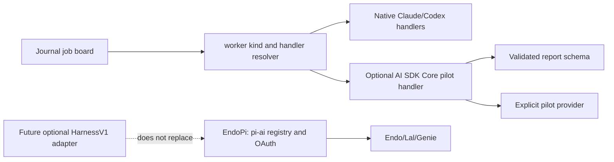

# Design: AI SDK as an optional garden integration, not a pi replacement

| Field | Value |
| --- | --- |
| Status | Proposed |
| Decision | Keep pi-ai as the Endo provider and subscription-OAuth path. Add no AI SDK runtime dependency to the garden now. Define a bounded, optional AI SDK Core pilot at the worker-harness boundary after its auth and sandbox assumptions are verified. |
| Evidence | [AI SDK research in the journal](../journal/projects/endo/ai-sdk-research.md), captured 2026-07-14; AI SDK 7 harness APIs are experimental. |

## Problem

"Pi" names two different seams, and treating them as one makes a false either/or
decision:

- `@mariozechner/pi-ai` is the multi-provider registry used by Genie and targeted
  by the EndoPi design. Its subscription OAuth and cross-provider handoff are
  requirements, not incidental implementation details.
- `@earendil-works/pi-coding-agent` is a coding-agent harness. AI SDK's
  experimental `@ai-sdk/harness-pi` adapter wraps this layer.

AI SDK Core offers a broad provider specification, typed tools, streaming, and
schema-validated output. Its HarnessAgent surface promises a uniform projection
over Codex, Claude Code, and Pi. The garden already has a deliberate worker
seam: `scripts/jobs/gardener.sh` selects a worker kind, and each kind selects a
handler that owns worktree setup, a model invocation, and the completion-marker
contract. The question is where, if anywhere, AI SDK adds value without replacing
the garden's job-board safety properties or EndoPi's OAuth work.

## Options compared

| Option | What changes | Value | Cost and decisive limitation |
| --- | --- | --- | --- |
| A. Keep pi, no AI SDK | Continue EndoPi's pi-ai registry and current `claude`/`codex` handlers. | Preserves working Genie consumption, subscription OAuth, provider handoff, and current completion and worktree controls. | Does not gain AI SDK's structured-output, streaming, and provider-spec ecosystem. |
| B. Replace pi-ai with AI SDK Core | Make AI SDK's language-model provider spec the Endo/Lal registry. | Larger provider ecosystem and consistent text, embedding, audio, image, tool, and structured-output APIs. | A migration before verified subscription-OAuth parity would regress the pivotal EndoPi capability; its TypeScript/Zod dependency closure also needs hardened-JS review. |
| C. Run AI SDK beside pi-ai | Keep pi-ai for Endo/Lal. Use AI SDK Core only in an isolated garden pilot or a separately owned UI/service. | Obtains typed tools, object validation, streaming, and a broad provider surface without changing credentials or Endo's provider contract. | Two abstractions need an explicit ownership boundary; it must not silently become a second credential store or gateway requirement. |
| D. Adopt AI SDK HarnessAgent as the garden worker runtime | Replace the handlers' direct CLIs with HarnessAgent sessions and adapters. | Could normalize streamed progress and external harness results, including Pi, Claude Code, and Codex. | The harness API is experimental, requires stateful session and sandbox lifecycle management, and its process sandbox is not an Endo compartment. It risks duplicating the garden's proven worker lifecycle. |
| E. Expose Endo/Lal as an AI SDK HarnessV1 adapter | Build an adapter after Endo's agent/session surface is mature. | Lets AI SDK consumers invoke an ocap-aware Endo agent while keeping Endo's authority model native. | This is an interoperability product, not a prerequisite for the garden; the experimental upstream contract makes it premature. |

## Recommendation

Choose **C now, with a narrow path toward E**, and explicitly reject B and D for
the first implementation.

Pi-ai remains the provider authority for Endo/Lal/Genie. In particular, EndoPi's
subscription OAuth, encrypted credential storage, and cross-provider handoff
remain owned by the existing EndoPi designs. AI SDK must not read, write, import,
or become the source of truth for pi-ai OAuth credentials.

The garden should first use AI SDK as an **optional, non-production Core pilot**.
The pilot can demonstrate structured, schema-validated worker artifacts or a
read-only tool loop, such as a review memo with a fixed result schema. It is
valuable precisely where the garden's existing text completion reports are weak:
machine-checkable result shape and typed stream events. It does not decide the
provider registry and it does not execute mutation-capable jobs.

Do not route the pilot through `HarnessAgent`. AI SDK Core is the stable seam;
HarnessAgent is an evaluation target, not an operational dependency. A later
adapter experiment is allowed only after the Core pilot and after the AI SDK
harness contract stabilizes sufficiently to pin a compatible version.

## Proposed architecture and boundaries

The following boundaries are normative:

1. **Board boundary.** `jobs/todo -> doin -> tada`, claim CAS, reaper behavior,
   inboxes, progress records, and the completion marker remain owned by existing
   garden scripts. An AI SDK stream is observability only. It cannot itself mark
   a job complete.
2. **Handler boundary.** A new handler is a sibling of
   `handlers/gardener-claude.sh` and `handlers/cleric-codex.sh`, selected through
   the existing worker-kind registry rather than by overloading `model:`. Like
   Spark's proposed `harness:` seam, a harness/runtime choice is orthogonal to a
   model selection.
3. **Capability boundary.** Phase 0 tools are read-only and have JSON schemas.
   No `bash`, file edit, git write, GitHub mutation, credential provisioning, or
   cross-repository interaction is exposed through AI SDK tools. Existing native
   handlers remain the only mutation path.
4. **Credential boundary.** The pilot uses a dedicated, least-privilege API key
   or an explicitly configured provider. It neither assumes Vercel AI Gateway
   nor reuses pi-ai subscription OAuth. Gateway use remains an optional provider
   choice, matching EndoPi's existing boundary.
5. **Isolation boundary.** AI SDK sandboxing is process/OS isolation and does
   not establish Endo's SES/compartment attenuation. Any future adapter must
   preserve Endo's explicit authority attenuation rather than describe a remote
   sandbox as equivalent protection.

## Affected garden components

| Component | Phase 0 effect | Migration boundary |
| --- | --- | --- |
| `scripts/jobs/common.sh` worker-kind registry | Add a capability-gated `ai-sdk` kind or equivalent handler entry only after the pilot contract is accepted. | Do not change existing `gardener`, `cleric`, or `hermit` defaults. |
| `scripts/jobs/gardener.sh` | Reuse its handler timeout, report capture, marker gate, and requeue behavior unchanged. | No stream event may bypass the report/marker gate. |
| `scripts/jobs/handlers/` | Add `gardener-ai-sdk.sh` with the same worker-common lifecycle and an explicit missing-runtime precondition report. | Never fork or duplicate claim/reaper logic. |
| `scripts/jobs/handlers/worker-common.sh` | Reuse per-job worktree preparation, bot identity, and completion discipline. | AI SDK does not own a persistent garden worktree session. |
| `scripts/jobs/test/` | Add deterministic handler tests with a fake AI SDK runner: schema pass, schema failure, absent key/runtime, timeout, and no-marker failure. | Tests must prove the existing completion contract still governs. |
| `skills/model-selection/SKILL.md` and routing data | Document that runtime/harness selection remains distinct from `model:` and provider routing. | Do not add an AI SDK runtime as a Claude or Codex model tier. |
| `designs/token-cost-ledger.md` | Add an `ai-sdk` harness/provider label only once the pilot records usage reliably. | Do not report gateway estimates as billed spend. |
| EndoPi designs and Genie | No code change in phase 0. | pi-ai stays authoritative until an independently approved provider migration proves OAuth and handoff parity. |

## Delivery sequence

1. **Compatibility spike, no fleet routing.** Pin a candidate AI SDK release;
   confirm exact AI SDK 7 identifiers against source; test Node/runtime support,
   the chosen provider's API-key path, schema validation, and package-lockdown
   compatibility. Verify whether AI SDK has subscription OAuth comparable to
   pi-ai `oauth.ts`. Record the result before selecting any registry migration.
2. **Read-only Core pilot.** Add the sibling handler and a single explicitly
   routed, bounded job class. Its tools only read the assigned worktree and its
   final output validates against a fixed report schema. The handler must emit
   the ordinary completion marker only after validation and report writing.
3. **Operational evaluation.** Compare native-handler and pilot jobs for useful
   result shape, failure/requeue behavior, token attribution, setup burden, and
   prompt-injection exposure. Keep the pilot opt-in until it has real evidence.
4. **Decision gate.** If Core's value is demonstrated, retain it for structured
   read-only work. Consider an AI SDK HarnessAgent or an Endo `HarnessV1` adapter
   only when upstream harness APIs are stable and the adapter can preserve the
   five boundaries above. A pi-ai replacement requires a separate Endo-focused
   design and proof of OAuth, handoff, credential-storage, and hardened-JS parity.

## Verification plan

- Unit-test the new handler with no network: successful schema validation writes
  a report and marker; invalid output and missing runtime/key write neither.
- Run the existing gardener worktree and completion-marker tests unchanged to
  show that worker lifecycle behavior did not move.
- Run one deliberately read-only pilot job in an isolated worktree. Confirm its
  report validates, its stream cannot complete a job by itself, and it leaves no
  changed project files.
- Before any Endo-facing change, test the candidate dependency closure under the
  relevant hardened-JS/lockdown configuration and explicitly assess
  subscription-OAuth parity from source, not documentation inference.

## Open questions

- Does AI SDK's provider specification support subscription OAuth with the scope,
  renewal, and account-selection behavior pi-ai `oauth.ts` supplies?
- Which AI SDK version and Node runtime can be pinned without a dependency or
  lockdown incompatibility in the intended pilot environment?
- Does the garden need streamed partial progress enough to justify a separate
  event journal surface, or is a validated final report sufficient for the
  first pilot?
- When the experimental harness API stabilizes, should Endo expose a
  `HarnessV1` adapter, or should the garden continue to treat its own handlers
  as the sole orchestration boundary?

## References

- [AI SDK introduction](https://ai-sdk.dev/docs/introduction), [agents overview](https://ai-sdk.dev/docs/agents/overview), and [HarnessAgent](https://ai-sdk.dev/docs/ai-sdk-harnesses/harness-agent).
- [AI SDK Pi harness adapter](https://ai-sdk.dev/providers/ai-sdk-harnesses/pi).
- [EndoPi provider registry and subscription OAuth research](../journal/projects/endo/drafts/endopi-provider-registry-and-oauth.md).
- [Spark gardeners](spark-gardeners.md), which establishes the garden's
  handler-versus-model boundary.
