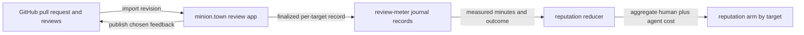

# Design: GitHub-linked change review with active-time metering

**Status:** Proposed

**Mandate:** Give a reviewer a first-class place to inspect a change and leave
feedback, while measuring the human time actually spent reviewing it. Make that
cost attributable to the change's producing `(worker kind, provider, model,
thoughtfulness)` combination and to the merge bar that was reviewed.

**Decision:** Build a small, authenticated review application on `minion.town`
that imports GitHub pull requests and publishes feedback back to GitHub. GitHub
remains the source of truth for the pull request, code, and published review;
the new application is the source of truth for review sessions and their
measured active time. Do not begin by adding this to Familiar. A future Familiar
client may present the same review session protocol, but the browser application
is the shortest path to shared review, GitHub integration, and useful data.

This is not a claim that software can observe cognition. The meter reports
conservative, evidence-bearing engaged time in this review surface, not
attention, diligence, or quality. Its purpose is cost accounting and
calibration, never productivity surveillance or reviewer ranking.

## 1. The unit being measured

A **change** is an immutable GitHub pull-request revision: repository, PR
number, head SHA, base SHA, and the import time. Re-importing a new head creates
a new revision rather than silently mixing time spent on different diffs.

A **review case** is the sequence of revisions for one pull-request attempt at
one target bar. It has a stable `case_id` and preserves its producing job base
when known. A request for changes on revision A and approval of revision B are
therefore two observations in the same case, not a cheap successful review of B
with A's cost forgotten. Reputation uses the case total through its terminal
merge-worthy or abandoned outcome.

A **review track** is `(change revision, target bar)`. The target bar is an
explicit named policy, initially `llm` and `master`, with a versioned policy
reference. `llm` means sufficient to merge to the bot roadmap lane; `master`
means sufficient for upstream master. A target name without its policy version
is not a comparable measurement.

A reviewer starts a session on exactly one review track. They may change tracks,
but the application ends the first interval and starts a new one. It never
copies the same minutes into both targets. A `master` review may cite prior
`llm` feedback as context, but its additional review time remains its own cost.

The initial outcome vocabulary is:

| Outcome | Meaning |
| --- | --- |
| `changes-requested` | The reviewer found a target-bar blocker. |
| `commented` | Feedback was left without a blocking verdict. |
| `approved` | The reviewed revision meets this target bar to the reviewer's knowledge. |
| `needs-more-review` | The reviewer stopped without a merge-worthiness verdict. |
| `superseded` | A newer head made the review revision obsolete. |

An approval is a review signal, not an automatic merge authorization. The
existing branch protections and maintainer decisions continue to decide merging.

## 2. Review surface and feedback

The application opens a pull request by GitHub URL or repository plus PR
number, fetches its metadata and a frozen diff revision, and shows files,
hunks, changed-line comments, general feedback, target bar, revision SHA, and a
visible timer. A reviewer can filter files, mark a file reviewed, make draft
comments, and choose an outcome. File marks are navigation aids, not evidence
that a file was understood.

Publishing uses the reviewer's GitHub authorization and creates the ordinary
GitHub review and comments. Draft feedback remains in the application until the
reviewer publishes or discards it. The application also records the GitHub
review ID and URLs after publication, so the meter is joined to an inspectable
review result rather than to a private stopwatch alone. It must not post
feedback, approve, request changes, or call an LLM on the reviewer's behalf.

The import path treats pull-request titles, descriptions, diff contents, and
comments as display data. They never become instructions to the application or
to an agent. An optional later AI assistance feature would require a separate
design with an explicit per-reviewer send action and a clear data boundary.



## 3. What counts as active review time

The timer runs only during an explicit session and only while all of the
following are true:

1. The review tab is visible and focused.
2. The session is not manually paused.
3. The app has observed a qualifying interaction within the preceding 60
   seconds.

Qualifying interactions are scrolling a diff, opening or navigating a file or
hunk, expanding context, marking a file, adding or editing draft feedback, and
pointer or keyboard events directed at the review application. Timer samples
are accumulated in short intervals, at most 15 seconds each. Losing focus,
hiding the tab, 60 seconds without a qualifying interaction, a network
disconnect, and explicit pause end the current interval immediately. The timer
does not resume merely because the tab is refocused: the reviewer must interact
with the review surface again.

The UI shows `counting`, `paused`, or `idle` continuously, plus the reason when
it is not counting. A reviewer can pause, stop, and add a short session note;
they cannot edit counted duration. They can dispute an interval by creating an
append-only correction with a reason. The default reputation import excludes
disputed intervals until a maintainer resolves them. This makes the number
auditable without pretending the meter can detect reading a printed diff,
thinking away from the computer, or mechanically scrolling a page.

The app stores only event categories and timestamps needed to establish the
intervals. It does not store keystrokes, pointer coordinates, screenshots,
window titles, clipboard contents, camera data, audio, or activity in other
applications. The reviewer sees their own event summary before finalizing a
session. Raw interaction events expire after 30 days; the final interval totals,
outcome, and audit references remain for accounting.

## 4. Data and attribution

The application has a transactional store for working drafts and an append-only
event log for metering. The following is the exported, finalized record shape;
the app keeps a fuller private event log needed to derive it.

```yaml
schema: review-meter/v1
record_id: rm_01J...
change:
  case_id: rc_01J...                 # one PR attempt at this target bar
  repo: endojs/endo-but-for-bots
  pr: 123
  head_sha: <40-hex SHA>
  base_sha: <40-hex SHA>
  github_review_id: 123456789       # null until feedback is published
track:
  target: llm
  policy_ref: review-bars/llm@v1
reviewer: reviewer_opaque_id
intervals:
  counted_seconds: 1320
  interval_count: 17
  disputed_seconds: 0
feedback:
  outcome: changes-requested
  github_comment_count: 3
  published_at: 2026-07-14T22:00:00Z
producer:
  job_base: optional-garden-job-base
  worker_kind: cleric
  provider: openai
  model: gpt-5.6-terra
  thoughtfulness: high
integrity:
  finalized_at: 2026-07-14T22:01:00Z
  event_log_hash: sha256:...
  meter_version: v1
```

`producer` values are imported from garden job and pull-request provenance when
available. If a human authored the change, or provenance is ambiguous, the
record sets `producer: unknown`; it is still useful as a review measurement but
does not update a model arm. The immutable change revision and target policy
are mandatory. A record with no final outcome is visible to the reviewer but is
not exported as a merge-cost observation.

The app exports finalized records to a journal path partitioned by target and
record ID, for example:

```
review-metering/v1/llm/2026/07/14/rm_01J....json
```

The exporter is idempotent on `record_id`; correction and target-policy changes
produce new records that supersede an earlier one. The journal reducer is the
only component that chooses the current record for reputation. It verifies the
schema, immutable revision identity, target policy reference, and event-log
hash before accepting it. The record contains no diff text or feedback body.

## 5. Reputation integration

`reputation-reduce.sh` consumes the accepted records by `(case ID, target
bar)`. For each terminal case it sums non-disputed `counted_seconds` across all
of that case's revisions, converts it to minutes, and applies the dated human
hourly rate from `reputation/rate-card.md`. It writes the existing review-cost
shape with `source: measured`, `meter_version`, record IDs, minutes, dollars,
and the target policy reference.

Measured data replaces the current inferred-commentary estimate only for the
same terminal case and target. It does not erase an inferred record for a
different target, nor does it make an incomplete case look free. Multiple
reviewers' finalized sessions on one track sum. The arm key remains:

```
(worker kind, provider, model, thoughtfulness) x work class x target bar
```

This answers the cost question the bid auction needs: an arm is compared on
agentic dollars plus actual human review dollars to reach merge-worthiness at a
specific bar. A cheap `llm` result is not evidence that the same arm is cheap
to bring to `master`.

## 6. Rollout and acceptance checks

1. Build the GitHub-linked review page, authenticated reviewer identity, frozen
   revision import, drafts, and GitHub feedback publication. The timer is
   present but emits only private records.
2. Add interval accounting, privacy deletion, immutable finalization,
   correction, and an event-summary UI. Exercise focus loss, hidden tab, idle,
   manual pause, reconnect, and revision change in a browser.
3. Add journal export and a reducer shadow mode that compares measured records
   with the inferred estimate but does not affect bids.
4. After enough paired observations, enable measured-preferred accounting per
   revision and target. Keep the inferred path as the fallback for GitHub-only
   reviews and for missing or disputed records.

Acceptance requires deterministic interval tests for every timer transition,
idempotent export and supersession tests, a schema rejection test, and an actual
browser run that observes a visible timer pause on focus loss and idle. It also
requires a test proving one session cannot add seconds to both `llm` and
`master` tracks, and a reducer test proving target-qualified measured data wins
only over the matching inferred observation.

## 7. Alternatives and open questions

**GitHub-only instrumentation:** rejected. A browser extension could meter
GitHub pages, but it cannot provide an intentional review-session model, an
auditable target bar, or a reliable draft-to-publish join without becoming a
more fragile version of this application.

**Familiar first:** deferred. Familiar can eventually offer stronger desktop
integration, but it would make a shared review tool depend on desktop rollout
and would invite broad host-activity collection. It should implement this
protocol later only if reviewers need an offline or local-capability surface.

- What is the maintainer-approved `review-bars/<target>@<version>` vocabulary
  and who may revise a policy version?
- Must publication on GitHub be required before a finalized interval may affect
  reputation, or may a reviewer finalize a documented `needs-more-review`
  session without feedback?
- Which reviewers may export records into the shared journal, and what review
  is required to resolve a disputed interval?
- Is the 60-second idle window appropriately conservative after a pilot that
  compares it with voluntary reviewer recollection?
- Should review time for maintainer clarification outside the tool enter this
  ledger as an explicit manual record, or remain in the existing inferred
  attention model until it can be captured with comparable consent?

## References

- [`cleric-worker-bid-auction-reputation.md`](cleric-worker-bid-auction-reputation.md)
  section 4.4 defines the inferred human-review fallback and the
  measured-preferred handoff.
- [`gardener-bid-accept-market.md`](gardener-bid-accept-market.md) defines
  target-qualified reputation and aggregate cost.
- `journal2:projects/minion-town/README.md` records minion.town's authenticated
  application and GitHub-review posture.
