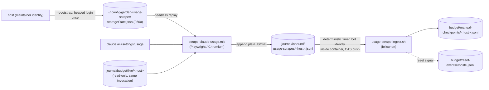

# Claude usage dashboard scraper (host-side Playwright)

| Created | 2026-09-04 |
| Author | designer (job `design-claude-usage-dashboard-scraper`) |
| Status | Proposed |
| Produces for | [manual-quota-calibration](../journal/budget/manual-checkpoints/README.md) and reset-time detection (`design-manual-quota-calibration`, `design-reset-time-detection`) |

## Problem

The garden's tokens-per-percent calibration and reset-time detection both consume
`journal/budget/manual-checkpoints/<host>.jsonl` and
`journal/budget/reset-events/<host>.jsonl`, which until now have been **hand-typed
from a human reading the Claude.ai dashboard** (kriskowal, all of 2026-09-03). Every
row so far carries measurement slop — the meter-vs-dashboard pairing is minutes to
tens of minutes apart, and the boost banner that confounds calibration
(`manual-checkpoints/README.md` § "A confound discovered 2026-09-03") was captured
exactly once, by luck, from a page dump. This design replaces the human read with an
**automated host-side scraper** that reads the dashboard through an authenticated
headless browser and emits the same rows, tightly paired against the local token
meter and capturing the boost banner on every run.

Per kriskowal 2026-09-03: *"propose a program that can use Playwright to interrogate
the Anthropic Claude usage dashboard through an authenticated session in the headless
browser… It will not be run in the garden environment, but on the host… It will need
to communicate with the garden by appending to a file in the garden's journal
checkout, somewhere the garden can monitor through its shared filesystem mount."*

This scraper is a **producer only**. It does not fit ratios (`design-manual-quota-calibration`)
or detect reset brackets (`design-reset-time-detection`); it feeds both their inputs.

## Trust boundary — the load-bearing constraint

The scraper runs on the **host**, under the maintainer's own identity, **never inside
the garden container** and never as a gardener job. Its authentication material — a
Playwright `storageState` holding a live claude.ai session — is effectively a bearer
token for the maintainer's account. It **must never be written anywhere under
`<garden-root>`**, because the bind mount that mirrors the host filesystem into the
container (CLAUDE.md § Container guard, § Host environment) would make anything under
the root equally readable by the bot-identity fleet.

- **Credential state lives host-only**, outside the garden root:
  `~/.config/garden-usage-scraper/storageState.json`, dir mode `0700`, file mode
  `0600`. The script refuses to run if the file's mode is looser than `0600`, and
  refuses to write it anywhere resolving under `<garden-root>`.
- **Only the derived readings cross into the garden**, via a plain append to a
  staging file under the shared mount (below). No credential, cookie, or token value
  is ever part of a staged row.

## Architecture



The split is deliberate: the **host half writes no git and holds no bot credential**
(it only appends to a staging file); the **garden half holds all git/identity** and
does the CAS commit into the tracked logs, matching every other write path in this
repo (`scripts/jobs/common.sh` `ensure_clone`/`sync_clone`/CAS-push).

## Authentication: bootstrap once, replay headless

Rather than reimplement whatever login flow the account uses (Google OAuth /
password+2FA / email link), use Playwright's standard `storageState` pattern:

- **`scrape-claude-usage.mjs --bootstrap`** launches **headed** Chromium at
  `https://claude.ai/`, the human logs in by hand, and the script waits until the
  usage settings page renders at least one `[role="meter"]` (or an explicit Enter
  keypress as a fallback), then persists `context.storageState()` to the host-only
  path above. This is interactive and run by the maintainer, not the fleet.
- **`scrape-claude-usage.mjs`** (no flag) launches **headless**, restores that
  `storageState`, navigates to the usage page, scrapes, reads the meter, appends one
  staging row, and exits.
- **Expired-session detection is loud and safe.** If the headless run lands on a
  login/redirect surface instead of the dashboard (no `[role="meter"]` within a
  timeout, or a known login URL/marker), the script **exits non-zero with a
  "re-run --bootstrap" message and writes NOTHING** to the staging file. A failed
  read never produces a garbage row.

## Scraping: ARIA meters are the contract

Grounded in the real page HTML kriskowal pasted 2026-09-03 (verified markup, not
guessed). Select on the **accessibility contract**, never on Tailwind utility classes
(those churn every rebuild).

- Each meter is `<div role="meter" aria-valuemin="0" aria-valuemax="100"
  aria-valuenow="31" aria-valuetext="31% used" aria-labelledby="_r_6f_">`. Read
  **`aria-valuenow`** as the exact integer percent — not rendered `%` text, not any
  CSS width/transform.
- `aria-labelledby` resolves to a sibling `<span>` naming the meter: **`Current
  session`** (the 5-hour rolling session limit) vs **`All models`** (the weekly
  aggregate this design tracks) vs per-model rows (`Fable`, etc. — the page lists
  weekly usage per model; captured as an optional `per_model_weekly` array in case a
  future need wants them, but `All models` is the weekly number of record).
- **Cross-check**: the sibling `<span class="… text-footnote text-secondary">31%
  used</span>` plain-text duplicate and `aria-valuetext` are read too. If the integer
  parsed from either disagrees with `aria-valuenow`, both are recorded, a warning is
  appended to the row, and `pairing_confidence` is not raised to `high` for that
  reading. Cheap insurance against a one-sided markup change.
- **Reset times are relative text, two formats, no explicit timezone:**
  - Session: `"Resets in 3 hr 12 min"` — a **duration**, timezone-independent. Parse
    to `now + duration` directly; no timezone assumption needed.
  - Weekly: `"Resets Fri 8:00 PM"` — a **wall-clock in the account's local zone**,
    with no date. Resolve to the next occurrence of that weekday/time, interpreting
    the clock in a **configured timezone** (default `America/Los_Angeles`, matching
    every confirmed reading this session), then convert to absolute UTC.
  - Store the **absolute UTC** value, never the relative string (it decays the moment
    it is saved). Also store the raw text (`*_resets_text`) and the timezone actually
    assumed (`reset_tz_assumed`), so a wrong-timezone guess is auditable and
    correctable after the fact rather than silently baked in. The timezone is a config
    value, not hardcoded blind — see Open decisions folded in, below.
- **Boost banner, captured every run:** the temporary plan-wide multiplier banner
  (*"Your limits are temporarily boosted. Your weekly Claude Code limit is 50% higher
  through September 13."*) is captured **verbatim** into `boost_banner`, or `null`
  when absent. This is a real, time-bounded confound on any tokens-per-percent
  calibration (`manual-checkpoints/README.md` § confound); capturing it on every run
  lets a future analysis bound *when* a boost was and wasn't in effect purely from the
  scrape history, even without knowing its start.
- **Network-tap check (implementation-time, not blocking):** during the build, check
  once via Playwright request interception whether the page's own JS fetches an
  internal JSON usage endpoint; if a stable one exists, prefer it (no DOM parsing at
  all). The ARIA-attribute path above is the confirmed-workable primary either way.
- **Out of scope (noted for a future extension):** the separate dollar-denominated
  "Usage credits" section ($400/mo spend cap, balance, auto-reload). Different
  mechanism from weekly/session token limits; do not build it in the first cut.

## Same-invocation meter pairing

Because the script runs **on the host**, it reads `journal/budget/live/<host>`
**directly in the same invocation** (a host-side read; no container boundary blocks
it) and extracts `spend` → `meter_spend_tokens`, `sampled_at` /
`sampled_at_epoch` → `meter_sampled_at`, and `window_start_epoch` →
`meter_window_start_epoch`. Because the dashboard read and the meter read happen
seconds apart in one process — not a minutes-apart human copy-paste — every automated
row can honestly carry **`pairing_confidence: "high"`**, the improvement over every
hand-paired checkpoint collected this session (the one page-dump row, ironically, had
the *worst* pairing because the copy-paste round-trip took 16 minutes). The row still
records `meter_window_start_epoch` verbatim so the ingest/fitting side can honor the
"never ratio across a window-anchor change" rule the manual-checkpoints README
escalation documents.

## Output: a staging file the garden ingests

The host script appends **one JSON object per line** to
`journal/inbound/usage-scrapes/<host>.jsonl` — a **plain staging file**, not the
git-tracked checkpoint logs. It requires no git and no bot credential; it is a bare
append under the shared mount. `<host>` is the GARDEN identity (matches the
`budget/live/<host>` filename), supplied by config.

Staging row (`usage-scrape/v1`), a superset carrying everything the ingest needs to
project into both downstream logs:

```jsonc
{
  "schema": "usage-scrape/v1",
  "scraped_at": "2026-09-04T05:40:12Z",   // script run time, UTC
  "host": "endolin-garden2-5bcdff64",
  "reported_by": "playwright-usage-scraper",
  "weekly_percent": 31,                    // aria-valuenow of the "All models" meter
  "weekly_percent_text": "31% used",       // plain-text duplicate, cross-check
  "weekly_resets_text": "Resets Fri 8:00 PM",
  "weekly_resets_at": "2026-09-05T03:00:00Z",   // absolute UTC
  "session_percent": 12,                   // aria-valuenow of the "Current session" meter
  "session_percent_text": "12% used",
  "session_resets_text": "Resets in 3 hr 12 min",
  "session_resets_at": "2026-09-04T08:52:00Z",  // absolute UTC (now + duration)
  "reset_tz_assumed": "America/Los_Angeles",
  "boost_banner": "Your limits are temporarily boosted. …",  // verbatim, or null
  "per_model_weekly": [                    // optional; every role="meter" row, for the record
    {"label": "All models", "percent": 31},
    {"label": "Fable", "percent": 0}
  ],
  "meter_spend_tokens": 77280478,          // from budget/live/<host>, same invocation
  "meter_sampled_at": "2026-09-04T04:01:07Z",
  "meter_window_start_epoch": 1787972400,
  "pairing_confidence": "high",
  "scraper_version": "1",
  "warnings": []                           // e.g. "aria-valuenow 31 != text 30"
}
```

The ingest (below) projects this into a `manual-checkpoints/<host>.jsonl` row
(dropping the scrape-only fields, computing `implied_weekly_cap_tokens` exactly as
that README documents) and carries `boost_banner` through as the new field the manual
checkpoints have mostly lacked. Reset-event population stays the reset detector's job
(`design-reset-time-detection`), which reads the checkpoints; the ingest does not
reimplement bracket detection.

## Placement

Per CLAUDE.md's layout rule (*"roles/ and skills/ hold no executables; scripts/ holds
no agent-only context fragments"*):

- **Executable:** `scripts/host/scrape-claude-usage.mjs` — a new top-level
  `scripts/host/` area (sibling to `scripts/aws/`, `scripts/agoric/`) for host-only
  programs that are explicitly **not** part of the `scripts/jobs/` fleet machinery:
  never run by a gardener, never claim a job, run under the maintainer's identity.
  `scripts/host/README.md` states that boundary.
- **Playbook:** `skills/claude-usage-dashboard-scrape/SKILL.md` — the human-facing
  bootstrap/run/failure playbook (purpose, inputs, state, procedure, output, notes).

## Follow-on work (explicit, not assumed)

Two build jobs, named here so they are not silently dropped (parked on the plan queue
by this design job for the maintainer to promote):

1. **`build-claude-usage-dashboard-scraper`** — write `scripts/host/scrape-claude-usage.mjs`
   itself (Node ESM + `playwright`), implementing `--bootstrap`, headless replay,
   ARIA-meter scrape, reset-text parsing, meter pairing, expired-session detection,
   and the staging append per this design. Include the one-time network-tap probe.
2. **`build-usage-scrape-ingest`** — the **garden-side ingest counterpart**: a
   deterministic, leader-only, no-`claude` timer `scripts/jobs/usage-scrape-ingest.sh`
   + `garden-usage-scrape-ingest.{service,timer}` unit, following the
   sysop/reaper/watcher pattern and `common.sh` `ensure_clone`/`sync_clone`/CAS-push
   discipline. It tails `journal/inbound/usage-scrapes/<host>.jsonl` from a per-host
   consumed-offset cursor (e.g. `journal/inbound/usage-scrapes/.cursor/<host>`),
   projects each new line into a `manual-checkpoints/<host>.jsonl` row (computing
   `implied_weekly_cap_tokens`, carrying `boost_banner`), and CAS-commits it. It is
   idempotent on the cursor so a re-run never double-appends. Reset-event rows remain
   the `design-reset-time-detection` detector's output over the checkpoints, not this
   ingest's.

## Decided defaults (folded in rather than left open)

- **Timezone** is a config value (`~/.config/garden-usage-scraper/config.json`
  `timezone`), default `America/Los_Angeles`, and the assumed zone is recorded in
  every row (`reset_tz_assumed`) so a wrong default is auditable and correctable, not
  silently baked in. Only the weekly reset needs it; the session reset is a
  duration and is timezone-free.
- **Run cadence is the operator's choice**, not fixed here: the maintainer runs the
  scraper from host cron or a host `systemd --user` timer at whatever interval suits
  (30–60 min is a sensible default given the two limits' granularity). It is a plain
  host program; nothing in the garden schedules it.
- **Config surface:** `~/.config/garden-usage-scraper/config.json` holds `url`
  (the account's `#settings/usage` URL), `host` (GARDEN identity / filename key),
  `journal_root` (host path to the garden's journal checkout), and `timezone`. CLI
  flags override individual values. Nothing sensitive lives here; the session token is
  only in `storageState.json`.

## Alternatives considered

- **Write directly into the tracked checkpoint logs from the host script.** Rejected:
  it would require git and bot-identity discipline on the host side, duplicating the
  CAS machinery the garden already owns, and would put a maintainer-identity process
  in the business of committing to `journal2`. The staging-file + garden-ingest split
  keeps all git/identity on the garden side where every other write path lives.
- **Screen-scrape the rendered `%` text or CSS bar width.** Rejected: `aria-valuenow`
  is an exact integer and an accessibility contract Anthropic has reason not to break;
  the rendered text and Tailwind classes churn.
- **Store `storageState` under the garden root** (convenient, one tree). Rejected
  outright — the bind mount would hand a live session token to the bot fleet. This is
  the design's load-bearing constraint.
