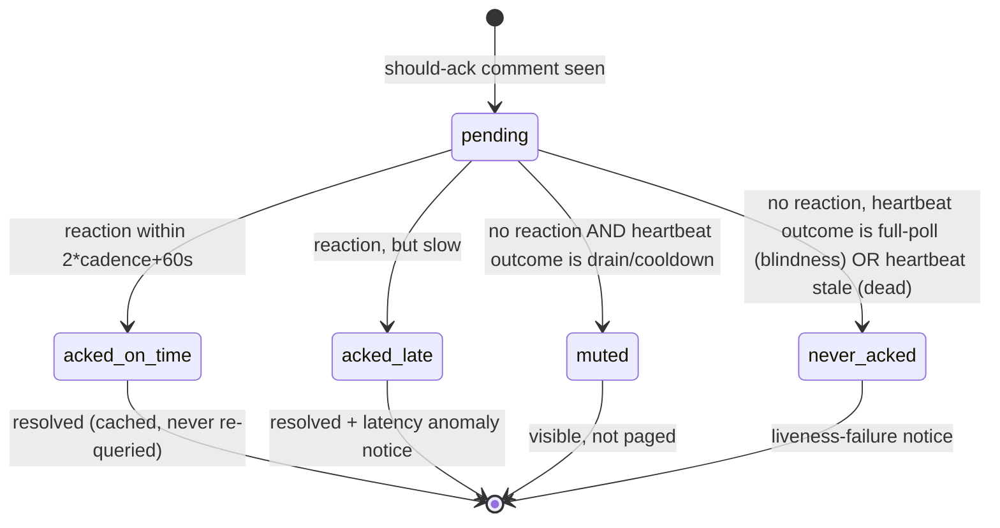

# Design: comment latency watch (reactji-anchored liveness)

| Created | 2026-09-23 |
| Author | designer |
| Status | Proposed |

Code to be built (by `build-comment-latency-watch`):
- `scripts/jobs/comment-latency-watch.sh` (the checker) and its unit pair
  `scripts/systemd/garden-comment-latency-watch.{service,timer}`.
- A shared classifier predicate extracted from
  [`scripts/jobs/comment-watcher.sh`](../scripts/jobs/comment-watcher.sh) into a
  sourced library both scripts call (see [The should-ack classifier](#1-the-should-ack-classifier-one-predicate-two-callers)).
- A per-tick liveness heartbeat written by the three watchers
  (`comment-watcher.sh`, [`issue-inbox-watcher.sh`](../scripts/jobs/issue-inbox-watcher.sh),
  [`mention-watcher.sh`](../scripts/jobs/mention-watcher.sh)).
- A read-only probe `scripts/jobs/comment-latency-probe.sh`.
- Alerting via [`scripts/jobs/watchdog-notice.sh`](../scripts/jobs/watchdog-notice.sh).

## Problem

Nothing watches comment-to-job latency today. Every existing defense misses the
failure that matters:

- The comment-watcher's blindness self-test (`comment-watcher.sh`, the
  `selftest_*` block) only fires when a tick RUNS and sees zero comments.
- Failed-unit checks do not fire either: the watcher's quiet skip paths all exit
  `0`. `fleet_draining` exits 0, `api_cooldown_active` exits 0, and a stale
  is-main-host read exits 0. systemd records success.
- The journal cursor's `last_polled_at` is written ONLY when a new comment moves
  the cursor forward (the `advance_cursor_with_retry` call near the end of
  `comment-watcher.sh`). A repo that is simply QUIET never advances its cursor, so
  the journal cannot tell a quiet repo from a dead watcher.

Incident 2026-09-22/23: every comment directive was silently dropped for ~4.5h
while systemd recorded success, because a bloated cursors clone latched the
shared journal-outage cooldown and every tick took the `api_cooldown_active`
exit-0 path. Separately, the quiet-repo confusion produced a false "7 repos
unpolled for weeks" alarm on 2026-09-23; those repos were just quiet.

## Source of truth: the acknowledging reactji

Maintainer requirement (kriskowal, 2026-09-23): **the timing of the acknowledging
reactji is the source of truth for liveness.** The watcher posts `eyes` (see
[reactji-acknowledgment](../skills/reactji-acknowledgment/SKILL.md)) as it
ingests a directive, and GitHub timestamps that reaction independently of the
garden's own bookkeeping. So:

```
latency = reaction.created_at - comment.created_at        (both from the GitHub API)
```

Reference point on kriscendobot/garden#108: a kriskowal directive created at
16:24:14Z had its `eyes` land at 16:25:56Z (102s), and the job posted at
16:25:48Z. A should-ack comment carrying no bot reaction after a threshold is the
anomaly. Reading the reaction's `created_at` from the API (not self-reported
state) is deliberate: it survives a watcher that lies about having acted, and it
needs no new journal writes.

## Design

### 1. The should-ack classifier (one predicate, two callers)

"Should-ack" is derived deterministically, with no LLM, from the SAME gates the
watchers already use. To guarantee the checker and the watcher cannot drift, the
build extracts the watcher's existing classification into a sourced library
(`scripts/jobs/comment-classify.sh`) exposing one predicate:

```
comment_should_ack <repo> <slug> <author-login> <surface> <pr-number> <body-file>
  -> rc 0 if this comment should have received a bot eyes reactji, else rc 1
```

The predicate is the composition already present in `comment-watcher.sh`, moved
verbatim, not reimplemented:

- **Armed-repo gate.** The repo is in the comment watch set (`comment-repos/<slug>`)
  or, for the issue inbox, is `config/garden-repo`, or, for the mention watcher,
  is any repo where the mention passed the sender gate.
- **Sender trust.** `gate_trusted` = `is_trusted` (journal `trusted-senders/allowlist`
  or `maintainers/allowlist` or a current endojs/Agoric org member) with the
  stricter allowlist-only rule where `sender-gate: required` or where the surface
  is the issue inbox (maintainers-only, no org fallback).
- **Directive recognition.** `reads_as_directive` (imperative verb in
  clause-initial position, "please", or a recognized branch-op verb) OR an
  `@kriscendobot` mention. A trusted maintainer's review (body or inline) counts
  as one should-ack unit, mirroring the watcher's review handling.
- **Exclusions.** The bot's own comments, closed PRs/issues, and other bots' or
  CI's automated comments are never should-ack (mirrors the skill's *When not to
  use*).

`comment-watcher.sh`, `issue-inbox-watcher.sh`, and `mention-watcher.sh` are
refactored to call `comment_should_ack` at their existing ack decision point, so
the predicate has exactly one definition. Coverage spans issue comments, review
bodies, inline review comments (all three via the watcher), the issue inbox, and
the GitHub-wide mention watcher when it is armed.

### 2. States and thresholds

The checker classifies each should-ack comment in the lookback window into one of
five states. Thresholds are derived from each source's timer cadence
(`comment-watcher@` 90s, `mention-watcher` 90s, `issue-inbox` 120s) so they track
the cadence rather than a magic constant:

| State | Condition |
| --- | --- |
| `acked-on-time` | reaction exists and `latency <= 2*cadence + 60s` (240s at 90s; 300s at 120s) |
| `acked-late` | reaction exists and `latency` beyond on-time but `<= 10*cadence` |
| `never-acked` | no bot reaction and comment age `> max(10*cadence, 900s)` (15 min) |
| `muted` | should-ack, no reaction, but the source was intentionally not acking (drain, or a persisting cooldown) |
| `pending` | should-ack, no reaction yet, still inside the never-acked age budget (not an anomaly) |

`2*cadence` covers the worst case where a comment lands just after a tick, plus
the reaction round-trip (the 102s reference sits comfortably inside 240s). The
`10*cadence` never-acked floor of 15 minutes catches the 4.5h incident an order
of magnitude sooner while leaving generous headroom against flapping.

Separating `never-acked` (genuine liveness failure) from `muted` (explainable
silence) needs one more input than the reaction alone: the watcher's per-tick
heartbeat (next section). The classification is:



A `never-acked` splits by heartbeat cause into two notices with different bodies:
**blindness** (the watcher polled fully yet did not ack a should-ack comment: the
classifier and the watcher disagree, a code defect) and **dead** (the heartbeat is
stale: systemd is not firing the timer at all). Both page; the body names which.

### 3. Quiet-repo liveness: a host-local per-tick heartbeat

Reactji only prove liveness when a comment arrives. A repo can be quiet for weeks,
so the checker also reads a **host-local per-tick heartbeat** each watcher writes.
It is host-local state, NOT a journal commit: journal churn was just cut from
~10k/day (main2 `74461976fd`, `3c696ea6c8`) and a per-tick journal write would
undo that.

Each watcher writes, at every exit point, a small file:

```
$GARDEN_STATE/comment-watcher/heartbeat/<slug>          (issue-inbox and mention have their own keys)
  last_tick_at: 2026-09-23T16:25:56Z
  outcome: full-poll | drained | cooldown | not-main-host | offline-journal
```

The outcome field is load-bearing: it is what distinguishes the incident's
failure (a tick that ran but took the `cooldown` exit for 4.5h) from a healthy
quiet tick (`full-poll`, zero comments). The checker reads the heartbeats it can
see on the leader host and raises:

- **stale heartbeat** (`last_tick_at` older than `3*cadence`): the timer is not
  firing. This is the dead-watcher case, caught before the next human comment.
- **stuck non-productive outcome** (`cooldown` or `offline-journal` continuously
  for longer than a bound, default 20 min): the exact incident. The watcher is
  ticking but wedged behind the shared cooldown latch.

`drained` and `not-main-host` are expected and are surfaced as `muted`/quiescent,
never paged (next section).

A **synthetic canary** (the bot posting a probe comment somewhere to force a
liveness signal on a quiet repo) would prove the whole path end to end, but it is
outward-facing. It is left as an [open question](#open-questions), not a default;
the host-local heartbeat is the churn-free liveness signal for quiet repos.

### 4. Drained fleet: visible, not paged

A drained fleet legitimately posts no reactji (`comment-watcher.sh` and
`mention-watcher.sh` both `fleet_draining && exit 0`). A drain must not page as
dead, but it must be VISIBLE. The checker reads the drain marker
(`fleet_draining`) and the foreman-brake is irrelevant here. When the fleet is
drained:

- should-ack comments with no reaction classify as `muted`, not `never-acked`.
- The checker opens ONE informational watchdog notice keyed
  `comment-ack-muted-drain` stating that acknowledgment is suppressed by the drain
  and listing the count of comments awaiting the fleet's return. It is amended
  while the drain persists and closed with `--recovered` when the drain lifts and
  the backlog acks. This is the "visible" requirement: the maintainer can see that
  directives are queued behind a deliberate drain, distinct from a dead watcher.

An "intentionally ignored directive" (a trusted comment the maintainer does not
want acted on) is not a separate case here: the watcher still posts `eyes` for
every should-ack comment it sees, so within the should-ack set the only intentional
non-ack is the drain. Untrusted senders and the bot's own comments are excluded by
the classifier before they can ever count as should-ack.

### 5. Where it runs, and what watches the watcher

- **Leader-only singleton**, gated by [`is-main-host.sh`](../scripts/jobs/is-main-host.sh),
  like the other watchers. Only the leader host runs it, and it follows the
  `leader` marker across a handoff.
- **It must still run while the fleet is drained.** Like the
  [sysop](../scripts/jobs/sysop.sh), the checker deliberately omits the
  `fleet_draining && exit` guard: a drained fleet is exactly when the maintainer
  most needs to know whether silence is the drain or a dead watcher. It gates on
  is-main-host only.
- **Cadence.** The checker runs slower than the watchers (default 300s): latency
  anomalies are minutes-scale, and a slower cadence bounds API spend.
- **GitHub quota.** Every source the checker reads is REST, against the same
  account-wide primary bucket. The checker honors the host-shared REST cooldown
  (`api_cooldown_active rest`) before collecting, and when any source reports
  primary-quota exhaustion it latches the shared cooldown for
  `api_primary_quota_secs` (the full quota hour), stops the remaining per-repo
  sweep, writes a `cooldown` heartbeat, and exits 0. Sweeping on would only
  repeat a doomed 403 per armed repository and fail the unit every tick.

**What watches the watcher.** Three turtles, stated honestly:

1. systemd restarts the service on crash (`Restart=on-failure`) and the timer
   re-arms it.
2. The checker writes its OWN host-local heartbeat
   (`$GARDEN_STATE/comment-latency-watch/heartbeat`). The read-only probe (section
   8) and the bulletin surface its staleness, so a wedged checker is visible.
3. If the leader host itself is down, the whole fleet is down, which is a louder
   and separately-monitored condition (peer-offline heartbeat,
   `GARDEN_HOST_OFFLINE_AFTER`). The checker does not need to self-detect that
   case; it is dominated by a bigger alarm.

The honest limit: the checker cannot page about its own total death from inside
itself. Turtle 3 (host-down) and turtle 1 (systemd restart) bound that; a fully
silent checker on a live leader is caught by its stale heartbeat surfacing in the
bulletin probe, which is a read, not a self-report.

### 6. API budget

Reading reactions costs one `gh api .../reactions` call per should-ack comment, so
the checker bounds the population three ways:

- **Lookback window only.** It classifies should-ack comments created within a
  lookback window (default `max(2 * never-acked-threshold, 6h)`), never the full
  history. Listing comments reuses the same per-repo comment feed the watcher
  polls (the comment source's cursor output), so listing is nearly free.
- **Resolve-and-cache.** A comment that reaches a terminal state
  (`acked-on-time`, `acked-late` past its latency read, `never-acked` after its
  notice) is written to a host-local cache
  (`$GARDEN_STATE/comment-latency-watch/resolved/<repo>/<comment-id>`) and never
  re-queried. Only `pending` should-ack comments inside the window are re-read
  each tick.
- **Slow cadence.** 300s versus the watchers' 90s.

Worst case per tick is therefore one reactions call per unresolved should-ack
comment in the window, which in normal operation is a handful.

### 7. Alerting

All alerts go through [`watchdog-notice.sh`](../scripts/jobs/watchdog-notice.sh):
one coalesced notice per open condition, amended as it continues, closed with
`--recovered`. Never a fresh message per tick. Keys, per repo plus class:

| Key | Condition |
| --- | --- |
| `comment-ack-latency-<slug>` | one or more `acked-late` comments (latency anomaly) |
| `comment-ack-blind-<slug>` | `never-acked` with a `full-poll` heartbeat (classifier/watcher disagreement) |
| `comment-watcher-dead-<slug>` | `never-acked` with a stale heartbeat (older than `3*cadence`; ages are clamped at 0, so a heartbeat newer than the checker's clock is fresh) |
| `comment-watcher-stuck-cooldown-host` | a `cooldown`/`offline-journal` outcome persisting past the stuck bound on one or more sources. Both latches are host-shared, so this is ONE host-level notice naming the latch and the affected repos, never N per-repo "dead" pages |
| `comment-latency-storm-<class>` | storm guard: more than `GARDEN_COMMENT_LATENCY_STORM_MAX` (5) repos in one class this tick collapse into this one summary |
| `comment-ack-muted-drain` | should-ack backlog suppressed by an active fleet drain (informational, fleet-level key) |
| `comment-latency-checker-stale` | the checker's own heartbeat is stale (surfaced by the probe/bulletin, not self-posted) |

Each notice names the repo, the offending comment URLs, the observed latency (or
age), and the heartbeat outcome that classified it. When the condition clears (the
comment gets its late reaction, the drain lifts, the heartbeat recovers) the
checker posts the `--recovered` amendment.

### 8. Observability

A small, churn-free latency record for the bulletin and a read-only probe:

- The checker maintains host-local per-repo rolling latency stats
  (`$GARDEN_STATE/comment-latency-watch/stats/<repo>`: p50, p95, sample count,
  last-ack timestamp) updated as comments resolve. Host-local, so no journal
  churn.
- `scripts/jobs/comment-latency-probe.sh` reads those files and prints per-repo
  p50/p95/last-ack plus each watcher's heartbeat outcome and age. It is read-only
  and safe to run any time; the bulletin can include a one-line summary.

## Ownership map

The design spans the checker, the watchers it observes, GitHub, host-local state,
and the journal. Boundaries:

| Boundary | Mechanism | Policy | Durable state | Commit/lifecycle authority | Value crossing |
| --- | --- | --- | --- | --- | --- |
| Watcher <-> GitHub reaction | watcher posts `eyes` | reactji-acknowledgment skill | GitHub reaction row | GitHub (immutable `created_at`) | the acknowledged fact + its authoritative timestamp |
| Watcher <-> heartbeat | watcher writes per-tick file | write at every exit point with outcome | `$GARDEN_STATE/.../heartbeat/<slug>` (host-local) | watcher (overwrites each tick) | `{last_tick_at, outcome}` |
| Checker <-> classifier lib | shared sourced predicate | `comment_should_ack` (single definition) | none (pure) | watcher codebase owns the definition | should-ack rc |
| Checker <-> resolved cache/stats | checker read/write | resolve-and-cache, rolling p50/p95 | `$GARDEN_STATE/comment-latency-watch/*` (host-local) | checker | per-comment terminal state, latency stats |
| Checker <-> journal notices | `watchdog-notice.sh` | one keyed notice per condition | `inbox/maintainer/unread/watchdog-*.md` (journal) | checker opens/amends/closes | the maintainer-facing anomaly |

Four ownership questions:

- **Who owns persistent state?** GitHub owns the authoritative liveness timestamp
  (the reaction). The journal owns the durable maintainer alert. Everything the
  checker computes (cache, stats, heartbeats) is host-local and reconstructible,
  by design, to avoid journal churn.
- **Who owns the commit/discard decision?** The checker decides when a comment is
  terminally resolved (cache write) and when a condition is open or recovered
  (notice commit). The watcher decides only that it acked (posts the reaction; the
  timestamp is GitHub's).
- **Restart/replay.** All host-local state is a cache: losing it re-derives from
  GitHub on the next tick (idempotent, bounded by the lookback window). A journal
  notice survives a checker restart because it lives in the journal, and
  `watchdog-notice.sh` amend-or-post is idempotent.
- **Execution classification.** The checker is a deterministic, no-LLM daemon (like
  the sysop and the other watchers). No model runs in the observe path; it reads
  the GitHub API and host-local files and posts deterministic notices.

Inner/outer naming check: the checker OBSERVES liveness; it does not own the
acknowledgment. It is named `comment-latency-watch` (a watcher of latency), not
`comment-acknowledger`. The reaction remains the watcher's to post; the checker
never posts an `eyes` itself (doing so would corrupt the very signal it measures).

## Test plan

- Unit: `comment_should_ack` returns identical verdicts to the watcher's inline
  classification across the existing `comment-watcher-test.sh` fixtures (the
  refactor must be behavior-preserving: the watcher's own tests are the oracle).
- Unit: state classification given synthesized `(comment_age, reaction_latency,
  heartbeat_outcome, drain_state)` tuples covers all five states and both
  never-acked sub-cases.
- Unit: threshold arithmetic per cadence (90s and 120s) at the boundaries.
- Unit: cache resolve-and-skip (a resolved comment is not re-queried; assert zero
  reactions calls on the second tick via a stub `gh`).
- Unit: watchdog notice keying and `--recovered` amendment per class, with a stub
  `watchdog-notice.sh`.
- Integration (stubbed GitHub): the 4.5h-incident replay (a run of `cooldown`
  heartbeats) produces exactly one `comment-watcher-dead-<slug>` notice, not one
  per tick, and clears on recovery.
- Integration: a drained fleet with should-ack backlog produces one
  `comment-ack-muted-drain` notice and no dead-watcher page.

## Open questions

- Should the garden add a **synthetic canary** (the bot periodically posting a
  probe comment to a controlled repo, then measuring its own ack latency) to prove
  the full comment-to-reactji path on quiet repos, or is the host-local per-tick
  heartbeat sufficient? A canary is outward-facing (a visible bot comment on
  GitHub) and would need a dedicated safe target repo and a cleanup discipline;
  the design does not adopt it by default.
- Should `never-acked` page on the FIRST offending comment, or only after N
  consecutive checker ticks confirm no reaction? The design pages on the first
  comment past the 15-minute floor (favoring fast detection of the 4.5h class);
  the maintainer may prefer a confirm-count to further reduce flapping risk.
