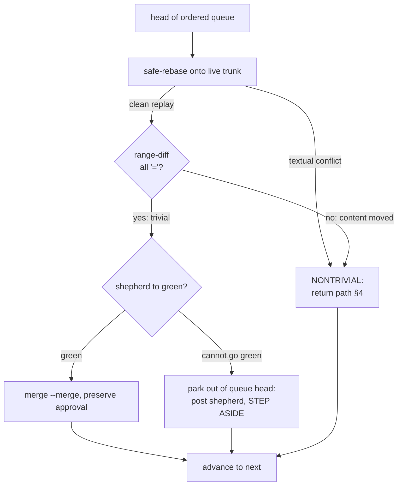
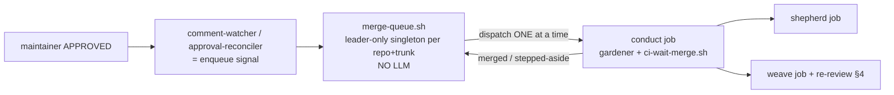

# Design: the conductor as a merge queue

| Created | 2026-08-17 |
| Author  | designer |
| Status  | Proposed |

## The problem

The conductor is a **per-PR one-shot**, and its merge-time freshness rebase is
mandatory ([conductor-rebase-before-merge](conductor-rebase-before-merge.md)): a
rebase changes the reviewed commit identity, so an approval on the pre-rebase head
is intentionally stale, and the maintainer must re-approve the rebased head. That
invariant exists to stop an agent force-push from inheriting a human signature —
and it is correct when the rebase actually changed something. But when the rebase
is **purely mechanical** — a clean replay that produces a patch-identical head —
re-approval buys **nothing**: the maintainer re-reads a change they already read.

Three instances in a single session on 2026-08-17, all on `endojs/endo-but-for-bots`:

- **#856** — approved on head `40af392`, freshness rebase moved it to `4e7b7f95`,
  approval went stale, re-approved, merged. **Two approvals for one merge.**
- **#1000** — approved 04:11Z on `4dad1282b`, a weave rewrote the head to
  `692f4803` at 04:58Z, approval stale again; ultimately closed as superseded, so
  **both approvals bought nothing** ([frozen-base-supersession-check](frozen-base-supersession-check.md)).
- **#282** — the approval predated recognition of a design collision, **void on
  arrival.**

The maintainer is the fleet's scarcest resource. Spending their approvals on
re-approving patch-identical rebases is the waste this design eliminates.

## The insight: serialize, then most rebases are provably trivial

If approved changes merge **one at a time** against a trunk that **only the queue
advances**, then between a maintainer's approval and the merge the trunk moves only
by the queue's own prior merges — at *known* points, not by concurrent races. Each
change's rebase happens at a defined moment, and — because the queue is the sole
writer — a clean replay is the common case. A clean replay can be **mechanically
proven patch-identical** (§ The triviality boundary), and a patch-identical rebase
**preserves approval**. The maintainer is asked to re-approve only when the rebase
genuinely changed content.

This *refines* the [conductor-rebase-before-merge](conductor-rebase-before-merge.md)
invariant rather than breaking it. That design says "a rebase never preserves that
signature." The queue narrows it: a rebase whose result is **proven identical** to
the reviewed commits preserves the signature; every other rebase does not. The
safety property — never merge unreviewed content under an old signature — is
untouched, because the proof is what gates it.

## 1. Handoff, entry, and ordering

**"Handed off to the conductor"** means: a PR carrying a current maintainer
`APPROVED` review (`pr-maintainer-approval-gh.sh` == 0 on the approved head) at the
moment of approval, authored by the bot on a bot-pushable head branch, is
**enqueued** into the merge queue for its target trunk.

- **Entry point (no new producer):** the two existing approval-detectors become
  *enqueue signals* rather than lone-conduct posters. The `comment-watcher.sh`
  `[APPROVED]` path and the [approval-reconciler](approval-reconciler.md) sweep
  already fire on exactly this condition and mint `<slug>-pr<N>-conduct`. In the
  queue model they enqueue instead (mechanically: the queue re-derives membership
  each tick, so "enqueue" is just *the approval record existing* — see § 5).
- **The botanist enqueues through the conductor too** (decided — kriskowal, PR #72
  review, 2026-09-03). The Dependabot MERGE-NOW path does **not** keep a separate
  direct `--dependabot-auto-merge` conduct dispatch outside the queue; the botanist
  enqueues its Dependabot PRs into the same `(repo, trunk)` queue so they serialize
  through the single trunk writer with every other change. Because a Dependabot
  MERGE-NOW PR carries **no maintainer approval signature**, the triviality /
  approval-preservation gate (§ 3) does not apply to it — it merges on the botanist's
  auto-merge policy once green — but it still rides the shared serial rebase →
  shepherd → retcon → merge spine (§ 2) rather than racing the queue's writer.
- **The queue is per target trunk** — keyed `(repo, trunk)`, e.g.
  `(endojs/endo-but-for-bots, llm)`. This is the singleton unit: a merge queue is
  inherently one writer per branch, and nothing in the garden handles concurrent
  duplicates. On `endo-but-for-bots` there is exactly one fork trunk, `llm`;
  `master` work never merges into the fork (it ferries upstream), so it never
  enters a queue (conductor step-2 exception, #475).
- **Ordering discipline:** stable **topological order** over the stacked-PR
  dependency graph ([pr-dependency-topo-sort](../skills/pr-dependency-topo-sort/SKILL.md)
  over the `journal2` dep registry), so a dependent never merges before its
  dependency. Ties (independent PRs) break by **approval timestamp** (FIFO) —
  decided (kriskowal, PR #72 review, 2026-09-03): age and sequence of approval is
  the tie-break — then by `(repo, number)`. A declared dependency **cycle** surfaces to the maintainer
  and the affected members do not merge until it is resolved — the topo-sort skill
  already specifies this.

## 2. The serial attempt loop

At most **one change is in a merge attempt at a time** per trunk. For the head of
the ordered queue:



The load-bearing rule: **the queue never blocks on a change it cannot land.** A
change that goes red and cannot be shepherded green, or that needs a nontrivial
rebase, **steps aside** (its slot is released, a shepherd or weaver job is posted)
and the queue **advances to the next entry**. A queue that stalls the whole line on
one stuck change is strictly worse than the per-PR status quo. A stepped-aside
change re-enters the queue by the normal path once it is green again and (if the
rebase was nontrivial) re-approved.

The per-change worker is the **existing conductor / `ci-wait-merge.sh` spine**,
extended with the triviality gate (§ 3): it already unfreezes, rebases via
`safe-rebase.sh`, waits for CI on the exact post-rebase head, and merges `--merge`.
The only change to the spine is *when it demands a fresh approval*.

**The conductor's operative scope** (decided — kriskowal, PR #72 review,
2026-09-03): while landing a queued change the conductor is **free to weave, fix,
shepherd, and retcon**. A **retcon is mandatory before merge** — the fixups a fix or
shepherd introduced must be collapsed back into their reviewed commits (with the
`chore: Update yarn.lock` kept as its own commit, [retcon](../skills/retcon/SKILL.md))
so the merged history matches the reviewed shape rather than carrying loose
fixup commits — and **CI must finally be green on the retconned head** before the
merge lands. The mandatory retcon is what makes the lockfile exemption (§ 3) sound:
the lockfile is regenerated and re-isolated as part of the collapse, so its
per-rebase churn never rides into a reviewed commit.

## 3. The triviality boundary (load-bearing)

A **trivial** rebase preserves approval; a **nontrivial** one returns the change to
a weaver and the maintainer. The test is **mechanical and no-LLM**, computed by a
new deterministic helper (`rebase-triviality.sh`, or folded into `safe-rebase.sh`):

```sh
git range-diff <old-base>..<old-head> <new-base>..<new-head>
```

Precedent: the PR-806 merge used `git range-diff` to establish that an approval on
an earlier head applied to the final head. `range-diff` pairs the commits of the
two ranges and marks each pairing `=` (patch-identical, modulo commit metadata),
`!` (paired but the patch text differs), or `<`/`>` (present in only one range).

Two gates compose, coarse then fine:

1. **Did the rebase even complete cleanly?** `safe-rebase.sh` already fails closed
   (`needs weave`) on **any** textual conflict except a lockfile-only conflict it
   regenerates. A rebase that hit a conflict is **nontrivial by construction** — it
   never produced an automatic head. This is today's behavior, unchanged.
2. **Did the clean replay change any content?** Even a conflict-free 3-way rebase
   can silently absorb neighboring base changes into a commit's patch context. The
   range-diff is the finer gate on top:
   - **all pairings `=`, equal commit count → TRIVIAL.** Approval preserved.
   - **any `!`, `<`, or `>` → NONTRIVIAL.** Return path.

**What counts as nontrivial**, explicitly: textual conflict resolution; any commit
added, dropped, or reordered; any commit whose patch content differs from its
reviewed form (including context lines the base changed). Only a byte-for-byte
identical set of patches rides the old approval.

### The policy component (maintainer's call — do not decide silently)

`range-diff` already ignores pure line-number offsets in hunk headers, so a plain
positional shift is not a difference. Two genuine edge cases sit on the boundary
and are **policy, not mechanism** — how much change may ride an old approval is the
maintainer's decision:

- **Context-only `!` pairings.** When the base changed a *nearby* line, range-diff
  shows a `!` whose nested diff touches only surrounding-context lines (leading
  space), with no added/removed reviewed lines. *Strict* option: any `!` is
  nontrivial (recommended default — the safety property must not leak, and a
  context change can be semantically load-bearing). *Lenient* option: a `!` whose
  inner diff is context-only is still trivial. **Risk of lenient:** a base edit that
  changes the meaning of a line the reviewed hunk depends on rides an old signature.
  **Risk of strict:** more re-reviews of changes that are visually near-identical.
  **Decided (kriskowal, PR #72 review, 2026-09-03): the strict default stands** —
  any `!` is nontrivial (the #72 review overrode only the lockfile case below).
- **Lockfile-only regeneration.** `safe-rebase.sh`'s one auto-recovery drops and
  regenerates `chore: Update yarn.lock`, changing *generated* (unreviewed) content.
  *Option A:* treat the regenerated lockfile as nontrivial (safe, may cost a
  re-approval on a purely mechanical lock bump). *Option B:* exempt a lockfile-only
  delta from the triviality check, since a lockfile is never reviewed line-by-line.
  **Decided (kriskowal, PR #72 review, 2026-09-03): Option B — lockfile
  regeneration is exempt.** A rebase whose only content change is a regenerated
  `yarn.lock` rides the old approval; the generated lockfile is never a re-review
  trigger. This composes with the conductor's mandatory pre-merge retcon (§ 2),
  which regenerates and re-collapses the lockfile into its own commit anyway.

## 4. The return path (bounded, and legible)

A nontrivial rebase hands back on a defined cycle:

1. **Weaver resolves.** Post a `weave` job (the change stepped aside in § 2). The
   weaver rebases/resolves and lease-pushes the new head. For a *conflict* rebase
   this is real work; for a clean-but-content-moved rebase the weaver's job is light
   — confirm and push the already-computed head.
2. **The maintainer re-reviews with a range-diff summary — not "the head moved."**
   The return message and the PR comment carry the rendered `range-diff` of exactly
   what changed (the `!`/`<`/`>` pairings), so the maintainer sees **why** re-review
   was demanded and can scan only the delta, not the whole PR. This is the
   attention-economy win even when re-review is unavoidable.
3. **Re-approval re-enqueues.** A fresh maintainer approval on the new head is the
   same enter-the-queue signal as any approval (§ 1).

**It cannot loop indefinitely.** Two bounds:

- **The serialization already caps churn:** because the queue is the sole trunk
  writer, a returned change's base moves only when the queue merges an *independent*
  sibling. A change with no independent siblings ahead of it will not be re-bumped.
- **For a change that keeps being bumped by a fast-moving trunk**, the queue **pins
  a frozen base** after the *second* nontrivial return: repoint the PR onto a frozen
  `llm-<sha>` snapshot ([frozen-base-branch](../skills/frozen-base-branch/SKILL.md),
  the *pin the merge base* verb) so subsequent queue merges no longer move its base;
  the range-diff is computed once and re-review is against a stable base, after
  which the conductor unfreezes-and-merges normally. A per-PR **re-review counter**
  (`merge-queue/<repo>/<pr>/rereview-count`, monotonic journal state) drives this and
  a maintainer alert ("returned N times — pin, split, or hold"), so a pathological
  change escalates to a human decision instead of spinning.

**Per-PR run-time cap** (decided — kriskowal, PR #72 review, 2026-09-03): a
conductor run for a **single PR** must not exceed **half an hour** (overridable via
journal config, e.g. `merge-queue/<repo>/conduct-timeout`). If a run exceeds the cap
or otherwise **fails**, the conductor **returns the PR to review and alerts the
maintainer** — it steps the change aside (§ 2) and does not hold the queue head. This
is the wall-clock backstop under the return-loop bounds above: a change that cannot be
landed within the cap stops consuming a slot and becomes a human decision rather than
an open-ended merge attempt.

## 5. Relationship to what exists



- **A new leader-only singleton daemon** `merge-queue.sh` (a sibling of
  `approval-reconciler.sh` and the foreman/scheduler), armed per authorized watched
  repo, gated by `is-main-host.sh` (the singleton rule: one writer per trunk, no
  concurrent-duplicate handling anywhere). It is **stateless per tick** like the
  approval-reconciler: each tick re-derives the ordered queue from live PR/approval
  state + the dep registry + the board — **no cursor, so a missed tick self-heals.**
  Its only job is *ordering and single-in-flight dispatch*; it runs no `claude`.
- **The per-change merge work stays a claimable `conduct` job** on the gardener
  fleet, so it keeps the existing worktree/requeue/reaping machinery and the
  `ci-wait-merge.sh` spine. The daemon **subsumes** the *dispatch* that the
  comment-watcher and approval-reconciler do today (they collapse into the enqueue
  signal) and **composes with** `ci-wait-merge.sh`, `safe-rebase.sh`, the shepherd,
  and the weaver — none of those change except the spine's approval gate, which now
  consults the triviality result.
- **Single-in-flight without a new lock:** the daemon dispatches the next conduct
  job only when the board shows **no** conduct job for this `(repo, trunk)` in
  `todo/`+`doin/`. The board *is* the lock — reap-safe by construction (a reaped
  worker's requeue still occupies the slot), so no separate mutable "in-flight
  marker" can desync. This reuses the deterministic *promote-one, watch-to-`tada`,
  then-next* pattern that `orchestrate.sh` already runs for a serial orchestration,
  but with a **dynamically re-derived** queue rather than a fixed child list.

## 6. Failure and recovery

The design's durable state is **entirely derived** from GitHub PR states + journal
approval records + the board; there is **no separate mutable queue file** that can
desync (the sole exceptions — the monotonic re-review counter and a frozen-base pin
— are idempotent journal records safe across a requeue). Consequences:

- **Queue worker reaped mid-merge.** The `gh pr merge` API call is atomic; the PR is
  either MERGED or not. The requeued conduct job rediscovers state from durable
  sources — the on-GitHub PR state and the `<!-- garden-job: <base> -->` marker per
  [requeue-rediscover-prior-work](requeue-rediscover-prior-work.md) — so a naive
  second merge/PR cannot happen. The next daemon tick re-reads PR state: MERGED →
  advance; not merged → the requeue retries the same slot.
- **Leader dies / leadership hands off.** Stateless-per-tick + journal-derived means
  the new leader's daemon reconstructs the identical ordered queue on its first tick.
  No handoff of in-memory queue state.
- **Half-merged is unreachable.** Because the queue advances only on an *observed*
  terminal PR state, not on a fire-and-forget, there is no "started but unrecorded"
  window that a fresh tick cannot re-derive.

## What this design does NOT cover

- **Upstream ferrying.** The queue lands on the fork trunk (`llm`); carrying merged
  work upstream is the boatman's separate, permissioned surface (§ The ferry).
- **GitHub's native merge queue** is deliberately not used: it cannot express the
  triviality/approval-preservation logic that is the entire point here.
- **The shepherd's internal CI-fixing** and the **weaver's conflict-resolution**
  logic are unchanged; the queue only dispatches and sequences them.
- **Cross-trunk / cross-repo global ordering.** Queues are independent per
  `(repo, trunk)`; there is no global serialization across trunks, and none is
  needed (different trunks do not race for one tip).
- **A concrete `rebase-triviality.sh` implementation** and the daemon's exact
  systemd unit shape are left to the build; this document fixes the contract (the
  range-diff gate, the exit-code meaning, the leader-only singleton discipline) that
  a builder implements from.

## Resolved decisions (kriskowal, PR #72 review, 2026-09-03)

The open questions this design raised were decided by the maintainer in the
[PR #72 review](https://github.com/kriscendobot/garden/pull/72#pullrequestreview-5098622457).
Each ruling is folded into the section noted; recorded here as the audit trail.

- **Trivial/nontrivial policy boundary** (§ 3): **lockfile regeneration is exempt**
  (Option B) — a rebase whose only content change is a regenerated `yarn.lock` rides
  the old approval. The **strict** default stands for context-only `!` pairings (any
  `!` is nontrivial); only the lockfile case was relaxed.
- **Conductor operative scope** (§ 2): the conductor is **free to weave, fix,
  shepherd, and retcon**; a **retcon is mandatory before merge** so fixups are
  collapsed into their reviewed commits, and **CI must finally be green** on the
  retconned head before the merge lands.
- **Per-PR run-time cap** (§ 4): a conductor run for a single PR **must not exceed
  half an hour** (journal-configurable); on failure or timeout it **returns the PR to
  review and alerts the maintainer** rather than holding the queue head.
- **Re-review return bound** (§ 4): the wall-clock cap above is the backstop; the
  pin-after-two-returns threshold + re-review counter + maintainer alert stand as
  designed. Repeated returns auto-pin a frozen base *and* alert.
- **Tie-break within a topo rank** (§ 1): **approval-timestamp FIFO** — age and
  sequence of approval — is the tie-break (oldest-approved-first), then `(repo,
  number)`.
- **Botanist Dependabot path** (§ 1): the **botanist enqueues through the conductor**
  — no separate out-of-queue `--dependabot-auto-merge` dispatch. Dependabot MERGE-NOW
  PRs serialize through the queue but skip the approval-preservation gate (they carry
  no maintainer signature), merging on the botanist's auto-merge policy once green.
</content>
</invoke>
