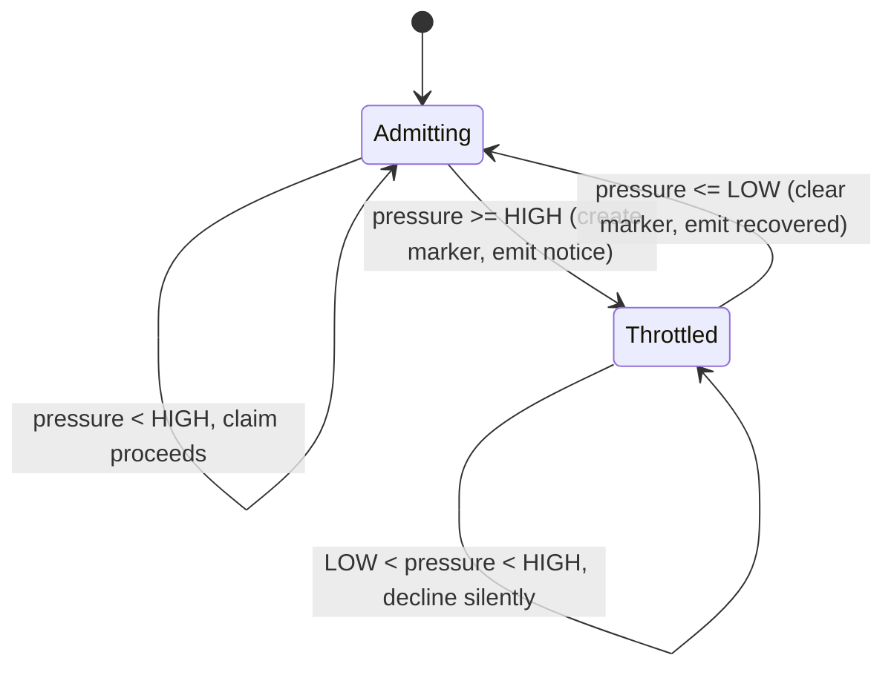

# CPU back pressure at the claim edge

| Created | 2026-09-19 |
| Author  | gardener (job `design-cpu-back-pressure-job-dispatch-20260918`) |
| Status  | Proposed |
| Builds on | [`live-budget-admission.md`](live-budget-admission.md) (the admission-surface pattern this deliberately inverts on fail-direction) |

## Problem

The dispatcher decides whether a worker may claim from three inputs: **budget**
(`pool_admits`, `usage-meter.sh`), **drain** (`fleet_draining`), and **worker
count** (leveled out-of-band by `set-workers.sh`/`budget-level.sh`). It has **no
notion of the host's actual CPU pressure**, and worker count is a poor proxy for it:
a single claim can fan out arbitrarily.

Measured incident (host `endolin-garden2-5bcdff64`, 32 CPUs, 2026-09-18
23:27–23:37Z): one job — `garden-monk@2` running
`endojs-endo-but-for-bots-pr1301-gauntlet-20260918-clean` — owned **594 processes**
(104 `manager-node.js` + 82 `worker-node.js`, ~190 Endo daemons) from a *single*
`ava` run of `packages/daemon`. Load average climbed 149→168 while the daemon count
stayed **flat at ~190** and their ages equalled the run's own age (median 2125s /
run 2191s): the suite was not churning files, it had stalled under its own
contention. Nothing throttled. **Two** monks were enough to saturate the box, so no
count cap would have caught it.

This was **not** an orphan/reaping failure: it was investigated directly — zero
`PPID=1` processes, exactly one process fleet-wide outside a `garden-*` cgroup,
every process inside a live worker's cgroup. It is the plain absence of admission
control relating host load to claim eligibility. The underlying `packages/daemon`
daemon-teardown leak is a **real upstream defect in `endojs/endo-but-for-bots`**
and is explicitly **out of scope here** (to be filed upstream); back pressure is the
durable answer regardless, because the dispatcher cannot assume every suite it runs
is well-behaved.

## Design

Add a fourth claim guard, **`load_admits`**, evaluated in `claim-job.sh` alongside
`fleet_draining` and `pool_admits`. It is a pure **admission** gate on the claim
edge: a saturated host stops taking *new* claims and lets in-flight work finish —
the same shape as a drain. It never touches a running handler.

### 1. Signal: PSI `some avg10`, load-average fallback

The gate reads, in order:

1. **`/proc/pressure/cpu`** — the `some avg10` field: the percentage of the last 10
   seconds during which *at least one* runnable task was stalled waiting for a CPU.
   This is the chosen primary signal. It measures **actual contention stall time**,
   not a task count, so it is far less noisy than load average on a box churning
   many short-lived processes, and it does not inflate on D-state (uninterruptible
   I/O) tasks the way the run-queue length behind load average does. In the incident
   a `some avg10` reading would have been pinned high the whole ten minutes while
   load average lagged its 1-minute EWMA. `avg10` (not `avg60`/`avg300`) is chosen
   for responsiveness — the hysteresis gap below, not a long averaging window,
   supplies the anti-oscillation stability.
2. **`/proc/loadavg`** — fallback when `/proc/pressure/cpu` is absent (kernel built
   without `CONFIG_PSI`, or `psi=0`). The normalized ratio is `loadavg1 / nproc`.
   Noisier and lagging, but universally present, and adequate as a floor.
3. **Neither readable → admit** (see §3, fail-open).

Thresholds are env-tunable (proposed defaults, to be calibrated — see Open
questions):

| Signal | Enter throttle (high-water) | Leave throttle (low-water) | Env |
| --- | --- | --- | --- |
| PSI `some avg10` (%) | `≥ 50` | `≤ 25` | `GARDEN_LOAD_GATE_PSI_HIGH` / `_PSI_LOW` |
| loadavg1 / nproc | `≥ 1.5` | `≤ 1.0` | `GARDEN_LOAD_GATE_LOADAVG_HIGH` / `_LOADAVG_LOW` |

### 2. Hysteresis: two water lines, host-local throttle state

A bare threshold oscillates (refuse → load drops → claim → spike). The gate keeps a
**host-local** throttle marker (`$GARDEN_STATE/load-throttled`) and applies separate
high/low water lines — the same asymmetric "harder to leave the safe state than to
enter it" intent `budget-level` gets from its `0.85` mark plus its dwell/confirm
streak, realized here as two water lines because the claim edge is **event-driven**
(irregular claims), not tick-driven, so a persistent flag fits where a per-tick
dwell counter does not.

The marker is **host-local**, not journal-backed: it is a fact about *this* host's
own CPU, every host evaluates its own `/proc` independently, and there is no
leader-only singleton to migrate (contrast the journal-backed foreman brake). The
marker is created with an **atomic `mkdir`** so that when several gardeners on one
host trip simultaneously exactly one wins the transition and emits the notice.

`load_admits` and its `host_cpu_pressure` reader live in `common.sh` (fleet-wide,
like `fleet_draining`). On decline it returns the same **exit 3** the drain and
budget-high-water paths use, so the gardener loop simply retries on its next tick.

### 3. Fail **open**, not closed — the deliberate opposite of the budget gate

`pool_admits` fails **closed** (`credit-controls-fail-closed-pools`): an unreadable
budget pool means we cannot know whether we can *afford* the work, so refusing is
correct. This gate is the **opposite**, and that is intentional. An unreadable load
signal means only that we cannot tell how *busy* we are — refusing every claim
fleet-wide on a missing `/proc` read would be a self-inflicted fleet outage. So when
neither PSI nor loadavg is readable, `load_admits` **admits** (and clears any stale
marker), degrading to exactly today's behavior. This asymmetry is stated here so a
future reader does not "fix" it into symmetry with the budget gate.

### 4. Admission only — never kill or preempt

The gate is consulted **only in `claim-job.sh`, before a claim**. No in-flight
handler ever reads it; a throttled host runs its current jobs to completion and
declines only the *next* claim. This is the maintainer's explicit choice of
throttling over killing the live job, and it composes with the existing busy-marker
scale-defer (`install-units.sh` defers stopping a mid-job worker until it is idle
between claims): a mid-job worker is never interrupted mid-flight. Back pressure is
symmetric with a drain, not with a reaper.

### 5. Observability — one coalesced notice per host per episode

A silent refusal is indistinguishable from an idle fleet — the confusion that hid
the foreman's `GARDEN_FOREMAN_ACTIVE_TARGET=0` quiesce for two months. So a decline
is surfaced through **`watchdog-notice.sh`**, keyed **`load-gate-<GARDEN>`**. It is
**edge-triggered on the throttle marker**: the notice is emitted once when the
marker is *created* (trip) and amended with `--recovered` once when it is *cleared*
(release). The many claims declined in between see the marker already present and
say nothing. This yields exactly one keyed notice per host per episode; the
`watchdog-notice` key is a coalescing backstop if two hosts (or a lost trip race)
touch the same condition.

### 6. Claim-edge only — production is left alone

The foreman and scheduler push work onto the board independently of any host's load.
This design puts back pressure **only at the claim edge** and deliberately does
**not** damp production. Rationale: a job sitting in `jobs/todo/` consumes no host
CPU — only a **claim** turns a board entry into 190 processes. The board is a
buffer; letting it fill while saturated hosts decline is precisely the drain shape,
and if every host is saturated, claims stop fleet-wide and the board simply buffers
until pressure eases. A fleet-wide saturation signal damping production would require
aggregating per-host load into shared journal state (cross-host coupling, more moving
parts) for little gain. Claim-edge alone is the smaller, safer change. Production-side
damping is noted as possible future work, not built here.

### State ownership (single component)

This is a single-component change (the dispatcher's claim-edge admission surface),
so it owes no cross-boundary ownership map. For the record: **mechanism** and
**policy** live in `load_admits`/`host_cpu_pressure` (`common.sh`); **durable state**
is the host-local `$GARDEN_STATE/load-throttled` marker, owned by whichever gardener
wins the atomic trip and cleared by whichever wins the release; **the value crossing
into the decision** is the kernel's `/proc` pressure reading, owned by the kernel and
only read. No commit/replay concern: the marker is host-local ephemeral state, safe
to lose (a lost marker just re-derives on the next claim's reading).

## Alternatives considered

- **Load average as the primary signal.** Rejected as primary: it counts run-queue
  length (including D-state I/O tasks) on a 1-minute EWMA, which lags and misreads a
  short-lived-process storm. Kept as the fallback where PSI is unavailable.
- **A per-host in-flight worker-count cap at the claim edge.** Rejected: the incident
  proves count is a poor proxy — two workers produced ~190 processes. Capping count
  would not have fired.
- **Killing or preempting the saturating job.** Rejected per maintainer directive:
  throttle admission, let in-flight work finish.
- **Damping foreman/scheduler production on a fleet-wide saturation signal.**
  Deferred, not rejected — see §6. Claim-edge back pressure is sufficient and
  smaller.

## Test plan

- Unit: `host_cpu_pressure` parses a fixture `/proc/pressure/cpu` (`some
  avg10=…`), a fixture `/proc/loadavg`, and returns nonzero when both fixtures are
  absent. Assert PSI is preferred when both exist.
- Hysteresis: drive `load_admits` across a scripted pressure sequence
  (`10→60→30→60→15`) with a temp `$GARDEN_STATE`; assert trip at ≥HIGH, hold in the
  dead-band, release at ≤LOW, and that exactly one trip notice + one recovered notice
  are emitted (mock `watchdog-notice.sh`).
- Fail-open: point the reader at a missing `/proc` path; assert `load_admits`
  returns admit **and** clears a pre-existing stale marker.
- Concurrency: race two `load_admits` calls into the trip; assert one marker, one
  notice (atomic `mkdir`).
- Integration: with the marker present, assert `claim-job.sh` exits 3 without
  claiming and never touches a running handler's busy marker.

## Open questions

- **What high/low-water values are right for the real fleet?** The PSI `50/25` and
  loadavg `1.5/1.0` defaults are proposed, not measured. They want calibration
  against a healthy busy host (to avoid throttling normal load) versus the incident
  profile (to trip before load 168). Should the values be recorded per-host in the
  journal (like a budget pool) rather than as fleet-wide env defaults?
- **Should the gate be worker-kind-aware?** The incident was a fan-out-heavy `monk`
  gauntlet; a 1-second `myrmidon` claim on a saturated host is cheap. Should a
  saturated host still decline cheap claims (simplest, current design) or exempt
  low-fan-out kinds so trivial work still drains? A kind-scoped high-water would be a
  policy fork.
- **Is `/proc/pressure/cpu` present on the fleet's hosts?** PSI needs a kernel with
  `CONFIG_PSI=y` and `psi=1`. The fallback + fail-open cover its absence, but if PSI
  is universally unavailable on the current hosts the loadavg path is what actually
  runs, and its thresholds are the ones that matter. Confirm per host at build time.
- **Should a *persistent* throttle episode escalate** — e.g. after N minutes
  throttled, page the maintainer or damp production (§6) — rather than only emitting
  the one coalesced notice? Left for a future iteration unless the maintainer wants it
  now.

🤖 Generated with [Claude Code](https://claude.com/claude-code)
