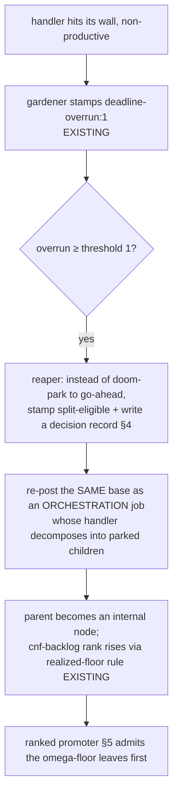

# Cybernetics for economic resilience

| Created | 2026-09-05 |
| Author  | designer (job `design-cybernetics-economic-resilience`) |
| Status  | Proposed |
| Grounds on | [`cybernetics-audit.md`](cybernetics-audit.md), the credit-expenditure investigation (`journal/reports/credit-investigation-endolin-garden2-20260905.md`) |
| Composes with | [`omega-task-rank-and-foreman-retirement.md`](omega-task-rank-and-foreman-retirement.md), [`live-budget-admission.md`](live-budget-admission.md), [`session-budget-pace.md`](session-budget-pace.md), [`quota-throttle.md`](quota-throttle.md), [`recurring-budget-calibration.md`](recurring-budget-calibration.md), [`manual-gauntlet-trigger.md`](manual-gauntlet-trigger.md), [`cnf-backlog-triple.md`](cnf-backlog-triple.md) |

The maintainer asked for four behaviors that make the garden cheaper and more
resilient without regressing what is deployed:

1. one overrun, with no retry, is sufficient just cause to **split** a job and
   **propagate an omega score upward** through its parents;
2. **retries only after back-off, and only for quota-bump / quota-recovery** cases;
3. **triager pacing from estimated job cost** — it wakes when enough tokens are
   projected to be released to afford the next job;
4. **durable journal visibility for every cybernetic input and output**, with
   provenance and outcome tracking.

The audit and the credit investigation already did most of the diligence. This
document verifies each request against the deployed code, states plainly which
half is already built, and narrows the proposal to the missing delta. It changes
no dispatch behavior by itself; each slice below is a separately-landable change,
and the ones that turn on ranking stay gated on the still-open omega orientation
question (§6 Q1).

## 0. What already landed — so this design is only the delta

The economics work of the last month is largely deployed. Verified on `main2`
at this worktree's checkout; each of the audit's ten recommendations that a
commit closed is out of scope here:

- **Spend-sensor blindness holds instead of maximizing** (`0b86ab72e2`);
  **budget-level restraint** — per-tick clamp, dwell, drain-skip (`60ceb2feeb`);
  **setpoint provenance** — `config/budget-pools` carries calibrated-from/date
  columns and `budget-level.sh` refuses to actuate on an uncalibrated cap
  (`3cfbeb5ac4`); **weekly capacity calibration** exists.
- **Quota calibration + reset detection**: `detect-quota-resets.sh`,
  `append-reset-event.sh`, manual quota-checkpoint ingestion and fit
  (`d5a2071faf`, `317a0f31e4`, `bd9c1af2aa`, `ed94e556fd`).
- **Scheduled dispatch now routes through the one admission gate** (`4f280ec1e1`);
  **raw maintainer-inbox path coalesces** (`5c1d9cd124`); **frontmatter validated
  at the write side** (`8d5139f4be`); **exit-0 provider outages routed off the
  unavailable-worker path** (`1c3cbbc1fa`).
- **Provider-quota back-off-and-recover already exists per job**: the gardener
  stamps `provider_quota_backoff_hint` from the parsed reset epoch and the reaper
  holds that one job until the reset, then requeues (`quota-throttle.md` §"What
  already exists"; `reaper.sh` `provider_quota_backoff_fields`).
- **Deterministic overrun doom at threshold 1**: a wall-hit (`rc=124`)
  non-productive cycle earns `<!-- garden-deadline-overrun: N -->` and dooms at
  `GARDEN_REAP_OVERRUN_THRESHOLD=1` — a single overrun already ends the retry
  loop (`reaper.sh`).
- **A board-derived ordinal rank already exists, read-only**: `cnf-backlog-triple.py`
  derives each job's rank from `role:` and realized children (`1 + max(child
  rank)`, capped at 2), never from a declared `rank:`/`omega:` field
  (`cnf-backlog-triple.md`). Nothing dispatches on it yet.

So three of the four requests are **partly** built. The gaps are specific and
named below; none is a new controller layered over a broken one.

## 1. Overrun → split, and omega propagated upward (request 1)

**Already built.** A single deterministic overrun already ends retries: threshold 1,
non-productive-only (a productive cycle resets the counter), doom bypassed straight
past the generic requeue budget. The rank half is half-built: `cnf-backlog-triple`
already propagates rank **upward** by construction (a parent's realized-floor rank is
`1 + max(child rank)`), and it is derived, not declared — exactly the maintainer's
"promote itself in that tree" made recomputable.

**The delta.** Today a threshold-1 overrun **doom-parks** the job to `jobs/plan/`
gated `go-ahead`, which *no* auto-promoter selects — it waits for a human. The
request is that the same single overrun instead be **just cause to split**: the
job decomposes into child sub-jobs and becomes an internal node, and the tree's
derived rank rises above the children by the existing realized-floor rule. This is
exactly Stage 5 of the omega design ("self-promotion on time-window overrun"),
which that design deliberately left as a *deliberate handler action* gated on
jcorbin's orientation answer. This design proposes making the **trigger**
deterministic while keeping the **decomposition** a handler act, so nothing
autonomous mints work:



The split is not a blind fan-out: the re-posted job wears the orchestrator role
and its *first act* is to decide whether the work genuinely decomposes. Work that
is simply too slow but indivisible (a long single build) is **not** forced into a
false split — it re-posts as a single child with a larger `handler-timeout:` and a
recorded reason, which is the honest form of "this leaf needs a bigger window,"
not a plan tree. This keeps the maintainer's rule ("a task that cannot be
completed within its window must create a plan and promote itself") while refusing
to manufacture a plan where none exists.

**Why the overrun, specifically, is sufficient cause.** The credit investigation's
pr665 anatomy is the evidence: a job that cannot fit its window resumes, pays
140K–900K cache-read tokens to reload a long session, does ~2 turns, exits, and
repeats — six ~$1 no-op reloads in four hours before failing anyway. One overrun is
a *deterministic* predictor that the next resume will do the same (the wall does
not move), so retrying is pure reload cost. Splitting converts that reload waste
into progress on smaller leaves that *do* fit. Machine cost is small in absolute
terms (omega §0: ~50–190× below human-review cost), so the win is not dollars — it
is not stalling the shared account on a job that structurally cannot converge.

**What stays gated.** The rank *number* that a ranked promoter consumes (§5) and
the leaf-is-floor-vs-root-is-floor orientation remain open (omega §5 Q1, §6 Q1
here). Until resolved, this slice can still land its deterministic half: the
overrun trigger, the split-eligible stamp, the re-post-as-orchestration, and the
decision record — all of which reuse the existing orchestration substrate and the
existing derived rank, none of which needs the orientation answer. Only the
*promotion ordering* waits.

## 2. Retries only after back-off, only for quota recovery (request 2)

**Already built.** Two of the three retry classes already obey this rule:

- **Provider-quota caps** hold-then-retry: the per-job backoff hint waits for the
  parsed reset epoch (a real back-off), then requeues once — retry after back-off,
  for a quota-recovery case. This is the *sanctioned* retry.
- **Deterministic overruns** already do **not** retry (threshold 1, §1).
- **Exit-0 provider outages** are routed off the unavailable-worker path
  (`1c3cbbc1fa`), so they no longer burn requeue cycles as if they were failures.

**The delta.** One retry path remains that is neither backed-off nor
quota-scoped: the **generic requeue budget** (`GARDEN_REAP_DOOM_THRESHOLD=5`). A
job that exits non-productively *without* hitting its wall and *without* a quota
signal is requeued up to five times, immediately claimable each time (no back-off
between cycles beyond the claim-age floor). The credit investigation shows this is
where stale-PR treadmill cost concentrates. The request narrows retry to
quota-bump / quota-recovery only, so the generic multi-cycle requeue should be
**retired in favor of split-or-surface**:

- A non-productive non-quota exit is treated like an overrun (§1): **split-eligible
  on the first occurrence**, not requeued five times. If it genuinely decomposes,
  the children retry the tractable parts; if not, it surfaces to the maintainer
  with its decision record rather than churning.
- The **only** retry that survives is the quota class, and it **only** fires after
  a back-off keyed on a *parseable future reset epoch* (the existing discriminator
  in `provider_quota_reset_epoch`: a reset epoch ⇒ quota, retry after back-off; no
  epoch ⇒ funding/other, alert a human, never auto-retry — `quota-throttle.md`).
- A **quota bump** (the maintainer raising a cap, or the +50% boost the reset
  detector already classifies as `cap-change-suspected`) is the second recovery
  trigger: work parked `over-token-budget` already auto-returns at the next
  refresh (`budget-refresh.sh`); this design records the bump as a first-class
  recovery event (§4) so the return is attributable, not silent.

Net effect: the retry vocabulary shrinks to exactly *"a quota window reopened, so
try the held work again."* Every other single failure either splits (if divisible)
or surfaces (if not) — no blind cycle count. `GARDEN_REAP_DOOM_THRESHOLD` drops
toward 1 for the non-quota classes; the change is a threshold and a destination,
not a new loop. This must be staged carefully against the deployed reaper, which
is the best-engineered loop in the fleet (audit §6) — the never-reap-earlier
invariant, the productive-cycle reset, and the doom-spool all stay untouched.

## 3. Triager pacing from estimated job cost (request 3)

**Already built.** The pieces a paced triager needs all exist: `session-budget-pace`
defines `allowed_pace = min(weekly_pace, session_pace)` in tokens/second from the
calibrated caps and the confirmed reset epochs; `detect-quota-resets.sh` +
`append-reset-event.sh` give the reset timing; the per-job **token** ledger and the
`cnf-backlog-triple` role classification give a basis for a per-role cost estimate.

**The delta.** The triager runs on a **fixed 2-minute cadence** (`garden-triager@.timer`,
`OnUnitActiveSec=2m`), blind to whether the fleet can afford what a claim would
cost. It posts jobs; whether they are claimable is decided far downstream by the
admission gate. The request is that the triager (and, by the same argument, any
producer whose cadence it makes sense to pace) **wake when enough tokens are
projected to be released to afford the next job**, rather than on a wall-clock
timer that fires into an exhausted account.

The mechanism is a deterministic, no-LLM projection — no new sensor:

```
est_cost(next_job)  = per-role trailing-median billable tokens   # from the ledger, by role:
projected_release(Δt) = allowed_pace × Δt                        # session-budget-pace, tokens/sec
                        + (reset_bonus if a reset falls within Δt) # detect-quota-resets epoch
wake_after = smallest Δt such that projected_release(Δt) ≥ est_cost(next_job)
             clamped to [current cadence floor, a ceiling]
```

The triager sleeps until `wake_after` instead of a flat 2 minutes. When the fleet
has headroom, `wake_after` collapses to the floor and behavior is unchanged; when
an account is near its cap, the triager backs off to the moment a reset or the
sustainable pace will have released enough tokens for one job — so it neither
spins posting unclaimable work nor sleeps past the reopening. This is the
producer-side complement to the consumer-side claim gate: the claim gate stops an
exhausted host from *claiming*; the pace wake stops a producer from *posting* into
that state faster than it can drain.

`est_cost` is intentionally the *trailing median by role*, not a live prediction:
it is cheap, recomputable, and honest about its imprecision (a gauntlet fix round
and a one-line doc fix have very different costs, and the median smooths that). The
projection **fails open**: missing pace calibration, a stale reset epoch, or an
absent ledger reverts to the current fixed cadence with one deduplicated warning,
matching the meter's existing discipline. It never *blocks* a triager tick that has
a real event to process past a hard ceiling — a paced sleep is a floor on quiet
ticks, not a gate on urgent ones (an event-bearing tick still fires; see §6 Q3 on
whether event arrival should preempt the sleep).

## 4. Durable journal visibility for every cybernetic input and output (request 4)

**Already built.** Several cybernetic *inputs* are durably journaled with
provenance: `config/budget-pools` (cap + calibrated-from + date), `budget/live/<host>`
(meter snapshot with cap/window), `budget/weekly-capacity/<host>.jsonl`,
`budget/manual-checkpoints/<host>.jsonl` (dashboard %, pairing confidence),
`budget/reset-events/<host>.jsonl`, `usage/<base>.jsonl` (per-engagement cost),
`panel-runs/`, `reputation/`, and `sysop-log/<GARDEN>/`.

**The delta.** The cybernetic **outputs** — the decisions the loops actually make —
are logged to the **host-local systemd journal**, which is ephemeral, per-host, and
invisible to anyone reading the board. There is no durable, attributable record of
*why the fleet did what it did*. Concretely, none of these leaves a journal2 trace
today: budget-level raising/lowering a worker count (and its reason), a claim
declined because a pool was in back-off, a job split under §1, a retry suppressed
under §2, a triager wake deferred under §3, a plan promoted or parked. The audit's
"silent detector" finding (§2.7) is the same shape from the sensor side: a decision
whose only record is a log line is indistinguishable, after the fact, from a
decision never made.

Add one append-only, per-host decision ledger — `budget/decisions/<host>.jsonl`
(name chosen to sit beside the existing `budget/` cybernetic state; it is not
budget-specific and may be renamed `cybernetics/decisions/` — §6 Q4). One row per
actuation, written by whichever loop actuates, with a fixed shape:

```jsonc
{
  "ts": "2026-09-05T16:40:00Z",
  "loop": "budget-level",              // which controller acted
  "input": {                            // the sensed values it acted on, with provenance
    "pool": "anthropic:endolin-garden-ece02cb4",
    "spend": 120100000, "cap": 149000000,
    "cap_provenance": "calibrated 2026-09-05 from /usage",
    "sensor": "session-log-fold", "sensor_age_s": 210
  },
  "decision": "lower-workers", "from": 4, "to": 3,
  "reason": "pool at 0.81 of cap; step clamp 1/tick",
  "outcome": "applied",                 // applied | fail-open-skipped | no-op | superseded
  "outcome_detail": "set-workers ok"
}
```

Every controller already computes `input`, `decision`, and `reason` (they appear in
the log lines quoted in the audit); this slice makes them **durable and
attributable** by writing the same fields as a row instead of (or in addition to) a
log line. `outcome` closes the loop the audit says is missing everywhere: a decision
that *failed open* is recorded as `fail-open-skipped`, so "the loop chose not to
act" is distinguishable from "the loop never ran." The write reuses the
append-only-JSONL + CAS discipline `usage-append.sh` already proves out, is
best-effort (a failed decision-log write must never wedge the actuation it
describes — it degrades to today's log line), and is bounded by per-host rotation
(§6 Q5). This is deliberately **not** the full telemetry ladder
(`garden-telemetry-and-anomaly-response.md`, unimplemented); it is the one
cheap rung — durable decision provenance — that every other request in this
document needs to be auditable (§1's split, §2's suppressed retry, §3's deferred
wake all write here).

## 5. How the four compose, and the staging order

The four are one loop seen from four sides: a cost estimate (§3) paces production,
an overrun splits intractable work into affordable leaves (§1), the retry
vocabulary shrinks to quota recovery so nothing churns (§2), and every decision is
attributable (§4). They share the omega-ranked promoter as the point where ranking
becomes real:

```
promoter tick:                       # garden-promoter, omega Stage 2, leader-only, no-LLM
  if not pool_admits(any pool): stop; record §4 decision "promotion-halted"
  else:
    next = omega_lowest_ranked(deferred)   # ranking — gated on §6 Q1
    promote(next); record §4 decision "promoted"
```

Staging, least-gated first, so value lands before the open orientation question is
answered:

1. **§4 decision ledger** — no policy, pure observability; unblocks auditing the rest.
   Land first.
2. **§2 retry narrowing** — a reaper threshold + destination change; needs no ranking.
3. **§3 triager pacing** — a wake computation over existing calibration; fails open.
4. **§1 overrun-split trigger + re-post-as-orchestration** — reuses the existing
   orchestration substrate and derived rank; deterministic half lands now.
5. **Ranked promotion ordering** (the omega `garden-promoter` consuming a rank
   number) — **gated on §6 Q1**; until then the promoter admits in the existing
   `plan_deferred_ranked` order and §1's split still helps by producing smaller
   leaves.

Each slice is individually reversible and behavior-preserving when its inputs are
absent (fail-open), matching the deployed loops' posture.

## 6. Open questions

1. **Omega orientation (blocks §5 ranked promotion and the §1 rank *number*).**
   The leaf-is-floor-vs-root-is-floor question is still open, awaiting jcorbin
   (omega §5 Q1; question posted 2026-08-03, unanswered). `cnf-backlog-triple`
   commits to leaf = R0 = do-first and propagates `1 + max(child rank)` upward;
   this design assumes that orientation for its *derived* rank but does not
   actuate a promoter on it until confirmed. Is the cnf orientation the one to
   build the promoter against?
2. **Is a single non-productive, non-wall-hit exit really sufficient cause to
   split (§2)?** An overrun (`rc=124` at the wall) is an unambiguous "did not fit."
   A plain non-productive exit is weaker evidence — it can be a transient the
   worker recovered from on the next claim. Should the split trigger require the
   wall-hit specifically, and leave *one* backed-off retry for a plain exit before
   splitting? Recommendation: split on wall-hit immediately; allow exactly one
   backed-off retry for a plain non-productive exit, then split. This preserves the
   "no blind cycle count" intent while not over-reacting to a single flake.
3. **Should an arriving event preempt the triager's paced sleep (§3)?** A paced
   wake optimizes the quiet case; but a real comment/CI event arriving mid-sleep
   is time-sensitive. Options: (a) the sleep is a floor only on ticks with no
   pending event (event arrival wakes immediately); (b) strict pacing even for
   events (an exhausted fleet cannot act on the event anyway). Recommendation: (a).
4. **Ledger name and scope (§4).** `budget/decisions/<host>.jsonl` or
   `cybernetics/decisions/<host>.jsonl`? The latter reads truer (leveling, splits,
   retries, and wakes are not all budget), but `budget/` is where the sibling
   cybernetic state already lives. Also: one file per host, or per-loop
   (`.../decisions/<host>/<loop>.jsonl`) to keep CAS contention on each loop's own
   stream, as the per-base usage files do?
5. **Decision-ledger retention.** Append-only JSONL grows unbounded. Rotate by age
   (drop rows older than N weeks) or by size, and where — a keeper tick, or a fold
   into the existing weekly calibration? The audit warns against a keeper whose
   own failure is silent (§2.7), so whatever rotates it must record its own action
   as a decision row.
6. **`est_cost` basis (§3).** Trailing median billable tokens by `role:` is the
   proposed estimator. Should it be per-`(role, repo)` (a gauntlet fix on
   endo-but-for-bots costs more than one on a small repo), or is role alone stable
   enough? Per-role is cheaper and less overfit; per-(role,repo) is more accurate
   but sparse for young repos.
7. **Does the split trigger interact badly with the auto-gauntlet retirement
   (`manual-gauntlet-trigger.md`)?** If gauntlets become manually triggered, a
   fix-round overrun inside a gauntlet is supervised by the gauntlet driver, not
   the reaper's generic path. Confirm the §1 split applies to ordinary jobs and
   that gauntlet-internal overruns stay owned by the gauntlet's `max_stage_retries`,
   not double-handled.

## 7. Alternatives considered

- **A new autonomous promoter for split children.** Rejected: the reaper's
  park-and-human-promote is correct for doomed work (audit §7, "not recommended");
  §1 keeps decomposition a deliberate handler act and only makes the *trigger*
  deterministic, so nothing autonomous mints work.
- **A stored per-loop decision counter instead of an append-only ledger.**
  Rejected for the same reason phases 1–2 rejected a stored "spent" counter: it
  duplicates truth and needs transactional updates. The ledger is append-only and
  read-folded.
- **Keeping the generic 5-cycle requeue and merely adding back-off between cycles.**
  Rejected: back-off does not fix a job that structurally cannot fit its window —
  five backed-off reloads still pay five reloads. Splitting addresses the cause.
- **Raising `max_iterations` / `GARDEN_REAP_DOOM_THRESHOLD` to "try harder."**
  Rejected (audit §5.2): more gain into a noisy plant spends more without
  converging.
- **A dedicated triager-pace timer.** Deferred: the wake computation lives inside
  the existing triager tick; a second timer duplicates the leader/cadence
  machinery, as `live-budget-admission.md` argued for `budget-level.sh`.

## 8. Definition of done for this design

- The four requested behaviors are each verified against deployed code, with the
  already-built half named explicitly and the delta isolated (§0–§4).
- The proposal changes no dispatch behavior on its own; every slice fails open and
  is individually reversible (§5).
- Unresolved choices — the omega orientation, the split trigger's evidence bar, the
  event-preempt policy, the ledger name/retention, the cost-estimator basis — are
  in Open questions, not guessed (§6).
