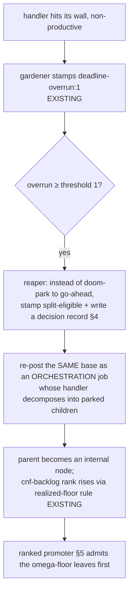

# Cybernetics for economic resilience

| Created | 2026-09-05 |
| Author  | designer (job `design-cybernetics-economic-resilience`) |
| Status  | Accepted |
| Grounds on | [`cybernetics-audit.md`](cybernetics-audit.md), the credit-expenditure investigation (`journal/reports/credit-investigation-endolin-garden2-20260905.md`) |
| Composes with | [`omega-task-rank-and-foreman-retirement.md`](omega-task-rank-and-foreman-retirement.md), [`live-budget-admission.md`](live-budget-admission.md), [`session-budget-pace.md`](session-budget-pace.md), [`quota-throttle.md`](quota-throttle.md), [`recurring-budget-calibration.md`](recurring-budget-calibration.md), [`manual-gauntlet-trigger.md`](manual-gauntlet-trigger.md), [`cnf-backlog-triple.md`](cnf-backlog-triple.md) |

The maintainer asked for four behaviors that make the garden cheaper and more
resilient without regressing what is deployed:

1. one overrun, with no retry, is sufficient just cause to **split** a job and
   **propagate an omega score upward** through its parents;
2. **retries only after back-off**: quota-bump / quota-recovery cases, plus one
   bounded retry for a plain non-productive exit;
3. **triager pacing from estimated job cost** — it wakes when enough tokens are
   projected to be released to afford the next job;
4. **durable journal visibility for every cybernetic input and output**, with
   provenance and outcome tracking.

The audit and the credit investigation already did most of the diligence. This
document verifies each request against the deployed code, states plainly which
half is already built, and narrows the proposal to the missing delta. It changes
no dispatch behavior by itself; each slice below is a separately-landable change.
The ranking orientation is settled: leaves are the omega floor (`R0`) and are
therefore admitted before their higher-ranked parents.

## 0. What already landed — so this design is only the delta

The economics work of the last month is largely deployed. Verified on `main2`
at this worktree's checkout; each of the audit's ten recommendations that a
commit closed is out of scope here:

- **Spend-sensor blindness holds instead of maximizing** (`0b86ab72e2`);
  **budget-level restraint** — per-tick clamp, dwell, drain-skip (`60ceb2feeb`);
  **setpoint provenance** — `config/budget-pools` carries calibrated-from/date
  columns and `budget-level.sh` refuses to actuate on an uncalibrated cap
  (`3cfbeb5ac4`); **weekly capacity calibration** exists.
- **Quota calibration + reset detection**: `detect-quota-resets.sh`,
  `append-reset-event.sh`, manual quota-checkpoint ingestion and fit
  (`d5a2071faf`, `317a0f31e4`, `bd9c1af2aa`, `ed94e556fd`).
- **Scheduled dispatch now routes through the one admission gate** (`4f280ec1e1`);
  **raw maintainer-inbox path coalesces** (`5c1d9cd124`); **frontmatter validated
  at the write side** (`8d5139f4be`); **exit-0 provider outages routed off the
  unavailable-worker path** (`1c3cbbc1fa`).
- **Provider-quota back-off-and-recover already exists per job**: the gardener
  stamps `provider_quota_backoff_hint` from the parsed reset epoch and the reaper
  holds that one job until the reset, then requeues (`quota-throttle.md` §"What
  already exists"; `reaper.sh` `provider_quota_backoff_fields`).
- **Deterministic overrun doom at threshold 1**: a wall-hit (`rc=124`)
  non-productive cycle earns `<!-- garden-deadline-overrun: N -->` and dooms at
  `GARDEN_REAP_OVERRUN_THRESHOLD=1` — a single overrun already ends the retry
  loop (`reaper.sh`).
- **A board-derived ordinal rank already exists, read-only**: `cnf-backlog-triple.py`
  derives each job's rank from `role:` and realized children (`1 + max(child
  rank)`, capped at 2), never from a declared `rank:`/`omega:` field
  (`cnf-backlog-triple.md`). Nothing dispatches on it yet.

So three of the four requests are **partly** built. The gaps are specific and
named below; none is a new controller layered over a broken one.

## 1. Overrun → split, and omega propagated upward (request 1)

**Already built.** A single deterministic overrun already ends retries: threshold 1,
non-productive-only (a productive cycle resets the counter), doom bypassed straight
past the generic requeue budget. The rank half is half-built: `cnf-backlog-triple`
already propagates rank **upward** by construction (a parent's realized-floor rank is
`1 + max(child rank)`), and it is derived, not declared — exactly the maintainer's
"promote itself in that tree" made recomputable.

**The delta.** Today a threshold-1 overrun **doom-parks** the job to `jobs/plan/`
gated `go-ahead`, which *no* auto-promoter selects — it waits for a human. The
request is that the same single overrun instead be **just cause to split**: the
job decomposes into child sub-jobs and becomes an internal node, and the tree's
derived rank rises above the children by the existing realized-floor rule. This is
exactly Stage 5 of the omega design ("self-promotion on time-window overrun"),
which that design deliberately left as a *deliberate handler action*. This design
makes the **trigger** deterministic while keeping the **decomposition** a handler
act, so nothing autonomous mints work. The rank orientation is leaf-first:
leaves are `R0`, parents derive `1 + max(child rank)`, and the promoter admits the
lowest rank first.



The split is not a blind fan-out: the re-posted job wears the orchestrator role
and its *first act* is to decide whether the work genuinely decomposes. Work that
is simply too slow but indivisible (a long single build) is **not** forced into a
false split — it re-posts as a single child with a larger `handler-timeout:` and a
recorded reason, which is the honest form of "this leaf needs a bigger window,"
not a plan tree. This keeps the maintainer's rule ("a task that cannot be
completed within its window must create a plan and promote itself") while refusing
to manufacture a plan where none exists.

**Why the overrun, specifically, is sufficient cause.** The credit investigation's
pr665 anatomy is the evidence: a job that cannot fit its window resumes, pays
140K–900K cache-read tokens to reload a long session, does ~2 turns, exits, and
repeats — six ~$1 no-op reloads in four hours before failing anyway. One overrun is
a *deterministic* predictor that the next resume will do the same (the wall does
not move), so retrying is pure reload cost. Splitting converts that reload waste
into progress on smaller leaves that *do* fit. Machine cost is small in absolute
terms (omega §0: ~50–190× below human-review cost), so the win is not dollars — it
is not stalling the shared account on a job that structurally cannot converge.

The split trigger applies only to ordinary jobs. A gauntlet-internal stage remains
owned by the gauntlet driver and its `max_stage_retries`; the reaper must not also
split or retry that stage. This single-owner boundary prevents an internal stage
failure from producing both a gauntlet retry and an ordinary-job decomposition.

## 2. Retries only after back-off, and never as an open-ended loop (request 2)

**Already built.** Two of the three retry classes already obey this rule:

- **Provider-quota caps** hold-then-retry: the per-job backoff hint waits for the
  parsed reset epoch (a real back-off), then requeues once — retry after back-off,
  for a quota-recovery case. This is the *sanctioned* retry.
- **Deterministic overruns** already do **not** retry (threshold 1, §1).
- **Exit-0 provider outages** are routed off the unavailable-worker path
  (`1c3cbbc1fa`), so they no longer burn requeue cycles as if they were failures.

**The delta.** One retry path remains that is neither bounded to one attempt nor
backed off: the **generic requeue budget** (`GARDEN_REAP_DOOM_THRESHOLD=5`). A job
that exits non-productively *without* hitting its wall and *without* a quota
signal is requeued up to five times, immediately claimable each time (no back-off
between cycles beyond the claim-age floor). The credit investigation shows this is
where stale-PR treadmill cost concentrates. Retire that generic multi-cycle
requeue in favor of one narrow transient-failure allowance followed by
split-or-surface:

- A wall-hit overrun is **split-eligible on the first occurrence** and is never
  retried (§1).
- A plain non-productive, non-quota exit receives **exactly one backed-off retry**.
  The reaper records both the retry count and a future not-before time so the job
  is not immediately claimable. If that attempt also exits non-productively, the
  job becomes split-eligible; if it genuinely decomposes, children carry the
  tractable parts, and if not, it surfaces with its decision record.
- A quota retry **only** fires after
  a back-off keyed on a *parseable future reset epoch* (the existing discriminator
  in `provider_quota_reset_epoch`: a reset epoch ⇒ quota, retry after back-off; no
  epoch ⇒ funding/other, alert a human, never auto-retry — `quota-throttle.md`).
- A **quota bump** (the maintainer raising a cap, or the +50% boost the reset
  detector already classifies as `cap-change-suspected`) is the second recovery
  trigger: work parked `over-token-budget` already auto-returns at the next
  refresh (`budget-refresh.sh`); this design records the bump as a first-class
  recovery event (§4) so the return is attributable, not silent.

Net effect: retries are either a quota window reopening or the one backed-off
attempt allowed to distinguish a transient plain exit from a structural failure.
There is no blind cycle count: an overrun splits immediately, and a repeated plain
exit splits or surfaces. The generic five-cycle threshold is replaced by explicit
one-retry state: the first plain failure schedules the sole retry and the second
chooses split-or-surface. This must be staged carefully against the deployed
reaper, which is the best-engineered loop in the fleet (audit §6) — the
never-reap-earlier invariant, productive-cycle reset, and doom-spool all stay
untouched.

## 3. Triager pacing from estimated job cost (request 3)

**Already built.** The pieces a paced triager needs all exist: `session-budget-pace`
defines `allowed_pace = min(weekly_pace, session_pace)` in tokens/second from the
calibrated caps and the confirmed reset epochs; `detect-quota-resets.sh` +
`append-reset-event.sh` give the reset timing; the per-job **token** ledger and the
`cnf-backlog-triple` role classification give a basis for a per-role cost estimate.

**The delta.** The triager runs on a **fixed 2-minute cadence** (`garden-triager@.timer`,
`OnUnitActiveSec=2m`), blind to whether the fleet can afford what a claim would
cost. It posts jobs; whether they are claimable is decided far downstream by the
admission gate. The request is that the triager (and, by the same argument, any
producer whose cadence it makes sense to pace) **wake when enough tokens are
projected to be released to afford the next job**, rather than on a wall-clock
timer that fires into an exhausted account.

The mechanism is a deterministic, no-LLM projection — no new sensor:

```
est_cost(next_job)  = per-role trailing-median billable tokens   # from the ledger, by role:
projected_release(Δt) = allowed_pace × Δt                        # session-budget-pace, tokens/sec
                        + (reset_bonus if a reset falls within Δt) # detect-quota-resets epoch
wake_after = smallest Δt such that projected_release(Δt) ≥ est_cost(next_job)
             clamped to [current cadence floor, a ceiling]
```

The triager sleeps until `wake_after` instead of a flat 2 minutes. When the fleet
has headroom, `wake_after` collapses to the floor and behavior is unchanged; when
an account is near its cap, the triager backs off to the moment a reset or the
sustainable pace will have released enough tokens for one job — so it neither
spins posting unclaimable work nor sleeps past the reopening. This is the
producer-side complement to the consumer-side claim gate: the claim gate stops an
exhausted host from *claiming*; the pace wake stops a producer from *posting* into
that state faster than it can drain.

`est_cost` is the *trailing median by role*, not per repository and not a live
prediction: it is cheap, recomputable, and honest about its imprecision (a
gauntlet fix round and a one-line doc fix have very different costs, and the
median smooths that). The projection **fails open**: missing pace calibration, a
stale reset epoch, or an absent ledger reverts to the current fixed cadence with
one deduplicated warning, matching the meter's existing discipline. A paced sleep
applies only while the queue is quiet. Arrival of a real comment, CI, or other
watched event preempts the sleep and wakes the triager immediately; pacing never
delays an event-bearing tick.

## 4. Durable journal visibility for every cybernetic input and output (request 4)

**Already built.** Several cybernetic *inputs* are durably journaled with
provenance: `config/budget-pools` (cap + calibrated-from + date), `budget/live/<host>`
(meter snapshot with cap/window), `budget/weekly-capacity/<host>.jsonl`,
`budget/manual-checkpoints/<host>.jsonl` (dashboard %, pairing confidence),
`budget/reset-events/<host>.jsonl`, `usage/<base>.jsonl` (per-engagement cost),
`panel-runs/`, `reputation/`, and `sysop-log/<GARDEN>/`.

**The delta.** The cybernetic **outputs** — the decisions the loops actually make —
are logged to the **host-local systemd journal**, which is ephemeral, per-host, and
invisible to anyone reading the board. There is no durable, attributable record of
*why the fleet did what it did*. Concretely, none of these leaves a journal2 trace
today: budget-level raising/lowering a worker count (and its reason), a claim
declined because a pool was in back-off, a job split under §1, a retry suppressed
under §2, a triager wake deferred under §3, a plan promoted or parked. The audit's
"silent detector" finding (§2.7) is the same shape from the sensor side: a decision
whose only record is a log line is indistinguishable, after the fact, from a
decision never made.

Add one append-only decision ledger per host and week under the existing budget
prefix: `budget/decisions/<YYYY-MM-DD>-<host>.jsonl`. The ISO date prefix is the
Pacific-local date of the Sunday that starts the ledger week. At Sunday 00:00 in
`America/Los_Angeles`, writers rotate to the new prefix. One row per actuation is
written by whichever loop actuates, with a fixed shape:

```jsonc
{
  "ts": "2026-09-05T16:40:00Z",
  "loop": "budget-level",              // which controller acted
  "input": {                            // the sensed values it acted on, with provenance
    "pool": "anthropic:endolin-garden-ece02cb4",
    "spend": 120100000, "cap": 149000000,
    "cap_provenance": "calibrated 2026-09-05 from /usage",
    "sensor": "session-log-fold", "sensor_age_s": 210
  },
  "decision": "lower-workers", "from": 4, "to": 3,
  "reason": "pool at 0.81 of cap; step clamp 1/tick",
  "outcome": "applied",                 // applied | fail-open-skipped | no-op | superseded
  "outcome_detail": "set-workers ok"
}
```

Every controller already computes `input`, `decision`, and `reason` (they appear in
the log lines quoted in the audit); this slice makes them **durable and
attributable** by writing the same fields as a row instead of (or in addition to) a
log line. `outcome` closes the loop the audit says is missing everywhere: a decision
that *failed open* is recorded as `fail-open-skipped`, so "the loop chose not to
act" is distinguishable from "the loop never ran." The write reuses the
append-only-JSONL + CAS discipline `usage-append.sh` already proves out, is
best-effort (a failed decision-log write must never wedge the actuation it
describes — it degrades to today's log line), and is bounded by the weekly
Sunday-midnight-Pacific rotation above. Rotation is itself an actuation and writes
the first decision row in the new ledger, including the prior ledger's path and
the rotation outcome. This is deliberately **not** the full telemetry ladder
(`garden-telemetry-and-anomaly-response.md`, unimplemented); it is the one
cheap rung — durable decision provenance — that every other request in this
document needs to be auditable (§1's split, §2's suppressed retry, §3's deferred
wake all write here).

## 5. How the four compose, and the staging order

The four are one loop seen from four sides: a cost estimate (§3) paces production,
an overrun splits intractable work into affordable leaves (§1), the retry
vocabulary shrinks to quota recovery plus one backed-off plain-exit attempt so
nothing churns (§2), and every decision is attributable (§4). They share the
omega-ranked promoter as the point where ranking becomes real:

```
promoter tick:                       # garden-promoter, omega Stage 2, leader-only, no-LLM
  if not pool_admits(any pool): stop; record §4 decision "promotion-halted"
  else:
    next = omega_lowest_ranked(deferred)   # leaf R0 first; parent rank rises upward
    promote(next); record §4 decision "promoted"
```

Staging, with observability first:

1. **§4 decision ledger** — no policy, pure observability; unblocks auditing the rest.
   Land first.
2. **§2 retry narrowing** — a reaper threshold + destination change; needs no ranking.
3. **§3 triager pacing** — a wake computation over existing calibration; fails open.
4. **§1 overrun-split trigger + re-post-as-orchestration** — reuses the existing
   orchestration substrate and derived rank.
5. **Ranked promotion ordering** — the omega `garden-promoter` consumes the
   derived number and admits leaf `R0` work before higher-ranked parents.

Each slice is individually reversible and behavior-preserving when its inputs are
absent (fail-open), matching the deployed loops' posture.

## 6. Alternatives considered

- **A new autonomous promoter for split children.** Rejected: the reaper's
  park-and-human-promote is correct for doomed work (audit §7, "not recommended");
  §1 keeps decomposition a deliberate handler act and only makes the *trigger*
  deterministic, so nothing autonomous mints work.
- **A stored per-loop decision counter instead of an append-only ledger.**
  Rejected for the same reason phases 1–2 rejected a stored "spent" counter: it
  duplicates truth and needs transactional updates. The ledger is append-only and
  read-folded.
- **Keeping the generic 5-cycle requeue and merely adding back-off between cycles.**
  Rejected: back-off does not fix a job that structurally cannot fit its window —
  five backed-off reloads still pay five reloads. Splitting addresses the cause.
- **Raising `max_iterations` / `GARDEN_REAP_DOOM_THRESHOLD` to "try harder."**
  Rejected (audit §5.2): more gain into a noisy plant spends more without
  converging.
- **A dedicated triager-pace timer.** Deferred: the wake computation lives inside
  the existing triager tick; a second timer duplicates the leader/cadence
  machinery, as `live-budget-admission.md` argued for `budget-level.sh`.

## 7. Definition of done for this design

- The four requested behaviors are each verified against deployed code, with the
  already-built half named explicitly and the delta isolated (§0–§4).
- The proposal changes no dispatch behavior on its own; every slice fails open and
  is individually reversible (§5).
- The settled policies are explicit: leaf `R0` ranks first; a plain exit gets one
  backed-off retry; events preempt pacing; decision ledgers use the `budget/`
  prefix and rotate weekly at Sunday midnight Pacific; costs are estimated by
  role; and only ordinary jobs use the split trigger.
