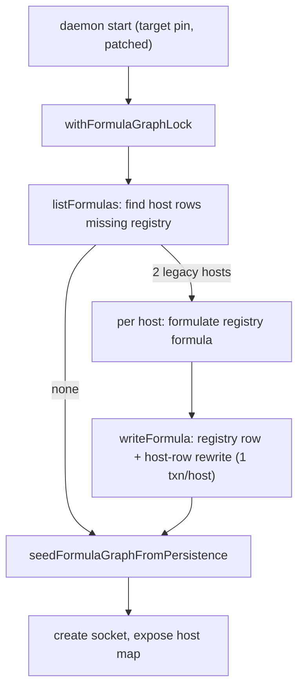

# Endo legacy `host.registry` migration

| Created | 2026-09-16 |
| Author  | gardener (job `design-endo-legacy-host-registry-migration-20260916`) |
| Status  | Proposed. Decides the compatibility question job `minion-town-reminder-daemon-redeploy-20260916` declined to improvise. |

## Problem

The minion.town @endo/reminder daemon must be revived onto Endo pin
`0eb88836d6e823ec45409a665efcc4f96d7fd09c`. The live daemon is pinned at
`f66505034aaa54ac46294347b2bf0e14655b088a` (`/opt/endo/ENDO_COMMIT`), active,
socket present, and is **1317 commits behind** the target. It must stay that way
until a reviewed migration exists; nothing here touches the live daemon or its
persisted state.

The wire is compatible: `packages/daemon/src/client.js` and `mail.js` are
byte-identical at both pins and match live. Wire compatibility is not state
compatibility. A dry-run against a **copy** of the captured snapshot
(`state-pre-0eb88836-20260916T0548Z.tar.gz`, SHA-256 `c08fa79f…`) opened the
SQLite store, loaded node id `9b03f5b4…`, deserialized all 3635 formula rows, then
threw during graph seed:

```
Error: Invalid formula identifier "[undefined]"
  at parseId (packages/daemon/src/formula-identifier.js)
  via isLocalId (manager.js) <- onFormulaAdded (graph.js)
  <- seedFormulaGraphFromPersistence (manager.js)
```

Both persisted `host` rows are schema-v2 records whose keys end at the older
`hostHandle/handle/.../pins` shape and carry **no `registry` property**. The throw
fired before the daemon created its socket, so no persisted names, guests, or
formulas became reachable and the live root list (61 names, 14 of them guest names)
could not be reproduced.

## Root cause: two distinct Endo-side defects

**1. The graph seed crashes ungracefully on an absent optional dependency.**
`seedFormulaGraphFromPersistence` calls `formulaGraph.onFormulaAdded(id, formula)`
for every persisted row. For a `host` formula, `extractLabeledDeps` (in
`manager.js`) unconditionally emits `['registry', formula.registry]`. On a
schema-v2 row `formula.registry` is `undefined`, and `onFormulaAdded` (in
`graph.js`) immediately filters with `isLocalId(dep)` over **every** pair before
discarding non-local ones. `isLocalId(undefined)` calls `parseId(undefined)`,
whose `idPattern.exec` coerces to the string `"undefined"`, fails to match, and
throws `Invalid formula identifier "[undefined]"`.

The sibling reader `getFormulaGraphSnapshot` already guards this exact case with
`if (dep && visited.has(dep))`. The seed path does not. The inconsistency is the
bug: an absent optional dep should be skipped, not fed to `parseId`.

**2. The designed registry migration was never implemented.**
`designs/registry-capability.md` § *Migration for already-formulated hosts*
specifies precisely the fix this job asks for:

> on daemon start, a one-shot upgrade pass rewrites host formulas missing the
> `registry` field to point at the daemon-default registry formula, in a single
> transaction per host. The upgrade is idempotent … and runs before the host map
> is exposed to callers … A host whose owner has already substituted a custom
> `@registry` keeps that substitution; the upgrade only fills the absent slot.

No such pass exists at `0eb88836`, nor at the current `llm` tip (`387ea6614`,
verified 2026-09-16). What shipped instead is a fail-fast in the `host` incarnator
(`throw new Error('Host formula missing registry (@registry required)')`) and a
changeset that states the real, blunt policy: *"a daemon whose state was
initialized before this release cannot incarnate its existing hosts and must be
re-initialized."* The `@node` precedent the migration section claims to mirror
(`designs/daemon-make-archive.md` § Phase 6) in fact shipped with **"no migration
path"** and a clean state wipe. So the "one-shot upgrade pass" is aspirational
design that never landed for either required field, and for `registry` even the
fail-fast is unreachable because defect 1 crashes the seed first with an opaque
error.

"Re-initialize" is exactly what minion.town cannot do: it would discard the 61
names and 14 guests. The garden must therefore author the migration Endo designed
but never built.

## Decisions

### Q1. Migration, not a read-time default. (decided)

Backfill the absent slot with a one-shot, idempotent, transactional **migration**;
do not treat a missing `registry` as a lazily-defaulted `undefined`.

- Endo made `@registry` **required, not optional** on `HostFormula` deliberately
  (`registry-capability.md` § *The `@registry` field is required*): an optional
  field "forces a conditional on every code path that touches resolution." A
  read-time default reintroduces exactly that conditional everywhere and fights the
  graph invariant that a host's `registry` is a required local dependency.
- A read-time default leaves the on-disk store permanently half-legacy: every
  future reader must carry the branch, and the graph edge for `registry` never
  exists, silently changing GC reachability for the registry capability.
- A migration ends with a store that is fully schema-current, auditable, and
  identical in shape to a freshly-formulated host. It is the safer choice against a
  production store precisely because after it runs there is nothing legacy left to
  reason about.

This is the shape `registry-capability.md` § *Migration* already blesses.

### Q2. Yes, this is an Endo-side bug. Fix upstream; carry a local stopgap. (decided)

Both defects above are Endo-side. The durable fix belongs upstream in
`endojs/endo-but-for-bots` (permitted; `agoric/agoric-sdk` interaction remains
forbidden and no part of this touches it):

1. **Harden the graph seed** so an absent optional dep is skipped rather than
   parsed: guard `onFormulaAdded` in `graph.js` with the same `dep &&` filter
   `getFormulaGraphSnapshot` already uses, so `isLocalId` never receives
   `undefined`. This is a robustness fix independent of registry and would have
   turned the opaque crash into the intended clear fail-fast.
2. **Implement the migration** `registry-capability.md` § *Migration* promised: a
   one-shot, idempotent upgrade pass that runs inside `withFormulaGraphLock`
   **before** `seedFormulaGraphFromPersistence` exposes the host map, backfilling
   each `host` row missing `registry`.

Until that upstream work lands, minion.town runs pinned code, so it needs a local
stopgap that carries the same migration. Two shapes were weighed:

- **A patched daemon build (recommended).** Fork the target pin, add the migration
  pass and the seed guard, pin `/opt/endo/ENDO_COMMIT` at the patched commit. It
  reuses the daemon's own `formulateNumberedRegistry`, `writeFormula`, and
  `withFormulaGraphLock` machinery, so formula-number generation, formula shape,
  and transaction boundaries are exactly the daemon's own. The patch is the same
  diff that will become the upstream PR, so the stopgap and the durable fix do not
  diverge.
- **An offline store-rewrite tool (rejected as primary).** A standalone script
  that rewrites the SQLite store before starting the unpatched target daemon. It
  must reproduce formulate semantics (random 256-bit formula numbers, the
  `{type:'registry', registryUrl}` shape, per-host transactions, any content-store
  bookkeeping) outside the daemon, duplicating internals that can drift from the
  daemon's own. Higher risk against a production store for no benefit over the
  patched build.

**Recommendation:** one diff, used twice. Author the seed guard plus the migration
pass as an `endojs/endo-but-for-bots` change; run minion.town on that patched pin
as the stopgap; open it as the upstream PR (a draft on `llm`) so the fix is durable
rather than a local fork forever.

### The migration, concretely

Run once at daemon start, inside `withFormulaGraphLock`, before the graph seed
walks the rows:

1. `persistencePowers.listFormulas()`; for each `host` formula whose `registry`
   field is absent (`=== undefined`):
2. Formulate a host-scoped registry via `formulateNumberedRegistry(randomHex256(),
   <host's node>, <registryUrl>)`, producing `{ type: 'registry', registryUrl }`.
   This mirrors what `formulateNumberedHost` pins for a fresh host.
3. Rewrite the host row with `registry` set to the new formula's id, via
   `persistencePowers.writeFormula`, **one transaction per host** (registry row +
   host-row rewrite committed together).
4. Skip any host that already carries a `registry` (idempotent; a second start is a
   no-op) and never overwrite a custom substitution (fill only the absent slot).

The registry URL is a genuine open question (below): the daemon default is
`https://registry.npmjs.org` (`registryDefaultUrl` = `registryPowers.registryUrl`),
but minion.town may want its endor proxy instead.



## Q3. What revival must prove before production. (decided)

All proofs run against a **copy** of a fresh snapshot, never live. Each is a gate;
production runs only after all are green and only under the maintainer's dry-run
gate.

1. **Seed completes.** The migration rewrites exactly the 2 schema-v2 host rows;
   `seedFormulaGraphFromPersistence` returns without throwing (clears the reported
   failure).
2. **Socket exists.** The isolated daemon creates its socket (the prior attempt
   never reached this).
3. **Root list reproduced.** Over that socket, the root list matches the live
   capture **exactly**: 61 names including the 14 guest names, compared name-set to
   name-set against the pre-experiment capture.
4. **Formula-count invariant.** 3635 pre-migration rows + exactly 2 new registry
   rows = 3637; no row deleted; no row mutated except the 2 host rows' `registry`
   field (diff the row set before and after).
5. **Idempotency.** A second start on the migrated copy performs zero further
   writes.
6. **Wire compat** (already proven: `client.js`/`mail.js` byte-identical) is a
   restated precondition, not a new proof.

Only after 1 to 5 are green on the copy does a production run become a maintainer
decision.

## Q4. Rollback. (decided)

The migration adds rows and rewrites host rows in place, so a forward-migrated
store must never be assumed readable by the older `f6650503` daemon. The clean
rollback is snapshot restore, not reverse migration:

1. Stop the target daemon.
2. Verify the pre-migration snapshot's SHA-256, then restore `/var/lib/endo-daemon`
   from it byte-for-byte.
3. Repin `/opt/endo/ENDO_COMMIT` back to `f66505034a…`.
4. Restart; confirm the `f6650503` daemon comes up on the restored state.

Two hard preconditions for the production run so this rollback is always available:

- **Take a fresh snapshot immediately before** the production migration (the
  `0548Z` snapshot may be stale by then); that fresh snapshot, not the dry-run one,
  is the rollback target.
- **The daemon is stopped during migration** (no concurrent writers), so the
  snapshot is a consistent point-in-time.

## Alternatives considered

- **Read-time default for a missing `registry`.** Rejected under Q1: contradicts
  Endo's required-field decision, leaves the store permanently legacy, and alters
  GC reachability for the registry capability.
- **Re-initialize (the shipped Endo policy).** Rejected: discards 61 names and 14
  guests, which is the entire thing revival must preserve.
- **Offline SQLite rewrite tool.** Rejected as primary under Q2: duplicates daemon
  internals and risks drift; kept only as a fallback if a patched build proves
  impractical.
- **Move the pin forward instead of patching.** Rejected: the current `llm` tip
  still lacks both the seed guard and the migration (verified 2026-09-16), so a
  newer pin fails identically.

## Open questions

- Which registry URL should migrated legacy hosts receive? The daemon default is
  `https://registry.npmjs.org`, but minion.town may prefer its endor proxy. Only
  the maintainer knows the intended resolution target for revived hosts.
- Should the upstream `endojs/endo-but-for-bots` PR (seed guard + migration pass)
  be opened now, in parallel with the local revival, or deferred until minion.town
  is confirmed healthy on the patched pin? Opening now keeps the stopgap and the
  durable fix identical; deferring narrows blast radius during revival.
- Is `0eb88836` still the right revival target, or should revival aim at a newer
  `llm` commit that the patched fix would ride on top of? The 1317-commit gap
  suggests confirming the target before building the patch.

## References

- `designs/registry-capability.md` § *Migration for already-formulated hosts*
  (`endojs/endo-but-for-bots`): the migration Endo designed and never built.
- `designs/daemon-make-archive.md` § Phase 6 (`endojs/endo-but-for-bots`): the
  `@node` precedent, which shipped with "no migration path."
- `packages/daemon/src/graph.js` `onFormulaAdded`; `manager.js`
  `extractLabeledDeps`, `isLocalId`, `seedFormulaGraphFromPersistence`,
  `formulateNumberedRegistry`, `formulateNumberedHost`, `getFormulaGraphSnapshot`;
  `formula-identifier.js` `parseId` (`endojs/endo-but-for-bots` @ `0eb88836`).
- Failure evidence (already on the minion.town box, not to be recreated): snapshot
  `/var/lib/endo-daemon/snapshots/state-pre-0eb88836-20260916T0548Z.tar.gz`
  (SHA-256 `c08fa79f…`); dry-run artifacts `/opt/endo-revival-dry-run-20260916`,
  `/var/lib/endo-daemon/revival-dry-run-20260916`; transient unit
  `endo-revival-dry-run-20260916.service`.

<!-- garden-design-open-questions -->
