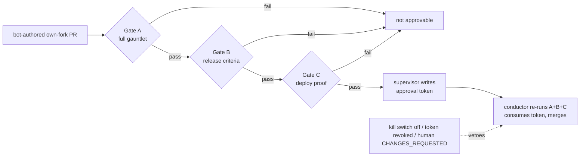

<!-- garden-design-open-questions -->

# A Fable release supervisor — deterministic gates, human-only ferry

| Created | 2026-09-04 |
| Author  | designer |
| Status  | Proposed |

Maintainer @kriskowal asked (kriscendobot/garden#58): *"enable a Fable supervisor
to approve changes that have undergone a full gauntlet, satisfied the release
criteria, and been proven deployed to production."* This design proposes a
supervisor that can grant the **approval** the conductor's merge gate today
requires a human to provide — but ONLY behind a closed, deterministic set of
gates, and ONLY for the garden's own forks. It carries open questions (§ Open
questions) and so lands as a review PR, not bare.

The supervisor's first real customers are the `kriscendobot/minion.town` own-fork
PRs the resumed `minion-town-press` schedule advances (issue #58 is the
minion.town primary-phase agenda).

## What "approve" means today, and the gap

The conductor merges a fork PR only when `pr-maintainer-approval-gh.sh` finds an
**effective APPROVED** review from a login in `journal2:maintainers/allowlist`
(`roles/conductor/AGENT.md` step 4). That signature is a *human* act. The one
existing exception is the botanist's `--dependabot-auto-merge` path
(`designs/dependabot-auto-merge.md`), which *substitutes a completed-criteria gate
for the signature* while retaining every other conductor guard. The release
supervisor is the same shape, generalized: a set of deterministic gates standing
in for the human signature, but for bot-authored feature work rather than a
Dependabot bump.

## The three gates (deterministic preconditions, not LLM judgment)

Each gate is a plain-code predicate an LLM supervisor **confirms but cannot
hand-wave past** — the same discipline as the approval reconciler
(`designs/approval-reconciler.md`), which re-derives every gate from ground truth
and "never mints a job that would stall at the merge gate."

### Gate A — the full gauntlet passed

**Signal (existing, concrete):** the PR's gauntlet record
(`<owner>-<repo>-pr<N>-gauntlet`) reached its terminal transition in
`scripts/jobs/gauntlet.sh` — a last stage marker of `panel-<k> pass` followed by
`undraft done`, written as `gauntlet-status: complete` — and the record is **not**
`tada_failed`/halted. Corroborated by live state: the PR is currently **not draft**
(`gh pr view --json isDraft` = false), CI is green at the current head, and no
maintainer holds an effective `CHANGES_REQUESTED`. All of this reads only trusted
journal job files plus `gh` PR metadata; no PR/comment body enters the check (no
injection surface), consistent with the reconciler's "trusted journal job files
only" rule.

### Gate B — release criteria satisfied (NEW; proposed here)

There is **no `release criteria` concept in the garden today.** This design
proposes one: a per-repo, **maintainer-authored** manifest on the journal,
`journal2:release-criteria/<owner>-<repo>.yaml`, read by a new deterministic
handler `scripts/jobs/handlers/release-criteria-gh.sh <owner/repo> <N>` (sibling of
`pr-mergeable-gh.sh`). **Fail-closed:** a repo with no manifest is **not**
release-eligible — the supervisor cannot approve it. The manifest is a *closed* set
of checkable predicates, each resolvable in plain code and each emitting a
per-predicate result line for the audit record:

- `required-checks:` — named CI checks that must be green (beyond the rollup).
- `changeset-present:` — a changeset / version-bump file per
  [changeset-discipline](../skills/changeset-discipline/SKILL.md).
- `no-release-blocker-labels:` — e.g. `do-not-merge`, `needs-design`.
- `no-blocker-markers:` — the diff carries no `TODO(release-blocker)` /
  `FIXME(release-blocker)`.
- `linked-issue-state:` — a referenced tracking issue is in a terminal/accepted
  state.
- `coverage-floor:` / `max-diff-size:` — a coverage floor where the repo reports
  it; an upper diff bound (a very large change is never auto-approvable).

The handler returns 0 only when **every** manifest predicate passes. New predicate
kinds are added only by a maintainer editing the manifest — like
`maintainers/allowlist`, the manifest is itself the arming act, and it is
journal-tracked (attributable, diffable).

### Gate C — proven deployed to production (NEW artifact; proposed here)

Deploy proof is a **captured artifact of a real run**, never a supervisor
assertion. An out-of-band deploy+probe run writes
`journal2:deploy-proofs/<owner>-<repo>/<head-sha>.json` carrying: the head SHA, the
deploy target, the probe command(s), the exit code, a rendered-observation digest,
a timestamp, and the producing session id. For minion.town the probe is the
deployed-topology evidence pattern already in use — build the candidate, deploy to
the live/canary environment, and run the e2e prod probe (the Gate-2 bridge
CC-token → Cognito → `/mcp` recipe; `designs/*` minion.town topology).

The gate (checked by the supervisor and, defense-in-depth, re-checked by the
conductor) requires a proof that (1) **matches the merge-candidate head SHA**, (2)
is within a freshness window, and (3) recorded exit 0 plus a positive probe
observation. The supervisor confirms the artifact; it does not manufacture it.

Keying the proof to the head SHA inherits the CI/approval **staleness** subtlety: a
rebase changes the SHA, so a rebase invalidates the proof (re-deploy + re-probe
required) exactly as it invalidates CI freshness. The pre-merge-vs-post-merge
sequencing of "proven deployed to production" is a genuine open question (§ Open
questions).

## What "approve" mechanically is, and its audit trail

**Primary mechanization — a supervisor-approval token.** The supervisor records
`journal2:approvals/supervisor/<owner>-<repo>/pr<N>-<head-sha>.md`, carrying the PR,
head SHA, and evidence pointers for gates A/B/C (record paths + per-predicate
results), plus a timestamp, the model, and the session id. Append-only,
attributable via git history, revocable.

**Conductor consumption — a scoped `--supervisor-approved` path** on
`scripts/jobs/gardening/ci-wait-merge.sh`, mirroring `--dependabot-auto-merge`. It
substitutes the token for the human signature but retains **every** other conductor
guard: unfreeze, rebase, CI freshness at the post-rebase head, the
`CHANGES_REQUESTED` veto, branch retention, and post-merge verification. Crucially,
before honoring the token the conductor **re-runs all three gates in plain code**
(the token is a *claim*; the gates are ground truth) and requires the token's head
SHA to equal the current head — a rebase invalidates the token, forcing a fresh
supervision, exactly the staleness discipline `pr-maintainer-approval-gh.sh` applies
to humans.

**Why a distinct token, not adding the bot to `maintainers/allowlist`:** that list
means *humans* everywhere it is read (the approval gate, the issue-inbox gate, the
mention gate). A separate supervisor token is separately revocable and separately
kill-switchable without weakening human-approval semantics. (A real bot APPROVED
review plus a separate supervisor-trust allowlist is the alternative — § Open
questions.)

**Audit + revocation + kill switch.** Every token is a journal commit (attributable,
timestamped, diffable); the conductor records which token it consumed in its merge
report. Revocation is a maintainer write
(`approvals/supervisor/<owner>-<repo>/revoked/pr<N>`), and a human
`CHANGES_REQUESTED` always vetoes (that conductor gate is unchanged and dominates).
The kill switch is a journal flag `config/fable-supervisor` (off by default; follows
the `leader` marker like the foreman brake) plus a per-repo enablement list
`config/fable-supervisor-repos`. When off, or the repo is unlisted, no supervisor
dispatches and the conductor's `--supervisor-approved` path refuses.

## Two hard invariants

### The mentat manual-only invariant (§1 — resolve deliberately)

`skills/model-selection/SKILL.md` states plainly: *"No automatic path may emit
Fable/mentat or any other manual-only pin,"* enforced in `job_eligible_for_kind` /
`claim-job.sh` and the gardener handler (they refuse `tier: mentat` unless
`dispatch: manual`). A **standing/automatic** Fable supervisor is exactly the
automatic-emits-mentat path this forbids.

**Recommendation — Phase 0 is a manual dispatch surface.** The supervisor is a
`post-manual-job.sh` mentat job the maintainer triggers ("supervise #N" /
"release #N"). This respects the invariant with **zero** carve-out: the three
deterministic gates still gate the merge, and the maintainer's manual trigger is the
human-in-the-loop that mentat requires. The word "standing" in the ask is precisely
what the invariant forbids automatically, so the standing behavior is deferred to a
maintainer decision.

**Phase 1 — a scoped, audited carve-out (maintainer's call).** If a standing
supervisor is wanted, the narrowest carve-out is a single automatic producer that
may emit `tier: mentat` + `dispatch: automatic` **only** for `role:
release-supervisor`, **only** on `config/fable-supervisor-repos`, and **only** once
a candidate PR has already passed gates A+B+C deterministically — so the Fable pin
can never fire on arbitrary work; it fires at most once per merge-ready PR. Enforced
by a new predicate (`job_is_release_supervisor`) in `job_eligible_for_kind` /
`claim-job.sh` that admits mentat-automatic under exactly those conditions and
refuses otherwise. The risk is bounded because the expensive, powerful Fable run is
gated behind three plain-code passes and a maintainer-authored repo allowlist.

### Approval is NOT ferry (§2 — hard invariant)

The supervisor operates **strictly on the garden's own forks**; its approval
authorizes only the **bot-identity** merge the conductor already performs. It
**NEVER** originates `identity_switch_authorized: true` and **NEVER** approves an
upstream ferry — that flag is *"a flag no agent may originate — only the
maintainer"* (CLAUDE.md § The ferry, `designs/fleet-gh-identity.md`).
`config/fable-supervisor-repos` is own-forks only. The ferry is **permanently**
outside the supervisor's vocabulary — never merely deferred — mirroring the sysop's
permanent exclusion of ferry and identity switches (`designs/sysop.md`).

## Files (Phase 0)

- `roles/release-supervisor/AGENT.md` — the role: confirm gates A/B/C, write the
  token, never ferry.
- `skills/release-criteria/SKILL.md` — the manifest format and predicate vocabulary.
- `scripts/jobs/handlers/release-criteria-gh.sh` — Gate B handler (no LLM).
- `scripts/jobs/gardening/ci-wait-merge.sh` — grows `--supervisor-approved` (re-runs
  A/B/C; consumes the token; every other guard unchanged).
- Journal state: `release-criteria/<owner>-<repo>.yaml`,
  `deploy-proofs/<owner>-<repo>/<sha>.json`,
  `approvals/supervisor/<owner>-<repo>/…`, `config/fable-supervisor`,
  `config/fable-supervisor-repos`.

## Open questions

- **Manual dispatch vs a scoped mentat carve-out?** Phase 0 above respects the
  mentat manual-only invariant with a maintainer-triggered manual job. Do you want
  the standing/automatic Phase-1 carve-out (`job_is_release_supervisor` admitting
  mentat-automatic behind gates A+B+C on an allowlisted own-fork set), or is
  manual-trigger the permanent shape?
- **Token vs bot-review as the "approve" mechanism?** The design proposes a distinct
  journal token consumed by a new conductor path, to keep `maintainers/allowlist`
  meaning *humans*. The alternative is a real bot `APPROVED` PR review plus a
  separate supervisor-trust allowlist the approval gate consults. Which do you
  prefer?
- **What is "proven deployed to production," and when?** Is deploy proof a
  **pre-merge** canary keyed to the merge-candidate head SHA (invalidated by a
  rebase, like CI freshness), or a **post-merge** release gate? And for minion.town
  specifically, what is "production" — the live daemon, or a canary environment?
- **Who authors the first release-criteria manifest, and its initial predicate
  set?** The manifest is maintainer-authored and fail-closed. What is the starting
  set for `kriscendobot/minion.town`?
- **A human cooling-off window before the conductor consumes a token?** Is the
  always-available `CHANGES_REQUESTED` veto sufficient, or should a token be
  unconsumable for a fixed interval after it is written, so a human can intercede?
- **Fable-only, or accept a fallback tier for an authority decision?** A mentat job
  carries `fallback-tier: minion`. For a decision that grants merge authority, should
  the release-supervisor role be Fable-only (refuse rather than downshift to a minion
  model) rather than accept the automatic anthropic mentor→minion downshift?
</content>
</invoke>
