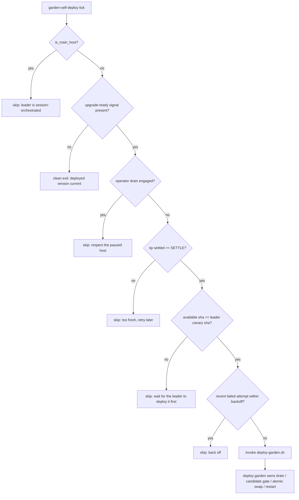

# Follower self-deploy: an unattended host advances its own deployed version

| Created | 2026-08-17 |
| Author  | gardener (designer) |
| Status  | Proposed |

Maintainer decision (kriskowal, 2026-08-17, liaison session): a **non-leader
host advances its own deployed version when it observes the local upgrade
signal, with no human in the loop**. This is a deliberate posture change, chosen
with the tradeoff stated plainly — deployed code advances on followers with no
human present. This document designs the trigger and records what it narrows,
because two existing documents say the opposite (§ What this supersedes).

## The problem this fixes

The follower `endolin-garden-ece02cb4` ran **30 commits behind for nine days**
(root-repo-guard `first_seen: 2026-08-08T15:52:01Z`). Every mechanism worked
**except the human**:

- the `garden-root-repo-guard` stalled-deploy watch detected the lag and paged;
- the notice reached the maintainer inbox;
- once *asked*, the sysop executed flawlessly — op sent `21:13:31Z`, acked
  `21:13:48Z`, deployed `21:14:07Z`: **36 seconds end to end**.

The single point of failure was that the notice sat **unread among 60+ inbox
messages**. The deploy-on-upgrade Monitor that would otherwise fire the deploy is
**leader-only** ([deliberate-deploy](deliberate-deploy.md) § Session-orchestrated
trigger), so an unattended follower accumulates the `upgrade-ready` signal with
nobody to act on it. The nine-day stall is the cost of putting a human on the
critical path of a follower that has no human.

## What this is *not*: this is the same hardened deploy, a different trigger

Self-deploy is **not** "unsupervised deploy." It invokes the identical, already
hardened `scripts/jobs/deploy-garden.sh`, whose safety rails were observed on two
real deploys on 2026-08-17 and are inherited unchanged:

- a **candidate test gate** (`bash -n` over every tracked `scripts/**/*.sh`, then
  the handler-classifier regression suites) *before* anything moves;
- **drain** engaged, wait for the fleet to quiesce, **defer** rather than proceed
  on a mid-job worker past the long-job threshold;
- **abort on a dirty tracked worktree** ("never clobber") — it aborted correctly
  once on 2026-08-17;
- **atomic per-file rename** of the root tree (no rc-127 exec window);
- unit reconcile, drain lift, worker restart, post-deploy broadcast.

So the design surface here is **only the trigger**: what deterministic local
observation fires `deploy-garden.sh` on a follower, and the guardrails that keep
that trigger from becoming a fleet hazard.

## The trigger

A new deterministic, **no-LLM** per-host daemon, `scripts/jobs/self-deploy.sh`,
wired to `garden-self-deploy.timer` (cadence in the 5–10 min range, offset from
the `:22/:52` guard). Its entire input is the host-local file
`$GARDEN_STATE/deploy/upgrade-ready` that the existing deterministic
`garden-upgrade-monitor` already writes; its entire action is to invoke
`deploy-garden.sh`. It reads **no bus topic and no message** (§ The attestation
boundary). Each tick:

1. **Gate: is this a follower?** `is_main_host` → **skip** (§ Leader vs
   follower). The leader's deploy stays session-orchestrated.
2. **Gate: is the signal present?** No `upgrade-ready` file → clean exit
   (nothing to do). The signal is written only while `origin/$GARDEN_MAIN_BRANCH`
   is a strict descendant of the recorded `deployed_sha`, and removed the moment
   the host catches up, so its mere presence is already "a deploy would advance
   this host right now."
3. **Gate: operator drain?** `fleet_draining` → **skip** (§ Interaction with
   drain). A host an operator paused is not self-deployed out from under them.
4. **Gate: settle window.** Refuse to deploy a tip that is younger than
   `GARDEN_SELF_DEPLOY_SETTLE` (default **10 min**) — see below.
5. **Gate: canary — never get ahead of the attended leader.** The follower
   self-deploys only up to the sha the leader has already deployed (§ Failure and
   observability). This is the load-bearing protection for the unattended path.
6. **Gate: back-off.** If a self-deploy attempt failed within
   `GARDEN_SELF_DEPLOY_RETRY_BACKOFF` (default 30 min), skip this tick so a
   broken candidate cannot spin (§ Failure and observability).
7. **Deploy.** Invoke `deploy-garden.sh`, which owns its own drain/quiesce/
   candidate-gate/abort. Record the attempt outcome to host state.

### Settling delay — yes, argue from risk

A freshly-pushed tip can be the middle of a still-landing stack, or a commit that
is reverted seconds later. `deploy-garden.sh`'s candidate gate catches a tip that
*fails tests*, but not a tip that is syntactically fine yet semantically premature
(half a two-commit change; a revert that is 60 s away). Deploying a 30-second-old
sha buys nothing — the follower was nine days behind, not nine minutes — and
risks deploying a transient tip.

**Recommendation: a settle window, keyed per-sha.** The daemon records, in host
state, the first tick at which it *observed* a given `available` sha as the
upgrade target, and refuses to deploy until that sha has been the target for
≥ `GARDEN_SELF_DEPLOY_SETTLE` (default 10 min). Because the upgrade-monitor
rewrites the signal each tick with the current tip, a tip that is superseded
before the window elapses simply never becomes eligible — the record for the
stale sha is discarded and the clock restarts on the new one. This is a *floor*
on tip age, not a periodic gate: a sha that has already sat as the tip for an
hour is eligible on the first tick that sees it.

### Minimum drift threshold — no, and here is why

A minimum ahead-by-N threshold is **rejected**: it re-creates exactly the failure
this design exists to fix. If a follower waits until it is N commits behind, then
a slow week with < N commits leaves it stalled — the nine-day shape again, just
with a smaller number. One commit behind is worth deploying once it has settled.
The stall came from *nobody acting*, not from *acting too eagerly*.

### Quiet-period requirement — subsumed, not added

No separate host-quiet requirement is needed. `deploy-garden.sh` already **defers
without engaging the drain** when a gardener has been mid-job past
`GARDEN_DEPLOY_LONG_JOB_THRESHOLD`, and drains-and-waits for the fleet to quiesce
otherwise. The settle window covers "don't chase churn." Adding a third quiet
gate would only widen the stall risk. The one thing self-deploy *adds* on top is
the retry back-off (§ Failure and observability) so a deploy that aborts does not
re-fire every tick.

## Leader vs follower

**Recommendation: keep the asymmetry — followers self-deploy, the leader stays
session-orchestrated.** The daemon is gated `! is_main_host`.

The asymmetry is justified, not incidental:

- **The leader is where a human actually is.** The liaison session runs on the
  leader; the leader hosts the singletons (foreman, scheduler, watchers,
  recovery, the maintainer-inbox Monitor). Keeping the leader's deploy on the
  liaison's deploy-on-upgrade Monitor preserves "advancing the deployed version
  is visible and interruptible" *at the one place a session is present to see
  it*. The invariant was always really about **that** — a watching session — not
  about a literal human keystroke (the liaison Monitor already auto-invokes
  `deploy-garden.sh` without asking).
- **The follower is unattended by definition** — that *is* the problem. There is
  no session to keep in the loop, so keeping the deploy "on the human surface"
  there means keeping it on a surface nobody is watching, which is what produced
  the nine-day stall.
- **The leader is the canary** (§ Failure and observability). Because the leader
  deploys first and every follower gates on the leader's deployed sha, the
  attended path acts as the integration test for the unattended paths. If the
  leader also self-deployed headlessly, that canary would vanish and a broken tip
  could land fleet-wide with no attended host having exercised it.

The residual is honest and small: a leader that runs for a long time **with no
liaison session** also stalls (it accumulates `upgrade-ready` with no Monitor).
That is strictly better than today (only the leader can stall, not every
follower), and it is where a human is expected. Whether the leader should *also*
gain a headless fallback after some longer grace period is left as an open
question rather than decided here.

## The attestation boundary

This is the subtle part and the design is careful about it. There are **two
distinct deploy-trigger paths** and they must never merge:

| | **sysop `deploy` op** | **follower self-deploy** |
| --- | --- | --- |
| Input | a **bus message** (`host/<GARDEN>` topic) | a **host-local file** (`$GARDEN_STATE/deploy/upgrade-ready`) |
| Provenance of the input | written by *another host* (self-asserted `from_host`) | written by *this host's* deterministic `garden-upgrade-monitor` from a `git fetch` + ancestry comparison |
| Trust gate | **issuer gate** + **maintainer attestation** (`authorized_by:` on `maintainers/allowlist`) | **none needed** — there is no message and no agent in the trigger path |
| Can an agent originate it? | only by naming a maintainer who no agent may impersonate | **no** — no message input exists to originate |

The reason the sysop `deploy` op requires maintainer attestation is that it is
**message-driven**: `from_host` is self-asserted, so the attestation is
defense-in-depth ensuring the irreversible tier "cannot be triggered by accident,
only by a message that names a maintainer" ([sysop](sysop.md) § Trust model).

Self-deploy has **no message input at all**. Its sole trigger is a file whose
only writer is `upgrade-monitor.sh`, and whose content is a function of a
cryptographic fact — "does `origin/$GARDEN_MAIN_BRANCH` descend from my deployed
sha" — not of any text an agent can author. Therefore:

- **Self-deploy must never read the bus, a message body, or any agent-authored
  text to decide to deploy.** Its input is exactly one host-local file plus git
  ancestry. This is a hard invariant, tested by asserting the daemon consults no
  `msgs/` path.
- **The sysop `deploy` op keeps its attestation unchanged.** Self-deploy does not
  become a back door around it: an agent that wants to force a deploy via a
  message still hits the attestation gate; the file path is unreachable from any
  message because nothing but the local monitor writes it.

Note what self-deploy does *not* widen: the trust boundary on **what can land on
`main2`** is unchanged. A malicious commit on `main2` is the same risk the
liaison-driven leader deploy already accepts, guarded by the same candidate test
gate and the same fleet push-access boundary. Self-deploy removes a human
*session* from the follower trigger — but that session was never an attestation
gate (the Monitor auto-invokes), so no attestation is lost.

## Interaction with drain and the foreman brake

- **Operator drain is respected by the trigger.** Before firing, self-deploy
  checks `fleet_draining` and **skips** while a drain is engaged. An operator
  drains a host for a reason (maintenance, an investigation); self-deploying it
  out from under them would violate the deliberate posture. Because the check is
  *before* `deploy-garden.sh` runs, any drain the trigger sees is
  operator/other-engaged, never the deploy's own transient drain.
- **`deploy-garden.sh`'s own drain is unchanged.** It engages its drain, quiesces,
  and lifts it on the success and self-abort paths; if it *finds* a pre-engaged
  (operator) drain it proceeds to quiesce but does **not** lift on abort. Because
  self-deploy skips while drained, `deploy-garden.sh` under self-deploy always
  engages and lifts *its own* drain — the clean case. An operator drain therefore
  survives self-deploy entirely: the trigger never fires under it.
- **The foreman brake is orthogonal and not consulted.** The brake stops only the
  foreman's autonomous pump; it gates neither gardener claiming nor deploys
  (CLAUDE.md § The foreman brake). Self-deploy is not a foreman action, so it is
  not braked. (Rationale: the brake exists specifically to quiet the *pump*
  without draining the fleet; a deploy is not the pump.)

## Failure and observability

An unattended self-deploy must be **visible on failure without a human polling**,
and — the harder question the maintainer posed — a follower must not deploy a
broken candidate to itself.

### The canary: never get ahead of the attended leader

The strongest protection for the unattended path is to make the **attended leader
deploy first**, and gate every follower on it: a follower self-deploys to sha *X*
only once it observes that the **leader has already deployed a sha ≥ X**. The
leader's deploy — watched by the liaison, on the host where a human is present —
becomes the fleet's integration test. A tip that breaks the fleet breaks the
leader first, in front of a session, and never reaches a follower.

Mechanism (small, additive):

- On a successful deploy, the **leader publishes its deployed sha to the
  journal** — a single file `deploy/leader-sha` (or `fleet/deployed/<leader>`) on
  `journal2`, written by `deploy-garden.sh` only when `is_main_host`. This is the
  one new piece of shared state; it rides the journal the follower already syncs.
- The follower's gate 5 resolves the leader identity (the journal `leader`
  marker), reads `deploy/leader-sha`, and proceeds only when the `available` sha
  from its `upgrade-ready` signal is an **ancestor-or-equal** of the leader's
  published sha. If the leader is behind, the follower waits — correctly, because
  the tip has not been canary-tested yet.

This makes "a follower deploys itself on a broken candidate" nearly unreachable:
the candidate would have had to pass the leader's candidate gate, deploy cleanly
on the attended leader, and be published — all before any follower touches it.
The settle window is the belt to this canary's suspenders (it also covers the
brief window where the leader is mid-deploy).

If the maintainer judges the canary too much machinery for a first cut, the
fallback is settle-window-only self-deploy, accepting that the fast candidate
gate (not the full 136-suite run — it is deliberately a fast tier) is the sole
protection. This design **recommends the canary**, because the fast gate alone is
explicitly a fast tier and an unattended path deserves the stronger guarantee.

### Visible failure

- **Repeated failure pages once per window, self-clearing.** On a deploy attempt
  that returns non-zero (or aborts), self-deploy raises `alert_maintainer` under
  a dedicated key (`self-deploy-failing-<GARDEN>`), coalesced per window exactly
  like the root-repo-guard stalled-deploy watch, and calls
  `alert_maintainer_clear` on the next success. So a persistently broken follower
  surfaces one rising-count inbox entry, and a recovered one closes it — no
  polling.
- **This does re-use the inbox** — but note the categorical difference from the
  failure this design fixes. Today's stall put an inbox notice on the
  **critical path**: nothing advanced until it was read. Here the notice is an
  **FYI after the host has already tried and backed off**; the host keeps
  retrying on its own cadence. An unread failure alert costs *observability*, not
  *liveness* — the deploy still happens once the candidate is fixed, with no human
  action. That is the property the nine-day stall lacked.
- **Back-off** (gate 6) bounds a broken candidate to one attempt per
  `GARDEN_SELF_DEPLOY_RETRY_BACKOFF`, so a red tip cannot burn a drain-quiesce
  cycle every tick. Combined with the canary, a broken tip is caught on the
  leader and never reaches the follower's retry loop at all.
- **The existing stalled-deploy watch stays** as the backstop. If self-deploy is
  wedged (e.g. an operator drain left engaged for days), the root-repo-guard's
  `deployed_sha`-lag alert still fires past `GARDEN_DEPLOY_STALL_DAYS`, so the
  fleet is never silently stuck even if the new daemon is itself failing.

### The dirty-tree case (the one path that still needs a human — softened)

`deploy-garden.sh` aborts on a **dirty tracked worktree** and that is correct —
never clobber. Stray edits in deployed roots have now been observed on **both**
hosts, so this path *will* be exercised. If a self-deploying follower simply
aborted and filed an inbox alert, it would **reproduce the very failure this
design exists to fix**: a follower stalled behind an unread notice.

**Recommendation: make the dirty tree self-heal deterministically, the way
root-repo-guard already self-heals HEAD/origin drift — losslessly and without a
human.** The invariant is that *no development ever happens in the root tree*
([deliberate-deploy](deliberate-deploy.md) § the hard rule); therefore any
tracked edit there is, by construction, an **escape**, not work-in-progress, and
preserving-then-reverting it is the correct, lossless disposition:

1. Capture the stray edit durably before touching it — a `git stash create`
   patch written to `$GARDEN_STATE/deploy/dirty-tree-backups/<ts>.patch` **and** a
   `root-guard-backup/<ts>` ref (root-repo-guard's existing lossless-backup
   discipline), so nothing is lost and a human can recover or inspect it later.
2. Restore the tracked paths to clean (`git checkout -- <paths>` / `git reset
   --hard` to the recorded `deployed_sha`), then let the deploy proceed.
3. Raise a **distinct** alert that this happened — but as an **after-the-fact FYI
   with the deploy already unblocked**, keyed and self-clearing, naming the backup
   path. This is categorically different from a blocking notice: the fleet is
   already moving; the alert is "we found and preserved a stray edit," not "come
   fix this or nothing advances."

The natural home for this self-heal is **root-repo-guard itself** as a new
**invariant D: the root working tree is clean** — it already runs on every host
every ~30 min, already backs up before repairing, and already owns the root's
invariants. Folding the dirty-tree self-heal there means self-deploy usually never
even *sees* a dirty tree (the guard keeps it clean out-of-band), and on the rare
race between guard tick and deploy, self-deploy performs the same preserve-and-
clean inline. Only a genuinely un-preservable state (the `git stash create`
itself fails) escalates as a hard, blocking alert — and that is rare enough, and
serious enough, to warrant a human. See § Open questions for the one judgment
call this leaves.

## What this supersedes

This posture change reverses a written invariant in two places. Both are
**narrowed to leader-only**, not deleted — the deliberate, session-visible deploy
remains exactly the policy **on the leader**; only the unattended follower gains
the headless trigger.

- **[deliberate-deploy.md](deliberate-deploy.md) § Session-orchestrated trigger**
  states the deploy is "never a fully autonomous background service" and that "the
  deploy is never autonomous-without-a-session by design." A "Narrowed by" note is
  added there: as of this design that sentence is **leader-only**; a *follower*
  advances headlessly via `garden-self-deploy`, invoking the same
  `deploy-garden.sh`. The deliberate-deploy machinery (candidate gate, drain,
  atomic swap, no continuous fast-forward) is entirely unchanged — self-deploy is
  a new *trigger* for that machinery, not a new deploy path, and the "no
  continuous fast-forward" rule still holds (self-deploy is discrete and gated,
  not a fast-forward loop).
- **[roles/liaison/AGENT.md](../roles/liaison/AGENT.md) § Deploy-on-upgrade
  Monitor** states "advancing the deployed version is the one garden action
  deliberately kept on the human surface, never a fully autonomous background
  service." The narrowing note there reads: this holds **on the leader**, where
  the liaison Monitor runs; on a **follower** the deterministic
  `garden-self-deploy` daemon fills the role the absent liaison cannot, gated
  `! is_main_host`, canary-bounded by the leader's published deployed sha, reading
  no bus message so it is not a path around the sysop `deploy` op's attestation.
  **This edit is deliberately deferred to the implementation build, not made in
  this design PR** — the liaison brief is a *live* behaviour document, and stating
  "followers self-deploy" there before the `garden-self-deploy` daemon exists would
  itself be a contradiction (a role brief must never claim a behaviour that is not
  yet deployed). The build that adds `self-deploy.sh` carries this note in the same
  change, so the brief flips true exactly when the behaviour becomes true. Recorded
  here so it cannot be forgotten. (Keeping this PR's diff **design-only** — every
  path under `designs/` — is also what arms the design-panel gauntlet the
  completion machinery stages; a live-brief edit would make the diff mixed and
  bypass that panel.)

## Implementation sketch (for a follow-up build, not this PR)

Deliberately not implemented here — the design record comes first because it
reverses a written invariant. A contained follow-up build would add:

- `scripts/jobs/self-deploy.sh` — the follower-gated trigger daemon (the seven
  gates above), no LLM, reading only `upgrade-ready` + git ancestry + the journal
  `leader`/`deploy/leader-sha`.
- `scripts/systemd/garden-self-deploy.{service,timer}` — a non-template timer,
  auto-enabled fleet-wide; the `! is_main_host` gate is *inside* the script so
  the leader's copy is a clean no-op rather than needing a per-host enable-set.
- `deploy-garden.sh` — publish `deploy/leader-sha` to the journal on a successful
  leader deploy (the one line of new shared state).
- root-repo-guard invariant D — the dirty-tree preserve-and-clean self-heal.
- the deferred **live-brief edit**: the "Narrowed by" note on
  `roles/liaison/AGENT.md` § Deploy-on-upgrade Monitor (§ What this supersedes),
  landed in the same change that makes the behaviour true.
- Env knobs with the defaults named above: `GARDEN_SELF_DEPLOY_SETTLE` (10 min),
  `GARDEN_SELF_DEPLOY_RETRY_BACKOFF` (30 min).
- `scripts/jobs/test/self-deploy-test.sh` — hermetic (throwaway state/journal;
  mocked `deploy-garden.sh`): the follower gate (leader is a no-op); no-signal
  quiet exit; the settle window (too-fresh skips, aged fires); the operator-drain
  skip; the canary gate (waits when leader is behind, fires when caught up); the
  back-off after a failed attempt; and the invariant that **no `msgs/` path is
  ever read** (the attestation-boundary regression).

## Open questions

- Should the **leader** also gain a headless fallback after a longer grace period
  (e.g. no liaison session and `deployed_sha` lags past a threshold), or is the
  leader-stalls-only residual acceptable given a human is expected there? This
  design keeps the leader session-orchestrated; the maintainer may revisit.
- The dirty-tree self-heal reverts stray tracked edits after preserving them. Is
  "any tracked edit in the root is an escape, safe to preserve-and-revert" the
  right call in **every** case, or is there a class of legitimate in-root tracked
  change (an operator hand-patch during an incident) that should instead **block**
  and hard-escalate? The design's position: no — the no-dev-in-root invariant is
  absolute and an operator incident patch belongs in a worktree + deploy, so
  preserve-and-revert is always lossless and always correct; but this is the one
  judgment the maintainer should confirm before the build lands invariant D.
- `deploy/leader-sha` vs `fleet/deployed/<GARDEN>`: publish only the leader's sha
  (minimal), or every host's deployed sha (a fleet deploy-state view useful to the
  liaison and the stalled-deploy watch)? The canary needs only the former; the
  latter is a cheap superset. To be decided at build time.
</content>
</invoke>
