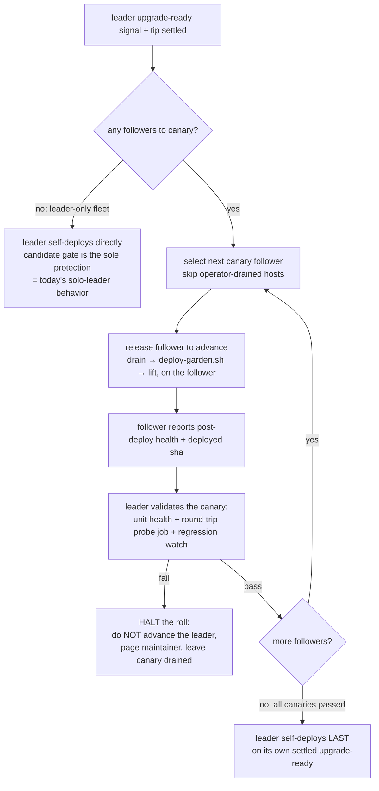

# Rolling deploy: the leader orchestrates a fleet upgrade with followers as canaries

| Created | 2026-08-17 |
| Updated | 2026-09-03 (rolling-deploy revision) |
| Author  | gardener (designer) |
| Status  | Proposed (open questions — review PR #73) |

> **This document was retitled and reframed on 2026-09-03.** It began as
> *"follower self-deploy"* — a headless trigger for **followers only**, keeping the
> leader session-orchestrated. The maintainer's review of PR #73 (kriskowal,
> 2026-09-03) reverses and extends that: the **leader** now self-deploys too, and
> it does so as a **rolling deploy** that uses followers as **canaries** to
> validate the upgrade before the leader advances itself. The design is therefore
> **fleet-wide**, not follower-only. The filename `follower-self-deploy.md` is kept
> for branch/link continuity; the earlier follower-only trigger survives inside
> this design as a **mechanism and a degraded-mode fallback** (§ The old
> follower-self-deploy trigger), not as the whole story.

Maintainer directive (kriskowal, 2026-09-03, PR #73 review
`#pullrequestreview-5098606293`), verbatim:

> I think I would like the leader to automatically self-deploy (not just followers
> autonomously self-deploying), but to do a rolling deploy, using the followers as
> canaries to validate the upgrade. The leader would orchestrate the upgrade,
> directing followers to drain, upgrade, lift the drain, and validate. The leader
> should test the follower after a deploy, exercising the upgraded behaviors and
> watch for some key regressions in expected job processing.

This is a deliberate posture change, chosen with the tradeoff stated plainly:
**the deployed version now advances fleet-wide with no human on the critical
path** — the safety gate that replaces the watching session is **canary
validation on a real host**, which this document argues is a *stronger* guarantee
than a human watching one deploy. It reverses a written invariant in two places
(§ What this supersedes).

## The two problems this fixes

1. **The unattended follower stall (the original problem).** The follower
   `endolin-garden-ece02cb4` ran **30 commits behind for nine days**
   (root-repo-guard `first_seen: 2026-08-08T15:52:01Z`). Every mechanism worked
   **except the human**: the guard detected the lag and paged; the notice reached
   the inbox; once *asked*, the sysop deployed in **36 seconds**. The single point
   of failure was that the notice sat **unread among 60+ inbox messages**. The
   deploy-on-upgrade Monitor that would fire the deploy is **leader-only**, so an
   unattended follower accumulates the `upgrade-ready` signal with nobody to act.
   A human on the critical path of a host that has no human is the whole defect.

2. **The leader stall — the same defect, one host up (the new problem).** The
   original design accepted a residual: a leader that runs *without a liaison
   session* also stalls, because its deploy-on-upgrade Monitor is a session
   behavior. Putting the leader's deploy on a human surface means putting it on a
   surface that, on a long-running unattended leader, **nobody is watching** —
   producing the nine-day shape one host higher. The maintainer's directive closes
   this: the leader advances **itself** automatically too. But a naive
   "everyone self-deploys headlessly" would delete the one thing the original
   design leaned on for safety — an **attended host that deploys first and acts as
   the fleet's integration test**. The rolling deploy restores that property
   *without* a human, by making a **follower** the canary and the **leader** the
   conductor that validates it.

## What this is *not*: the same hardened deploy, a new orchestration over it

The rolling deploy invokes the identical, already-hardened
`scripts/jobs/deploy-garden.sh` on each host, whose rails are inherited unchanged:
a **candidate test gate** before anything moves; **drain** engaged, quiesce, and
**defer** past a long-job threshold; **abort on a dirty tracked worktree** (never
clobber); **atomic per-file rename** of the root tree; unit reconcile, drain lift,
worker restart, post-deploy broadcast. "No continuous fast-forward" still holds —
each host's advance is a discrete, gated invocation of `deploy-garden.sh`, not a
loop.

What is new is **only the orchestration and the triggers**: *which host advances
when*, *how a follower is released and validated*, and *what fires the leader's
own advance*. The per-host deploy mechanics are untouched.

## The rolling deploy, in one picture

The leader is the **conductor**. It advances the fleet in waves — followers first,
as canaries; the leader itself last, and only if the canaries pass.

The load-bearing rule, stated once: **the leader never advances itself on a failed
canary.** Everything below serves that rule.

## Rolling order, canary count, and degenerate fleets

**Recommendation: followers first, one canary at a time by default, leader last.**

- **Order.** The leader rolls followers in a deterministic order (sorted `GARDEN`
  identity, or least-loaded-first — a tunable, not load-bearing), one at a time by
  default (`GARDEN_ROLL_CANARY_BATCH=1`), so the blast radius of a bad upgrade is
  exactly **one host at a time**. A batch knob permits parallel canaries where the
  fleet is large and the maintainer accepts a wider wave.
- **How many canaries.** By default **every follower is a canary** and is rolled
  and validated before the leader advances — the leader is genuinely last. A
  cheaper posture (validate a **quorum** of *k* followers, then advance the leader
  and let the rest follow) is offered as a knob; whether "all followers must pass"
  or "a quorum must pass" is the right default is an open question, because a large
  fleet makes all-follower serial validation slow.
- **Single-follower fleet.** That one follower is the sole canary: roll it,
  validate it, then advance the leader. No special case beyond "the canary set has
  one member."
- **Leader-only fleet (no followers).** There is **no canary by construction**.
  The leader self-deploys **directly** on its own settled `upgrade-ready` signal —
  which is exactly today's solo-leader behavior, where the fast candidate gate is
  the sole protection. This is not a regression: a fleet with no second host never
  had a canary to offer. The design accepts it and says so.

## Orchestration mechanics — and the attestation boundary (the crux)

The maintainer's framing is **bus-driven**: the leader *directs* followers to
drain, upgrade, lift, and validate. The original design's load-bearing safety
property (design point 4) was the **opposite**: the deploy trigger is a host-local
**cryptographic fact** (git ancestry), **never a bus message** — specifically so
it stays **outside** the sysop `deploy` op's maintainer-attestation boundary
([sysop](sysop.md) § Trust model). A leader-directed rolling deploy *is* a
bus-driven deploy, so this tension must be resolved, not papered over. There are
two honest ways, and this design **recommends the first** and flags the choice for
the maintainer.

### Reconciliation A (recommended) — the deploy trigger stays host-local; the leader orchestrates *ordering*, not the deploy op

The follower's deterministic `garden-self-deploy` daemon (from the original
design) **survives as the actual deploy trigger**. It still fires
`deploy-garden.sh` **only** on this host's own host-local `upgrade-ready`
cryptographic signal — never on bus text. What the leader adds is a per-host
**roll gate**: a journal file `deploy/roll/<GARDEN>` naming the sha the leader has
**cleared this host to advance to**. This *inverts* the original canary: instead
of "followers wait until the leader has deployed first," the leader now **releases
followers one at a time as canaries and holds itself for last**.

- **Drain / lift.** "Drain" and "lift the drain" map onto existing substrate:
  `deploy-garden.sh` already engages its own drain, quiesces, swaps, and lifts.
  Where the leader wants an *explicit* pre-drain (to quiesce a host before
  releasing it), it sends a **benign-tier** sysop `drain` op over `host/<GARDEN>`
  — which is **issuer-gated only, no maintainer attestation** ([sysop](sysop.md)
  § Trust model, "Benign-tier ops need only the issuer gate"). "Lift the drain" is
  `deploy-garden.sh`'s own lift, with a benign `drain off` op as the backstop.
- **Upgrade.** The leader does **not** send a `deploy` op. It writes the
  `deploy/roll/<GARDEN>` release token; the follower's own daemon, seeing both its
  host-local `upgrade-ready` **and** a release token for that sha, fires
  `deploy-garden.sh`. The deploy trigger is still the cryptographic fact; the token
  is a *gate*, not a trigger.
- **Validate.** The leader runs the canary probe (§ Post-deploy validation).

**Why the attestation boundary is untouched.** The only bus messages the leader
issues are **benign-tier** (`drain`), plus a **journal release token that is not a
sysop op and not a deploy trigger**. A forged or stray release token can only
permit a follower to advance to a sha that is **also the canonical
`origin/main2` tip it would eventually reach anyway** (the follower still requires
the independent host-local `upgrade-ready` ancestry fact to move, and only ever
advances to origin's tip). It **cannot** make a follower deploy arbitrary code. So
the sysop `deploy` op and its maintainer attestation are **never routed through**
by the rolling deploy — they remain exactly as strict as before, for the human
"deploy this host now" path. Design point 4's invariant ("self-deploy must never
read the bus, a message body, or any agent-authored text to *decide to deploy*")
is **preserved verbatim**: the deploy decision is still `upgrade-ready` + git
ancestry; the release token only decides *timing within the roll*, and it is a
permission that cannot widen what code can land.

### Reconciliation B (alternative) — a leader-issued deploy op with a narrowed attestation exemption

The leader could instead send real sysop `deploy` ops to followers. An autonomous
leader cannot carry a maintainer's `authorized_by:` (no agent may originate it), so
this path requires **revising** the sysop's deploy-op attestation: accept a
`deploy` op **without** maintainer attestation **iff** (a) `from_host` equals the
current journal `leader` marker **and** is on `sysop-issuers`, **and** (b) the
existing `to_sha == origin/main2 HEAD` guard holds. The argument for it: attestation
was defense-in-depth against an *accidental* destructive op, and a deploy already
guarded to the canonical tip cannot deploy arbitrary code; the leader is the
designed orchestrator.

This design **does not recommend B**, for two reasons: it **weakens** a
deliberately conservative boundary (the sysop design calls attestation the very
thing that keeps the irreversible tier un-triggerable by accident), and it is
**unnecessary** — Reconciliation A delivers the maintainer's leader-orchestration
(the leader controls ordering, drain, validation, and the go/no-go) without
touching the boundary at all. B is recorded as the fallback **if** the maintainer
prefers a single unified deploy path over the host-local-trigger split (see § Open
questions).

## Post-deploy validation — "exercise the upgraded behaviors, watch for regressions"

After a follower deploys, the leader must, in the maintainer's words, *exercise the
upgraded behaviors* and *watch for key regressions in expected job processing*, and
**gate the roll on the result**. Concretely, validation is a **bounded,
deterministic canary probe** with three parts and a single pass/fail verdict:

1. **Unit health.** The follower publishes a post-deploy health record to the
   journal (`fleet/health/<GARDEN>`: deployed sha + `systemctl --user is-active`
   for every `garden-*` unit + a timestamp), extending the post-deploy broadcast
   `deploy-garden.sh` already emits. The leader reads it and requires **all
   `garden-*` units active, none failed or crash-looping**. A restart that leaves a
   unit dead is an immediate fail.
2. **Round-trip probe job (the "exercise").** The leader posts a **synthetic no-op
   canary job pinned to the canary host** (via the existing host-requirements
   eligibility axis — `requires: host=<GARDEN>`, so only that host can claim it)
   and watches it travel the **real** upgraded path: `claim → run → jobs/tada/`,
   within `GARDEN_CANARY_PROBE_DEADLINE` (default 10 min). This exercises exactly
   the machinery the maintainer named — the claim script, the worker spine, the
   report path — **on the freshly upgraded code**. A probe that never claims, never
   completes, or errors is a fail.
3. **Regression watch (the "watch for regressions").** Over
   `GARDEN_CANARY_WATCH` (default 15–30 min) the leader watches two key,
   deterministically-measurable signals attributed to the canary host: **claim
   liveness** (does it keep claiming jobs, or has it gone silent at zero
   throughput — the self-throttle failure class this fleet has hit before, where a
   stale cap silently declined every claim), and **failure rate** (are its jobs
   completing, or is its
   doomed/failed-job count spiking above a recent baseline). A canary that goes
   silent or whose jobs all fail is a regression even if its units are nominally
   "active."

**Pass/fail gate.** The canary **PASSES** iff *(units all active)* **and** *(the
probe job reaches `tada/` within the deadline)* **and** *(no regression signal in
the watch window)*. On **pass** the leader releases the next follower, and — when
the canary set is exhausted — advances **itself**. On **any fail** the leader
**HALTS** (§ Failure handling).

**Fixed suite vs change-specific probes.** The probe suite above is a **fixed
core-path exercise**, chosen because it is deterministic and needs no LLM (keeping
the orchestrator on the same no-agent-in-the-trigger footing as the rest of the
deploy path). It cannot, by construction, know what a given upgrade *changed*.
Whether to *additionally* derive change-specific probes from the deploy diff — a
richer "exercise the upgraded behaviors" that would need judgment or an LLM assay —
is left as an open question; the fixed suite is the recommended first cut.

## Failure handling and rollback

**On a failed canary, the leader halts.** Specifically it:

1. **Stops the roll** — releases no further followers and **does not advance
   itself**. This is the load-bearing rule; a broken tip that fails a canary never
   reaches the leader.
2. **Pages the maintainer**, once per window and self-clearing (`alert_maintainer`
   under `rolling-deploy-canary-failed-<GARDEN>`, cleared on the next clean roll),
   naming the canary host, the sha, and the failing signal (which unit, or "probe
   timed out," or "throughput dropped to zero").
3. **Leaves the failed canary drained** so it stops taking real work on a suspect
   version, pending a human decision.

**Rollback is deliberately *not* automatic (recommended).** `deploy-garden.sh`
records the prior `deployed_sha` and swaps atomically, so a rollback is mechanically
a re-deploy of that prior sha — but the sysop `deploy` op's `to_sha == origin/main2
HEAD` guard **refuses a non-HEAD sha**, so rollback needs a **distinct capability**
(a `rollback` path that checks out the recorded prior `deployed_sha`). The design
recommends **halt + page + drain** as the default rather than auto-rollback,
because: (a) auto-rollback re-introduces the very drift the roll was closing; (b) a
bad upgrade may be bad in a way rollback does not cleanly undo (persisted state, a
schema move); and (c) a *confirmed regression* is exactly the case where a human is
the right judge. Auto-rollback is offered behind a knob (§ Open questions); if
built, it reuses `deploy-garden.sh`'s atomic swap targeting the recorded prior sha.

**A halt here is correct, not a regression to the nine-day stall.** The original
stall was an **unread notice on the *liveness* critical path with *no failure*** —
work simply didn't advance because a human never looked. A canary halt is the
opposite: a **real, confirmed regression** has been detected, and stopping the roll
plus paging a human is the **safety property working as designed**. The two look
superficially alike (a deploy that isn't proceeding) but differ in kind: no-signal
liveness loss versus signal-driven safety stop. The rolling deploy removes the
former and *adds* the latter.

## Leader self-deploy — the reversal, made concrete

The leader now advances **itself** as the **last** step of a completed roll, with
no human on the critical path. The trigger is deterministic and, like the
follower's, **never a bus message**: a leader-only daemon (sketch:
`garden-rolling-deploy`) detects the leader's **own** host-local `upgrade-ready`
signal (settled, per the settle window below), drives the canary roll, and — only
once every required canary has **passed** — fires `deploy-garden.sh` for the leader
itself. So the leader's own deploy decision is still `upgrade-ready` + git ancestry
+ **canary-pass state**, all local/journal facts, no agent text.

The **liaison deploy-on-upgrade Monitor** is thereby demoted from *the trigger* to
an **observer/override**: a human at the leader can still watch the roll and
intervene (drain, halt, force), but is no longer *required* for the leader to
advance. Whether the Monitor is **retired** or **kept as a human-visible override**
is an open question; the recommendation is to keep it as an override so a present
operator retains a kill switch, while the autonomous rolling orchestrator is the
primary path.

### Settling delay — carried forward, still argued from risk

A freshly-pushed tip can be the middle of a still-landing stack or a commit
reverted seconds later; the candidate gate catches a tip that *fails tests*, not
one that is syntactically fine yet semantically premature. So both the follower
release and the leader's own advance keep a per-sha **settle window**
(`GARDEN_SELF_DEPLOY_SETTLE`, default 10 min): a sha becomes eligible only after it
has been the observed upgrade target for ≥ the window. Because the upgrade-monitor
rewrites the signal each tick with the current tip, a superseded tip never becomes
eligible and the clock restarts on the new one. This is a *floor* on tip age, not a
periodic gate. (A **minimum ahead-by-N drift threshold is still rejected** — it
recreates the stall this design exists to fix: a slow week under N commits leaves a
host stalled again. One settled commit is worth rolling.)

## The old follower-self-deploy trigger — subsumed as mechanism, kept as fallback

The original headless `garden-self-deploy` daemon does **not** disappear; its role
changes:

- **Primary path (mechanism).** It is the actual per-follower deploy trigger the
  leader *releases* (Reconciliation A). Its gate changes from the original
  "leader-sha canary + settle" to "**leader roll-release token** for this host +
  settle." In the normal case the leader's release supersedes the old autonomous
  headless behavior.
- **Degraded-mode fallback (liveness backstop).** If there is **no live leader to
  orchestrate** — the journal `leader` marker is stale/absent, or the roll has not
  progressed past a long grace `GARDEN_ROLL_LEADERLESS_GRACE` **and**
  root-repo-guard's stall threshold has tripped — the follower falls back to the
  **original headless self-deploy** (settle window + the old "never get ahead of
  the last-known-good sha" canary). This preserves the nine-day-stall fix **even if
  the leader itself dies**: a leaderless fleet still advances, just without the
  rolling validation, which is the best available guarantee when there is no
  conductor.

So the trigger daemon is retained; only its gating changes (leader release token
primary; leaderless headless fallback degraded). The design point-4 invariant holds
in both modes: the deploy decision is always `upgrade-ready` + ancestry, never bus
text.

## Interaction with drain and the foreman brake

- **Operator drain is respected.** An operator-drained follower is **skipped as a
  canary** (a paused host cannot validate, and self-deploying it out from under an
  operator would violate the deliberate posture). The roll proceeds with the
  remaining, non-drained followers. The leader advances itself only after at least
  the required canary set (all, or a quorum — § Open questions) has **passed**; if
  **every** follower is operator-drained, the fleet has no available canary and the
  leader falls back to leader-only-fleet behavior *or* holds — an open question,
  since "no canary available because a human paused them all" is arguably a signal
  to wait for the human, not to deploy unvalidated.
- **`deploy-garden.sh`'s own drain is unchanged** — it engages, quiesces, and lifts
  its own drain on success/self-abort; because the roll skips operator-drained
  hosts, the deploy under the roll always engages and lifts *its own* drain, the
  clean case, and an operator drain survives the roll entirely.
- **The foreman brake is orthogonal and not consulted.** The brake stops only the
  foreman's autonomous pump; it gates neither gardener claiming nor deploys
  (CLAUDE.md § The foreman brake). A deploy is not the pump, so it is not braked.

## The dirty-tree case — lossless self-heal (carried forward)

`deploy-garden.sh` aborts on a **dirty tracked worktree** — never clobber — and
stray edits in deployed roots have been observed on **both** hosts, so this path
*will* be exercised in a headless roll. An abort that simply files an inbox alert
would reproduce the original stall (a host wedged behind an unread notice). The
original design's disposition carries forward unchanged, because the invariant it
rests on is unchanged (*no development ever happens in the root tree* —
[deliberate-deploy](deliberate-deploy.md) § the hard rule), so any tracked edit
there is an **escape**, and preserve-then-revert is the correct lossless
disposition:

1. Capture the stray edit durably first — a `git stash create` patch to
   `$GARDEN_STATE/deploy/dirty-tree-backups/<ts>.patch` **and** a
   `root-guard-backup/<ts>` ref (root-repo-guard's lossless-backup discipline).
2. Restore the tracked paths to clean, then let the deploy proceed.
3. Raise a **distinct, after-the-fact FYI** (self-clearing, naming the backup path)
   — the fleet is already moving; this is "we found and preserved a stray edit,"
   not "come fix this or nothing advances."

The natural home is **root-repo-guard as a new invariant D: the root working tree
is clean** (it already runs every ~30 min on every host, already backs up before
repairing, already owns the root's invariants), so the roll usually never even
*sees* a dirty tree. Only a genuinely un-preservable state (the `git stash create`
itself fails) escalates as a hard, blocking alert.

## What this supersedes

This posture change reverses a written invariant in two places. Both are **updated,
not deleted** — the deliberate, gated `deploy-garden.sh` machinery is exactly as
before; what changes is the **trigger and orchestration** around it.

- **[deliberate-deploy.md](deliberate-deploy.md) § Session-orchestrated trigger**
  states the deploy is "never a fully autonomous background service" and "never
  autonomous-without-a-session by design." The narrowing note there (added by the
  original follower-only design) is **rewritten** by this revision: that sentence
  now holds on **neither** tier. The deployed version advances via an autonomous,
  leader-orchestrated **rolling deploy**; what replaced the watching session as the
  safety gate is **canary validation on a real host**, argued here to be stronger
  than an unread notice. (This edit is a designs/ record edit and is made in this
  PR, keeping the diff design-only.)
- **[roles/liaison/AGENT.md](../roles/liaison/AGENT.md) § Deploy-on-upgrade
  Monitor** states advancing the deployed version is "the one garden action
  deliberately kept on the human surface, never a fully autonomous background
  service." Under this design that is no longer true even for the leader: the
  liaison Monitor is demoted to an **observer/override**, and the autonomous
  `garden-rolling-deploy` orchestrator is the primary trigger. **This live-brief
  edit is deliberately deferred to the implementation build, not made in this
  design PR** — a role brief must never claim a behavior that is not yet deployed,
  and (equally) keeping this PR's diff **design-only** (every path under `designs/`)
  is what arms the design-panel gauntlet. The build that lands the orchestrator
  carries the brief edit in the same change, so the brief flips true exactly when
  the behavior becomes true. Recorded here so it cannot be forgotten. The updated
  note the build will write: this holds **only as an operator override**; the
  leader self-deploys autonomously as the last wave of a canary-validated rolling
  deploy, reading no bus message so it is not a path around the sysop `deploy` op's
  attestation.

## Implementation sketch (for a follow-up build, not this PR)

Deliberately not implemented here — the design record comes first because it
reverses a written invariant. A contained follow-up build would add:

- `scripts/jobs/rolling-deploy.sh` + `scripts/systemd/garden-rolling-deploy.{service,timer}`
  — the **leader-only** conductor daemon (gated `is_main_host`): detect the leader's
  settled `upgrade-ready`; select/roll canary followers (release token + optional
  benign `drain` op); run the canary probe per follower; halt-or-advance; deploy the
  leader last. No LLM; reads only local signals + journal state.
- `scripts/jobs/self-deploy.sh` + `garden-self-deploy.{service,timer}` — the
  follower trigger daemon, retained from the original design, re-gated to consume the
  leader `deploy/roll/<GARDEN>` release token (primary) with the headless
  leaderless-grace fallback (degraded). Still fires only on host-local
  `upgrade-ready` + git ancestry.
- `deploy-garden.sh` — publish `fleet/health/<GARDEN>` (deployed sha +
  `is-active` per `garden-*` unit) on every successful deploy; publish
  `deploy/leader-sha` on a leader deploy (retained for the leaderless fallback's
  last-known-good gate).
- A synthetic **canary-probe** job template pinned via `requires: host=<GARDEN>`,
  plus the leader-side watcher that gates on `tada/` within the probe deadline and
  on the regression signals.
- root-repo-guard **invariant D** — the dirty-tree preserve-and-clean self-heal.
- the deferred **live-brief edit** on `roles/liaison/AGENT.md` (§ What this
  supersedes), landed in the same change that makes the behavior true.
- Env knobs with the defaults named above: `GARDEN_SELF_DEPLOY_SETTLE` (10 min),
  `GARDEN_ROLL_CANARY_BATCH` (1), `GARDEN_CANARY_PROBE_DEADLINE` (10 min),
  `GARDEN_CANARY_WATCH` (15–30 min), `GARDEN_ROLL_LEADERLESS_GRACE`,
  `GARDEN_SELF_DEPLOY_RETRY_BACKOFF` (30 min).
- `scripts/jobs/test/rolling-deploy-test.sh` — hermetic (throwaway state/journal;
  mocked `deploy-garden.sh` and probe): follower-first ordering; the canary
  pass-advances-leader path; a **canary fail halts and never advances the leader**;
  operator-drained followers are skipped; leader-only fleet self-deploys directly;
  the leaderless-grace headless fallback; and the invariant that **no `msgs/` path
  is read to decide to deploy** (the attestation-boundary regression).

## Open questions

- **Attestation reconciliation (A vs B).** This design recommends **Reconciliation
  A** (host-local deploy trigger + a benign leader release token, sysop attestation
  untouched). Does the maintainer prefer **B** (a leader-issued `deploy` op with a
  narrowed, leader-and-canonical-tip-only attestation exemption) for a single
  unified deploy path, accepting the weakening of the sysop boundary? A is the
  recommendation; B is the recorded fallback.
- **Canary quorum vs all-followers.** Must **every** follower canary pass before
  the leader advances (maximal safety, slow on a large fleet), or is a **quorum of
  k** enough (faster, wider residual risk)? Default proposed: all followers; revisit
  if fleet size makes serial validation too slow.
- **Auto-rollback.** Default is **halt + page + drain** on a failed canary, no
  automatic rollback. Should a failed canary be **auto-rolled-back** to its prior
  `deployed_sha` (needs a non-HEAD deploy capability), or is leaving it drained for
  a human the right call? The design's position: no auto-rollback by default;
  confirm.
- **Change-specific probes.** The canary probe is a **fixed** core-path suite
  (deterministic, no LLM). Should the leader *additionally* derive change-specific
  probes from the deploy diff (a richer "exercise the upgraded behaviors," needing
  judgment/an LLM assay), or is the fixed suite sufficient for a first cut?
- **All-followers-drained.** If an operator has drained **every** follower, the
  fleet has no available canary. Should the leader fall back to leader-only
  (deploy directly, unvalidated), or **hold** and wait — treating "a human paused
  all followers" as a signal not to advance unvalidated? Leaning toward hold.
- **Liaison Monitor: retire or keep as override.** Recommendation: keep it as a
  human-visible override/kill-switch on the leader. Confirm, versus retiring it
  entirely now that the leader self-deploys autonomously.
- **`deploy/leader-sha` vs `fleet/deployed/<GARDEN>`.** Publish only the leader's
  sha (minimal, enough for the leaderless fallback), or every host's deployed sha
  (a fleet deploy-state view useful to the liaison and the stalled-deploy watch)?
  The latter is a cheap superset. To be decided at build time.
</content>
</invoke>
