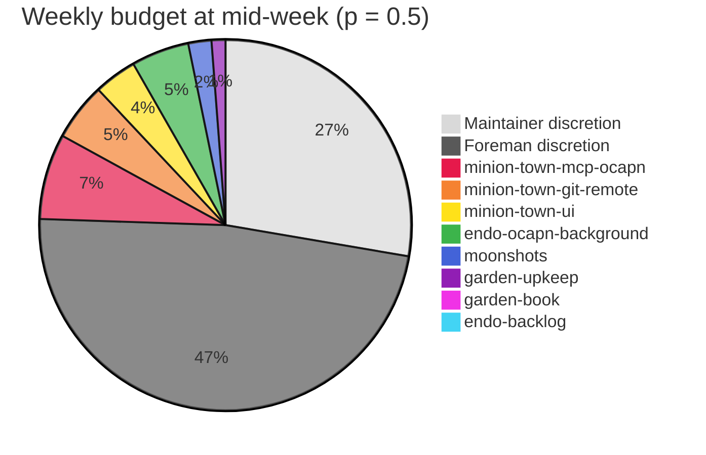

# Foreman-discretion pool: a three-way, time-varying split of the weekly budget

| | |
| --- | --- |
| Created | 2026-10-06 |
| Author | designer (job `design-foreman-discretion-pool`) |
| Status | Proposed |
| Amends | [accountant-arc-apportionment.md](accountant-arc-apportionment.md) (`planning_ceiling`, `unallocated`), [standing-token-backoff-ramp.md](standing-token-backoff-ramp.md) (curve endpoints; open PR [kriscendobot/garden#116](https://github.com/kriscendobot/garden/pull/116)) |

## Directive

Maintainer directive (kriskowal, 2026-10-06, liaison session): add a third
budget pool for work at the **foreman's own discretion**, so the fleet keeps
spending when no accountant-prioritized arc has ready work. Each pool is a
fraction of the week's available tokens and interpolates **linearly** from
week start to the scheduled quota reset:

| Pool | Week start | At reset |
| --- | --- | --- |
| Maintainer discretion | 50% | 5% |
| Foreman discretion (new) | 0% | 95% |
| Accountant-prioritized (per-arc slate) | 50% | 0% |

## What exists today, and what this design does with it

- **`planning_ceiling`** (`config/apportionment`, live `0.9`, "spend each
  subscription to 90%, never 100%"). `total_tokens` is 90% of calibrated
  capacity. The 10% outside it is the maintainer's remainder. So the
  maintainer's "90%" **is** `planning_ceiling`, and "95%" is its new value at
  reset. This design **retires the static scalar**. The foreman's envelope
  becomes the time-varying `F(p)` below, which equals 0.95 at reset. No second
  ceiling is introduced.
- **`unallocated`** (the pseudo-arc for foreman-drawn work outside the slate,
  live `22.75M`, a fixed share of `total_tokens`). It is a static reserve, not
  a growing share. It is **folded into the new pool**: the foreman-discretion
  pool replaces it, and its pseudo-arc is renamed (§ Stamping).
- **The standing backoff ramp** ([design](standing-token-backoff-ramp.md),
  PR #116, **Proposed, unbuilt**). `token_backoff_fraction_for` and
  `config/token-backoff-initial` do not exist in `scripts/jobs/`. The live
  `config/token-backoff-fraction = 1.00` is the **last step of the 2026-09-28
  hand stopgap**: schedule `token-backoff-ramp-100` fired on 2026-09-30 and was
  never cleaned up, because the ramp's deploy commit is what would remove it.
  The ramp has not been abandoned. Today the foreman is gated only at 100% of
  quota, which is why the maintainer's 10% sits unprotected. That ramp gates
  the same thing as `1 − maintainer discretion`: the share of a subscription's
  quota that foreman-drawn work may consume. Its curve with `r0 = 0.50` runs
  0.50 → 1.00. The maintainer curve here runs 0.50 → 0.95. Running both
  would double-gate with two nearly equal knobs. **Decision: the ramp's
  computed-on-read fraction *is* `F(p)`, and its end value changes from 1.00
  to `1 − m1 = 0.95`.** Everything else in #116 stands: per subscription,
  computed when read, `config/token-backoff-fraction` as an intervention pin,
  and its window-math fixes. #116 should be merged with that one amendment
  before the build below.

## The closed form

Let `p = clamp(elapsed / duration, 0, 1)` over the window from
`subscription_pacing_window` (the machinery #116 uses; week start → scheduled
reset). Let `W` be the week's available tokens: calibrated capacity, **not**
90% of it. Three journal knobs give the endpoints, with defaults from the
directive:

```
m0 = 0.50  m1 = 0.05      # maintainer discretion at start / reset
a0 = 0.50                 # accountant share at start (falls linearly to 0)

M(p) = m0 + (m1 - m0) p          = 0.50 - 0.45 p   maintainer discretion
A(p) = a0 (1 - p)                = 0.50 - 0.50 p   accountant-prioritized
D(p) = 1 - M(p) - A(p)           = 0.95 p          foreman discretion
F(p) = 1 - M(p) = A(p) + D(p)    = 0.50 + 0.45 p   foreman envelope
```

`D` is defined as the remainder, so the three pools sum to 1 at every `p`, not
only at the endpoints. Validation in `set-apportionment.sh`:
`0 ≤ m1 ≤ m0`, `0 ≤ a0 ≤ 1 − m0` (so `D(0) = 1 − m0 − a0 ≥ 0`, and the
directive's values give `D(0) = 0`).

**The fractions are cumulative ceilings, matching every existing budget
number** (`planning_ceiling`, the backoff fraction, arc `token_cap`s are all
"spent-so-far this week ≤ fraction × W"). Read cumulatively, a *shrinking*
accountant share cannot mean a shrinking cap, because spend cannot be un-spent.
So `A(p)` is an **earmark**: the part of the envelope that discretionary work
may not touch while arcs have not yet spent it. The earmark decays linearly, so
by reset every unspent arc token has been released to discretion. That is the
directive's intent: tokens flow to discretion when the arc slate is dry.

## Admission (all computed when read, no ticked writer)

Ledger sums are week-to-date, from `usage/*.jsonl` via `arc-spend.sh`:
`S_arc` is the sum over slate arcs, `S_disc` is the discretion pseudo-arc, and
`S_F = S_arc + S_disc`.

1. **Envelope (per subscription, foreman-drawn only).** Foreman-drawn work is
   admitted on a pool only while that pool's usage is below
   `F(p_pool) × capacity`. This is #116's gate with the 0.95 end value. It is
   the existing `foreman.sh` / `budget-level.sh` check of
   `GARDEN_TOKEN_BACKOFF_FRACTION`, resolved by `token_backoff_fraction_for`.
2. **Arc work** (a deferred plan or a foreman-generated step stamped with a
   slate arc). It is admitted while its slice has headroom (`S_i < token_cap_i`,
   unchanged) and the envelope admits. Slate caps now sum to `a0 × W`
   (50% of capacity), not 95% of `total_tokens`. Arcs keep **first claim**: the
   deferred selector still orders ready plans by rank before anything
   discretionary.
3. **Discretion work** is admitted only when no ready arc plan was promotable
   this pass and:

   ```
   S_F + max(0, A(p)·W − S_arc) < F(p)·W
   ```

   In words: discretion may spend whatever of the envelope the unspent arc
   earmark is not holding. At `p = 0` this is `0 < 0`, so there is no
   discretion. At reset it is `S_F < 0.95 W`. The digest reports this headroom
   as the pool's line.
4. **The refusal rule changes.** Today the service skips the inner foreman
   agent when no arc, `unallocated` included, has headroom. Now it skips only
   when no slate arc **and** the discretion pool have headroom. With slate arcs
   exhausted or dry but discretion headroom open, the agent runs with the
   mandate's discretion clause and stamps the discretion pseudo-arc. The
   accountant re-slice nudge fires only when discretion headroom is also zero
   while pools still report unspent quota. Discretion now absorbs the
   "slate dry" case on its own.

Gauntlet stages and chained follow-ups stay **charged but not gated** (the
existing accounting-vs-admission rule): a discretionary build's gauntlet is
charged to the discretion pool and can overshoot it, and the statement reports
the overshoot.

## Stamping and reporting

The pseudo-arc `unallocated` is **renamed `foreman-discretion`**
(`GARDEN_ARC_RESERVE` in `common.sh`). It has no static `token_cap`: its
headroom is the formula above. `unallocated` is read as a legacy alias in
`arc-spend.sh` and the statement, the same pattern as `ratchet-arc:` →
`arc:`, so this week's already-stamped rows still sum correctly. A distinct
name is needed because the statement must show the foreman's own choices
separately from "reserve nobody spent". After the rename, unspent reserve is
simply `W − S_total`, shown as a line, not an arc.

`accountant-statement.sh` reports the three pools at the current `p` (and at the
statement's week end): ceiling, spend, and remaining for each. Maintainer spend
is `S_total − S_F` (everything not foreman-drawn).

## Where it lives (extend, don't add parallel state)

- **`config/apportionment`** (schema 2 → 3): drop `planning_ceiling` and
  `unallocated_tokens`. Add `pools: {"maintainer_start":0.50,
  "maintainer_reset":0.05, "accountant_start":0.50}`. `total_tokens` now means
  `W` (full calibrated capacity). A schema-2 record is read with
  `planning_ceiling` → `m1 = 1 − planning_ceiling`, `m0 = 0.50`,
  `a0 = sum(slate)/W`, so the fleet behaves sanely before the accountant
  re-slices.
- **`config/token-backoff-initial`** (from #116) is **not created**. `r0` is
  derived as `1 − m0` from `config/apportionment`. One source of truth for the
  curve, owned by the accountant's single CAS writer.
- **`common.sh`**: one helper `foreman_pool_fractions [pool] [now]` that prints
  `p M A D F`. `token_backoff_fraction_for` returns its `F`, and the foreman
  digest and the statement call it.
- **`set-apportionment.sh`**: accepts and validates `pools`. It scales the
  slate so it sums to at most `a0 × W` (it already refuses over-subscription).
  It no longer materializes a capped `unallocated` budget file. It writes
  `config/arc-budgets/foreman-discretion` with `"cap":"formula"` so readers
  that list arcs still see it.
- **Deferred selector** (`plan_deferred_status`): a plan stamped
  `foreman-discretion` or `unallocated` is gated by rule 3 instead of a static
  cap.
- **Foreman digest** (`foreman.sh`): prints the three pool lines and the
  discretion headroom next to the per-arc headroom. The `note_once
  token-backoff` text names `F(p)` and its source.
- **Mandate** (`config/foreman-mandate`, regenerated by `set-apportionment.sh`):
  gains a discretion clause. When stamping `foreman-discretion`, prefer
  in-mandate upkeep, unblocking parked work, and finishing in-flight PRs over
  opening new fronts.

## Illustration

Mid-week (`p = 0.5`): maintainer 27.5%, foreman discretion 47.5%, accountant
earmark 25%, which is the live slate's eight arcs scaled to that earmark. The
palette follows the maintainer's picture: light grey for maintainer, dark grey
for foreman, and a rainbow for the arcs.



## Ownership map

| Boundary | Owner of durable state | Writer | Readers |
| --- | --- | --- | --- |
| Pool endpoints + slate | `config/apportionment` (journal) | `set-apportionment.sh` (accountant, maintainer-authorized CAS) | `common.sh` helper |
| Live fractions | none (computed when read from clock + reset facts) | — | foreman, budget-level, selector, statement |
| Spend | `usage/*.jsonl` (immutable rows) | usage meter | `arc-spend.sh` |
| Intervention pin | `config/token-backoff-fraction` | `set-token-backoff-fraction.sh` | overrides `F` only |

## Rollout

One build job (`build-foreman-discretion-pool`), after #116 merges with the
0.95 amendment. It can also be built together with #116. The deploy commit
removes the stale `config/token-backoff-fraction` (`1.00`) and the stopgap
schedules, as #116 already prescribes. The accountant then re-slices the
current week to schema 3. The legacy read keeps the fleet sane in between. Test
plan: unit-test `foreman_pool_fractions` at `p ∈ {0, 0.5, 1}` and its clamps;
check that the sum is 1; test rule 3 at both endpoints and with arcs dry
mid-week; test the legacy `unallocated` alias summing; and run the schema-2 read.

## Open questions

1. **Should maintainer discretion be an enforced reservation, or stay implicit
   headroom?** As designed, `M(p)` is enforced only *against the foreman*: the
   envelope `F(p)` stops foreman-drawn work, so the foreman never competes for
   it. Maintainer-directed jobs, triagers, watchers, and schedules stay ungated
   and are not limited to `M`. If they overrun it, the foreman does not yield
   further. The stricter alternative also counts non-foreman spend against the
   foreman's gate: admit foreman work only while
   `S_total + max(0, M(p)·W − S_nonforeman) < W`. This guarantees the
   maintainer's unspent share even after heavy watcher or schedule spend, but
   lets non-foreman background traffic idle the foreman. Recommendation:
   implicit (as designed), because background traffic is small and the
   statement makes any overrun visible.
2. **Is the cumulative reading of the accountant column right?** Read as
   cumulative ceilings, like every other budget number, the slate's weekly
   caps total **50%** of capacity, down from about 86% today (95% of a
   90%-of-capacity total). The other half of the foreman's share reaches arcs
   only by out-ranking discretion, never by slice. If the maintainer instead
   wants arcs to keep their current slice sizes, the alternative is
   `a0 = 0.95` with the earmark decaying to 0. That would give `D(0) < 0`
   against `m0 = 0.50`, so it needs `m0` lowered. That is a different table,
   which is why this is a question and not a choice made here.
