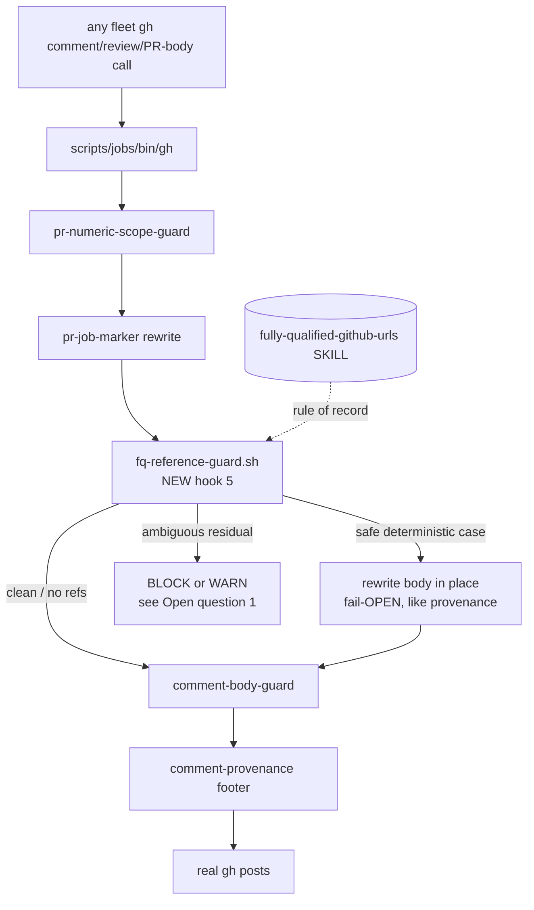

# Design: a fully-qualified-reference enforcement lane for outbound GitHub text

| Created | 2026-09-18 |
| Author  | gardener (job `design-fq-reference-enforcement-lane`) |
| Status  | Draft — open questions for the maintainer (garden issue [#89](https://github.com/kriscendobot/garden/issues/89#issuecomment-5725014097)). |

## Origin

Maintainer directive (kriskowal, garden issue #89, comment
`5725014097`, 2026-09-18):

> In the manner of the Americanizer and Anti-Botese automation, please run all
> comments to be posted on Github through a grep filter that senses the presence
> of any bare `#nnnn` notation and dispatches an agent to replace these with
> fully qualified references of the form `[#nnnn](https://github.com/org/repo/pull/nnnn)`
> or the corresponding notation for issues.

The *rule* already exists as the standing skill
`skills/fully-qualified-github-urls/SKILL.md` (maintainer directive 2026-07-20,
plus dckc's 2026-09-17 "referring without linking" back-reference guidance). What
does not yet exist is the *mechanical enforcement* the two normalization lanes
([american-english-normalization](../skills/american-english-normalization/SKILL.md),
[botese-normalization](../skills/botese-normalization/SKILL.md)) provide for their
rules. This design is that enforcement half.

## The crux: this is a pre-post gate, not a panel-diff lane

The two existing normalization lanes gate the **panel over a PR source diff** —
they run *post-hoc*, over committed lines, and dispatch a myrmidon fixer that
edits the source and re-pushes. The maintainer's ask here is subtly but decisively
different: the filter must run over **outbound GitHub comment / review / PR-body
text just before it is posted**. That text is *ephemeral* — it never becomes
committed source, it lives for one moment in the authoring agent's hands at post
time — so a "dispatch a fixer job to a PR worktree" pattern has nothing to edit.

The garden already has the right choke point for ephemeral outbound text, and it
is not the panel: it is the **fleet `gh` wrapper** (`scripts/jobs/bin/gh`).

### The choke point already exists — this is hook #5

`scripts/jobs/bin/gh` sits at the front of the fleet PATH (prepended in
`scripts/jobs/common.sh`, inherited by every gardener, every `claude -p`
subagent, and every direct-posting handler). **Every** GitHub write the fleet
performs — `pr comment`, `pr review`, `issue comment`, `pr create`, the reactji
and reply handlers' `gh api … -X POST`, `maintainer-reply.sh`, `message-user.sh`
— crosses it. It already carries four sourced hooks, in this order:

1. `pr-numeric-scope-guard.sh` — fail-open block of an ambiguous bare `gh pr 51`.
2. `pr-job-marker.sh` — fail-open rewrite stamping the `<!-- garden-job -->`
   marker on `pr create`.
3. `comment-body-guard.sh` — **fail-closed block** on the #475 backtick-strip
   corruption signature (a positive, zero-false-positive match).
4. `comment-provenance.sh` — **fail-open rewrite** appending the provenance
   footer to every comment body.

This design adds a fifth hook, `fq-reference-guard.sh`, of exactly the same shape.
It is the single place where "run all comments to be posted on GitHub through a
filter" is literally true and enforced by code, not remembered by an agent — the
`roles/mentor/AGENT.md` principle the provenance footer already embodies.

## Detection (deterministic, no LLM)

A new library `scripts/jobs/fq-reference-guard.sh`, sourced by the wrapper,
mirroring `comment-body-guard.sh` / `comment-provenance.sh`: pure, side-effect-free
to source (defines functions only), self-contained (does not source `common.sh`,
so the hot path stays cheap). It extracts the outgoing body from the same argv
shapes those two libraries already parse (`-b/--body`, `-F/--body-file`, and the
`gh api … -f body=…` / `-f body=@file` comment endpoints), then scans it.

The detector flags a reference **only** when it is a *bare* shorthand — never a
compliant form. Compliant forms it must leave untouched (the precision discipline,
exactly as the panel greps cast a wide net but the seat spares identifiers):

- A reference already inside a markdown link `[text](url)`.
- A reference inside an inline code span `` `#nnnn` `` or a fenced/indented code
  block (code spans are the *compliant back-reference* form the skill blesses).
- An already-qualified cross-repo `owner/repo#nnnn`.
- A reference already inside an `https://…` URL.
- The provenance footer's own generated link (the FQ hook runs **before** the
  footer is appended, so the footer is never in the scanned body — see ordering).

The full `fully-qualified-github-urls` scope, matched as bare tokens:

| token shape | example | compliant expansion |
| --- | --- | --- |
| bare same-repo issue/PR | `#1234` | `[#1234](https://github.com/OWNER/REPO/issues/1234)` |
| `owner/repo` shorthand | `endojs/endo` | `[endojs/endo](https://github.com/endojs/endo)` |
| bare commit SHA (7–40 hex) | `a3ebcca` | `https://github.com/OWNER/REPO/commit/a3ebcca` |
| bare hostname / site | `main0.ymax.app` | `https://main0.ymax.app` |

`OWNER/REPO` is the repository the comment is being **posted to**, which the
wrapper already knows deterministically from the call's `-R/--repo` flag or the
`gh api repos/OWNER/REPO/…` endpoint path. This is the load-bearing observation
that makes most cases *deterministically fixable* rather than agent-requiring —
see next.

### The `#99` ambiguity, resolved

The maintainer's `#99` example exposes the hard part: a bare `#nnnn` on repo X
autolinks to X, which is correct **only when the target is in X**. Detection alone
cannot always know which repo the author meant.

The resolution: a bare `#nnnn` written into a comment being posted to X carries
*exactly the same* meaning GitHub's own autolink already gives it — "issue/PR
`nnnn` in X". Expanding it deterministically to `https://github.com/X/issues/nnnn`
therefore **preserves that meaning while hardening it** for email, foreign-repo
rendering, and copied excerpts (the skill's stated reason the autolink is not
enough). If the author actually meant a *different* repo's `#nnnn`, that is a
pre-existing authoring error the autolink *already* renders wrong — the gate makes
it no worse, and the same-repo expansion is strictly better than the status quo
for every non-error case.

Two consequences:

- **`/issues/nnnn` vs `/pull/nnnn`:** GitHub redirects `/issues/N` → `/pull/N`
  (and vice versa), so `/issues/nnnn` is always a valid URL for both. The gate can
  expand deterministically **without a network lookup** in the hot path. (Open
  question 2 records the alternative — one `gh api` classify per number for an
  exact `/pull/` vs `/issues/` path.)
- **The genuinely agent-requiring residual** is narrow: a bare `#nnnn` the author
  meant for a *foreign* repo, or a bare SHA with no same-repo provenance. This is
  where "dispatch an agent" in the directive is real — the repo-disambiguation
  context lives only with the authoring agent. Open question 1 decides how the gate
  handles this residual (block-and-repost vs warn-and-post).

### Back-reference suppression (the transform this job applied by hand)

The one transform that is unambiguous *and* needs no repo knowledge: a bare
`#nnnn` whose **same number already appears fully-linked earlier in the same
body** is a back-reference, and per the skill's "Referring without linking"
section the compliant form is the code span `` `#nnnn` ``. The gate rewrites those
later bare occurrences to backticked form deterministically. This is precisely the
transform the issue-follow-up parent applied by hand to 17 comments on issue #89 —
here it becomes code.

## Two-tier handling, mirroring the wrapper's own split

The wrapper already models both dispositions this design needs. The FQ hook uses
both:

- **Safe deterministic rewrite — fail-OPEN (like `comment-provenance.sh`).** For
  same-repo `#nnnn` expansion, `owner/repo` expansion, bare-hostname expansion,
  and back-reference suppression, the hook rewrites the body in place and lets the
  post proceed. Any parse doubt → passthrough unchanged; a body that cannot be
  rewritten still posts. A rewrite never blocks.
- **Ambiguous residual — see Open question 1.** For the narrow residual the hook
  cannot confidently resolve (foreign-repo `#nnnn`, unknown-provenance SHA), the
  disposition is the open decision: fail-CLOSED block naming the remedy (like
  `comment-body-guard.sh`, so the authoring agent — which holds the context —
  reposts fully qualified via `--body-file`), **or** fail-open leave-as-is plus a
  throttled maintainer gap note (like the provenance instrumentation-gap note).

## Scope boundary (free, by construction)

The two panel lanes need an explicit *External-author calibration* to drop their
findings on external-author PRs. **This lane needs none.** The `gh` wrapper only
ever intercepts *fleet* gh calls, so every body it sees is garden/bot-authored by
construction; external contributors' text never passes through it. The scope
boundary the directive requires ("garden/bot-authored text only; never imposed on
external contributors") is automatic.

It also respects `## External-repo etiquette` verbatim: the hook only *reformats
references already present* in the outgoing text — it never adds a new
cross-reference, `@`-mention, or link. Per the skill, fully-qualifying a reference
"never authorizes a new cross-reference"; a reference etiquette forbids stays
forbidden whether or not it is qualified, and the hook has no path to introduce
one.

## Files the build would add or change

Primary lane (the maintainer's explicit ask):

1. `scripts/jobs/fq-reference-guard.sh` — the sourced detection + safe-rewrite
   library (new), shaped after `comment-body-guard.sh` / `comment-provenance.sh`:
   argv body-extraction, the compliant-form skip set, the four bare-token
   detectors, the deterministic rewriter, and the residual disposition of Open
   question 1.
2. `scripts/jobs/bin/gh` — one sourced hook block calling
   `fq_reference_guard_argv`, placed **after** `pr-job-marker` and **before**
   `comment-body-guard` / `comment-provenance` (so the footer's own link is never
   scanned, and a rewrite composes with the marker on `pr create`). Must cover
   `pr comment`, `pr review`, `issue comment`, the `gh api` comment endpoints, and
   `pr create --body/--body-file` / `pr edit --body` (PR bodies are in the ask).
3. `scripts/jobs/test/fq-reference-guard-test.sh` — the zero-false-positive test
   corpus (new), matching the `comment-body-guard-test.sh` discipline: a real bare
   `#nnnn` fires; an existing `[…](…)` link, a code span, an `owner/repo#nnnn`, a
   bare-token-inside-URL, and a back-reference do not; the deterministic rewrites
   land the exact expected strings; the residual disposition behaves per Open
   question 1.
4. `skills/fully-qualified-github-urls/SKILL.md` — add an `## Enforcement`
   section documenting the gate as the mechanical home of the rule (the way the two
   normalization SKILLs document their grep + seat + fixer), so the rule and its
   enforcement live together.

Optional post-hoc lane (Open question 3 — the true structural analog to
americanizer / deslopper, for **committed prose** that references bare `#nnnn`,
e.g. `designs/*.md`, `roles/*`, `skills/*`, and maintainer-authored PR source):

5. `scripts/jobs/gardening/fq-reference-grep.sh` — a deterministic diff grep over
   added lines, mirroring `orthographer-divergence-grep.sh` /
   `thesaurus-cliche-grep.sh` (`check`/`lines`/`report`; wide net; skip lockfiles
   / minified / the skill itself).
6. A cost-gated juror seat `roles/jurors/<seat>/AGENT.md` + its
   `scripts/jobs/gardening/seat-gate-<seat>.sh` gate, wired into
   `GARDEN_CODE_SEATS` and `GARDEN_DESIGN_SEATS` in
   `scripts/jobs/gardening/panel.sh`, with external-author `drop` calibration in
   `skills/panel-review/SKILL.md`. The seat resolves each bare number to its full
   URL from context and **bakes the concrete replacement into the finding** — like
   the deslopper's concrete rewrite — so the fixer stays mechanical.
7. A myrmidon-tier fixer variant `roles/<role>/AGENT.md` running the deterministic
   apply-then-re-grep loop (terminating oracle `residual ⊆ accept` against the
   stable PR merge base, never `HEAD~1` — the two corrections the american-english
   build already learned), plus a `qualify #N` verb in the triager map,
   comment-watcher verb table, and the `README.md` / `CLAUDE.md` vocabulary tables.

## Alternatives considered

- **A standalone `post-comment` helper every role calls.** Rejected: it re-invents
  the choke point the `gh` wrapper already *is*, and a role that forgets to call it
  (or a direct `gh api` handler) escapes it. The wrapper cannot be forgotten.
- **A pre-push-gates probe / panel-only lane as the primary mechanism.** Rejected
  as primary: neither sees *ephemeral outbound comment text*, which is exactly what
  the directive names. The panel lane survives only as the optional Surface B for
  committed prose (Open question 3).
- **A blanket `gh api` classify per bare number** to pick `/pull/` vs `/issues/`.
  Rejected for the hot path (a network call per comment); `/issues/N` redirects, so
  the deterministic path needs no lookup. Recorded as Open question 2.

## Open questions

1. **Residual disposition — block or warn?** For the narrow residual the gate
   cannot resolve deterministically (a bare `#nnnn` meant for a *foreign* repo, a
   bare SHA of unknown provenance), should the hook **fail closed and block** the
   post (naming the remedy so the authoring agent reposts fully qualified from its
   own context, like `comment-body-guard.sh`), or **fail open and post** while
   surfacing a throttled maintainer gap note (like the provenance
   instrumentation-gap note)? Blocking guarantees compliance but can wedge a post
   if the detector over-fires; warning never blocks but tolerates a slipped bare
   reference. (The safe deterministic majority is fail-open either way; this
   decides only the residual.)

2. **Same-repo `#nnnn` expansion form — `/issues/` redirect, or exact path via
   lookup?** The deterministic path expands to
   `https://github.com/OWNER/REPO/issues/nnnn` (valid for both PRs and issues via
   GitHub's redirect, no network call). Is the redirect acceptable, or do you want
   the exact `/pull/nnnn` vs `/issues/nnnn` path — which costs one `gh api` classify
   per number in the posting hot path?

3. **Also build the committed-prose panel lane (Surface B)?** The maintainer's
   directive names *comments*; the pre-post gate covers that fully. Should the build
   *also* add the juror-seat + myrmidon-fixer post-hoc lane (files 5–7) for bare
   `#nnnn` in committed prose (`designs/`, `roles/`, `skills/`, maintainer-authored
   PR source) — the exact structural twin of americanizer/deslopper — or defer it
   until a need appears? (Committed garden-repo prose autolinks correctly in-repo,
   so its urgency is lower than outbound cross-surface comment text.)

4. **Should same-repo bare `#nnnn` be expanded at all,** or only *back-reference
   suppression* + *cross-repo/foreign* references? Expanding every same-repo bare
   `#nnnn` maximizes robustness (email, excerpts) per the skill's rationale, but
   rewrites a great many currently-correct autolinks; suppressing that and touching
   only genuinely-bare-cross-surface references is lighter but leaves same-repo
   comments relying on the autolink.

5. **Names (if Surface B is built).** Proposed juror seat `referencer`, fixer role
   `qualifier`, verb `qualify #N`. Confirm or rename (as `orthographer` /
   `americanizer` and `thesaurus` / `deslopper` were confirmed on their PRs).
