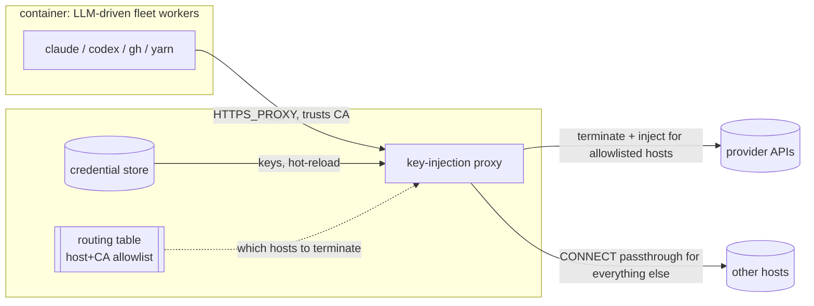

<!-- garden-design-open-questions -->

# Host-side dynamic API-key injection proxy

Maintainer directive (kriskowal, 2026-09-21): explore a host-side proxy that
injects the right provider's API key into outbound requests dynamically, so a
key can be **added or rotated without touching any running container**. Today
that requires exporting the key on the host and **recreating the container**:
`scripts/systemd/seed-api-key-handoff.sh` is an allowlist-only bridge that copies
a fixed set of `*_API_KEY` values into `/run/environment.d` (a container tmpfs)
at start, so the running fleet inside the container only ever sees the keys that
were present when the container was created. Adding `TYPESAFE_API_KEY` (a sibling
job) or rotating any existing key means a recreate.

This document specifies the proxy, states a position on each real design
question, and lands its unresolved forks in `## Open questions` — which is why it
is a PR (garden open-questions carve-out), not a bare `main2` landing.

## What it is (and what it is not)

- **Not SOCKS.** A SOCKS4/5 proxy relays raw TCP and never sees an HTTP header,
  so it cannot inject an `Authorization`/`x-api-key` header. This is an
  **HTTP(S) forward proxy that terminates TLS** for the provider hostnames it
  injects credentials for: it decrypts the request, adds the header, re-encrypts,
  and forwards to the real provider.
- **Scoped TLS termination, not blanket MITM.** The proxy terminates TLS only for
  an explicit **allowlist of provider API hostnames** — the same set as the
  routing table's keys (today: `api.anthropic.com`, `api.openai.com`,
  `api.moonshot.cn`, `api.fireworks.ai`, `openrouter.ai`, `ollama.com`, and
  `api.typesafe.ai` pending its sibling job). Every other `CONNECT` is tunneled
  blind (raw TCP passthrough), never decrypted. Rationale: a smaller trust
  surface, and if a provider ever pins its certificate we are only exposed on the
  handful of hosts we deliberately terminate, not on all outbound traffic. The
  allowlist and the routing table are the **same** artifact — a host we do not
  inject for is a host we do not terminate.
- **A CA the containers trust.** To present its own certificate for the
  terminated hosts, the proxy needs a CA cert baked into each container's trust
  store. Unlike API keys, a CA rarely rotates, so this stays a **one-time trust
  provisioning at container-creation time** via the existing image/entrypoint
  path. Eliminating recreation for **key** changes is the goal; the CA is
  explicitly out of that goal.

## Ownership map

The design spans the container client, the host proxy, and a host credential
store, so the boundaries are stated before review rather than left in prose.

| Boundary | Mechanism | Policy | Durable state | Lifecycle / commit authority | Value crossing |
| --- | --- | --- | --- | --- | --- |
| container client -> host proxy | proxy terminates TLS + injects header | which hosts to terminate; which key per host per this host's key set | none (proxy is stateless per-request) | proxy process (systemd unit) | the injected credential, added inside the proxy, never seen by the client |
| host proxy -> credential store | proxy reads keys; store holds them at rest | which store; encryption at rest | the key values themselves | the store (systemd-creds / SSM); proxy only reads + hot-reloads | plaintext key, only in the proxy's private `/run` |
| host proxy -> provider | proxy is the outbound client identity | none | none | proxy | the finished authenticated request |

Answers to the four ownership questions: **durable state** (the key values) is
owned by the credential store, never by a container and never by the repo or
journal. The **commit/discard** of a key change is the store's write plus the
proxy's hot-reload; a container never commits a key. **Restart/replay:** the
proxy is stateless per request, so a restart re-reads the store and loses
nothing; an in-flight request fails and is retried by the client. **Execution
classification:** the proxy is a network intermediary (a header rewrite), not a
policy engine — it makes no decision beyond "terminate-and-inject vs tunnel."

## Architecture

The dynamic part — a hostname -> key routing table, hot-reloadable via a watched
config file or a local control socket — is the easy, low-risk piece. It is a
plain map keyed on the terminated hostname, reloaded on a file-watch or a signal;
no request is dropped during a reload because the proxy swaps the table
atomically. The risky pieces are below.

## Positions on the real questions

**Blast radius / centralization — the proxy *reduces* the container-side surface.**
The naive read is "one process now holds every credential, so blast radius is
worse." It is not that simple. **Today, a compromised container already sees the
whole host's key set** — `seed-api-key-handoff.sh` copies every allowlisted key
into `/run/environment.d`, so it lands in the environment of the LLM-driven
workers that execute arbitrary tool calls. That container environment is the
*more* exposed surface. Under a full-replace proxy the container holds **no**
provider keys at all; a compromised container can only make proxied calls (which
an in-container attacker could make regardless). The concentration moves from
"every container's env" to "one host process" — but the host already held all
those keys, so this is not new concentration, and it retires the genuinely
exposed copy. Net: scoped correctly, the proxy **shrinks** the exposed blast
radius rather than growing it. The one truly new secret-at-rest is the proxy's
**CA private key**: whoever holds it can MITM the terminated hosts for any
container trusting the CA, so it is stored like a provider key (below), not baked
into the image or the repo.

**Fail-closed, not fail-open (the budget-gate lineage, not the provenance one).**
If the proxy dies or is unreachable, outbound provider calls **fail** rather than
fall back to a direct connection. This is deliberately the *opposite* of
`comment-provenance.sh`'s "FAIL OPEN, NEVER CLOSED," and it is the right call
because the two failures are not the same kind. A missing provenance footer is
**cosmetic** — failing open costs nothing. A key-injection fallback is
**security-relevant**: a direct-with-baked-key fallback would resurrect a
credential the maintainer may have *intentionally rotated away* (a revoked key
still works through the fallback), and it would silently reintroduce the exact
"recreate to change a key" problem this design exists to remove. That places it
in the `subscription-budget-model` lineage instead — "a wrong/again-live outbound
credential is a real harm, so prefer the safe refusal." The cost of fail-closed
is honest and must be named: the proxy becomes a **new single point of failure
that takes down every worker kind on the host at once**, which the fleet does not
have today. The mitigation is to *lower the probability* of that failure rather
than paper over it with a security-regressing fallback: run the proxy as a
hardened, auto-restarting systemd unit with a health probe and a loud alert on
down, the same posture the fleet already accepts for its leader-only singletons.

**Full-replace of `seed-api-key-handoff.sh` as the end-state.** The cleanest
realization of "one place holds keys" is that the container gets **no** provider
keys — the proxy is the sole holder, and `seed-api-key-handoff.sh` is retired for
the providers the proxy covers. Full-replace + fail-closed is *consistent*: the
container literally cannot make a provider call without the proxy, which is the
honest expression of the model, and it means there is no baked copy to go stale
or to resurrect on fallback. The transition keeps the bridge only until the proxy
is proven on a host, then removes the allowlisted keys from it host by host.

**Credential storage — systemd encrypted credentials, not the tmpfs bridge.**
The `/run/environment.d` bridge is deliberately volatile and container-scoped and
does not map to a host process that must read keys across restarts. The primary
proposal is **systemd encrypted credentials** (`LoadCredentialEncrypted=`,
`systemd-creds encrypt`): encrypted at rest bound to the host, decrypted only
into the proxy unit's private `/run` credential directory, never in the
bind-mounted home, the repo, the unit files, or the journal (the same
"no-secret-in-tracked-state" property `seed-api-key-handoff.sh` already holds).
For hosts with AWS access (minion.town uses SSM today), an **SSM SecureString**
source is an allowed alternative the proxy reads at start and on reload; the
design permits it but does not require it. Hot-reload is a file-watch or a
control-socket signal.

**One proxy per host, never shared or replicated.** Each host runs its own proxy
holding only **that host's** credential set. This respects the existing
per-host-credential reality (`designs/fleet-gh-identity.md`; the subscriptions
`claude-endolin1` / `claude-endolin2` / `claude-oros` are genuinely separate and
non-shared, while `codex-endolin` is shared across exactly two hosts): the proxy
changes only *how a host's own keys reach its own containers*, not *which host
has which key*. A shared/central proxy is rejected — it would route all fleet
traffic through one cross-host hop, concentrate every host's credentials in one
process (the blast-radius win above is lost), and couple host availability.

**Client cooperation — verify, do not assume.** The design assumes `claude`,
`codex`, `gh`, and the npm/yarn registry clients honor `HTTPS_PROXY` /
`NO_PROXY`, but this must be **empirically confirmed per client** before the
proxy is load-bearing (a client that ignores the env var needs its own proxy
configuration, or it silently bypasses injection). This repo's own
`git@github.com:...` SSH journal/`main2` pushes are a different protocol and a
different credential class and are **unaffected either way** (SSH keys, not
provider API keys, and no HTTP header to inject). `NO_PROXY` must at minimum
cover `github.com` API traffic the fleet's `gh` wrapper makes with the bot token,
which the proxy has no business terminating.

## Alternatives considered

- **Blanket MITM of all outbound traffic.** Rejected: larger trust surface and
  exposure to any provider that pins, for no benefit over the scoped allowlist.
- **Keep `seed-api-key-handoff.sh`, add a control socket to mutate
  `/run/environment.d` live.** Rejected: the fleet reads its environment at
  process start, so a live env edit does not reach already-running workers — the
  recreate problem persists for anything long-lived.
- **A sidecar proxy inside each container.** Rejected: it puts the credential
  back inside the container, losing the blast-radius win, and still needs a
  recreate to change the sidecar's key.

## Test plan

- A unit test that the routing table hot-reloads (add a hostname+key, observe the
  next request to that host carries the injected header) with **no** proxy
  restart and no in-flight request dropped.
- A parity probe per client (`claude`, `codex`, `gh`, `yarn`) confirming
  `HTTPS_PROXY`/`NO_PROXY` are honored and a terminated-host request actually
  routes through the proxy (observe the injected header server-side or in a proxy
  log that never records the key value).
- A fail-closed test: kill the proxy, confirm a provider call fails loudly (not a
  direct fallback) and the health alert fires.
- A no-secret-in-tracked-state assertion mirroring `seed-api-key-handoff.sh`'s
  discipline: grep the repo, journal, unit files, and bind-mounted home for any
  key value after a full run.

## Open questions

- **Fail-closed vs a bounded cold-start bootstrap exception?** The recommendation
  is fail-closed with no direct fallback. Is a *narrow, time-boxed* cold-start
  exception wanted — the container gets baked keys at creation only for the window
  before the proxy is confirmed reachable, then never falls back to them once the
  proxy has come up — or is the pure "no keys in the container, ever" model
  (full-replace + fail-closed) preferred despite the single-point-of-failure
  cost?
- **Retire `seed-api-key-handoff.sh` entirely, or keep it as a bootstrap path?**
  The recommendation is full-replace as the end-state. Confirm the transition is
  acceptable (remove the allowlisted keys from the bridge host by host once the
  proxy is proven), or state that the bridge stays as a permanent cold-start
  fallback.
- **Credential store: `systemd-creds` on every host, or SSM where AWS access
  exists?** The recommendation is `systemd-creds` as the portable default with
  SSM SecureString allowed where available. Should hosts with SSM prefer it, and
  do any hosts have neither a usable TPM/host-key for `systemd-creds` nor SSM?
- **CA private-key custody and rotation.** Where does the proxy's CA private key
  live (same store as the provider keys?), who may read it, and what is the CA
  rotation/revocation story given it is baked into every container's trust store
  at creation (a CA rotation *does* reintroduce a recreate — is that acceptable
  for the rare CA case)?
- **Client cooperation is unverified.** Do `claude`, `codex`, `gh`, and the
  registry clients actually honor `HTTPS_PROXY`/`NO_PROXY` on these hosts? This
  needs a probe before the proxy is load-bearing; a client that ignores it needs
  its own configuration or the design does not cover it.
- **Build vs adopt.** Build a small custom terminating proxy, or configure an
  existing one (mitmproxy in a scripted addon mode, Squid with SSL-bump, an
  Envoy/`http-proxy` filter)? Each carries a different maintenance and
  audit surface for a process that holds every provider credential; the
  maintainer's tolerance for a third-party dependency in the credential path is
  the deciding question.
- **Scope of the terminated-host allowlist over time.** New providers arrive
  (the model-selection worker-kind map grows). Is the allowlist maintained by
  hand alongside the routing table, or derived from the worker-kind -> provider
  map so a new provider is covered automatically?
