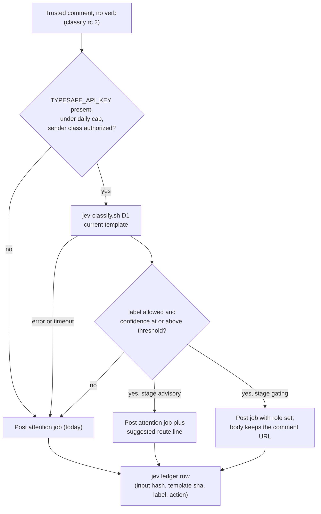
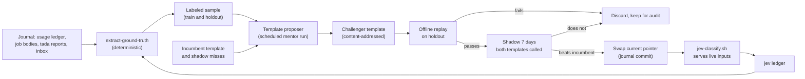

# Design: Jev in the triage and foreman workflows, with an amortized prompt template

| Field | Value |
| --- | --- |
| Status | Proposed. Open questions are maintainer-facing (egress). The offline trial below runs on already-authorized data only. |
| Directive | kriskowal, 2026-10-08: integrate Jev in the triage and foreman workflows for (a) reactions to maintainer feedback and (b) job classification, with an agent that periodically proposes a reusable Jev prompt template applied to many inputs. |
| Builds on | [typesafe-jev-classification](typesafe-jev-classification.md) (Jev is a primitive called by deterministic code, never a worker kind or tier), [jev-trusted-sender-quoted-text](jev-trusted-sender-quoted-text.md), [typesafe-ai](../skills/typesafe-ai/SKILL.md), [foreign-content-preclassification](../skills/foreign-content-preclassification/SKILL.md) |
| Job | `design-jev-triage-foreman-integration` |

## Problem

The triage and foreman paths are deterministic and stay that way. Two kinds of
decision currently fall through to a full LLM run, or to nobody:

- A trusted comment that names no verb (`classify` in `comment-watcher.sh`
  returns 2) becomes an `attention` job with no `role:`. A gardener spends a
  whole claim (mean 384 s across 112 runs from 2026-09-08 to 2026-10-07)
  reading the comment and deciding what work it implies.
- About a third of job runs carry no role. Of 4,748 usage-ledger rows in the
  same window, 1,621 have no `role` and 2,086 run as the generic `gardener`.
  `post-job.sh` infers a role only from an explicit `--role`, front-matter, or
  a `**Role: <x>.**` template line.

Jev returns a bounded typed answer with a confidence for about $0.042 per
million input tokens. The open questions are where it helps, how its prompt
template is produced and kept current, how we know it is right, and what text
it may see.

## Measured volumes (journal, 2026-09-08 to 2026-10-07)

| Input | 30-day count | Source |
| --- | ---: | --- |
| Distinct job bases run | 3,619 | `usage/*.jsonl` |
| Runs with no `role` | 1,621 of 4,748 rows (34%) | `usage/*.jsonl` |
| `attention` jobs (comment residual) | 63 | bases `<slug>-pr<N>-<hash8>` in `usage/` |
| Comment-derived posts since 2026-09-16 | 31 residual, 32 verb | `jobs/index/*` (`identity: …:comment:<id>`) |
| Review-derived jobs (`-review-<hash8>`) | ~117 | `usage/` |
| Maintainer-inbox messages | 2,512 (~84/day) | `inbox/maintainer/{read,unread}` `sent_at:` |
| Plans parked in `jobs/plan/` today | 169 | `jobs/plan/` |

## 1. Decision points, ranked

Every point keeps today's behavior authoritative. Jev proposes a label and a
confidence; deterministic code decides; low confidence, a missing key, a
timeout, or a malformed answer leaves today's path untouched.

| Rank | Decision point | Today | Jev label set | Fit | Value |
| --- | --- | --- | --- | --- | --- |
| 1 | **D1. Comment residual routing.** `classify` rc 2 (`attention`) | Generic job; the claiming gardener routes it | `fixer`, `weaver`, `shepherd`, `designer`, `builder`, `reply_only`, `route_by_llm` | High: a closed set of job kinds over short text | Medium: 63 per month, but each saves a routing hop and gets the right role prompt from the start |
| 2 | **D4. Maintainer-inbox triage at arrival.** Watchdog, doom, and poison notices | Annotated only when a muster runs, by `muster-pilot.sh` | `self_clears` (noul); `doom_fate` choice `promote`/`drop` | High: structured notices and structured ground truth | High: ~84 per day, the largest volume; extends a practice that already graduated |
| 3 | **D3. Job role at post time.** Only when the poster sets no role | No role, so a `gardener` dispatch default | Postable roles minus an excluded set (below) | Medium: bodies are long and varied | Medium: ~1,200 roleless runs per month get the right brief and the right handler budget |
| 4 | **D2. Reaction to maintainer feedback.** Trusted comment the watcher calls non-actionable (rc 1, trusted) | 👀 plus a reply via `ack_or_log_slide`; no job | `missed_directive` (noul) | Medium | Low to medium: catches a directive phrased outside the verb table; volume unknown, measured by the trial |
| 5 | **D5. Foreman promotion ordering.** `plan_deferred_ranked_omega` | Arc rank, omega rank, `priority:`, then FIFO | `doom_risk` score (5 levels) | Low: "the right order" has no direct ground truth | Low: only a tiebreak inside one `priority:` level |

Labels Jev can never select, at any confidence: `conductor` (merge), `boatman`
(ferry), `retcon`, and anything that changes a PR's state. Merge stays on the
deterministic `finalize` path (trusted imperative plus mergeable probe).
`reply_only` and `route_by_llm` are the safe sinks: both preserve today's
outcome.



## 2. The amortization loop

A Jev call is cheap; producing a good question set is not. The template
proposer is a periodic LLM run whose output many Jev calls reuse.

**Proposer.** A scheduled gardener job (`set-schedule.sh`, role `researcher`,
tier `mentor`) using a new skill, `jev-template-proposal`. It is not a new role
and not a worker kind. One run per decision point:

- **Inputs:** a stratified sample of at most 200 labeled inputs from the last
  30 days (at least 10 per label where available), produced by the
  ground-truth extractor (§ 3); the incumbent template; and the incumbent's
  shadow-ledger disagreements (inputs it labeled wrong). Inputs are passed as
  files and read as data.
- **Output:** a template JSON, canonicalized with `jq -S` and addressed by its
  SHA-256, written to the journal at
  `jev/templates/<decision>/<sha256>.json`:

  ```json
  {
    "decision": "D1",
    "parent": "<sha256 of incumbent or null>",
    "model": "jev-latest",
    "state_schema": ["repo", "pr_title", "surface", "author_class", "comment"],
    "questions": {
      "route": {
        "type": "choice",
        "instructions": "...",
        "criteria": { "fixer": "...", "reply_only": "...", "route_by_llm": "..." }
      }
    },
    "proposed_thresholds": { "route": 0.80 },
    "eval": { "holdout_n": 0, "agreement": null, "false_act": null }
  }
  ```

  The pointer `jev/templates/<decision>/current` holds the sha in use. Code
  reads only the pointer and the file it names. Thresholds in the template are
  proposals; the threshold in force lives in `config/jev/<decision>.env`,
  which only the maintainer or a reviewed commit changes.

**Promotion of a challenger.**

1. **Offline replay** on a held-out set the proposer never saw (the newest 30%
   of the window). Requirement: agreement no worse than the incumbent, and a
   false-act rate no higher than the incumbent's and within the pass bound
   (§ 7).
2. **Shadow** for 7 days or 50 live inputs, whichever is later: both
   incumbent and challenger are called on every input; only the incumbent's
   label is used. Regret is the count of inputs the incumbent labeled
   correctly and the challenger labeled wrongly, once ground truth matures.
3. **Promote** when challenger agreement is at least incumbent agreement plus
   2 points, its regret is at most half its gains, and its false-act rate is
   no higher. The pointer swap is a journal commit that names both shas and
   the numbers. Otherwise discard the challenger and keep its file for audit.

**Cadence.** Drift-triggered with a floor: run when rolling 14-day agreement
falls 5 points below the agreement recorded at promotion, and otherwise
monthly. Skip a run when fewer than 30 new labeled inputs have matured since
the last one.

**Break-even.** Both the proposer and the LLM hop a template displaces are
priced by wallclock on the same rate card (`reputation/rate-card.md`:
Anthropic $0.000069/s calibrated on the subscription, $0.005154/s fleet
list-equivalent). So the break-even count is a ratio of seconds and is the
same on either basis:

`N* = T_proposer / t_displaced`, with `T_proposer` ≈ 900 s (estimated mentor
run; the trial measures it) and Jev's cost (≈2,000 input tokens, $0.000084 per
call) negligible beside both.

| Decision | `t_displaced` per decision | `N*` per template | Monthly volume | Cadence that clears `N*` |
| --- | --- | ---: | ---: | --- |
| D1 | ~60 s routing hop in the attention claim | 15 | 63 | Monthly (63 ≈ 4×`N*`); weekly would only break even |
| D4 | ~5 s of liaison attention per notice in muster | 180 | 2,512 | Weekly (≈580 per week ≈ 3×`N*`) |
| D3 | ~30 s of a mis-briefed run, conservatively | 30 | ~1,200 | Weekly |
| D2, D5 | Unknown | n/a | Measured by trial | Share the D1 and D3 templates; no proposer of their own |

Total Jev spend at these volumes, with shadow calls doubling it, is about
16 million input tokens per month, or $0.70. The proposer runs (about 10 per month: D4 and D3 weekly, D1 monthly)
cost about $0.62 calibrated or $46 list-equivalent, all from the same quota
pool as gardeners. The binding cost is quota, not dollars.



## 3. Ground truth

Every label is read from what happened, from data the journal already keeps.
A full-history clone of `journal2` (blob-filtered, outside the garden root)
recovers each job's posted body from the commit that added
`jobs/todo/<base>.md`.

| Decision | Correct label | Extraction |
| --- | --- | --- |
| D1 | What the attention claim led to | Join the attention base to (a) bases named in its `jobs/tada/**/<base>.md` report that first appear in `usage/` after the claim; label is the first such base's posted `role:`. (b) If none, and the report records a push (`pushed` or `force-pushed` plus a 7- to 40-hex sha), label is `fixer` (acted in place). (c) If neither, `reply_only`. A report that matches none of these is `unlabeled` and excluded. |
| D4 | What the notice turned into | Watchdog notice (`watchdog_key`, not `recovered`): `self_clears=true` if a `recovered: true` message with the same key has `sent_at` within 24 h, else `false`. Doom or poison notice (`doom_base`/`poison_base`): `promote` if that base later reached `tada` in `usage/` or `jobs/tada/`, `drop` if it is in `jobs/withdrawn/`, otherwise pending and excluded. |
| D3 | The role the job was meant to run as | Jobs whose posted body carries an explicit `role:` other than `gardener`, with the role field, the `**Role:**` line, and the base name blinded before classification. Roleless jobs have no ground truth; they are the population D3 serves, so it is evaluated on labeled look-alikes. |
| D2 | Whether a "non-actionable" trusted comment was in fact a directive | A later verb or attention job on the same PR by the same author within 24 h (from `jobs/index/` identities and comment ids), which shows the maintainer had to repeat themselves. |
| D5 | Whether a promoted plan doomed | `doomed: true` front-matter or a `fail` outcome in `usage/` after promotion. |

New instrumentation is limited to one thing: the Jev ledger
`jev/<decision>/<GARDEN>/<YYYY-MM-DD>.jsonl` (input sha256, template sha,
label, confidence, threshold, action taken, usage tokens). It stores hashes,
never text; the text stays where it already lives. If D1 labeled coverage
falls below 70% in the trial, the follow-up adds a `routed-to:` front-matter
line to attention reports; that is the only other change this design allows.

## 4. Data egress and trust

The 2026-09-23 acceptance covers the Muster pilot, which since 2026-09-28 is
standing practice over the maintainer inbox. The 2026-09-28 directive covers
foreign-content pre-classification before ingestion. Neither covers an
autonomous watcher or PR-comment text; that question is also open on
[#115](https://github.com/kriscendobot/garden/pull/115) and unanswered.

| Decision | Text sent to TypeSafe | Senders | Covered today? |
| --- | --- | --- | --- |
| D4 | Maintainer-inbox message bodies (garden-authored notices), head+tail capped at 4 KB | Garden scripts and gardeners | **Same data class as the standing Muster pilot.** Moving the call from muster time to arrival time makes it autonomous, so it needs confirmation (open question 1). The offline trial replays this class. |
| D1, D2 | Comment body, PR title, surface | Trusted senders after the existing gate: `maintainers/allowlist`, `trusted-senders/allowlist`, endojs/Agoric org members | **No.** Open question 2. First surface proposed: `maintainers/allowlist` authors only. Untrusted senders are dropped before this point today and stay dropped; nothing here reorders the gate. |
| D3 | Job body with the `(untrusted, truncated)` excerpt block removed before sending | Garden producers; the liaison paraphrasing the maintainer | **No.** Open question 3. Garden-authored text, but not yet authorized for autonomous egress. |
| D5 | Plan body, same stripping as D3 | Garden producers | **No.** Same question as D3. |

No decision point sends text from a sender the existing gates would drop, and
no point classifies the 280-byte excerpt of third-party text that the watchers
embed in job bodies.

## 5. Failure, cost, and injection posture

- **Fail open everywhere.** `jev-classify.sh` exits 0 and prints
  `jev_status=unavailable reason=<no_key|cap|timeout|http|shape|unauthorized>`;
  the caller takes today's path. Timeout is `GARDEN_JEV_TIMEOUT` (default 8 s
  on watcher paths so the 👀 ack, which follows the post, is not delayed
  noticeably; 30 s elsewhere).
- **Credential.** `TYPESAFE_API_KEY` is maintainer-provisioned through
  `seed-api-key-handoff.sh`. No job acquires, guesses, or configures it.
- **Daily cap.** `GARDEN_JEV_DAILY_USD` (default $0.25, about 6 million tokens)
  summed from today's ledger rows on this host. At the cap, calls stop until
  UTC midnight and one coalesced `watchdog-notice.sh` fires.
- **Authorization switch.** Each decision point is off unless
  `config/jev/<decision>.env` exists in the journal with `egress=authorized`
  and the journal `message` id that recorded the maintainer's answer.
- **Injection.** Jev cannot emit prose or tool calls. A hostile or confused
  input can still pick a wrong label inside the set. The blast radius of each
  wrong label:

| Wrong label | Consequence | Bound |
| --- | --- | --- |
| D1 picks a mutating role instead of `reply_only` | A fixer or weaver job runs on a PR the maintainer already controls | Excluded labels never include merge, ferry, or PR-state changes; the job body keeps the comment URL and the preflight; gating only on `maintainers/allowlist` senders |
| D1 picks the wrong mutating role | Wrong brief; the claim usually reroutes | Same as today's mis-routed attention job |
| D4 `self_clears` wrong | A live problem is shown as "probably self-clearing" | Advisory only; muster still disposes; nothing is archived by Jev |
| D3 wrong role | Wrong brief and handler budget | Only roleless jobs; never overrides an explicit role |
| D5 wrong `doom_risk` | A plan is promoted later | Tiebreak inside one priority level only |

## 6. Options and recommendation

1. **Advisory annotation only.** Hand-written static template; Jev's label is
   printed into the job body or inbox item, and nothing branches on it.
   Cheapest and safest. Saves no LLM time, and the template rots unmeasured.
2. **Threshold gating with a static template.** Above the threshold, D1 and D3
   set the role. Saves the routing hop. A hand template has no measured
   accuracy and no way to improve, so the threshold is a guess.
3. **Full template-proposer loop.** Option 2 with templates produced, replayed,
   shadowed, and promoted by the loop in § 2. Measured accuracy, adapts to new
   job kinds, and the proposer's cost is repaid within one cadence period at
   current volumes. Most moving parts: a scheduled job, a ledger, and an
   evaluator.
4. **Do nothing; tighten deterministic rules.** Mine the same ground truth for
   new verb-table phrases and base-name role rules. No egress. It is also the
   baseline every Jev template must beat (§ 7).

**Recommendation: option 3, staged, with option 4 as the gate.** A Jev
template ships at a decision point only if it beats the best deterministic
rule mined from the same data.

| Stage | D4 (inbox) | D1 (comment residual) | D3 (job role) | D2, D5 |
| --- | --- | --- | --- | --- |
| 0. Offline trial | Live replay (authorized class) | Labels and proposer only; no Jev call | Labels and proposer only; no Jev call | Measure volume only |
| 1. Shadow | After open question 1 | After open question 2, maintainer senders only | After open question 3 | No |
| 2. Advisory | Annotate items at arrival for muster | Suggested-route line in the attention job | Suggested-role line | D2 only, as a note on the slide log |
| 3. Gating | Never (muster disposes) | Set `role:` when the pass bounds hold for 14 days | Set `role:` on roleless jobs | Never |

## 7. Trial plan (next job, executed as written)

**Scope.** No `TYPESAFE_API_KEY` call is made except for D4 records. All work
happens in the trial job's own worktree and a scratch clone outside the garden
root. Scripts land under `scripts/jobs/jev-trial/`.

1. **Clone.** `git clone --filter=blob:none --single-branch -b journal2
   https://github.com/kriscendobot/garden "$TMPDIR/jev-journal"`.
2. **Extract ground truth** (`extract-ground-truth.sh <decision>`), per § 3,
   for the window 2026-09-01 to 2026-10-07. Emit
   `{id, decision, input_file, label, sent_at}` JSONL plus a coverage summary
   (labeled, unlabeled, pending). Split chronologically: before 2026-09-27 is
   the training set, from 2026-09-27 onward is the holdout.
3. **Deterministic baselines** (`baseline.sh <decision>`), fit on training,
   scored on holdout:
   D4, the per-`watchdog_key` historical self-clear rate (predict true if ≥ 0.8)
   and the per-`doom_signature` historical promote rate;
   D3, a base-name prefix map (`build-` builder, `design-` designer, `-conduct`
   conductor, `-shepherd` shepherd, `weave-` weaver, `-retcon` retcon, `fix-`
   fixer);
   D1, the most common label.
4. **Propose.** The trial job's own agent, following the draft
   `jev-template-proposal` skill, writes one template per decision from at
   most 200 training records, without seeing the holdout. Record its wallclock
   as `T_proposer`.
5. **Replay D4** (`replay.sh D4 <template>`): call TypeSafe for each holdout
   record, 20 records per request, state capped at 4 KB per record. Record
   label, confidence, and usage tokens. For D1 and D3, stop at step 4 and
   report "ready for live replay, awaiting egress authorization".
6. **Score** at thresholds 0.6, 0.7, 0.8, 0.9 and report a table per decision.

**Pass criteria (D4 must meet all; D1 and D3 are scored the same way once
authorized).**

| Metric | Definition | Pass |
| --- | --- | --- |
| Agreement | Correct labels ÷ labels above threshold | ≥ 0.85 for D4 and D3; ≥ 0.80 for D1 |
| Coverage | Records above threshold ÷ labeled holdout | ≥ 0.40 |
| False-act rate | D4: `self_clears=true` on a notice that persisted, or `drop` on a base later promoted. D1: a mutating role where truth was `reply_only`. As a share of records above threshold. | ≤ 0.02 for D4; ≤ 0.03 for D1 |
| Beats baseline | Agreement minus the deterministic baseline's agreement on the same records | ≥ +0.05; otherwise ship the baseline rule instead (option 4) |
| Cost per decision | Mean `usage.input_tokens` × $0.042 per million | ≤ $0.0005 |
| Break-even | `N* = T_proposer ÷ t_displaced` (§ 2) against measured 30-day volume | Monthly volume ≥ 2 × `N*` at the chosen cadence |
| Labeled coverage | Labeled ÷ (labeled + unlabeled) | ≥ 0.70, or the decision's score is reported as not valid |

The trial reports the table, the template shas, and a go or no-go per decision
for stage 1. It does not wire anything into a watcher.

## Ownership map

| Boundary | Mechanism | Policy | Durable state | Commit authority | Value crossing |
| --- | --- | --- | --- | --- | --- |
| `comment-watcher.sh` → `jev-classify.sh` | Helper call after the sender gate, before the post | Watcher's threshold and excluded-label table (`config/jev/D1.env`) | None in the helper | Watcher posts the job and slides the cursor | Body file path; returns `label`, `confidence`, `status` |
| `post-job.sh` → `jev-classify.sh` (D3) | Helper call only when no role resolved | `post-job.sh` keeps explicit role first | None | `post-job.sh` | Stripped body file; returns label |
| Inbox writer → `jev-classify.sh` (D4) | Annotation appended as front-matter | Muster disposes; Jev never archives | The inbox item itself | Liaison during muster | Notice body; returns annotation |
| `jev-classify.sh` → TypeSafe | HTTPS POST from a request file | Daily cap, authorization switch | `jev/<decision>/<GARDEN>/<date>.jsonl` | Helper appends ledger rows only | Template questions plus state; typed answers |
| Proposer → template store | Scheduled mentor run | Promotion rule in § 2 | `jev/templates/<decision>/<sha>.json` | Evaluator swaps `current` | Template JSON |
| Ground-truth extractor → proposer and evaluator | Deterministic join over the journal | Label definitions in § 3 | None (recomputed) | None | Labeled JSONL |

- **Persistent state:** the journal owns templates, the pointer, and the
  ledger. The helper owns nothing between calls.
- **Commit and discard:** each watcher or poster keeps the decision to post;
  the evaluator alone swaps `current`.
- **Restart and replay:** a crashed watcher tick replays and re-classifies
  idempotently (same template sha, same input hash). A crashed proposer leaves
  at most an unpromoted file.
- **Execution classification:** Jev's output is a *label*, not a job outcome.
  The helper is named `jev-classify` and returns `label`, never `route` or
  `disposition`, so the inner primitive does not borrow the outer layer's
  decision vocabulary.

## Alternatives considered

- Considered and rejected: Jev as a worker kind or tier. Reason: settled in
  [typesafe-jev-classification](typesafe-jev-classification.md).
- Considered and rejected: classify every comment, including verb-table hits.
  Reason: the verb table is authoritative and free; Jev adds egress for no
  gain.
- Considered and rejected: let Jev choose `conductor` or any PR-state change.
  Reason: a wrong label must never merge or close.
- Considered and rejected: a per-call LLM classifier instead of Jev. Reason:
  costs the same wallclock as the hop it replaces and returns unbounded text.

## Open questions

1. **May D4 run autonomously at message arrival?** The text is the same
   maintainer-inbox class the standing Muster pilot already sends, but the call
   would happen without a liaison session.
2. **Does sending sender-gated comment text to TypeSafe from the comment
   watcher have your authorization, and for which senders?** The proposal is
   `maintainers/allowlist` authors first, with trusted senders and org members
   later and separately. This is the same question as open question 2 on
   [#115](https://github.com/kriscendobot/garden/pull/115); one answer can
   settle both.
3. **May garden-authored job and plan bodies, with third-party excerpts
   stripped, be sent to TypeSafe for D3 and D5?**
4. **Is `researcher` the right role to wear for the template proposer, or
   should the scheduled job name a dedicated skill under `gardener`?**
