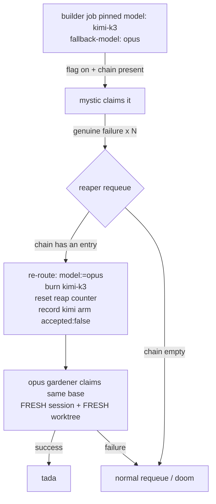

# Design: route opus work to kimi-k3 for evaluation, with automatic opus fallback

| Status | Proposed |
| Job | `kimi-k3-takes-opus-work-with-opus-fallback` |

Maintainer directive (2026-07-28): *"I would like kimi k3 to start taking work
away from claude opus, for evaluation, with the option of retrying with opus if
kimi fails."*

The work opus does exclusively is exactly the work kimi is currently barred
from, so satisfying the directive requires **lifting a deliberate safety
boundary**. The directive itself supplies the mitigation that makes the lift
acceptable: an **automatic opus retry on failure**. This design builds them as
one unit, in the mandatory order — **the fallback ships and is demonstrated
before the bar is relaxed** — and lands the relaxation **data-gated off by
default**, so the code is inert until a maintainer flips one journal flag.

---

## The blocking tension

Two deterministic predicates make the intersection of "opus work" and
"kimi-claimable work" empty:

- `role_default_model` (`common.sh`) resolves **only `designer` and `builder`**
  to opus (`resolve_model_tier anthropic opus` → `claude-opus-4-8`). Every other
  role rides the fleet default. So opus's *exclusive* work is design + build.
- `job_eligible_for_kind` (`claim-job.sh`) bars a `moonshot` worker from any
  `designer`/`builder` job even when the job pins `model: kimi-k3`:

  ```bash
  case "$role" in
    designer|builder) return 1 ;;   # explicit K3 is not a high-stakes route
  esac
  ```

Kimi therefore cannot take *any* work away from opus as configured. The
resolution is a **graduated, fallback-gated relaxation** of that bar.

---

## Decision

1. **A per-instance journal flag `config/kimi-takes-opus-work` (default `off`)**
   is the single reversible enablement. While it is `off` nothing changes —
   landing this code is a no-op. `scripts/jobs/set-kimi-fallback.sh on|off`
   writes it; `kimi_fallback_enabled` (`common.sh`) reads it from any already-synced
   clone, mirroring the model-routing override read path.

2. **Graduated eligibility.** When the flag is `on`, a `mystic` may claim a
   `role: builder` job pinned `model: kimi-k3` **iff** the job carries a
   non-empty `fallback-model:` chain (the safety net is *mechanically required*
   before the bar lifts). **`designer` stays barred** in phase 1 — see *Why
   builder first*.

3. **On failure, re-route rather than merely requeue.** The reaper — already the
   single writer of the requeue and the doom counter — advances a failed kimi
   job's `model:` pin to the head of its `fallback-model:` chain, so an opus
   gardener claims the *same base* next. This is the fallback that does not exist
   today (§ *The fallback and requeue*).

4. **One hop, never a cycle.** A burned model moves to `model-burned:`; the chain
   is finite; a re-routed job is now opus-pinned and a mystic can no longer claim
   it. Bounded by construction.

5. **The fallback's opus run counts against kimi's record**, so the evaluation
   does not lie (§ *Evaluation*).



---

## The enablement flag (and the kill switch)

`config/kimi-takes-opus-work` holds `on` or `off` (absent ⇒ `off`). It is
per-instance journal state, read fail-safe: an unreadable/absent flag reads as
`off`, so a missing file never opens the claim path.

**Turning it off fast — two levers, no code edit:**

- **Finer (leaves the canary working):** `set-kimi-fallback.sh off` — a one-line
  journal write. `job_eligible_for_kind` immediately bars mystic builder claims
  again; already-claimed jobs finish, and any in-flight `fallback-model:` chain
  still re-routes to opus on failure (the safety net never disarms mid-flight).
- **Blunt (stops all kimi):** `scripts/jobs/set-mystics.sh 0` — scales the mystic
  pool to zero; no kimi worker claims anything. This is also the ship-disabled
  default state.

Both are journal-state changes the liaison can make in one command.

---

## Why builder first (the graduation)

A relaxation should widen along the axis with the strongest *automatic* safety
net. A bad **build** is caught by objective gates that run without a human: CI,
`local-verify`, and the panel gauntlet the build's draft PR auto-runs
(`gardening-state-machine.md`, `auto-gauntlet-handoff.sh`). A bad **design** is
subtle prose whose only real gate is human review, arriving hours-to-days later
with a far larger blast radius (every downstream builder implements from it).
Builder is therefore the safe evaluation surface; designer is deferred to a
later phase once builder data exists. Work-class size is *not* used to graduate
in phase 1 (a small builder job is as safe as a large one — same gates); the
per-job `fallback-model:` requirement is the finer control.

---

## The fallback and requeue

### What counts as "fails"

The reaper classifies a non-completing claim through the existing machinery; the
re-route reuses it rather than inventing a parallel notion of failure:

| Failure mode | Existing signal | Counts toward re-route? |
| --- | --- | --- |
| handler non-zero / crash | reap-count increments | yes |
| deadline overrun (rc=124 at the wall) | `garden-deadline-overrun` | yes |
| exit-0-unsatisfying (quota cut, swallowed API error, unfinished) | reap-now hint, reap-count increments | yes |
| provider unavailable / quota storm | **outage-cycle hint** (fleet brake engaged) | **no** — held, environmental, not kimi's fault |
| productive treadmill (HEAD advanced) | **productive-cycle hint** | **no** — count reset to 0, kimi is working |
| completed but bad (panel reject / CI red / fix-loop stalls) | *no board edge exists today* | **phase 2** (§ Open questions) |

So the re-route fires on a **genuine, non-environmental failure** — exactly the
cycles the reaper already increments the doom counter on — once the count
reaches `GARDEN_KIMI_FALLBACK_AFTER` (default `1`: fall back on the first genuine
failure; the outage/productive exemptions already keep transients and progress
from counting). The knob lets an operator give kimi more attempts before the hop.

The last row is the most valuable for evaluation and the hardest: a builder that
returns a plausible-but-wrong diff. Today **no board state represents a
completed-but-rejected build** — the panel's fixer loop either converges to
`pass` or `panel.sh` exits loud/non-zero to its supervising gardener, and
nothing records "this build was bad." Wiring a panel rejection into a fallback
trigger is a genuine new edge, designed but deferred to phase 2 (§ Open
questions) because it depends on a signal that does not yet exist.

### How the re-route is expressed

Three headers in the job's leading frontmatter, all surviving `clean_body`'s
basename-preserving requeue (it strips only the trailing claim block and
markers, never frontmatter):

- `model:` — the live pin the workers race on (`kimi-k3` initially).
- `fallback-model:` — an **ordered, comma-separated chain** of fallbacks
  (`opus`, or `opus,sonnet`). Its head is the next provider.
- `model-burned:` — comma-separated audit of already-tried models; also the
  ping-pong bound.

`reroute_job_model` (`common.sh`) is a pure body transform: if `model:` is a
burnable pin and `fallback-model:` is non-empty, it sets `model:` to the chain
head, pops that head, and appends the old model to `model-burned:`. The reaper
calls it in the requeue branch; when it re-routes it **resets the reap counter
to 0** (a fresh provider earns a fresh doom budget) and logs the hop. Rewriting
`model:` (rather than a side header) is deliberate: it is the one value
`job_eligible_for_kind`, the handlers, and `rep_resolve_arm` all already read, so
a re-routed job needs no new consumer — the opus gardener claims it because
`model: opus` now classifies anthropic, and the mystic can no longer claim it
because `model:` is no longer `kimi-k3`.

### Session and worktree continuity (the correctness crux)

The fallback must start opus **fresh**, never resuming kimi's session or
inheriting kimi's worktree. This is correct **by construction** with the current
handlers, and the design depends on that:

- **Fresh session.** `gardener-claude.sh` sets `$resuming` only when a *Claude*
  transcript exists at `~/.claude/projects/<encoded-worktree>/<sid>.jsonl`. Kimi
  runs through `mystic-kimi.sh`, which writes its session under a private
  `KIMI_CODE_HOME`, never a Claude transcript. So on opus's first claim of a
  re-routed base, `$resuming=false` and opus starts a **fresh** session
  (`--session-id`, not `--resume`). A *kimi* transcript is not resumable by opus,
  and this is precisely why opus never tries.
- **Fresh worktree.** The per-job worktree path is stable per base, so kimi's
  leftover tree sits at the path opus will use. `worker_ensure_worktree(...,
  resuming=false)` `scratch_cleanup`s and recreates it off `origin/main2`, so
  opus gets a **clean** checkout — kimi's alien uncommitted edits are discarded.
- **Opus resumes its *own* work.** After the hop, if opus itself dies and
  requeues, opus's Claude transcript now exists → `$resuming=true` → opus resumes
  its own session and worktree across *its* requeues. Exactly right.

This means the fallback needs **zero** new session-handling code; it needs only
to not break the invariant. The test asserts opus runs fresh (a `--session-id`,
not a `--resume`).

### The ping-pong bound

One hop, not a cycle: the chain is finite, each hop pops one entry into
`model-burned:`, and once `model:` is opus a mystic is ineligible. When the chain
empties, the job requeues normally and dooms at the usual threshold if opus
also fails — bounded total attempts (kimi's budget + opus's budget), never
infinite, never back to kimi.

---

## Evaluation

Evaluation is the *point*, and today the garden cannot evaluate anything: all
reputation events carry `agentic_dollars: censored` and every arm sits at
`attempts: 0`, because the token-cost ledger is unwired. Open job
`build-token-cost-ledger` is the head of that chain and is a **hard prerequisite
for cost-based comparison**; this design depends on it and does not duplicate it.

**The comparison surface already exists.** Arms are keyed
`<kind>/<provider>/<model>/<thoughtfulness>/<work_class>@<target>`
(`reputation.sh`), so kimi vs opus on the same work class is directly
expressible once arms populate:

- kimi: `mystic/moonshot/kimi-k3/<tht>/build:<size>@<target>`
- opus: `gardener/anthropic/claude-opus-4-8/<tht>/build:<size>@<target>`

**Success metric (define up front, not cost alone).** Rank a work class by
**acceptance rate first, aggregate dollars second.** A cheaper model that fails
half its builder jobs and falls back to opus is *more* expensive in total, so:

- **The fallback's failure is charged to kimi.** On a re-route the reaper emits a
  reputation event for the **kimi arm** with `accepted: false`, `attempts` = the
  kimi cycles burned, keyed to `moonshot/kimi-k3`. Kimi's acceptance rate then
  reflects fallbacks *as failures*; without this the arm never sees the attempt
  and the evaluation lies. (Dollars stay `censored` until `build-token-cost-ledger`
  lands; the acceptance half works immediately.)
- **The fallback's opus cost is additional total spend**, recorded on the opus
  arm's own completion event. So "kimi + the opus runs it triggered" is strictly
  costlier than "opus alone" whenever kimi fails — the arm math penalizes a
  low-quality-cheap model automatically.

Coordinate with `investigate-opencode-alternate-harness`, which raises whether
**harness** should become an explicit arm dimension — the same arm-keying question
this evaluation rides on.

---

## Operational scope

- **Pool.** The mystic pool is `1` on this host and moonshot auth is verified
  (2026-07-25 canary passed with real tool use). Keep it at **1** to start —
  bounded, reversible, per the kimi-k3 precedent. Grow only after the first
  builder arms show kimi completing without a runaway fallback rate.
- **Initial share.** Phase 1 is **opt-in per job**, not a blanket auto-flip: the
  liaison/maintainer points specific builder jobs at kimi by posting them with
  `model: kimi-k3` + `fallback-model: opus`. That is a naturally bounded slice
  (you choose how many), which is the right first dose. An automatic *fraction*
  of builder jobs stamped at post time is phase 2 (§ Open questions), where the
  recommended opening share is **~10–20 % of builder jobs**, tunable by a single
  journal knob.
- **Turn it off fast:** `set-kimi-fallback.sh off` (finer) or `set-mystics.sh 0`
  (blunt) — both journal-state, no code edit (§ The kill switch).

---

## Phasing

- **Phase 1 (this change):** the flag + kill switch; graduated builder-only,
  fallback-required eligibility; the reaper re-route for handler-failure /
  deadline / exit-0-unsatisfying; the kimi-arm failure attribution; a test that
  demonstrates a deliberately-failed kimi job re-running on opus fresh, once.
- **Phase 2 (follow-up build):** a "completed-but-bad" board edge so a panel
  rejection / non-converging fix-loop triggers a fallback; auto-stamping a tunable
  *share* of builder jobs at post time; extending the graduation to `designer`
  once builder arms justify it. Cost-ranking waits on `build-token-cost-ledger`.

---

## Open questions

- Should `GARDEN_KIMI_FALLBACK_AFTER` default to `1` (fall back on the first
  genuine failure — conserves the doom budget, fastest evaluation signal) or
  `2` (give kimi one free non-outage transient — e.g. a lone host death — before
  the hop)? Phase 1 ships `1`; revisit once real failure-mode data exists.
- What is the exact "completed-but-bad" signal for phase 2 — a committed
  `reputation/verdicts/<base>` with `accepted: false` written by the panel on a
  non-converging fix-loop, consumed as a fallback trigger? The verdicts override
  already exists in `complete-job.sh`; the panel does not write it today.
- Should designer graduate at all, or should kimi-on-design remain permanently
  barred given the weak automatic gate on design quality?
- When auto-stamping a share (phase 2), does the share apply before or after the
  auction's arm selection, so the market's own exploration is not double-counted
  against the fixed share?

---

## Test plan

`scripts/jobs/test/kimi-opus-fallback-test.sh` (new), in the standalone
`*-test.sh` idiom:

1. **Eligibility, flag off:** a `builder` job pinned `model: kimi-k3` +
   `fallback-model: opus` is **left in todo** by a mystic (bar intact).
2. **Eligibility, flag on:** the same job is **claimed** by a mystic; the same
   job with **no** `fallback-model:` is **left** (safety net required); a
   `designer` kimi job is **left** (graduation).
3. **Re-route:** a stale kimi-pinned claim carrying `fallback-model: opus`, run
   through the reaper, is requeued to todo with `model: opus`,
   `model-burned: kimi-k3`, an empty chain, and reap counter reset — then a
   `gardener` (not a mystic) claims it, and its handler is launched with
   `--session-id` (fresh), never `--resume`.
4. **Bound:** the re-routed opus job, failing again, requeues normally (no second
   hop back to kimi) and dooms at the usual threshold.
5. **Evaluation honesty:** the re-route wrote a `reputation/events/*` entry for
   the `moonshot/kimi-k3` arm with `accepted: false`.
