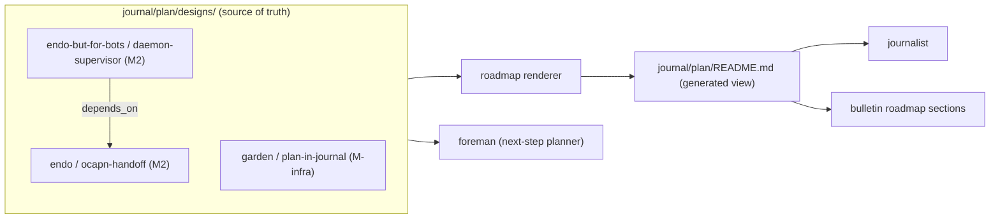
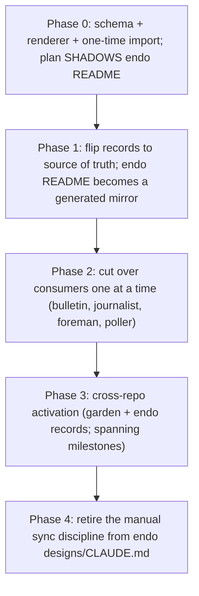

# design(plan-in-journal): the plan as cross-repo garden journal state

| Created | 2026-06-24 |
| Author  | designer (gardener fleet) |
| Status  | Proposed   |

## Summary

Move the **plan** (the roadmap: milestones, the design index, statuses, estimates,
dependency edges, target dates) out of the single endo fork and into the garden's
own `journal2` state, re-architect it to span **multiple repositories**, and replace
the hand-enforced README synchronization discipline with **idiomatic garden
automation** (job board jobs plus systemd services that reuse the bulletin loop's
machinery). The plan becomes garden-level state because the garden now operates at
garden scope, not endo scope.

The core move is a separation the current arrangement conflates: **design narrative**
(the prose of a design, repo-coupled) stays in its home repository, while the
**plan** (small structured metadata: status, size, dependencies, milestone, target
date, repository) becomes garden journal state with a **generated** roadmap view. One
source of truth (the metadata records), one recomputed view, no manual sync.

## Problem

Today the plan lives at `designs/README.md` on the `endojs/endo-but-for-bots:llm`
branch: a hand-maintained table of roughly 104 designs (a status enum, six
milestones M0 through M6 with exit criteria and target dates, a Mermaid dependency
graph, and a velocity-calibrated S/M/L/XL estimate table). The process that keeps it
correct is documented in the endo `designs/CLAUDE.md`: every modification to any
design (especially its metadata) must be reflected by hand in the README summary
table, the milestone totals, the dependency graph, and the estimates. Three problems
follow:

1. **Single-repo residence.** A garden-level milestone cannot span repositories. The
   table, the subsystem prefixes (`daemon-`, `chat-`, `ocapn-`, ...), and the
   milestone narratives are all endo-specific, so work the garden does in the garden
   repo itself or in `endojs/endo` has no place on the plan.
2. **Manual synchronization is brittle.** The sync discipline is the human-enforced
   core: a metadata edit that forgets to update the table, the totals, the graph, or
   the estimates silently desynchronizes the plan from reality. This is exactly the
   kind of mechanical bookkeeping the garden's job-board automation exists to take
   over.
3. **Garden infrastructure is coupled to one fork's branch.** The journalist, the
   bulletin's roadmap sections, the foreman, and the prior design-poller all read an
   endo-resident file on the `llm` branch. The garden's own coordination layer should
   read garden-local state, not reach into a fork to learn its own roadmap.

## What is generalizable, what is endo-specific

Reusing the synthesis the liaison already performed: the **endo-specific** parts are
the `llm` branch, the package layout, the subsystem prefixes, and the endo
technology in the milestone narratives. The **generalizable** parts (which this
design lifts to garden scope) are the metadata format, the status enum, the
dependency-graph concept, the velocity-calibrated estimate model, milestone binning
by exit criterion, and the synchronization discipline itself. The plan carries the
generalizable parts; the narrative keeps the endo-specific parts in endo.

## Proposed representation: the plan as `journal/plan/` state

The plan lives under a new `journal/plan/` tree on the `journal2` branch, alongside
the existing `jobs/`, `inbox/`, `repos/`, and `projects/` state. The **per-design
metadata records are the source of truth**; the rendered roadmap is generated and
must not be hand-edited.

```
journal/plan/
  designs/<repo-slug>/<design-slug>.md   one metadata record per design (frontmatter + a pointer to the narrative)
  milestones/<id>.md                     milestone definition: exit criteria, target date, members
  velocity.md                            observed PR-merge velocity inputs and the S/M/L/XL day-mapping
  README.md                              GENERATED roadmap view (table + dep graph + estimates); do not hand-edit
```

A design metadata record is small and merge-friendly (one file per design, so two
gardeners editing different designs never collide on the board):

```yaml
---
slug: daemon-supervisor
repository: endojs/endo-but-for-bots
narrative: designs/daemon-supervisor.md@llm   # repo-relative path @ branch, or a URL, where the prose lives
status: in-progress                            # the v1 enum, carried verbatim
size: M                                        # S | M | L | XL
milestone: M2
depends_on: [daemon-vat, ocapn-handoff]        # design slugs, resolved across all repos
pr: endojs/endo-but-for-bots#246               # the implementing PR(s) when known
target: 2026-07-15                             # optional explicit target; otherwise projected
created: 2026-06-01
updated: 2026-06-24
---

One-paragraph plan-side note (why this design sits where it does in the
sequence). NOT the narrative; the narrative lives at the `narrative:` pointer.
```

The narrative pointer is the decoupling hinge. **Design narrative stays in its home
repository:** endo keeps its `designs/` prose for endo designs, the garden keeps its
own `designs/` for garden meta-designs (this document among them), and a record's
`narrative:` field names where to fetch the prose on demand. Narrative is heavy,
repo-coupled, and best reviewed in a PR in its home repo; the plan is light,
cross-cutting, and best computed. Moving narrative into the journal would drag the
endo subsystem coupling into garden state for no benefit, so the proposal keeps it
home (see Open questions for the alternative).

The status enum is carried verbatim from v1: Not Started, Proposed, In Progress,
Draft, Complete (Implemented), Active, Reference, Deprecated, Superseded.

## Cross-repository model

The `repository` field on every record is the new dimension. A garden-level milestone
binds designs by membership regardless of which repo each lives in, so one milestone
can span the garden repo, `endojs/endo`, and `endojs/endo-but-for-bots` at once.

- **Dependency edges cross repos.** `depends_on` lists design slugs; the renderer
  resolves each slug to its record across the whole record set, so an edge from an
  endo-but-for-bots design to an endo design is just two records and one edge. Slugs
  are unique across the plan (the validator enforces uniqueness).
- **Aggregate computation is over the union.** Milestone totals, completion
  percentage, estimate rollups, and the critical path are computed across all records,
  not per repo. The critical path follows `depends_on` across repo boundaries.
- **Referencing a foreign-repo design** is the `narrative:` pointer: a reader or the
  foreman fetches `repo-path@branch` on demand rather than the plan duplicating prose.
- **Scope is bounded.** The allowed `repository` set is the repositories the garden
  actively develops: the garden itself, `endojs/endo`, `endojs/endo-but-for-bots`, and
  others the maintainer adds. **`agoric-sdk` is excluded unconditionally** ("we must
  not and cannot do anything for agoric-sdk"): the validator rejects a record whose
  `repository` is `Agoric/agoric-sdk`, and the renderer never emits an agoric-sdk row.



## The process as garden automation

The endo `designs/CLAUDE.md` process maps onto garden machinery one step at a time.
The renderer reuses the **bulletin loop's** proven shape (`scripts/jobs/bulletin.sh`):
a durable cursor over `origin/journal2`, a deterministic recompute, a change-gated
CAS push, and multi-host idempotence. The plan view is exactly the kind of
journal-local rendered artifact the bulletin loop already produces, so the renderer is
a sibling service (or, see Open questions, folded into the bulletin loop itself), not
a new mechanism.

| `designs/CLAUDE.md` process step | Garden mechanism |
|---|---|
| Per-doc metadata table required on every design | **Plan validator** (a pre-push gate plus a job posted on plan change): validates each record's frontmatter against the schema, rejects missing or unknown fields, rejects an unknown status, and rejects `agoric-sdk`. Reuses [`skills/pre-push-gates`](../skills/pre-push-gates/SKILL.md). |
| Sync every metadata edit into the README table | **Roadmap renderer** service (`garden-roadmap-renderer`, modeled on `bulletin.sh`): regenerates `journal/plan/README.md` from the records whenever the plan changes. This replaces the manual sync; the view is recomputed, never hand-edited. |
| Milestone totals and exit criteria | Renderer aggregates membership and totals; a milestone-rollup step recomputes per-milestone size totals and completion percentage. |
| Dependency graph | Renderer emits the Mermaid graph; a cycle-and-dangling-edge check runs via [`skills/dependency-graph-maintenance`](../skills/dependency-graph-maintenance/SKILL.md) and surfaces a violation as a maintainer note rather than a silent bad graph. |
| Velocity-calibrated estimates | **Velocity recalibration** ([`skills/velocity-recalibration`](../skills/velocity-recalibration/SKILL.md)) observes merged-PR cadence from board `tada` completions plus GitHub merge timestamps, recomputes the S/M/L/XL day-mapping into `velocity.md`, and **roadmap projection** ([`skills/roadmap-projection`](../skills/roadmap-projection/SKILL.md)) reprojects milestone target dates, keeping review-queue latency a first-class timeline input. |
| Status drift (record says Complete, PR unmerged, or the reverse) | **Plan reconciliation** job: a gardener job that compares each record's `status`/`pr` against actual PR and board state, then flips the status with an audit `entry` or posts a reconcile job. The proxy and foreman already observe completions; reconciliation consumes the same signal. |
| Design lifecycle (proposal to complete) | Board-event-driven transitions: a design PR opening sets Proposed or Draft; a merge sets Complete; reconciliation advances the record. The lifecycle is data the automation reconciles, not a human checklist. |

### Connection to the in-flight machinery

This proposal is coherent with the services landed in this session only if each plan
consumer is re-pointed at the journal-local plan. The cutover points:

- **journalist** ([`roles/journalist`](../roles/journalist/AGENT.md)) bins PRs into
  milestones for the bulletin. Today it reads the endo `designs/README.md` Per-Design
  Estimates table. **Cutover:** it bins against `journal/plan/` (the records plus the
  generated view), which removes its cross-repo fetch of the `llm` branch and lets it
  bin work from any plan repo.
- **bulletin roadmap sections** (`scripts/jobs/bulletin.sh`) render milestone-binned
  sections. **Cutover:** render from `journal/plan/README.md`, which is already
  journal-local, so the bulletin stops reaching into a fork for its own roadmap.
- **foreman** ([`roles/foreman`](../roles/foreman/AGENT.md), `scripts/jobs/foreman.sh`)
  is the idle-pump that posts the next unblocked step of the current in-progress
  milestone. Today it reads `designs/README.md` on `llm` to find the current milestone
  and next step. **Cutover:** read `journal/plan/milestones/` and the records, pick the
  current milestone and the next unblocked step from the journal-local plan and the
  `depends_on` edges. The foreman gains cross-repo sequencing for free and loses its
  fork fetch.
- **design-poller / design-to-pr-pipeline** walked the `llm` roadmap branch for
  designs ready to build. **Cutover:** the readiness query becomes a plan query: a
  record with status Proposed or Accepted and an unblocked `depends_on` set is
  ready-to-build. The poller (or the foreman) reads the records; the cross-repo edge
  resolution is the same machinery the renderer uses.

## Migration path

Incremental, with a named cutover point per consumer so the journalist, the bulletin,
and the foreman keep working mid-flight. Until a consumer is cut over it keeps reading
the endo file, which Phase 1 keeps mirrored, so nothing breaks.



- **Phase 0: schema, renderer, shadow import.** Land the `journal/plan/` schema, the
  validator, and the renderer. A one-time import reads the current
  `endojs/endo-but-for-bots:llm designs/README.md` table into per-design records. The
  generated `journal/plan/README.md` is diffed against the live endo table for
  fidelity. The endo file stays the live source; the journal plan is a shadow.
- **Phase 1: flip source of truth.** Once the shadow renders faithfully, declare the
  records the source of truth. Keep generating a copy of the table back into the endo
  `designs/README.md` (a mirror) so any human still reading there sees the current
  plan and a redirect note.
- **Phase 2: cut over consumers, one at a time.** Order by risk, lowest first:
  1. **bulletin** (read-only, already journal-local): point its roadmap sections at
     `journal/plan/README.md`.
  2. **journalist**: bin against the records.
  3. **foreman**: read `journal/plan/milestones/` and the records.
  4. **design-poller**: query records for ready-to-build.
  Each consumer's cutover is one commit; until it lands, that consumer reads the
  mirrored endo file.
- **Phase 3: cross-repo activation.** Add records for garden-itself designs and endo
  designs; let milestones span repos; turn on cross-repo critical-path computation;
  confirm the agoric-sdk exclusion in the validator.
- **Phase 4: retire the manual discipline.** Replace the synchronization section of
  the endo `designs/CLAUDE.md` with a pointer to `journal/plan/` and the renderer. Endo
  `designs/` keeps only narrative plus each doc's own metadata, which the record's
  `narrative:` pointer references. The Phase 1 mirror can then stop or remain as a
  courtesy redirect (Open questions).

## Open questions

- Should design narrative ever move into the journal, or always stay in its home
  repository? Proposal: stays home (the plan carries metadata, the repo carries prose).
- Source-of-truth granularity: per-design record files (proposed, for board
  merge-friendliness) versus one structured plan file. Which does the maintainer
  prefer?
- Who owns the Complete transition: the reconciler flipping it automatically on a
  detected merge, or a maintainer gate before a design is marked Complete?
- Is the roadmap renderer a standalone service (`garden-roadmap-renderer`), or should
  plan rendering fold into the existing `garden-bulletin.service` loop, which already
  regenerates journal-local rendered state on every board change?
- Does the Phase 1 endo `designs/README.md` mirror stay indefinitely as a redirect, or
  get removed in a later phase?
- Does review-queue latency stay a single first-class timeline input, or does it need
  to be per-repo once milestones span repos with different review velocities?
- Where do the new metadata field names settle: is `narrative` the right name for the
  prose pointer, and should `repository` carry the full `owner/name` or a short slug
  the validator expands?
