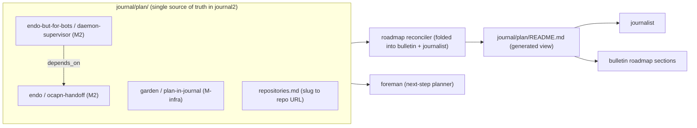
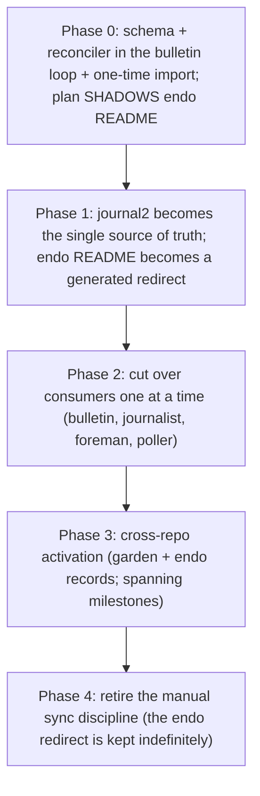

# design(plan-in-journal): the plan as cross-repo garden journal state

| Created  | 2026-06-24 |
| Revised  | 2026-06-25 |
| Author   | designer (gardener fleet) |
| Status   | Proposed   |

## Summary

Move the **plan** (the roadmap: milestones, the design index, statuses, estimates,
dependency edges, target dates) out of the single endo fork and **fully** into the
garden's own `journal2` state, re-architect it to span **multiple repositories**, and
replace the hand-enforced README synchronization discipline with **idiomatic garden
automation** (a reconciler that rides on the existing bulletin generator and
journalist loops over journal2). The plan becomes garden-level state because the
garden now operates at garden scope, not endo scope.

The plan lives in one place. Both the **plan metadata** (status, size, dependencies,
milestone, target date, repository) and the **design narrative** (the prose of each
design) move into `journal2`. The maintainer's directive is to move it all into the
journal to avoid a coordination problem: keeping metadata in journal state while the
narrative lived on per-repo fork branches meant two homes that had to be kept in
sync across repositories. One home, one source of truth, one recomputed view, no
manual sync.

## Problem

Today the plan lives at `designs/README.md` on the `endojs/endo-but-for-bots:llm`
branch: a hand-maintained table of roughly 104 designs (a status enum, six
milestones M0 through M6 with exit criteria and target dates, a Mermaid dependency
graph, and a velocity-calibrated S/M/L/XL estimate table). The process that keeps it
correct is documented in the endo `designs/CLAUDE.md`: every modification to any
design (especially its metadata) must be reflected by hand in the README summary
table, the milestone totals, the dependency graph, and the estimates. Three problems
follow:

1. **Single-repo residence.** A garden-level milestone cannot span repositories. The
   table, the subsystem prefixes (`daemon-`, `chat-`, `ocapn-`, and so on), and the
   milestone narratives are all endo-specific, so work the garden does in the garden
   repo itself or in `endojs/endo` has no place on the plan.
2. **Manual synchronization is brittle.** The sync discipline is the human-enforced
   core: a metadata edit that forgets to update the table, the totals, the graph, or
   the estimates silently desynchronizes the plan from reality. This is exactly the
   kind of mechanical bookkeeping the garden's job-board automation exists to take
   over.
3. **Garden infrastructure is coupled to one fork's branch.** The journalist, the
   bulletin's roadmap sections, the foreman, and the prior design-poller all read an
   endo-resident file on the `llm` branch. The garden's own coordination layer should
   read garden-local state, not reach into a fork to learn its own roadmap.

## What is generalizable, what is endo-specific

Reusing the synthesis the liaison already performed: the **endo-specific** parts are
the `llm` branch, the package layout, the subsystem prefixes, and the endo
technology in the milestone narratives. The **generalizable** parts (which this
design lifts to garden scope) are the metadata format, the status enum, the
dependency-graph concept, the velocity-calibrated estimate model, milestone binning
by exit criterion, and the synchronization discipline itself. The plan carries the
generalizable parts. The endo-specific subsystem prefixes survive only as slugs on
the records that target endo, not as structure the garden imposes everywhere.

## Proposed representation: the plan as `journal/plan/` state

The plan lives under a new `journal/plan/` tree on the `journal2` branch, alongside
the existing `jobs/`, `inbox/`, `repos/`, and `projects/` state. The **journal is the
single source of truth**, and within the journal **the per-design files are the
authoritative unit**: each `designs/<repository-slug>/<design-slug>.md` is the source
of truth for both its metadata (frontmatter) and its narrative (prose). The roadmap —
the milestone table, the dependency graph, the estimate rollups — is an
**aggregation** of those per-design files: generated, never hand-edited, and never a
second source of truth. There is no authoritative per-repo copy of any part of the
plan. Edit a design by editing its file; the aggregate roadmap recomputes from it.

```
journal/plan/
  repositories.md                             the repository-slug to repository-URL mapping (see Cross-repository model)
  designs/<repository-slug>/<design-slug>.md  one record per design: metadata frontmatter + the design narrative below it (the source of truth)
  milestones/<id>.md                          milestone definition: exit criteria, target date, members
  velocity.md                                 observed PR-merge velocity inputs and the S/M/L/XL day-mapping
  README.md                                   GENERATED roadmap view, AGGREGATED from the per-design files (table + dep graph + estimates); do not hand-edit
```

A design record is small in metadata and self-contained: the frontmatter is the
merge-friendly part (one file per design, so two gardeners editing different designs
never collide on the board), and the narrative prose lives in the body of the same
file, in the journal, not on a fork branch.

```yaml
---
slug: daemon-supervisor
repository: endo-but-for-bots                   # repository slug; repositories.md maps it to a repository URL
status: in-progress                            # the v1 enum, carried verbatim
size: M                                         # S | M | L | XL
milestone: M2
depends_on: [daemon-vat, ocapn-handoff]        # design slugs, resolved across all repositories
pr: endo-but-for-bots#246                       # the implementing PR(s) when known, by repository slug
target: 2026-07-15                             # optional explicit target; otherwise projected
created: 2026-06-01
updated: 2026-06-24
---

The full design narrative lives here, in the journal. This is the prose that used to
live on a fork's `designs/` branch. It moves into journal2 so the plan has a single
home and there is no per-repo copy to keep in sync.
```

Moving the narrative into the journal is the coordination-avoiding move the
maintainer directed. The earlier draft kept narrative in each home repository and
referenced it by a pointer, on the theory that prose is repo-coupled and heavy. In
practice that split created the coordination problem this design exists to remove: a
metadata edit in journal2 and a narrative edit on a fork branch are two writes in two
repositories that must agree. With both in journal2, a single record (frontmatter
plus prose) is one merge-friendly file, reviewed in one place, with one source of
truth. The endo subsystem coupling that the prose carries is just text in a journal
file; it does not constrain garden state.

The status enum is carried verbatim from v1: Not Started, Proposed, In Progress,
Draft, Complete (Implemented), Active, Reference, Deprecated, Superseded.

## Cross-repository model

The garden develops in several repositories. Each design **targets** exactly one
**repository** (the field is named `repository` for that reason — a design lands in a
specific repository), while every part of the plan itself (records, narrative,
milestones, the generated view) lives in journal2. A **project** is a higher-level
effort that may **span multiple repositories**; spanning is expressed through
milestone membership and `depends_on` edges that cross repository boundaries, not
through the per-design field, which always names a single repository.

- **Each design names one repository by a short slug.** The `repository` field is a
  short kebab-case slug (`endo-but-for-bots`, `garden`, `endo`). Slugs are
  deliberately lightweight and adaptable: a kebab-case variation can be introduced
  later without a schema migration.
- **`repositories.md` maps slug to repository URL.** A single mapping file records,
  for each repository slug, the repository URL it names. The plan tracks **repository
  URLs**, not GitHub `owner/name` pairs, so the model stays open to **repositories
  that are not on GitHub** (a self-hosted git remote, a non-GitHub forge). Nothing in
  the record schema or the renderer assumes a GitHub host. Where a GitHub-specific
  affordance is needed (PR links, merge detection), it keys off the resolved URL
  being a GitHub URL rather than assuming it for every repository.
- **Dependency edges cross repositories.** `depends_on` lists design slugs; the
  renderer resolves each slug to its record across the whole record set, so an edge
  from an endo-but-for-bots design to an endo design is just two records and one edge.
  This is how a multi-repository project is stitched together. Slugs are unique across
  the plan (the validator enforces uniqueness).
- **Aggregate computation is over the union.** Milestone totals, completion
  percentage, estimate rollups, and the critical path are computed across all records,
  not per repository. The critical path follows `depends_on` across repository
  boundaries, so a milestone or project spanning several repositories rolls up as one.
- **Scope is bounded.** The allowed repository set is the ones the garden actively
  develops: the garden itself, `endojs/endo`, `endojs/endo-but-for-bots`, and others
  the maintainer adds to `repositories.md`. **`agoric-sdk` is excluded
  unconditionally** ("we must not and cannot do anything for agoric-sdk"): the
  validator rejects a record whose `repository` resolves to the agoric-sdk repository,
  and the renderer never emits an agoric-sdk row.



## The process as garden automation

The endo `designs/CLAUDE.md` process maps onto garden machinery one step at a time.
There is **no new plan-updating role and no new standalone service**. Per the
maintainer's directive, plan reconciliation and rendering **consolidate into the
bulletin generator** (`scripts/jobs/bulletin.sh`) and the **journalist**, which
already run continuously over `journal2`. The bulletin loop's shape is exactly right
for this: a durable cursor over `origin/journal2`, a deterministic recompute, a
change-gated CAS push, and multi-host idempotence. The plan view is one more
journal-local rendered artifact that loop produces, and keeping the plan current is
one more reconciliation it performs.

**Reconciliation is continuous and not maintainer-gated.** It runs on every bulletin
and journalist pass, the same as the rest of those loops; the maintainer does not
approve plan updates and no transition waits on a gate. In particular the **Complete
flip is automatic**: when the reconciler detects a design PR's merge it advances the
record to Complete on its own, with an audit `entry`, rather than holding it for
maintainer confirmation. The plan tracks reality as fast as the loops observe it.

**Weekly recalibration and grooming (Sunday evenings).** On top of the per-pass
reconciliation, a weekly scheduled task runs **Sunday evenings** via the
[`schedule`](../skills/schedule/SKILL.md) skill (`set-schedule.sh`, dispatched by the
sole `garden-scheduler`): it recalibrates velocity from the week's merged-PR cadence
([`skills/velocity-recalibration`](../skills/velocity-recalibration/SKILL.md)),
reprojects milestone target dates
([`skills/roadmap-projection`](../skills/roadmap-projection/SKILL.md)), and grooms the
plan's open questions and stale records
([`skills/groom-open-questions`](../skills/groom-open-questions/SKILL.md)). The
continuous reconciler keeps status and the view honest moment to moment; the weekly
pass is the slower cadence at which estimates, projections, and grooming are
refreshed.

| `designs/CLAUDE.md` process step | Garden mechanism |
|---|---|
| Per-doc metadata table required on every design | **Plan validator** (a pre-push gate plus a job posted on plan change): validates each record's frontmatter against the schema, rejects missing or unknown fields, rejects an unknown status, enforces slug uniqueness, and rejects a record whose `repository` resolves to agoric-sdk. Reuses [`skills/pre-push-gates`](../skills/pre-push-gates/SKILL.md). |
| Sync every metadata edit into the README table | **Reconciler in the bulletin generator**: the bulletin loop regenerates `journal/plan/README.md` from the records whenever the plan changes. This replaces the manual sync; the view is recomputed, never hand-edited. No separate `garden-roadmap-renderer` service is introduced. |
| Milestone totals and exit criteria | The reconciler aggregates membership and totals; a milestone-rollup step recomputes per-milestone size totals and completion percentage. |
| Dependency graph | The reconciler emits the Mermaid graph; a cycle-and-dangling-edge check runs via [`skills/dependency-graph-maintenance`](../skills/dependency-graph-maintenance/SKILL.md) and surfaces a violation as a maintainer note rather than a silent bad graph. |
| Velocity-calibrated estimates | **Velocity recalibration** ([`skills/velocity-recalibration`](../skills/velocity-recalibration/SKILL.md)) observes merged-PR cadence from board `tada` completions plus merge timestamps, recomputes the S/M/L/XL day-mapping into `velocity.md`, and **roadmap projection** ([`skills/roadmap-projection`](../skills/roadmap-projection/SKILL.md)) reprojects milestone target dates. **Review-queue latency is a single garden-wide timeline input**, not per-repository: one latency figure feeds every projection regardless of which repository a milestone's designs target. |
| Status drift (record says Complete, PR unmerged, or the reverse) | **The reconciler takes responsibility for updating the plan.** Riding on the bulletin and journalist loops (which already observe completions), it compares each record's `status` and `pr` against actual PR and board state and advances the status, with an audit `entry`. Design authors do not hand-sync a summary table; the reconciler keeps the plan current. |
| Design lifecycle (proposal to complete) | Board-event-driven transitions the reconciler applies: a design PR opening sets Proposed or Draft; a detected merge sets Complete; the reconciler advances the record. The lifecycle is data the reconciler maintains, not a human checklist. |

### Connection to the in-flight machinery

This proposal is coherent with the services landed in this session only if each plan
consumer is re-pointed at the journal-local plan. The cutover points:

- **journalist** ([`roles/journalist`](../roles/journalist/AGENT.md)) bins PRs into
  milestones for the bulletin, and now also hosts plan reconciliation. Today it reads
  the endo `designs/README.md` Per-Design Estimates table. **Cutover:** it bins and
  reconciles against `journal/plan/` (the records plus the generated view), which
  removes its cross-repo fetch of the `llm` branch and lets it bin work from any plan
  repository.
- **bulletin roadmap sections** (`scripts/jobs/bulletin.sh`) render milestone-binned
  sections and now also regenerate `journal/plan/README.md`. **Cutover:** render from
  `journal/plan/`, which is journal-local, so the bulletin stops reaching into a fork
  for its own roadmap.
- **foreman** ([`roles/foreman`](../roles/foreman/AGENT.md), `scripts/jobs/foreman.sh`)
  is the idle-pump that posts the next unblocked step of the current in-progress
  milestone. Today it reads `designs/README.md` on `llm` to find the current milestone
  and next step. **Cutover:** read `journal/plan/milestones/` and the records, pick the
  current milestone and the next unblocked step from the journal-local plan and the
  `depends_on` edges. The foreman gains cross-repository sequencing for free and loses
  its fork fetch.
- **design-poller / design-to-pr-pipeline** walked the `llm` roadmap branch for
  designs ready to build. **Cutover:** the readiness query becomes a plan query: a
  record with status Proposed or Accepted and an unblocked `depends_on` set is
  ready-to-build. The poller (or the foreman) reads the records; the cross-repository
  edge resolution is the same machinery the reconciler uses.

## Migration path

Incremental, with a named cutover point per consumer so the journalist, the bulletin,
and the foreman keep working mid-flight. Journal2 becomes the single source of truth
as soon as the records render faithfully; the endo file degrades to a generated,
non-authoritative redirect that is **kept indefinitely** as a courtesy pointer for any
human reader.



- **Phase 0: schema, reconciler, shadow import.** Land the `journal/plan/` schema, the
  validator, the `repositories.md` mapping, and the reconciler step inside the bulletin
  loop. A one-time import reads the current `endojs/endo-but-for-bots:llm`
  `designs/README.md` table into per-design records, and pulls each design's narrative
  from its fork `designs/` file into the record body. The generated
  `journal/plan/README.md` is diffed against the live endo table for fidelity. The
  endo file stays the live source only until the shadow renders faithfully.
- **Phase 1: journal2 is the single source of truth.** Once the shadow renders
  faithfully, declare the journal records and narrative the sole source of truth.
  Generate a copy of the table back into the endo `designs/README.md` as a
  **non-authoritative redirect** (a courtesy for any human still reading there, with a
  pointer to `journal/plan/`). It is generated output, not a second source of truth.
- **Phase 2: cut over consumers, one at a time.** Order by risk, lowest first:
  1. **bulletin** (read-only of the view, already journal-local): point its roadmap
     sections at `journal/plan/README.md`.
  2. **journalist**: bin and reconcile against the records.
  3. **foreman**: read `journal/plan/milestones/` and the records.
  4. **design-poller**: query records for ready-to-build.
  Each consumer's cutover is one commit; until it lands, that consumer reads the
  redirect copy of the endo file.
- **Phase 3: cross-repo activation.** Add records (with narrative) for garden-itself
  designs and endo designs; populate `repositories.md`; let milestones span
  repositories; turn on cross-repository critical-path computation; confirm the
  agoric-sdk exclusion in the validator.
- **Phase 4: retire the manual discipline.** Replace the synchronization section of
  the endo `designs/CLAUDE.md` with a pointer to `journal/plan/` and the reconciler.
  Endo `designs/` narrative is now mirrored from the journal record bodies. The
  Phase 1 redirect is **kept indefinitely** as a courtesy pointer; it is generated
  output, so it costs nothing to leave in place for human readers.

## Open questions

None remaining. The four questions this design previously carried are resolved by the
maintainer's review on garden#4 (2026-06-25) and folded into the body above:
per-design files are the authoritative source of truth and the roadmap is an
aggregation of them; reconciliation is continuous and not maintainer-gated (the
Complete flip is automatic on a detected merge), with a weekly Sunday-evening
recalibration-and-grooming pass added to the schedule; the endo `designs/README.md`
redirect is kept indefinitely; and the per-design field is named `repository` (a
design targets one repository, while a project may span several). The design is
settled and ready to build.
