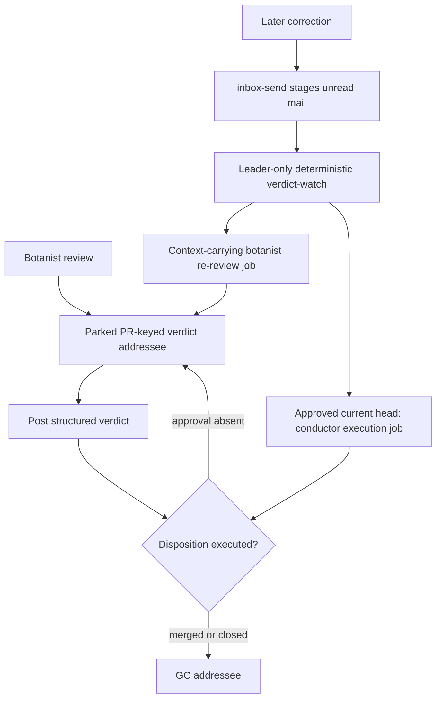

# Design: durable addressee for a posted but unexecuted PR verdict

> **Withdrawn for botanist MERGE-NOW (2026-08-12).** This document records the
> former approval-wait problem and an unimplemented proposal. Botanist MERGE-NOW
> now conducts immediately through the scoped exception in
> [Dependabot MERGE-NOW auto-conduct](dependabot-auto-merge.md), so it has no
> `pending-approval` state to preserve. The correction-addressability lesson may
> still motivate a future design, and ordinary human-authored conductor merges
> remain approval-gated. Everything below is historical rather than the current
> execution contract.

## Problem

`MERGE-NOW` is currently terminal only as a *review classification*.  It is not
terminal as a disposition until `ci-wait-merge.sh` has actually merged the PR (or
GitHub has accepted auto-merge).  The distinction matters when its final
maintainer-approval check refuses the merge: `ci-wait-merge.sh` leaves the PR
unmerged, but the botanist job can complete and `complete-job.sh` removes its
inbox.  A later correction then reaches `inbox/dead/` and `deadmail.sh` can only
make a context-free `deadmail-<msgid>` gardener job.

The failure occurred on endojs/endo-but-for-bots#269 on 2026-07-28: a 07:17Z
MERGE-NOW was overturned at 07:51Z after the base-ref census and `merge-tree`
proved the action-pin PR was a no-op.  The correction reached the work only by
way of `deadmail-20260728T074423Z-6bee53`.

The root cause is thus a lifecycle classification error: the system treats a
posted verdict as terminal although its externally gated disposition is still
pending.  EMBARGO already models the latter state with a ledger, a precise
self-deleting recheck, and a daily backstop.  The post-verdict path needs an
equivalent durable reader, not a promise that the original ephemeral reviewer
will remain reachable.

## Decision

Introduce a durable, PR-keyed **verdict addressee** plus a leader-only,
deterministic **verdict-watch** service.  This is a composite solution:

1. Before posting or executing a bot-owned terminal verdict, the botanist writes
   a parked addressee at `jobs/plan/<project>-pr<N>-verdict-addressee.md`, with
   `gate: verdict-addressee`.  It is deliberately never promotable or claimable.
   `inbox-send.sh` already stages mail for a `plan/` recipient, so this stable
   base remains an address after every short-lived review or execution job ends.
2. The record holds the current verdict and a compact, immutable review snapshot.
   `verdict-watch.sh` reads its inbox and PR state, turns each unread correction
   into a distinct normal job, and moves that message to `read/` in the same CAS
   change that records the dispatch.  A correction therefore wakes a botanist
   re-review with both the original evidence and the new message; it does not
   ask a generic gardener to rediscover either.
3. For an outstanding `MERGE-NOW`, the same watcher uses a deterministic GitHub
   read and `pr-maintainer-approval-gh.sh` to recognize a *current* approved head.
   It then posts an execution job that runs the existing conductor spine.  The
   watcher never calls `gh pr merge` itself and never makes an LLM decision.

The addressee is an external-gate continuation record, not a second review
verdict.  A future implementation should create it before the external PR
comment, because journal and GitHub cannot be one transaction.  If comment
posting fails, the harmless parked record is recoverable; the reverse ordering
recreates the loss window.

### Record and carried context

The body is a versioned, append-only audit record, not the original job body
alone.  It must retain enough material to make a correction actionable:

- canonical repo, PR number/URL, head OID, base ref/OID, author, and bot-owned
  authority scope;
- verdict, verdict-comment URL/time, disposition state (`pending-approval`,
  `execution-active`, `merged`, `closed`, or `superseded`), and a generation;
- the review's evidence: lockfile/action-pin census, merge-tree result, CI/head
  observation, approval observation, advisory/source/maturity facts, ledger-row
  reference, and original reviewing job base/report;
- every inbound correction's message id, sender, time, and derived child base;
- the last dispatched head OID and execution child base.

This lives in the journal plan record and its retained `inbox/<base>/read/`, so
it survives garden worktree teardown.  The child job receives a snapshot of the
record plus the correction; on completion it updates the addressee generation
and disposition atomically with its report handoff, rather than relying on a
future agent to read a vanished `work/<base>` directory.  The existing
dependabotany ledger remains the maturity source; it is referenced, not copied
as a competing ledger.

### Wake rules and serialization

Each verdict-watch tick is board- and API-derived, no `claude -p`:

- An unread inbox message is a wake event.  Its stable message id derives a
  `...-verdict-recheck-<msgid>` child basename and a matching job identity such
  as `verdict:<repo>#<N>:message:<msgid>`.  The watcher dispatches once, records
  it, and archives the message.
- A `MERGE-NOW` record wakes execution only when the PR is open, its head OID
  differs from neither the reviewed OID nor the recorded execution attempt, and
  `pr-maintainer-approval-gh.sh` accepts a current maintainer approval.  The
  execution child runs `ci-wait-merge.sh`; its own CI/review rechecks remain the
  final race-closing authority.
- A changed head, `CHANGES_REQUESTED`, a missing approval, pending CI, or a
  failed GitHub read never causes a merge or an LLM re-review merely by polling.
  The watcher records/retains `pending-approval` and retries the deterministic
  read next tick.  A changed head makes the old verdict stale and requires an
  explicit correction or normal watcher-posted botanist review, never automatic
  reuse of the old evidence.
- Merged or closed PR is the termination trigger.  An approved event is only an
  execution wake; it is not an instruction to erase the addressee.

At most one child may be active per addressee.  The record's generation and
`active_child` are CAS-claimed by the watcher; a second message stays unread
until that child reports.  This preserves correction order and prevents a
gate-clear execution racing a no-op correction.  A correction has priority over
gate-clear execution in a tick.

## Scope

The first adopter is botanist `MERGE-NOW`, because it has a durable verdict and
an existing approval gate.  The mechanism is intentionally general for “a
reviewed disposition blocked on an external gate the reviewer cannot clear,”
but not every blocked job qualifies.

| Role/path | Adopt now? | Reason |
| --- | --- | --- |
| Botanist MERGE-NOW | Yes | A posted autonomous verdict plus approval gate is the exact gap. |
| Conductor merge | Yes, share the execution half | It already distinguishes a declined merge with `orchestration-failed`; its pending approval state needs the same PR record rather than a completed, unreachable job. |
| Shepherd | No by default | CI diagnosis/fix work has no durable disposition once it stops; CI watchers can post fresh shepherd work from a real red signal. Adopt only if a future shepherd creates an explicit externally gated disposition. |
| Weaver | No | A rebase conflict is an engineering escalation, not a pre-decided action waiting on a remote gate. `blocked_on`/a new job is the honest handoff. |

This does not replace `blocked_on` + `unblock.sh`: that primitive wakes when a
PR closes or a predecessor job reaches a successful `tada`, whereas this design
wakes *before* close on a current approval and carries an adjudicated PR record.

## Liveness, cleanup, and host ownership

`gate: verdict-addressee` must be added as a closed gate value.  The foreman
selects only `deferred`; `unblock.sh` only `blocked`; `orchestrate.sh` only
`orchestrated`; proxy parking must leave this record alone.  Gardeners still
claim only `todo`, so it holds no gardener slot.  `reaper.sh` scans only `doin`;
it requeues an interrupted child, never the durable record.  `GARDEN_CLAIM_TTL`
therefore bounds a failed execution/review child without losing its addressee.

`verdict-watch` is a leader-only singleton, like `deadmail` and `orchestrate`:
it writes record state, archives mail, and can emit one maintainer notice.  Its
systemd service uses `is-main-host.sh`; gardener children remain safe to
race-claim on every host.  It should poll on the existing short watcher cadence
and use a fail-closed PR-state/approval reader, never interpret an API outage as
open, approved, or closed.

On merged/closed state the watcher waits for `active_child` to drain, appends the
terminal observation to the record, then removes the plan record and its inbox in
one CAS commit.  If unread corrections exist at that point, it moves them to
`inbox/dead/` in that same commit so generic `deadmail.sh` remains their recovery
path; it does not silently discard a late message.  A periodic age audit should
surface records that have stayed `pending-approval` past a configured retention
window to the maintainer, but must retain them while the PR remains open.  Thus
there is no forever-per-PR supervisor or occupied slot: one small journal record
exists only for an open PR whose disposition is pending.

## Idempotency and identity

The addressee base is reserved by canonical repo identity plus PR number, for
example `ebfb-pr269-verdict-addressee`; it is **not** the botanist job base and
never reuses `...-dependabot`.  Creating it is basename-idempotent in `plan/`.
It must additionally validate immutable repo/PR fields on an existing record and
fail loudly on a malformed collision.

Derived children include both the addressee generation and their distinct cause:
`...-verdict-g3-message-<msgid>` or `...-verdict-g3-execute-<head12>`.  They use
the existing `post-job.sh --identity` map.  A repeat poll of the same message or
approval sees the same child base/identity and no-ops; a later correction or new
head gets a new identity and cannot be swallowed by an old `tada`.  The stable
anchor's reserved basename is purposely outside directive identities: its job is
delivery addressability, while `jobs/index/<hash>` continues to deduplicate each
actual directive/child.  This avoids both collisions with a re-posted botanist
directive and the inverse bug of treating a fresh correction as an old verdict.

## Alternatives considered

- **Only re-post when `reviewDecision` becomes APPROVED.** Rejected: it solves
  approval waiting but offers nowhere for the #269 correction, cannot preserve
  review context, and a boolean rollup is weaker than the current-head approval
  helper.
- **A gardener or orchestration supervisor parked forever per PR.** Rejected:
  orchestration is excellent for finite child chains, but a claimed poller leaks
  a scarce slot and a terminal orchestration record deletes itself.  A dormant
  plan record plus deterministic watcher has the required indefinite address
  with no slot or token cost.
- **Make the original botanist job wait indefinitely.** Rejected: it consumes a
  claim, is subject to `GARDEN_CLAIM_TTL`, and still loses corrections when the
  handler dies or is reaped.
- **Extend deadmail with PR-context inference.** Rejected: deadmail is correctly
  generic and sees only an intended base/message.  Reconstructing a review from
  a torn-down job is unreliable and makes the backstop responsible for primary
  delivery.
- **Embargo-style timer only.** Rejected: a timer gives eventual rechecking but
  not immediate correction delivery or an approval-edge wake.  Its precise
  one-shot plus daily heartbeat remains the right maturity mechanism.

## Migration and adoption

1. Add the record schema, `gate: verdict-addressee`, creation/update helpers,
   watcher, leader-only unit/timer, and hermetic tests for message dispatch,
   approval dispatch, head change, CAS/idempotency, reaper isolation, and terminal
   GC/dead-letter handoff.
2. Change `roles/botanist/AGENT.md`: retain the 2026-07-28 anti-pattern warning,
   but replace “a verdict you already posted is not final” as discipline alone
   with the concrete requirement to create/update the durable addressee before
   posting MERGE-NOW and to report `pending execution` rather than `executed`
   when approval blocks.  Its definition of done must require actual merge,
   auto-merge enqueue, or a live addressee.
3. Route conductor’s approval-blocked completion through the same record after
   botanist adoption proves the substrate.  Do not migrate EMBARGO: its ledger
   and two-leg scheduler already express the relevant future recheck.
4. Seed records only for currently open bot-owned PRs with an explicitly posted
   pending MERGE-NOW; do not infer old verdicts from vague comments.  Until a
   record exists, `deadmail.sh` continues to rescue late mail.

## Out of scope and known gaps

This does not grant new merge/comment authority, change the maintainer approval
rule, retry failed CI, reinterpret a changed head, or make upstream PRs bot-owned.
It does not replace the generic dead-letter queue, schedule carry-forward, the
proxy’s `blocked_on` parking, or orchestration.  The retained snapshot reduces
but cannot eliminate the need for a fresh botanist review when a correction
changes technical facts.  A maintainer may still approve a stale-but-open PR
before a watcher tick sees a correction; the final execution job must therefore
re-read the record generation and current head immediately before invoking the
existing merge spine.
