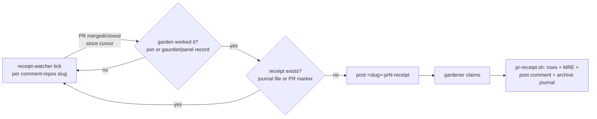

# Automated PR completion receipts

| Created | 2026-09-05 |
| Author  | gardener (job `design-pr-completion-receipts`) |
| Status  | Proposed — carries open questions (§ Open questions); landed on `main2` and mirrored to a review PR per CLAUDE.md § Conventions carve-out |

Every pull request the garden works on ends — merged or closed — and today that
ending leaves no ledger. The maintainer asked (kriskowal, 2026-09-05) for an
automated **completion receipt** emitted for **every** PR the garden finishes,
merged **or** closed, posted as a PR comment **and** archived in the journal:
per-engagement `model / tokens / harness / role / notional cost / calibrated
cost`, plus one per-PR **heuristic cost of maintainer review** grounded in the
feedback the PR drew.

The garden already owns nearly every primitive this needs. This is a
**composition** design plus **one new heuristic** and **one new deterministic
watcher** — not new infrastructure. It reuses the true-cost join
(`cost-by-pr.sh`), the per-engagement usage ledger (`usage/<base>.jsonl`), the
reputation events (`reputation/events/<base>.md`), the same maintainer-cleared
watch set the comment/CI watchers ride, and the same identity-pinned `gh` wrapper
they post through.

## What already exists (build on, do not reinvent)

- **`scripts/jobs/cost-by-pr.sh`** — the base→PR join is the hard part and it is
  solved. Two deterministic edges (authoritative `jobs/index/<hash>` directive
  identity, then PR-number-in-basename validated against the real PR set) map a
  job base to its PR, with measured join coverage and an explicit
  `__UNATTRIBUTED__` bucket. It prices on **two bases already**: NOTIONAL (the
  usage ledger's list-price `total_cost_usd`, ~8.7× high on a flat subscription)
  and **TRUE-COST** (each reputation event's capped-proxy wallclock ×
  `reputation/rate-card.md`). Today it rolls up to **merged** PRs only.
- **`usage/<base>.jsonl`** — one JSON line per engagement, carrying
  `model, provider, role, input/output/cache_creation/cache_read tokens,
  num_turns, elapsed_s, total_cost_usd (notional), host, outcome, ts`. This is
  the richest per-engagement source and already the one `cost-by-pr.sh` parses.
- **`reputation/events/<base>.md`** — the final per-base record carrying the
  **calibrated** cost: `estimated_dollars` (wallclock proxy × rate card) or
  `aggregate_dollars` (metered providers), plus `provider, model,
  thoughtfulness, duration_secs, cost_source`.
- **`reputation/rate-card.md`** — journal data that **outranks** the tracked seed;
  a rate correction needs no deploy. The receipt's calibrated basis and the
  maintainer-rate constant follow this same journal-data-outranks-seed pattern.
- **`panel-runs/<repo-slug>-<pr>/*.md`** and **`jobs/gauntlet-archived/*.md`** —
  per-PR **machine** review records (`rounds`, `must_fix_total`, `iteration`,
  `resumes`). These are the garden's *own automated* review; they are **machine**
  cost, not maintainer attention, and inform the receipt as context, not as the
  maintainer-review figure.
- **Comment-posting** — `panel.sh` and the fixer path already post PR comments
  through the fleet's identity-pinned `gh` wrapper, only on the
  maintainer-authorized `comment-repos/` set. The receipt reuses that path and
  **widens commenting to nothing**.

## The receipt

Two parts: a table of **per-engagement rows** and a single **maintainer-review**
figure. Legible as a plain PR comment, and distilled when a PR has many
engagements (§ Size discipline), reusing `panel.sh`'s foreperson-distillation
precedent for GitHub's ~65 KB body limit.

### Per-engagement rows

One row per engagement that joined to this PR. An "engagement" is one
`usage/<base>.jsonl` result row (the ledger's own boundary — one
`$GARDEN_JOB_HANDLER` invocation). Fields:

| Field | Source | Notes |
| --- | --- | --- |
| **role** | `usage` row `role` | builder, designer, fixer, weaver, gardener, a juror seat, … |
| **harness** | `usage`/`reputation` `provider` → agent-bin map | `anthropic`→`claude`, `openai`→`codex`, `moonshot`→`kimi`, `fireworks`→`fireworks`, `openrouter`→`openrouter`, `ollama-cloud`→`ollama`, `local`→`local`. This is the garden's `agent_bin`/worker-kind axis. |
| **model** | `usage` row `model` | resolved id, e.g. `claude-opus-4-8`, `kimi-k3`. |
| **tokens** | `usage` row | billable = `input + output + cache_creation` (the `usage-meter.sh` definition; `cache_read` shown parenthetically, excluded from billable). |
| **notional $** | `usage` row `total_cost_usd` | list-price; header-flagged as ~8.7× high on a flat plan. |
| **calibrated $** | `reputation` event `estimated_dollars` / `aggregate_dollars` | the garden's true-cost basis. Per-**base**, so when a base has several engagement rows the calibrated figure is attributed to the base and shown once on the base's summary line (a `∑` row), not duplicated per engagement. |

Rows group by base (a base may span requeues/hosts/roles). The comment shows a
per-base subtotal and a PR grand total for tokens, notional, and calibrated.

### The one per-PR figure: maintainer-review effort

A single **heuristic estimate of the maintainer's review cost**, in minutes and
dollars, plus its **ratio to the machine calibrated cost** — the whole point,
per the garden's own finding that *human review dominates machine cost ~50–190×
at the median* (memory: *human review dominates machine cost*; optimize review
rounds, not tokens). Formula in § The maintainer-review-effort heuristic.

### Example shape

```markdown
## 🧾 Garden completion receipt — endojs/endo-but-for-bots#1075 (closed, not merged)

Completed 2026-08-30. 4 engagements across 2 bases. Basis: calibrated = capped
proxy-wallclock × reputation/rate-card.md (true cost); notional = usage-ledger
list price (~8.7× high on a flat subscription).

| base | role | harness | model | tokens (billable) | notional $ | calibrated $ |
|---|---|---|---|---|---|---|
| build-…-1075 | builder | claude | claude-opus-4-8 | 143 900 | 5.04 | — |
| ″ (∑ base) | | | | 143 900 | 5.04 | **0.83** |
| …-pr1075-gauntlet-panel-1 | gardener | claude | claude-opus-4-8 | 39 570 | 0.69 | 0.11 |
| … | | | | | | |
| **PR total** | | | | **207 300** | **6.42** | **1.07** |

**Maintainer review (heuristic): ~27 min ≈ $68** — 2 review sittings, 1 comment
(1 365 chars). That is **≈ 64×** the machine calibrated cost ($1.07).
Machine context: 6 gauntlet panel rounds, 0 fix iterations.

<sub>Receipt generated deterministically from the journal usage + reputation
ledgers and the PR's human review threads. Archived at
`receipts/endojs-endo-but-for-bots/2026/08/pr1075.md`.</sub>
<!-- garden-receipt: endojs/endo-but-for-bots#1075 -->
```

The trailing `<!-- garden-receipt: <repo>#<n> -->` marker is the **idempotency
key** (§ Idempotency).

## The maintainer-review-effort (MRE) heuristic

A defined, reproducible formula — not an ad-hoc guess. All inputs come from
`gh api` over the PR, filtered to **human** feedback.

**Human-author filter.** A review/comment counts as maintainer feedback when its
author is **not** a bot: exclude the fleet bot login (`kriscendobot` and any
`config/fork-owners` login), `Copilot`, `github-actions[bot]`, `dependabot[bot]`,
and any login ending `[bot]`. Positively, `author_association ∈
{OWNER, MEMBER, COLLABORATOR}` or a login on the journal `maintainers/allowlist`
confirms a human maintainer. (No LLM: a fixed login/association test.)

**Measured inputs** (three `gh api` endpoints — `pulls/N/reviews`,
`pulls/N/comments`, `issues/N/comments`):

- `S` = **review sittings** = count of distinct `(human author, calendar-day)`
  pairs across all human reviews and comments. A robust proxy for "times a human
  loaded this PR into their head." Floored at **1** for any PR the garden
  completed (even a silent merge/close is one glance).
- `C` = total count of human review bodies (non-empty) + human inline comments +
  human issue comments.
- `L` = total character length of those same human bodies.

**Estimated maintainer minutes:**

```
M = S·a + C·b + L/r
```

with journal-tunable constants (seeded defaults, chosen to be directionally
sane against real PRs — see § Validation):

- `a = 8` min — fixed per-sitting cost of paging the PR into context.
- `b = 1.5` min — cost of authoring one pointed comment.
- `r = 750` chars/min — combined read-and-comprehend throughput over the PR
  prose the human actually processed.

**Dollars:** `MRE$ = (M/60)·H`, where `H` = maintainer hourly rate from journal
config `receipts/config/maintainer-hourly-usd` (seed **$150/hr**), following
`rate-card.md`'s journal-data-outranks-seed rule — retunable with no deploy.

**Reported:** `M` (minutes), `MRE$`, and the headline **ratio `MRE$ /
calibrated-machine-$`**, which is the maintainer-dominates figure the receipt
exists to make concrete.

The machine review rounds (panel `rounds`, gauntlet `iteration`/`resumes`) are
shown as **context** ("6 panel rounds, 0 fix iterations") but are **not** folded
into `M`: they are machine cost, already counted in the per-engagement calibrated
total. Whether maintainer-triggered fix iterations should amplify `M` is an open
question (§ Open questions).

### Validation (directional sanity, 3 real PRs)

Measured live 2026-09-05 with the defaults above (`H=$150`):

| PR | human reviews (sitting-days) | comments (chars) | `M` | `MRE$` |
| --- | --- | --- | --- | --- |
| endo#1075 (closed) | 2 | 1 (1 365) | ~27 min | ~$68 |
| endo#1109 (closed) | 0 | 3 (1 429) | ~22 min | ~$56 |
| endo#1151 (design, no human feedback) | 0 | 0 | 8 min (floor `S=1`) | ~$20 |

Each dwarfs the sub-$5 machine calibrated cost of those PRs by 10–100×,
consistent with the 50–190× median finding — directionally sane, so the shape is
committable with the constants flagged as tunable open questions.

## The trigger: a completion watcher

A new **deterministic, no-`claude -p`** producer, `receipt-watcher.sh`, modeled
exactly on `ci-watcher.sh` (which watches CI status) — this one watches **PR
terminal state**. Per tick, per watched repo:

```
enumerate the repo's OWN PRs that reached a terminal state (merged OR closed)
  since a durable journal cursor  (authoritative paginated REST, never a page cap)
    → keep only PRs the garden actually worked (≥1 base joins to this PR via the
       cost-by-pr.sh join, OR a jobs/gauntlet-archived / panel-runs record names it)
    → skip any PR that already has a receipt (journal receipt file exists, OR the
       PR body already carries the <!-- garden-receipt: repo#N --> marker)
    → otherwise post exactly one `<slug>-pr<N>-receipt` job, idempotent by basename
```

A gardener then claims `<slug>-pr<N>-receipt` and runs the **receipt generator**
(a `scripts/jobs/pr-receipt.sh`, plain code): build the rows from the ledgers,
compute MRE, render the comment, post it via the identity-pinned `gh` wrapper,
and write the journal archive — all in one idempotent pass.

**Why a claimed job, not all-in-watcher.** The join, the `gh api` review reads,
and the comment post are non-trivial and must not block the watcher tick; the
watcher stays a cheap deterministic detector (like ci-watcher minting a
shepherd), and the receipt work is a normal fresh-budget claimable job. The
generator itself runs **no LLM** — it is deterministic — but it lives as a job so
retries and the board's CAS idempotency apply.

**Arming and monitoring safety.** `receipt-watcher.sh` is a leader-only
singleton template unit `garden-receipt-watcher@<slug>`, armed by
`repo-watcher.sh`'s reconcile against the **same `comment-repos/` set** the
comment and CI watchers use (add one line:
`reconcile_set comment-repos garden-receipt-watcher`). It reads only PR **state
and authorship/metadata** and the garden's **own** journal ledgers — never
external comment *bodies* into an LLM (the generator reads human comment bodies
only to **count and measure length**, deterministically, never feeding them to a
model). So it is injection-safe by construction, like ci-watcher, and posts only
on the already-authorized set — no widening of the monitoring surface
(CLAUDE.md § Monitoring safety constraint).



## Journal archive layout

```
receipts/<repo-slug>/<YYYY>/<MM>/pr<N>.md
```

e.g. `receipts/endojs-endo-but-for-bots/2026/08/pr1075.md`. Categorized by
**repository** (top dir), **date** (year/month of completion), and **PR number**
(filename) as asked. `pr<N>` is unique within a repo (a PR completes once), so no
day-level directory is needed for uniqueness; the full ISO completion date lives
in the file's frontmatter. The directory tree alone is browsable, so no separate
index/manifest is required.

The archived file is the **full** receipt (frontmatter + the complete,
un-distilled table even when the posted comment was distilled for size):

```markdown
---
repo: endojs/endo-but-for-bots
pr: 1075
completed_at: 2026-08-30T14:22:10Z
disposition: closed          # merged | closed
posted_comment_url: https://github.com/…/pull/1075#issuecomment-…
engagements: 4
bases: [build-…, …-pr1075-gauntlet-…]
tokens_billable: 207300
notional_usd: 6.42
calibrated_usd: 1.07
maintainer_review_minutes: 27
maintainer_review_usd: 68.00
maintainer_dominance_ratio: 64
---
<full receipt markdown>
```

## Idempotency and retry

A PR completes once, so this is simpler than the recurring-job cases — the risk
is a **crashed retry double-posting**, not a recurring re-fire. Three guards, any
one sufficient:

1. **Journal receipt file** — if `receipts/<slug>/<YYYY>/<MM>/pr<N>.md` already
   exists on `journal2`, the generator is a no-op (re-posts nothing).
2. **PR-body / comment marker** — before posting, the generator lists the PR's
   comments for the `<!-- garden-receipt: <repo>#<N> -->` marker; if present it
   skips the post and only ensures the archive exists (heals a
   posted-but-not-archived crash, and vice-versa).
3. **Watcher pre-check** — the watcher skips minting a `-receipt` job for a PR
   that already satisfies (1) or (2), and `post-job.sh` is idempotent by basename
   across `todo/doin/tada`, so a re-tick before the job finishes cannot
   double-post.

Order in the generator: **archive-write then comment-post** is *not* required;
each step is independently guarded by its own marker, so a crash between them
resumes correctly on the next claim (the watcher re-mints only if *neither*
marker exists). Extending `cost-by-pr.sh` to **closed-without-merge** PRs (its
join already carries `state ∈ {merged, open, closed}`; only its roll-up filter is
merged-only) is in scope for the build — the receipt covers both.

## Build task list (for `pr-completion-receipts-build`)

Concrete, no open design questions to resolve (constants come from the seeded
defaults; retuning is journal config, not code):

1. **`scripts/jobs/pr-receipt.sh`** — deterministic generator. Extend/reuse the
   `cost-by-pr.sh` join to resolve the bases for one `<repo>#<N>` (both merged
   and closed states). Read `usage/<base>.jsonl` for per-engagement rows and
   `reputation/events/<base>.md` for the calibrated per-base figure. Compute MRE
   from the three `gh api` endpoints with the human-author filter. Render the
   comment (with `panel.sh`-style size distillation over ~65 KB). Post via the
   identity-pinned `gh` wrapper. Write `receipts/<slug>/<YYYY>/<MM>/pr<N>.md`.
   Both idempotency markers.
2. **`scripts/jobs/receipt-watcher.sh`** + `garden-receipt-watcher@.{service,timer}`
   templates; add `reconcile_set comment-repos garden-receipt-watcher` to
   `repo-watcher.sh`; durable cursor `receipts/<slug>` via `cursor-get.sh`;
   leader-only `is-main-host.sh` ExecCondition.
3. **Extend `cost-by-pr.sh`** roll-up to include closed-without-merge PRs (drop
   the merged-only filter for the per-PR join used by the generator; keep the
   `--merged-only` flag for the escrow-oracle view).
4. **Seed config**: `receipts/config/maintainer-hourly-usd` (150) and the MRE
   constants (`a=8, b=1.5, r=750`) as a tracked seed
   (`scripts/jobs/receipt-defaults.*`) that journal config overrides.
5. **Produce 10 example receipts** from real completed PRs — merged **and**
   closed both represented. Closed candidates already surfaced this session:
   `endojs/endo-but-for-bots#1075`, `#300`, `#1109`. Merged candidates: any of
   the recently-landed PRs named in `journal` `pr-review-sequence.md`'s "Newly
   landed" section. Commit them under `receipts/…` and link them in the report.
6. **House style**: plain code, no `claude -p` in the watcher or generator;
   fail-open (a receipt failure never blocks anything); post only on
   `comment-repos/`.

## Open questions

- What is the right **maintainer hourly rate** `H` for the dollar figure? The
  seed is $150/hr; the garden's cost designs deliberately censor `human_dollars`.
  Is a single flat rate acceptable, or should it vary by reviewer / repo?
- Are the **MRE constants** (`a=8` min/sitting, `b=1.5` min/comment, `r=750`
  chars/min) acceptable seeds? They are directionally validated (§ Validation)
  but not empirically calibrated against timed maintainer sessions.
- Should **maintainer-triggered fix-loop iterations** amplify the review-effort
  estimate (each `CHANGES_REQUESTED` that forces a rework round arguably
  multiplies the human's involvement), or stay context-only as proposed?
- Is the **review "sitting" proxy** (`distinct (author, calendar-day)` pairs) the
  right granularity, or should rapid same-day back-and-forth count as multiple
  sittings?
- Should the receipt distinguish **notional vs calibrated** prominence — e.g.
  lead with calibrated and footnote notional (proposed), or show both equally?
- **Archive depth**: `<YYYY>/<MM>/pr<N>.md` is proposed; is a `<DD>` level wanted
  for very high-volume repos, or is month-level nesting enough?
