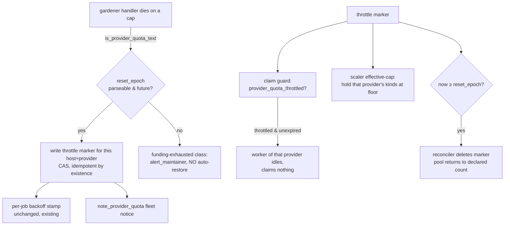

# Design: auto-throttle a host's workers on quota exhaustion, auto-restore on reset

| Created | 2026-08-19 |
| Author  | designer |
| Status  | Proposed |
| Job     | `design-quota-throttle` (design only; a `build-quota-throttle` follows after maintainer review) |

Maintainer directive (2026-08-19): *"Add a mechanism to automatically throttle
gardeners down on a host if the quota gets hit, while posting a commensurate job
to throttle back up when the quota is restored. This must be sensitive to the
difference between session quota and weekly quota for Claude and Codex. Ollama is
not quota'd locally. The others are not quota'd but require explicit manual
funding."*

## The incident this closes

2026-08-18 00:23 UTC, `endolin-garden2-5bcdff64` hit a Claude quota window. A wave
of jobs died mid-flight — 5 requeue cycles each, then doomed — including
`kriscendobot-minion.town-pr47-review-237136a0`, which swallowed a maintainer's PR
review reply for over a day. Half a dozen jobs doomed in the same ~40-minute
window; the maintainer inbox took 28 doom notices from the one root cause. Today's
remedy is manual ([[gardener-pool-quota-throttle]]): a human runs
`set-workers.sh gardener 2` and later remembers to scale back up. This design makes
that reaction automatic, host-scoped, per-provider, and self-restoring.

## What already exists — reuse, do not rebuild

The garden already **detects** a provider quota cap and **captures its reset time**.
The gap is purely the *reaction*: nothing stops the host's pool from re-claiming
into the wall, and nothing restores the count. Accept and reuse, verbatim:

- **Classifier (`common.sh`).** `is_provider_quota_text` recognizes the account-cap
  refusal; `provider_quota_limit_type` returns `session|usage|weekly|5-hour`;
  `provider_quota_reset_clause` extracts the `resets …` text; and
  `provider_quota_reset_epoch` parses it to a **future epoch** (time-only → next
  occurrence; `Mon DD` → that date this year or next). This is the whole detection
  surface — the design adds **no new parsing**.
- **Detection point (`gardener.sh` ~L1172).** When a handler dies on a cap the
  gardener *already* computes `quota_type` and `quota_reset_epoch` and stamps a
  **per-job** backoff (`stamp_provider_quota_backoff_hint`) that the reaper
  (`provider_quota_backoff_fields`, reaper.sh ~L581) reads to **hold that one job**
  until the reset, then requeue. This design adds a **host-level** reaction at the
  same point, from the same two values already in hand.
- **Worker-count primitive (`set-workers.sh`).** Host-scoped-writes-its-own-host
  only; already reasons about a **quota-driven floor-of-zero**
  (`quota_routing_mode`, `host_has_qualified_non_claude_worker`): an Anthropic kind
  may reach 0 only while a probe-qualified non-Claude class still claims work.
- **Worker-kind registry (`common.sh` `worker_kind_field`/`worker_kinds`).** Each
  kind carries a `provider`: `monk`/`gardener` → `anthropic`, `cleric` → `openai`,
  `hermit` → `local` (Ollama), `mystic` → `moonshot`, `fireworker` → `fireworks`,
  `friar` → `ollama-cloud` (paid Ollama Cloud, added 2026-09-01).
  This is how "throttle only the affected provider" is expressed mechanically.
- **Fleet notice (`alert_maintainer`/`note_provider_quota`).** A cap already folds
  into ONE coalescing `provider-quota` maintainer notice carrying the limit type +
  reset clause; `note_provider_ok` clears it when a call next succeeds.
- **Lightweight journal-flag precedent (`brake-foreman.sh` / `foreman_braked`).**
  A journal-backed, existence-is-the-signal, fails-safe flag read from an
  already-synced clone — the shape this design's throttle marker copies.

## Decision: a self-expiring, per-host, per-provider throttle marker

The core object is a **journal-backed throttle marker**, one per (host, provider),
carrying the captured reset epoch:

```
throttle/<GARDEN>/<provider>        # e.g. throttle/endolin-garden2-5bcdff64/anthropic
  limit_type: weekly
  reset_epoch: 1755590400
  reset_at:   2026-08-19T04:00:00Z
  observed_by: monk-3
  written_at: 2026-08-18T00:23:11Z
```

It drives two deterministic reads, mirroring how `fleet_draining` and
`foreman_braked` already gate the worker loop:



**1 — Detect + throttle down, at the point of first failure (not after 5 dooms).**
The `gardener.sh` cap branch already holds `quota_type`+`quota_reset_epoch`. When
both are present *and the epoch is a future time*, it additionally writes the host's
throttle marker for **its own provider** (derived from its own `worker_kind` via
`worker_kind_field <kind> provider`). The write is a CAS loop like `set-workers.sh`
and **idempotent by existence**: the first of N concurrent gardeners to trip the cap
writes it; the rest see an unexpired marker for the same provider and no-op. This is
the "react at first failure" requirement — the very next capped worker on the host
stops claiming immediately (guard below), rather than each of a dozen jobs burning
five requeue cycles.

**2 — Immediate brake via a claim-time guard (the primary throttle).** Before a
worker claims, it already exits on `fleet_draining` (`gardener.sh` L283). Add the
parallel `provider_quota_throttled "<this-worker-provider>"` predicate (reads the
marker from the already-synced clone; unexpired ⇒ true). A throttled worker idles
exactly like a drained one — **no unit churn, no count to remember, no scheduled
restore to lose**. This is why the primary mechanism is a *guard on a self-expiring
marker*, not a literal `set-workers.sh <kind> 0`: the manual toil being automated is
precisely *remembering the old count and the restore*; a marker that carries its own
expiry never accrues that debt. `set-workers.sh` stays the human's lever and the
mechanical floor authority; the auto path does not mutate the declared count.

**3 — Reconcile + self-restore (session vs weekly, same code, captured epoch).**
Restoration needs **no scheduled job and no delayed host-op**. A deterministic
per-host reconciler tick (fold into the existing `garden-scaler` reconcile, which
already right-sizes the pool to the declared count every tick) does two things from
the marker:
   - while `now < reset_epoch`: apply an **effective cap** of the non-Claude floor to
     that provider's kinds — the exact "runtime effective cap holds the pool below
     the declared count" pattern `set-workers.sh` already cites for the
     backend-probe gate — so a restart-looping pool is quiesced without rewriting
     `hosts/<GARDEN>`;
   - when `now ≥ reset_epoch`: **delete the marker**; the effective cap lifts and the
     pool returns to its *declared* count on the same tick.

   **Session vs weekly is handled by the captured epoch itself, not by a branch.**
   `provider_quota_reset_epoch` yields the short window for a session cap and the
   multi-day window for a weekly cap; the marker restores at the right wall-clock
   time for each with one code path. The design *is* sensitive to the distinction —
   it reads `limit_type` and the real reset time from the capture and restores
   accordingly — rather than blind-polling or using a fixed backoff. `limit_type` is
   recorded for observability and for the one policy knob that legitimately differs
   (below); the mechanism does not otherwise fork on it.

This answers requirement 3's *"pick one, justify, don't build both."* The two real
alternatives are a **fire-once scheduler** (`set-schedule-once.sh <name> <reset-ISO>`
exists and does exactly this — dispatches one job at an absolute UTC instant, then
self-deletes, with a `preflight:` idle-gate) and a **restore actuator** (that job, or
a delayed `send-host-op.sh <host> op=set-workers … / op=restore`, drives the count
back up). Both are rejected as the *primary* path in favor of the self-expiring
marker, for one decisive reason: **they require the throttle-down to mutate the
declared count**, which reintroduces the exact toil being automated — remembering the
pre-throttle number, and owning a separate restore step that can mis-fire or be lost
across a restart. The marker instead carries its own expiry and never touches
`hosts/<GARDEN>`, so restoration is the *absence of a reason to hold* rather than a
scheduled action: nothing to dispatch, nothing to lose. It also fails safe for free —
an unreadable journal already no-ops the scaler tick (`sync_clone` runs before the
read), so the pool can never wrongly un-throttle on a journal it could not read.
`set-schedule-once.sh` remains the right tool for the *residual* human-gated cases
(the funding class below, or a maintainer who wants a timed re-check), not for the
common quota window.

**Belt-and-suspenders restore.** `note_provider_ok` already fires when a `claude -p`
call next completes on the host. The reconciler may *also* clear a marker on an
observed-success signal — an early exit if the provider recovers before its stated
reset. Optional; the epoch is the authority.

## Provider-specific handling (all tiers named)

- **Claude (`anthropic`: `monk`/`gardener`) and Codex (`openai`: `cleric`).** Both
  quota'd, both session- and weekly-scoped; both get the full detect → throttle →
  self-restore path above, keyed on `provider`. A Claude cap throttles only the
  host's active Anthropic spelling (`anthropic_active_kind`); a Codex cap throttles
  only `cleric`. **Codex-wording caveat (open question below):** the classifier's
  signatures are Claude-Code-worded (`hit your … limit · resets …`). The Codex CLI's
  weekly/session-cap wording must be confirmed and, if different, added to the shared
  `GARDEN_PROVIDER_QUOTA_CAP_SIGNATURES` fragment so *the same* `is_provider_quota_text`
  fires and *the same* `provider_quota_reset_epoch` parses its reset — one fragment,
  both providers, no second classifier.
- **Ollama (`hermit`, `provider: local`) — explicit non-goal / exclusion.** Local
  compute is never quota'd. Two independent reasons it is untouched: (a) a local
  endpoint never emits a cap signature, so it never *writes* a marker; and (b) the
  guard and reconciler key on the **failing worker's provider**, and the floor the
  throttle preserves is *exactly* the non-`anthropic`/non-`openai` classes — Ollama
  is what **keeps claiming** while a paid provider is capped. A Claude or Codex cap
  MUST NOT throttle `hermit`; this is stated, not merely omitted.
- **Manually-funded arms (`mystic`=moonshot/kimi, `fireworker`=fireworks, `friar`=
  ollama-cloud, and paid `cleric` credit) — a different failure shape, routed to a
  human.** Funding exhaustion has **no programmatic reset time**. The discriminator is
  already in hand: `is_provider_quota_text` may match, but
  **`provider_quota_reset_epoch` returns nothing** (no parseable future reset — a
  billing/insufficient-funds/402 shape). In that case the design **does not** write an
  auto-restoring marker (there is nothing valid to schedule); it routes to the
  maintainer inbox via `alert_maintainer`/`note_provider_quota` ("needs funding, human
  action"). The host may still stop claiming on that provider, but restoration is
  human-gated, never an epoch that "can't possibly fire correctly."
  Presence-of-a-parseable-reset-epoch is the single, existing, deterministic split
  between *"quota, will reset"* and *"funding, needs a human."*
  - **`friar` (provider `ollama-cloud`) is explicitly NOT the local exclusion above.**
    Even though a friar runs the `claude` CLI (like a monk) and points at an Ollama
    endpoint (like a hermit), it is a **paid, metered, external** surface: it spends
    the maintainer's Ollama Cloud key and *will* emit real rate-limit/quota errors,
    unlike `hermit`'s free local compute which never emits a cap signature. So
    `ollama-cloud` gets a throttle classification, and it is sized as a manually-funded
    arm (this bullet), not pooled with `anthropic` (whose caps auto-restore on a
    parsed reset epoch) and not excluded like `local`. If Ollama Cloud ever surfaces a
    Claude-Code-worded cap that names a parseable UTC reset, the friar rides the same
    `provider_quota_reset_epoch` self-restoring path as any other provider by
    construction — the split is mechanical, not per-provider.

## Interaction with existing mechanisms

- **kimi-fallback ([[kimi-k3-takes-opus-work-with-opus-fallback]]) is an orthogonal
  axis.** That is a **per-job model reroute** (the reaper advances a failed kimi
  job's `model:` pin to opus); this is **host-level pool sizing**. They share no
  signal and complement each other: throttling `anthropic` to the non-Claude floor
  keeps `cleric`/`mystic`/`hermit` claiming, while the per-job reroute handles jobs
  pinned to a dead model. One caution to encode in the build: kimi-fallback reroutes
  *into* `anthropic`; during an Anthropic cap a rerouted job simply hits the same
  per-job quota-backoff hold — correct, not harmful — but the build should not treat
  reroute as a *substitute* for host throttling (reroute moves one job; throttle
  stops the pool re-claiming). This also sits beside
  [[tier-routing-claude-off-automatic]]/[[reroute-role-floor-audit]]: throttle-down
  never *reroutes* a job, so it cannot violate a per-role tier floor.
- **Foreman-brake ([[the foreman brake]]) is the model, not a dependency.** The
  throttle marker copies its shape (journal-backed, existence-is-the-signal,
  fails-safe). It does **not** auto-brake the foreman: the foreman produces jobs,
  the throttle stops *claiming* them, and jobs waiting in `todo/` during a cap is
  the correct state. For a long weekly Anthropic cap a human may *additionally* brake
  the foreman to stop *producing* Anthropic work; that stays a separate, deliberate
  lever.
- **Reaper outage-pause / per-job backoff — this REDUCES how often they fire.** The
  existing per-job backoff and the outage-cycle doom-pause (reaper.sh ~L772) are the
  *after-the-fact* safety net that stopped the 2026-07-01 mass-dooming. By braking
  the pool at first failure, this design keeps most jobs from ever entering that path
  — it complements, never duplicates, that logic. The per-job backoff stamp stays
  exactly as is.

## Relationship to `skills/restore` (not a replacement)

This is the **automatic, host-scoped, per-provider-quota-triggered analogue of the
worker-pool reactivation step** of [restore](../skills/restore/SKILL.md) — and only
that step. Restore's other recoveries (orphaned in-flight claims, dead letters,
doomed-job redispatch) are a different failure class and stay **human-triggered**.
The design should link both ways: restore's "reactivate the pool" step notes that a
quota window now self-restores; this marker's clear path notes restore for the
residual wreckage a long outage still leaves.

## Test plan

- **Unit:** `provider_quota_throttled` true while marker unexpired, false after
  `reset_epoch`; false when no marker. Marker write is idempotent under concurrent
  writers (existence CAS). A capture with a cap signature **but no parseable reset**
  writes **no** marker and DOES alert (funding class).
- **Provider isolation:** an `anthropic` marker leaves `hermit`/`cleric`/`mystic`
  guards false; a `local`-provider capture writes no marker.
- **Session vs weekly:** feed the two exact incident strings
  (`"…session limit · resets 1:10am (UTC)"`,
  `"…weekly limit · resets Aug 15, 3am (UTC)"`) through the write path and assert the
  marker's `reset_epoch` matches `provider_quota_reset_epoch` for each; assert the
  reconciler clears at `now ≥ reset_epoch` and holds the effective cap before it.
- **Restore path:** a marker past its epoch is deleted on the next scaler tick and
  the pool returns to the declared count without a human touching `set-workers.sh`.
- **Fails-safe:** an unreadable/offline journal clone no-ops the reconciler tick
  (no un-throttle on a journal it could not read).
- Extend, don't fork: reuse `claude-session-limit-classifier-test.sh`'s fixtures.

## Open questions

- **Codex cap wording.** What exactly does the Codex CLI print for a session/weekly
  cap, and does it name a UTC reset the existing `provider_quota_reset_epoch` can
  parse? The build must confirm against a real capture (or
  `handlers/codex-provider-common.sh`) and extend the shared signature fragment;
  today only Claude-Code wording and a Fireworks 429/503 retry class are recognized.
  If Codex names no reset time, Codex caps fall into the funding-class (alert, no
  auto-restore) until the wording is added — state that fallback explicitly in the
  build.
- **Reconciler home.** Fold the marker read into the existing `garden-scaler`
  reconcile (preferred: it already computes each pool's effective count per tick and
  runs on every host), or a tiny dedicated per-host timer? The scaler is the natural
  owner; confirm it can express a per-provider effective cap without disturbing the
  monk/gardener active-spelling selection.
- **Floor policy by limit type.** Default floor is `host_has_qualified_non_claude_worker`
  (retain ≥1 usable non-Claude class). Should a **weekly** cap (days) use a *deeper*
  throttle than a **session** cap (hours) — e.g. drop Anthropic effective count to 0
  for weekly but merely to a low floor for session? The mechanism supports either;
  the default treats them identically and the knob is `limit_type`-gated if wanted.
- **Multi-provider simultaneous caps.** Markers are per-(host, provider), so two
  concurrent caps (Anthropic + Codex) are independent by construction — confirm the
  guard and reconciler iterate providers rather than assuming one.
