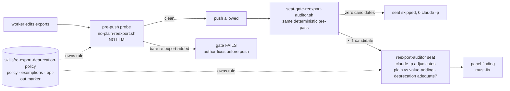

<!-- garden-design-open-questions -->

# A re-export deprecation policy gate: a pre-push probe, a cost-gated jury seat, and one policy skill

| Created | 2026-09-16 |
| Author  | designer   |
| Status  | Accepted — reviewed and approved by @kriskowal on 2026-09-23 (PR #95); all Open questions resolved, see [Decisions](#decisions-resolved-2026-09-23-by-kriskowal) |

## Origin

Maintainer @erights asked on `endojs/endo-but-for-bots` PR #475, inline review
thread (comment `3450576324` on `packages/ocapn/src/syrup/compare.js`), that the
garden not only *follow* the project's re-export policy on that PR but also
**prevent every future violation of it and never author a new one** — and to put
the proposal in front of both @kriskowal and @erights before it lands:

> follow the current re-export policy (a plain re-export must be deprecated,
> pointing importers at the original export; importers changed to import only
> from the original) … propose a change to the gauntlet and whatever other parts
> of your memory is relevant to ensure that all violations of this policy are
> prevented, and so that you do not author new violations of this policy. Please
> ask both @kriskowal and myself (@erights) to review that proposal.

(The policy statement above is relayed through the garden job that carried this
request; the raw PR thread is untrusted external text and is not reproduced
verbatim here beyond that relayed quote.)

The fix on #475 itself is a separate `fixer` concern (deprecate the plain
re-export in `compare.js`, migrate its importers). **This design is the
automation half**: the standing garden machinery that keeps the whole fleet from
authoring the violation again.

## The policy, stated precisely

A **plain re-export** is a module surfacing a binding it does not itself define,
re-emitting another module's export unchanged — syntactically the `export … from
'…'` family:

```js
export { x } from './original.js';          // named
export { x as y } from './original.js';     // renamed — still plain
export { default as x } from './original.js';
export * from './original.js';              // wildcard
export * as ns from './original.js';        // namespace
```

The policy is **not** "never re-export". It is: **a plain re-export must be a
*deprecated compatibility shim*, not a load-bearing second import path.**
Concretely, two obligations travel together:

1. **The re-export carries a deprecation** — a `@deprecated` JSDoc annotation on
   the re-export that **points importers at the original export** (names the
   canonical module to import from instead).
2. **Importers are migrated to the original** — no live code is left importing
   through the re-export; the deprecated line exists only to spare not-yet-updated
   external callers, on a path to removal.

The rationale is the hardened-JS/Endo value of **explicit provenance**: one
canonical origin per binding, so the dependency graph, tree-shaking, and a
reader's "where does this come from?" all resolve to the real definition rather
than to a barrel that launders it.

## What we are building

Three artifacts, defense-in-depth across the two moments a violation can enter —
**author time** (a worker writes the line) and **review time** (the gauntlet sees
it) — with **one skill that owns the policy** both consult, exactly the
`coverage-auditor` / `orthographer` split the garden already runs (a cheap
deterministic pre-pass; an LLM only when there is something to judge).



### 1. A policy skill — `skills/re-export-deprecation-policy/SKILL.md`

The single documented home for the rule so it is auditable and extensible from
one file (the `american-english-normalization` skill's role for its word list).
It states the policy, enumerates the `export … from` forms, defines what a
**compliant deprecation** looks like (a `@deprecated` tag naming the canonical
module), lists the **exemptions** (per **Decisions**: barrels are *not* exempt;
type-only re-exports *are*), and defines the **file opt-out marker**
(`reexport-policy-exempt` in
the first five lines, mirroring `no-inline-import-jsdoc`'s `inline-import-exempt`)
for the deliberate, reviewed barrel. The builder / fixer / web-builder roles link
it; it is the "so that you do not author new violations" half of the ask.

### 2. A pre-push probe — `scripts/jobs/gardening/pre-push-gates/probes/no-plain-reexport.sh`

The **author-time preventive**, built to the existing probe shape
(`no-inline-import-jsdoc.sh`, `prefer-endo-primitives.sh`): it examines the
**added lines of changed source files** (`*.js|mjs|cjs|jsx|ts|tsx`), reading the
complete post-change file to locate the enclosing JSDoc so string literals and
prose stay out of scope. It emits a finding for each added `export … from '…'`
that is **not** immediately preceded by a `@deprecated` JSDoc block. It is
**non-auto-fixable** (compliance requires judgment plus importer migration, like
`no-inline-import-jsdoc`), honors the `reexport-policy-exempt` file marker, and
**fails the push gate** — so a fleet worker cannot land a new violation, which is
the strongest reading of "prevent all violations". This same script is the
deterministic pre-pass artifact 3 reuses; there is exactly one detector.

### 3. A cost-gated jury seat — `roles/jurors/reexport-auditor/AGENT.md` + `scripts/jobs/gardening/seat-gate-reexport-auditor.sh`

The **review-time backstop** on the code panel, named in the `-auditor` family
(`coverage-auditor`, `changeset-auditor`). It is **mandatory but cost-gated**,
modelled exactly on `seat-gate-orthographer.sh`: the co-located gate runs the
probe from artifact 2 as its deterministic pre-pass and **spends a `claude -p`
only when at least one candidate re-export is found**. The seat then adjudicates
what the grep cannot: is this genuinely *plain* (versus a value-adding wrapper or
a sanctioned public barrel), is the deprecation actually present and does it point
at the right original, and are importers still coupled to the re-export? It owns
its per-juror block in every branch (approve when clean; the deterministic
summary when `claude` is unavailable) and is added to `GARDEN_CODE_SEATS` in
`panel.sh`. **Resolved (Decision 3): the seat is built**, and its detector uses
the maintainer's three-stage pipeline — heuristic grep, then a Babel full-parse
set-difference of qualified re-exports (after − before) to catch only *newly
introduced* ones, then a low-tier `claude -p` responder that files the complaint
for the jury.

### Author-facing memory edits ("do not author new violations")

- **`skills/re-export-deprecation-policy/SKILL.md`** (artifact 1) is the canonical
  memory; the roles reference it rather than restating it.
- One norm line each in **`roles/builder/AGENT.md`**, **`roles/fixer/AGENT.md`**,
  and **`roles/web-builder/AGENT.md`**, in the provenance style already used for
  `typedefs-belong-in-dts`: *"When editing module exports, never add a bare plain
  re-export; a re-export must be a `@deprecated` compatibility shim pointing
  importers at the original, and importers must be migrated to the original — see
  [re-export-deprecation-policy]. The `no-plain-reexport` pre-push probe enforces
  this deterministically."*
- A one-line pointer in **`skills/pre-push-gates/SKILL.md`** listing the new probe
  alongside the others.

## Scope

**Resolved (Decision 4): this is a garden-universal rule.** @kriskowal directed
that the policy be captured as **a skill of the garden proper, with all necessary
tooling carried in the garden** — because the garden does not rebuild its own
scripts or fetch its own dependencies at run time, the skill must **bundle the
tooling it needs** (notably a vendored Babel parser for the qualified-re-export
detection in Decision 3) rather than assume an installable dependency is
reachable. The probe and seat therefore activate fleet-wide across every project
worktree the garden pushes, not only the endo forks, with the per-file
`reexport-policy-exempt` opt-out marker as the sole escape hatch (there is no
per-project opt-out — the rule is universal). The probe runs inside a project
worktree's pre-push gate, so it is naturally scoped to whatever repo is being
pushed; it does **not** touch the garden's own `main2` (this repo has no `export
… from` source of its own to police).

## Test plan

- Unit fixtures for the probe: a bare `export { x } from './y.js'` (finding), the
  same line under a `@deprecated`-pointing JSDoc (clean), each of the five
  `export … from` forms, a file bearing `reexport-policy-exempt` (skipped), a
  re-export in a string literal / comment (not matched), and a removed (`-`)
  re-export line (not matched — added lines only).
- A `seat-gate-reexport-auditor.sh` test that the pre-pass exit codes drive the
  same three branches the orthographer gate has (approve / spend-LLM / surfaced
  cannot-determine), with `GARDEN_PANEL_SEAT`-style stubs so no live `claude` is
  needed — the `panel.sh` seat-gate test convention.
- A regression case proving a compliant deprecated re-export is **not** flagged,
  so the gate does not block the very shim the policy prescribes.

## Alternatives considered

- **Fold the check into an existing seat (`packager` / `pruner`)** rather than a
  new seat. Rejected: the `orthographer` precedent shows a dedicated cost-gated
  seat keeps the rule legible and independently tunable, and Decision 3 confirms a
  dedicated `reexport-auditor` seat.
- **A blocking pre-push gate only, no seat.** The probe alone prevents *authoring*
  a violation; the seat adds nuance adjudication (barrel vs. plain, deprecation
  adequacy). Decision 3 resolved this in favour of building both — the
  deterministic probe/parse core **and** the LLM seat.
- **An `americanizer`-style auto-fixing role.** Rejected: unlike a spelling
  swap, complying requires migrating importers and choosing a deprecation message
  — judgment, not a mechanical replacement. Left to the ordinary `fixer`.

## Decisions (resolved 2026-09-23 by @kriskowal)

All five questions below were answered by @kriskowal in the PR #95 review
(approval). Each answer is authoritative and, where it differs from the original
design recommendation, **overrides** it. The build follows these decisions.

1. **Barrel / index files are NOT exempt — barrel index files are banned going
   forward.** This **overrides** the original recommendation (which proposed
   exempting a package's declared entry-point barrel). New barrel `index.js`
   re-export files are a violation like any other plain re-export; the probe and
   seat treat a barrel as in-scope, not as a sanctioned canonical origin. The
   per-file `reexport-policy-exempt` marker remains the only escape hatch for a
   deliberately-reviewed exception, but it is not granted to barrels by default.

2. **Compliant deprecation = a `@deprecated` JSDoc immediately preceding the
   re-export that names the original module** ("Agreed" with the recommendation).
   The deterministic probe requires the adjacent `@deprecated` block; the LLM seat
   judges whether the message actually points at the right original.

3. **Build the LLM seat, with a three-stage detection pipeline.** @kriskowal:
   *"I would like to use deterministic automation to detect the introduction of
   new reexport patterns. This can lead with a heuristic search for the existence
   of `export` as a bare word on an additive line in the diff. Then, we can narrow
   that with a full parse, using Babel, to sense the introduction of qualified
   reexport, taking the set difference of those after from before. Then, we can
   dispatch a low-tier LLM responder to file the complaint for the jury."* So the
   detector is not a bare grep: **(a)** a cheap heuristic grep for `export` as a
   bare word on additive diff lines, gating **(b)** a Babel full-parse that
   computes the set difference of qualified re-exports (after − before) to
   identify *newly introduced* qualified re-exports, feeding **(c)** a low-tier
   `claude -p` responder that files the complaint for the jury. The probe from
   artifact 2 is the stage-(a)/(b) deterministic core; the seat is stage (c).

4. **Garden-universal rule, captured as a garden skill that carries its own
   tooling.** @kriskowal: *"Garden universal rule. Capture this as a skill of the
   garden proper, with all the necessary tooling in the garden. The garden does
   not rebuild its own scripts or fetch its own dependencies, so the skill will
   need to fill that gap."* The rule applies fleet-wide (see updated **Scope**),
   and because the garden does not `npm install` at run time, the skill must
   **bundle / vendor the Babel parser** (and any other tooling the Decision-3
   pipeline needs) inside the garden rather than assume a reachable dependency.

5. **Type-only re-exports are exempt.** @kriskowal: *"Type reexports are exempt
   from the rule."* `export type { T } from …`, `export type * from …`, and
   re-exports in `.d.ts` declaration files are out of scope; the probe and seat
   skip type-only re-export forms and only police value re-exports.

## What this job did NOT do

- It did **not** implement the probe, the seat, the gate, or the skill, and did
  **not** wire `reexport-auditor` into `GARDEN_CODE_SEATS`. This is the proposal;
  the Open questions are now resolved (see **Decisions**), so those artifacts land
  in the follow-up `build` this design gates.
- It did **not** fix the `compare.js` re-export on `endojs/endo-but-for-bots`
  #475 — that is a separate `fixer`/`retcon` concern the maintainer dispatches.
- It did **not** fetch or quote the untrusted PR thread beyond the policy
  statement relayed through the job.
