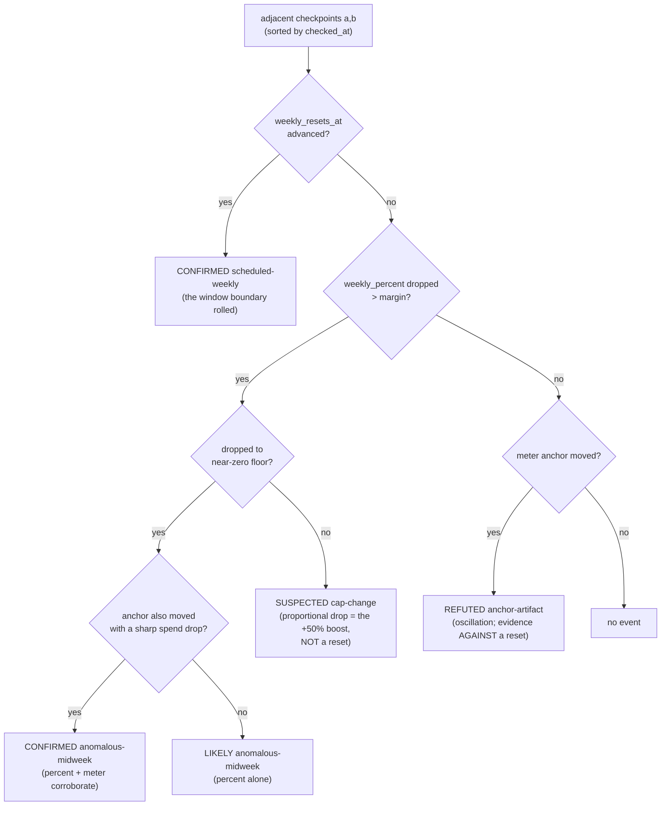

# Detecting and interpolating quota reset times from the checkpoint log

| | |
| --- | --- |
| Created | 2026-09-04 |
| Author | designer (gardener, job `design-reset-time-detection`) |
| Status | Proposed |
| Directive | kriskowal 2026-09-03: *"We should of course also be tracking quota reset times. We may have to extrapolate because quota necessarily intercepts 0 at some time between a high quota usage measurement and a low quota usage measurement. In general, we can infer the exact time of the Friday 8pm Pacific reset, but Anthropic occasionally resets mid-week, as they did on Tuesday this week."* |
| Composes with | [`manual-quota-calibration.md`](manual-quota-calibration.md) (the sibling ratio-fit; shares the checkpoint log and the measure/actuate boundary) |

The sibling design [`manual-quota-calibration.md`](manual-quota-calibration.md) fits the
tokens-per-percent **ratio** from the manual quota-checkpoint log. This one answers the
orthogonal question over the same log: **when did each host's weekly quota reset?** The
scheduled Friday-8pm-Pacific reset is contractual and needs no inference; the problem is
the **anomalous mid-week** reset, which nothing announces — its only trace is a usage
drop between two samples, and recovering its timing requires a detector that deliberately
looks for that signature and, crucially, separates a real reset from the two confounds
that mimic one. This design specifies that detector, ships it as a deterministic no-LLM
script tested against the real seed, and decides how a detection feeds the fleet.

It reuses, and does not duplicate, the sibling's infrastructure: the same
`journal/budget/manual-checkpoints/<host>.jsonl` input, the same measure/actuate boundary
(the detector never writes `config/budget-pools`), and a `journal/budget/reset-events/`
log seeded by hand this session, whose README already anticipates this detector's schema.

## 1. The sensor problem: percent is ground truth, the meter anchor is not

Three quantities move in the data, and only one is a trustworthy reset sensor:

- **`weekly_percent`** — Anthropic's own dashboard reading, transcribed by a human. It is
  **independent of the local meter** and it only ever *grows* between resets (usage in a
  window is cumulative). Therefore **any genuine drop in `weekly_percent`, beyond the
  ±0.5% display-rounding band on each reading, means the window rolled over to zero in
  that bracket** — a spend-only trajectory cannot lower it. This is the primary sensor.
- **`weekly_resets_at`** — the dashboard's stated next-reset time, also human-transcribed.
  When it **advances** between two checkpoints, the window boundary itself moved forward:
  a reset *definitely* happened in that bracket. This is the *definitive* sensor when
  present, stronger than a percent drop because it cannot be produced by any confound.
- **`meter_window_start_epoch`** — the **local** meter's own anchor, re-derived every tick
  by `usage-meter.sh`'s `_meter_entitlement_cutoff` (it scans the CLI session logs for a
  `seven_day` rejection followed by a fresh success and moves the anchor there). This field
  is **not ground truth**: it is the output of an *existing, imperfect* reset detector that
  **oscillates** between two fixed anchors (`manual-checkpoints/README.md` escalation), and
  when it moves, `meter_spend_tokens` swings independent of real usage. It is a *second,
  corroborating* signal, never a primary one.

Two confounds also lower `weekly_percent` or move the anchor **without a reset**, and the
detector must reject both:

1. **A mid-window cap increase** (the +50% boost through 2026-09-13). The denominator grew,
   so `weekly_percent` drops **proportionally but stays well above zero**, `weekly_resets_at`
   does **not** advance, and meter spend is unchanged. This is a *cap change*, not a reset.
2. **The meter anchor oscillation.** `window_start_epoch` flips, so `meter_spend_tokens`
   swings, but the dashboard percent and `weekly_resets_at` do not move. An anchor
   transition with **no accompanying dashboard-percent drop** is the artifact, whichever way
   spend moves (flat on a backward reversion, or collapsing on a forward jump).

## 2. The detector — `detect-quota-resets.sh`, deterministic, no LLM

The detector walks the time-sorted checkpoint rows and classifies each adjacent pair
`(a, b)`. The whole classification is one `jq` pass; the decision order is what makes it
safe (a definitive signal is checked before an ambiguous one, and an artifact is named
rather than silently dropped):

**The discriminating rule for cross-validation (scope 2), settled.** An anchor transition
corroborates a reset **only when the dashboard percent also dropped** (branch `G`). An
anchor transition with **no percent drop** is classified `refuted` — the artifact — whether
spend is roughly flat (a backward reversion) or swings sharply (a forward jump that shortens
the summed window). The dashboard is the ground truth; if it did not move, the local anchor
moving is meter noise, never a reset. This is stricter and more correct than "flat spend
argues against a reset" alone, because the oscillation's forward-jump shape is *not* flat
yet is still an artifact.

**Interpolating the crossing time (scope 1).** Within a `confirmed`/`likely` bracket the
detector estimates `reset_at` by, in preference order:

1. **Meter token-spend rate** from the *following* same-anchor pair `(b, c)`:
   `rate = (c.spend − b.spend) / (c.t − b.t)`, then `reset_at = b.t − b.spend / rate`.
   This is the scope's named model. **Assumption: a constant burn rate across the reset
   boundary** — the burn just after the reset equals the burn that was in flight at the
   reset instant. **How wrong it can be:** the error is proportional to the ratio of the
   true instantaneous burn at the reset to the averaged post-reset burn; a reset that lands
   in a lull followed by a burst (or vice-versa) skews the estimate toward the busier side.
   A same-anchor requirement guards against ratio'ing across an oscillation.
2. **Dashboard-percent rate** (anchor-independent) as a fallback when the following pair
   crosses an anchor or has no usable spend: `reset_at = b.t − b.percent / percent_rate`.
   Same constant-burn assumption, but immune to the meter oscillation.
3. **Bracket only** when no following rate exists: `reset_at` is the bracket midpoint,
   `reset_at_precision: "bracketed"`, with `bracket_lower`/`bracket_upper` the two
   checkpoint times. This is the honest floor — "somewhere in this interval" — and is what
   the seeded log's schema already calls `bracketed`.

The interpolated instant is only accepted if it lands **inside** the bracket; otherwise the
detector falls back to the midpoint. Grades map to the seeded log's `reset_at_precision`:
an interpolated crossing is `extrapolated`, a bracket midpoint is `bracketed`, a
`weekly_resets_at`-advance without interpolation is `bracketed`.

### What it finds on the real seed (the honest result)

Run against the real `endolin-garden-ece02cb4` checkpoint log (10 checkpoints, all recorded
*after* the 2026-09-01 event and all inside one weekly window — `weekly_resets_at` is a
constant `2026-09-05T03:00:00Z` throughout):

- **0 confirmed / 0 likely reset events.** Correct: no reset occurred *during the observed
  window*, and the detector does not invent one. The 2026-09-01 event predates the first
  checkpoint entirely, so it is out of this log's reach — it lives in the reset-events log
  as the hand-pinned `exact` row and is not re-derivable from checkpoints that all postdate
  it (see Open questions).
- **2 refuted anchor-artifacts**, reproducing *both* hand-recorded `unknown` rows to the
  bracket: the 20:57→21:18 backward reversion (flat spend, 0.7% change) and the 23:45→00:49
  forward jump (sharp 65.5% spend swing) — both correctly named artifacts because
  `weekly_percent` did not drop across either. The detector independently arrives at the
  same judgment the humans reasoned to by hand.

That is the detector working: it certifies nothing it should not, and it labels the meter's
own noise as noise. A synthetic fixture series (in the test) exercises the confirmed
scheduled-weekly, confirmed/likely anomalous, and cap-change-suspected branches the real
seed does not contain.

## 3. How a detected reset feeds the fleet — notice, never silent actuation (scope 3)

The detector **measures and records; it does not actuate.** It writes no cap, no worker
count, and clears no hold on its own — the same boundary the sibling fit draws, for the
same reason (`cybernetics-audit.md` § 2.3: never wire an auto-derived setpoint straight to
a full-authority actuator). What a detected anomalous reset *earns* is a **coalesced
maintainer notice**, delivered through the existing `watchdog-notice.sh` under the key
`quota-reset-<host>`, so repeated detections of the same event fold into **one** inbox
entry (the same dedup that fixed the 94-message flood), not one per tick. The notice states
plainly that nothing was changed and names the two things that are *safe to do sooner than
the next scheduled Friday* once the reset is confirmed genuine:

- **Clear a stale weekly `provider-quota-backoff` hold.** Jobs parked with a
  `<!-- garden-provider-quota-backoff: type=weekly reset-at=… -->` marker are held until
  that `reset-at` (the reaper releases them then). A genuine reset *earlier* than the marker
  means those jobs could run now; surfacing it lets the maintainer (or a proxy) release them
  rather than idling until Friday.
- **Take a fresh calibration checkpoint** (`append-quota-checkpoint.sh`) so the sibling fit
  re-grounds against the post-reset window instead of waiting for the scheduled cadence.

Deliberately **not** done automatically: the design does **not** override a human's stated
reset expectation, and does **not** auto-rewrite `config/budget-pools`. kriskowal's framing
("Anthropic occasionally resets mid-week") and the `config/budget-pools` header's framing
("a local credential-refresh artifact, *not* a new ceiling") are *both live readings of the
same 2026-09-01 evidence*; a detector that silently actuated on either would be picking the
unresolved question for the maintainer. The notice surfaces; the human decides. (Whether a
future, better-grounded posture should auto-release a weekly hold on a `confirmed`
`weekly_resets_at`-advance — the one signal no confound can forge — is an Open question.)

## 4. Durable recording without a hand-written row (scope 4) — `append-reset-event.sh`

Mirroring the sibling's `append-quota-checkpoint.sh`, `append-reset-event.sh <host>
--type … --precision … [--at | --bracket-lower/--bracket-upper]` is the CAS-racing append
path for the reset-events log, so a detection becomes one command instead of a hand-edit.
The detector's `--append` flag records only `confirmed`/`likely` **reset** findings
(never a `suspected` cap-change or a `refuted` artifact), **idempotently** by a
`detector_key` (`<host>|<lower>|<upper>|<type>`): re-running the detector never appends a
duplicate row for an event it already recorded. `refuted` and `suspected` findings stay in
the detector's JSON output for legibility but are deliberately kept out of the event log —
the log records *events*, and the artifacts are non-events by construction.

The reset-events README's row schema is unchanged; this design adds two optional fields the
detector populates and a hand row omits: `grade` (`confirmed|likely|suspected|refuted`) and
`detector_key` (the idempotence key). The seeded `exact`/`scheduled` rows remain valid.

## Build slice (this job ships items 1–3; 4 is the notice wiring, shipped as opt-in)

1. `detect-quota-resets.sh` — the classifier + interpolator writing findings JSON (§ 2).
   **Built and tested in this job** (`test/detect-quota-resets-test.sh`, 10 assertions;
   reproduces both real hand-recorded artifacts).
2. `append-reset-event.sh` — the durable, idempotent ingestion path (§ 4). **Built.**
3. `--append` (record confirmed/likely resets) and `--notify` (coalesced maintainer notice
   for an anomalous detection, § 3). **Built, off by default** — the detector measures;
   recording and notifying are opt-in, so a scheduled run cannot actuate by surprise.
4. A recurring wiring (a `set-schedule.sh` entry running `detect-quota-resets.sh <host>
   --append --notify` per host on a cadence) is **reserved**, not armed here, pending the
   Open question on whether `endolin-garden2` (unmetered, temporary API key) needs it at all
   and the maintainer's call on auto-notify cadence.

## Coordinated follow-up with manual quota calibration

The implementation authorized through
[`manual-quota-calibration.md`](manual-quota-calibration.md) remains the first stage. Its
fit must split on temporal contiguity and must never pool observations across a genuine
quota reset, even if the local meter later returns to an earlier anchor. Reset detection
then follows as a second sensor over the same checkpoint stream rather than competing with
the fit or adding another actuation path.

The durable follow-up job `kriscendobot-garden-pr83-reset-calibration-followup` is blocked
on the complete PR 80 calibration campaign. It will add the detector's classifications to
that campaign's seven daily effectiveness observations, check that reset boundaries are
also fit boundaries, and include both mechanisms in the seventh-day synthesis. Every host
with a checkpoint log remains in measurement scope, including a temporarily `unmetered`
host, but observation alone neither promotes a cap nor releases a quota hold. The week of
joint evidence decides the permanent cadence, notice coalescing, and whether to enable the
already-built opt-in append/notify path. This sequencing reconciles the two in-flight
designs without duplicating either implementation or silently granting the reset sensor
actuator authority.

## Alternatives considered

- **Read `budget/live/<host>` git history for anchor transitions** (how the seeded
  `unknown` rows were originally found). Rejected as the *primary* path: it is journal-git
  archaeology, expensive and fragile, and every anchor transition it surfaces is exactly the
  meter-oscillation signal the detector already treats as *secondary*. The checkpoint log
  carries `meter_window_start_epoch` per row, so the same signal is available without git
  history, and the dashboard percent — the actual ground truth — is only in the checkpoint
  log anyway.
- **Interpolate on the dashboard percent rather than the meter spend.** The percent is
  coarser (integer, display-rounded) so its rate is noisier, but it is anchor-independent.
  Decision: prefer the meter token-rate when a same-anchor following pair exists (scope's
  named model), fall back to the percent rate when it does not — keeping both rather than
  committing to one.

## Open questions

- **Was the 2026-09-01 event a genuine Anthropic-side reset or a local credential-refresh
  artifact?** This is the unresolved tension the reset-events README already holds open, and
  this design does not resolve it — it *formally holds* it: the event is out of the
  checkpoint log's reach (every checkpoint postdates it), so the detector neither confirms
  nor refutes it, and the hand-pinned `exact` row plus both interpretations stand. The
  discriminator that *would* settle a *future* such event is now explicit (a
  `weekly_resets_at` advance = genuine; a proportional percent drop with fixed `resets_at` =
  a boost; an anchor move with no percent drop = an artifact), so the next occurrence is
  classifiable even though this one remains ambiguous.
- **Does an off-cycle reset shift or cancel the scheduled Friday cadence?** The seeded log
  assumes not (an anomalous reset does not cancel the scheduled row). The detector inherits
  that assumption; a future occurrence where `weekly_resets_at` after a mid-week reset lands
  somewhere *other* than the next Friday would disprove it. Not decidable from current data.
- **Should a `confirmed` `weekly_resets_at`-advance auto-release a weekly quota-backoff
  hold?** That signal alone is un-forgeable by either confound, so it is the safest possible
  candidate for the one automatic action this design otherwise withholds. Left deliberately
  as notice-only here; promoting it to an auto-release is a real, bounded next step for the
  maintainer to authorize, not a default.
- **Does `endolin-garden2` need reset detection at all while it runs on a temporary API
  key?** It is `unmetered` in `config/budget-pools`, so no weekly ceiling gates it and no
  hold accrues to release; its reset log stays useful only as a historical record until the
  key lapses and a real weekly window returns. Same shape as the sibling's final open
  question.
- **Should the notice cadence coalesce across hosts** the way the fleet-level
  `provider-quota` notice does, or stay per-host (`quota-reset-<host>`)? A reset is a
  per-account event, so per-host is the default here; a simultaneous fleet-wide reset would
  produce N entries rather than one. Deferred.
