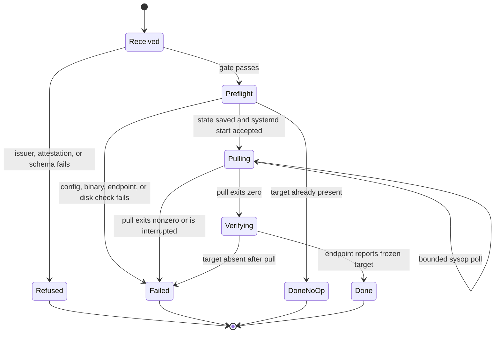

# Host-addressed local-model provisioning

## Decision

Add `local-model` to the sysop's closed operation vocabulary. The operation means:
make the model selected as this host's `local` routing default present in this
host's garden Ollama endpoint. The message carries no model name, tag, URL, or
registry. The target is resolved on the addressed host from its deployed model
configuration and must pass the exact closed classification in
[`model-tier-inventory.tsv`](../scripts/jobs/model-tier-inventory.tsv).
This extends the host-addressed channel in [the sysop design](sysop.md). It does not
change [`requires:` capability gating](host-requirements-gating.md), which cannot
reserve a job for a named host, or the model classification described in the
[provider catalog](provider-model-catalog.md).

`local-model` joins the sysop's destructive trust tier. It requires `authorized_by:`
naming a login on `maintainers/allowlist`. A model pull can consume tens of gigabytes
of disk and egress. Exhausting a follower's disk can stop its journal consumers and
workers, so attestation is required regardless of which garden host issues the op.

This inherits the sysop's existing trust boundary: journal push access is the real
authentication boundary, while `from_host` and `authorized_by` are self-asserted.
Maintainer attestation prevents accidental use and leaves a reviewable claim of
authorization; it does not stop a compromised journal writer from forging that
claim. Cryptographic authorization remains a separate hardening project.

The sysop never runs the pull. It resolves and validates the request, records local
state, and asks systemd to start one fixed, non-enabled
`garden-local-model-pull.service` with `--no-block`. Each later sysop tick performs a
bounded poll and reports a state transition. The service runs a deterministic
helper with no sysop tick timeout and writes a terminal result to host-local state.
This keeps `sysop.sh` a timer-driven oneshot, not a process supervisor.

The operation does not enable, start, stop, or change the enablement policy of
`garden-ollama.service`. That service remains owned by the existing hermit scaler
and `unit` operation. In particular, `hermits: 0` keeps it disabled. Provisioning
requires the garden endpoint to be active and reachable first. An operator normally
establishes that desired state with `set-workers kind=hermit count=N`; an attested
`unit action=start` is available for an intentional one-off start. The provisioning
op refuses an unreachable endpoint instead of silently overriding either policy.

## Message and target resolution

The sender shape is:

```sh
scripts/jobs/send-host-op.sh <GARDEN> \
  op=local-model authorized_by=<maintainer-login>
```

The operation accepts no operation-specific field other than `authorized_by`.
`reply_to`, when present, remains common sysop routing metadata. A `model`, `tag`,
`url`, `registry`, or other extra operation field is a parse error. This makes an
arbitrary pull unrepresentable in the message vocabulary.

On receipt, the target host:

1. Reads `model_routing_default local` from its current deployed configuration.
2. Requires `model_dispatch_tier local "$target"` to find that exact target in the
   deployed `model-tier-inventory.tsv`. A routing override cannot classify a new
   tag by itself.
3. Reads the target's reviewed `pull_bytes` metadata from an optional fourth
   inventory column. This column is blank for models that are not locally
   provisioned and required for the selected local target. All inventory readers
   must read the existing first three columns separately so the dispatch tier does
   not absorb the new field.
4. Freezes the target, dispatch tier, pull size, deployed garden commit, and
   inventory digest in the execution record before starting the service.

Missing defaults, failed classification, duplicate matching rows, and missing or
invalid `pull_bytes` all fail closed before network or unit activity. The related
local-routing repair can therefore replace the current phantom pin in the inventory
without a second tag embedded in sysop code. A host must deploy that corrected
inventory before receiving `local-model`; the audit record makes a stale deployed
inventory visible.

## Preconditions and guards

The sysop evaluates these checks in order after the trust gate:

1. `ollama` resolves to an executable. If not, record and ack a failed precondition.
   Package installation is outside the sysop vocabulary.
2. The configured garden endpoint responds within a short bounded probe. The pull
   client uses `OLLAMA_HOST` derived from `GARDEN_LOCAL_OLLAMA_URL`, so the content
   lands in the store owned by the daemon that hermits actually use. A system
   Ollama instance on `:11434` does not satisfy this check.
3. Reuse the local provider's exact presence predicate, including the defined
   unqualified-name to `:latest` normalization. If the endpoint already reports the
   target, finish as `accepted-and-applied` with detail `already present`; do not
   start the pull unit or perform a network request.
4. Determine free bytes with `df -PB1` on the filesystem containing the serving
   user's model store. A shared helper resolves `OLLAMA_MODELS` when configured and
   otherwise the garden service's bot-user default under `$HOME/.ollama`; the
   service and provisioner must use that same helper. Require
   `free_bytes >= pull_bytes + max(10 GiB, pull_bytes / 4)`. The first term covers
   the expected new blobs and the second preserves operating headroom and download
   staging space. Report both required and observed bytes on refusal. Shared layers
   and partial downloads do not reduce this conservative preflight requirement.
5. Acquire a host-local `flock` and check for an active execution. A request for the
   same frozen target attaches to that execution and receives its eventual terminal
   result. A request for a different target is refused as busy; it does not cancel
   or retarget the active pull.

The free-space check is a preflight, not a reservation against unrelated writers.
If disk availability changes during the pull, Ollama's nonzero exit becomes a
terminal failure. The helper does not delete models, blobs, or partial downloads;
cleanup is a separate destructive decision, outside this operation.

## Async execution and state

`garden-local-model-pull.service` is a static `Type=oneshot` unit with no `[Install]`
target, so routine unit installation does not enable it. It has no sysop or handler
wall-clock limit (`TimeoutStartSec=infinity`), is started only by an accepted
request, and is supervised by systemd. Its `ExecStart` takes no model argument. The
helper reads the frozen target from the state file written by the sysop, rechecks
its closed-inventory classification, and runs only:

```sh
OLLAMA_HOST="$(ollama_serve_host)" ollama pull "$validated_target"
```

State lives under `$GARDEN_STATE/sysop/local-model/`, outside the journal and the
deployed checkout. Writes use a temporary file plus rename. It holds one execution
record, terminal result, and a set of attached sysop message ids. Journal records
remain at the existing required path
`sysop-log/<GARDEN>/<msgid>.md`.



Every sysop tick polls local-model state with a short timeout before consuming new
messages. Polling never waits for `ollama pull`. It compares the helper's state and
the systemd unit's `ActiveState`/`Result`, then does one of three things:

- While the unit is active, retain `accepted-in-progress`. Emit an ack when the
  phase changes and a throttled heartbeat at most once every ten minutes. Each
  heartbeat reports target and elapsed time; progress percentages are omitted
  unless Ollama exposes a stable machine-readable value.
- When the helper records success, independently rerun the endpoint presence probe,
  then finalize every attached message as `accepted-and-applied` and ack `done`.
- When the helper records failure, or the unit becomes inactive without a terminal
  result, finalize every attached message as `failed` with the unit result and a
  bounded diagnostic tail. A new attested message is required to retry.

A sysop restart reconstructs polling from the host-local execution record. A cursor
replay sees the corresponding nonterminal sysop log and attaches rather than
starting another pull. A terminal log remains the replay/idempotence belt used by
all existing operations.

## Logging and acknowledgments

The first accepted tick creates or updates
`sysop-log/<GARDEN>/<msgid>.md` with `op`, `from_host`, `authorized_by`, `host`,
`target`, `pull_bytes`, `inventory_digest`, `deployed_sha`, `phase`, `outcome`,
`started_at`, `updated_at`, and `detail`. Unlike existing single-tick operations,
the presence of this file is not by itself terminal. `outcome:
accepted-in-progress` means the next tick must poll; terminal outcomes are
`accepted-and-applied`, `refused`, `parse-error`, and `failed`. Updates use the
producer clone's existing compare-and-swap retry path.

The sysop sends two classes of ack:

- `accepted-in-progress` after systemd accepts the nonblocking start, or after a
  duplicate request attaches to the active execution. This proves the message
  arrived and names the target selected by the host.
- A terminal ack with `done`, `refused`, `parse-error`, or `failed`. A clean no-op is
  `done` with detail `already present`.

If the target host never ticks, neither ack nor sysop log appears. If it starts and
later loses journal access, local execution continues and the sysop retries the
pending log and terminal ack on later ticks. The sender can therefore distinguish
never arrived, in progress, done, refused, and failed.

## Host and fleet safety

The op preserves the sysop's standing boundaries:

- It runs on leaders and followers because the unattended follower is the use case.
  Each daemon still reads only `msgs/host/<its-own-GARDEN>`.
- It still ticks under drain. An attested pull may start or finish while drained,
  and a pull does not prevent the sysop from processing `drain off` or another fast
  operation on later ticks.
- It mutates only the addressed host's model store, host-local state, user systemd,
  audit path, and ack topic. There is no broadcast or cross-host action.
- It runs no `claude`, claims no jobs, interprets no prose, touches no credentials,
  and adds no ferry or identity-switch surface.

## Failure modes

| Condition | Result |
| --- | --- |
| Issuer or maintainer attestation fails | Refuse before parsing execution inputs; log and ack the reason. |
| Local default is absent, stale, unclassified, duplicated, or lacks size metadata | Fail closed with the deployed commit and inventory digest; no network access. |
| `ollama` is absent | Failed precondition; installation remains a host-image operation. |
| Garden Ollama endpoint is disabled or unreachable | Failed precondition; do not start or enable it. Report the `hermits: 0` interaction and the existing scaler/unit remedies. |
| Model is already served | Clean terminal no-op; no pull service and no egress. |
| Free space is below the threshold | Refuse with observed and required bytes; no pull service. |
| Same target is already pulling | Attach the new message id; one pull, separate terminal logs and acks. |
| A different target is already pulling | Refuse as busy; never cancel or switch the active execution. |
| systemd rejects the start | Terminal failure; preserve diagnostic result and do not report in progress. |
| Pull exits nonzero or post-pull verification fails | Terminal failure; retain Ollama's partial state and require a new attested request to retry. |
| Host reboots during pull | On the next tick, inactive-without-result becomes `failed: interrupted`; do not retry silently. |
| Journal write or ack fails after local start | Keep pending delivery in host-local state and retry on later ticks; never rerun a completed pull just to recreate an ack. |
| Host is down or sysop is disabled | No log and no ack, which remains distinct from every arrived outcome. |

## Verification plan

A deterministic stub harness should demonstrate:

- a message cannot carry a model or unknown operation field, and a routing default
  not exactly classified by the inventory starts no unit;
- issuer and maintainer gates both run before endpoint, disk, or network probes;
- an already-present target is a no-op, a missing binary or endpoint fails without
  changing `garden-ollama`, and insufficient disk reports exact observed and
  required byte counts;
- the first tick returns while a stub pull remains active, later ticks emit bounded
  in-progress reports, and a final tick records and acks success or failure;
- cursor loss, sysop restart, and a second same-target message do not start a second
  pull, while a different target is refused as busy;
- the sysop continues to process a fast `drain off` message while the pull unit is
  active, and the path works with the host drain marker present; and
- every outcome produces `sysop-log/<GARDEN>/<msgid>.md` and an ack, while no test
  path invokes `claude`, touches a foreign host path, or enables the pull or Ollama
  service.

## Considered and rejected

- **Run `ollama pull` inside the sysop tick.** Rejected because it blocks every
  other host operation and collides with the sysop's 900-second oneshot budget and
  the fleet's already costly long-handler failures.
- **Fork a detached `nohup` child.** Rejected because a reboot, deploy, or lost pid
  leaves no authoritative lifecycle or exit result. A fixed systemd unit supplies
  supervision without adding a supervisor loop to sysop.
- **Carry `model=<tag>` in the message.** Rejected because journal issuers would gain
  an arbitrary registry and disk-write selector. The deployed closed inventory is
  the only source of the target.
- **Use `requires: local` or add job-board host affinity.** Rejected because
  capability gating does not reserve a job for a named host, and an LLM job handler
  is the wrong execution path for host provisioning.
- **Use only the journal-push authorization boundary.** Rejected because a tens-of-
  gigabytes pull can exhaust disk and remove an unattended follower from the fleet.
  Maintainer attestation is required for the same consequence-based reason as other
  destructive sysop ops.
- **Have `local-model` enable or start `garden-ollama`.** Rejected because it would
  race the scaler's `hermits: 0` policy and duplicate the existing `unit` and worker
  scaling controls. Provisioning fails visibly until the endpoint's desired state
  is established separately.
- **Automatically delete old models or partial blobs to make room.** Rejected because
  the sysop cannot infer which local data is expendable. Deletion needs its own
  separately designed, attested vocabulary if it is ever added.
- **Broadcast one request to the fleet.** Rejected because host-scoped construction
  is the safety boundary. Provisioning two hosts is two addressed messages with two
  independent logs and acknowledgments.
