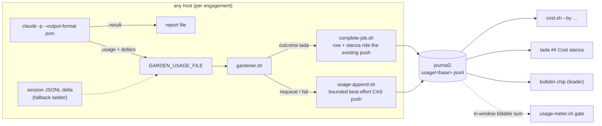

# An attributed per-job token-cost ledger for the garden fleet

| Created | 2026-07-10 |
| Author  | designer (job `design-token-cost-ledger`) |
| Status  | Accepted (maintainer-commissioned 2026-07-10, routed from the `scholar-ingest-unum` library ingest; builder follow-up expected) |

The garden meters token spend at exactly one granularity today:
[`usage-meter.sh`](../scripts/jobs/usage-meter.sh) sums the fleet's billable
tokens over a trailing weekly window so the foreman can back off before the
weekly quota. That is a fleet-wide quota **gate** (plain code, no LLM). It works
and it stays. But it cannot say *which job, role, or model* spent the tokens,
keeps no per-job persisted record, and gives the maintainer no "where did the
spend go" view. This design adds the complementary instrument: an attributed
per-job cost **ledger** that measures and attributes spend, on unum's proven
pattern. **The ledger measures; the gate caps.** The ledger can feed the gate
(§ Feeding the gate); it never replaces it.

Grounding (read alongside this document):

- Library concept **cost-ledger** with worked sections
  `library/sections/unum--token-cost-ledger.md` (the record and capture) and
  `library/sections/unum--cost-attribution-and-aggregation.md` (grouping and the
  three surfaces), all on the `journal2` branch.
- [`tada-token-accounting.md`](tada-token-accounting.md) (Accepted 2026-07-09,
  not yet built): deterministic per-engagement token capture, the journal-backed
  per-base usage ledger, and the machine footer on the tada report.

## Relationship to tada-token-accounting.md: one build, widened record

The accepted [tada-token-accounting](tada-token-accounting.md) design already
settled the hard mechanics, and this design keeps every one of its decisions
and invariants wholesale:

- **Capture is code-driven, never the agent** (no LLM anywhere in the capture,
  storage, or annotation path; the agent can neither author nor destroy the
  record).
- **Engagement boundary**: one ledger row per `$GARDEN_JOB_HANDLER` invocation,
  every outcome (`tada`, `requeue`, `fail`), accumulating across requeues,
  gardeners, and hosts.
- **Measurement**: the per-base session-transcript delta with the two-layer
  handler-primary / `gardener.sh`-fallback contract (its § a), never a time
  window.
- **Store location and lifecycle**: a per-base file under `usage/` at the
  journal top level on `journal2`, outliving the job's board presence; the
  completion row rides `complete-job.sh`'s existing commit; non-completion rows
  go through a bounded best-effort CAS appender.
- **The re-stamped machine footer** on the tada report at every doin→tada
  transition, delimited by `<!-- garden-usage-begin -->` /
  `<!-- garden-usage-end -->`, strip-then-regenerate.
- **Fail-open everywhere**: accounting can never block or fail a completion.

What that design captures is a single integer (billable tokens) per engagement.
This design widens the same row into unum's attributed **CostRecord** (all four
token classes, the CLI-computed dollars, wall-clock, host rusage, and the
attribution tags) and adds the read side (aggregation and surfaces) that a
single integer cannot support. Since neither design is built yet, **the builder
implements the merged shape once**: one ledger, one footer, one capture ladder.
Where the two documents differ (file format, row schema, capture primary), this
document governs; everything it does not restate carries over from
tada-token-accounting unchanged, including its builder task list as amended in
§ Build phasing.

## The record

One JSON line per engagement, appended to `usage/<base>.jsonl` on `journal2`
(the accepted design's `usage/<base>.tsv`, format widened; § The storage shape
has the rationale). The schema adapts unum's `CostRecord` to the garden's
vocabulary: unum's `task` is the **job base**, unum's `channel`/`persona` is
the **role**, unum's realm is the **host** (`$GARDEN` shard identity).

```jsonc
{
  "ts": "2026-07-10T23:41:12Z",        // engagement end, RFC3339 (sorts lexicographically)
  "base": "design-token-cost-ledger",  // job base: the attribution key (unum's task)
  "host": "endolin-garden2-5bcdff64",  // $GARDEN shard identity, not raw hostname
  "gardener": 7,                       // worker index on that host
  "session_id": "8f2a…",               // deterministic uuid5 from the base
  "role": "designer",                  // job frontmatter `role:` (omitted when absent)
  "model": "claude-fable-5",           // resolved model id passed via --model
                                       //   (omitted = fleet default model)
  "trigger": "maintainer",             // job provenance, when stamped (omitted until
                                       //   producers stamp it; § Open questions)
  "outcome": "tada",                   // tada | requeue | fail
  "source": "result",                  // capture layer: result | delta | fallback | none
  "elapsed_s": 1841,                   // handler wall-clock
  "num_turns": 23,                     // from the result envelope (omitted on delta paths)
  "input_tokens": 12847,
  "output_tokens": 3412,
  "cache_creation_tokens": 8200,
  "cache_read_tokens": 4600,
  "total_cost_usd": 0.1342,            // CLI-computed dollars (omitted on delta paths)
  "cpu_user_ms": 331000,               // rusage of the claude subprocess tree,
  "cpu_sys_ms": 74000,                 //   best-effort via /usr/bin/time
  "peak_rss_kb": 611000                //   (all three omitted when unavailable)
}
```

Conventions carried from unum, all load-bearing:

- **Store both the provider's dollars and the raw tokens.** The Claude CLI
  computes `total_cost_usd` at run time against live rates, so no local rate
  table exists to drift; the four raw token classes stay the durable,
  re-priceable truth. (The fleet bills through a Max subscription, so the
  dollars are *notional* API-rate pricing, not an invoice. They remain the
  right cross-model comparable and the operator's natural ordering key; the
  [gardener-reputation-bootstrapping](gardener-reputation-bootstrapping.md)
  design already reasons in notional dollars.)
- **Omit-when-empty attribution.** A field the capture layer could not supply
  is absent, never `""` or `0` pretending to be data. A row with no token
  fields at all (`"source":"none"`) still records that the engagement happened;
  readers count such rows as "unmetered" rather than folding zeros.
- **Tokens spent are recorded regardless of disposition.** A `requeue` or
  `fail` engagement spent real tokens and gets its row; the accepted design's
  constraint 2 already requires this.
- The gate's **billable** definition (input + output + cache_creation,
  cache_read excluded unless `GARDEN_TOKEN_COUNT_CACHE_READ=1`) is *derivable*
  from every row, so the ledger can feed the gate without a schema change.

## Capture: where the numbers come from

A three-layer ladder, refining the accepted design's § a. Layers 2 and 3 are
exactly that design's primary and fallback; layer 1 is new and strictly richer
when available.

1. **Primary: the CLI's terminal result envelope.**
   [`gardener-claude.sh`](../scripts/jobs/handlers/gardener-claude.sh) switches
   its invocation to `claude -p --output-format json`, extracts `.result` to
   the report file (byte-preserving, so the completion-marker contract and
   `report_has_completion_marker` are untouched) and folds `.usage`,
   `.total_cost_usd`, `.num_turns`, and `.duration_ms` into the
   `$GARDEN_USAGE_FILE` handoff (widened from the accepted design's
   `<tokens>\thandler` line to one JSON object). This is unum's capture
   decision transplanted: the CLI accumulates usage across the invocation's
   turns and prices it; store the CLI's numbers rather than re-deriving them.
   `meter_claude` in [`usage-meter.sh`](../scripts/jobs/usage-meter.sh) already
   parses this exact envelope, so the shape is proven in this codebase. A
   `--resume` invocation's envelope covers only that invocation's turns, which
   is precisely the engagement boundary. Rows carry `"source":"result"`.
2. **Secondary: the per-class session-log delta.** When the envelope is
   missing or malformed (claude killed by the `timeout` wrapper, a truncated
   write), the handler-or-gardener before/after delta over the job's own
   session JSONL applies, unchanged from the accepted design except widened
   from one billable integer to the four-class tuple (the session logs carry
   all four classes per turn; the same jq/awk dedup pipeline emits four sums
   instead of one). No dollars and no `num_turns` on this path: those fields
   are omitted, and read-time aggregation reports how many rows in a group
   were unpriced. Rows carry `"source":"delta"` (handler-measured) or
   `"source":"fallback"` (`gardener.sh`-measured after a handler kill).
3. **Last resort: `"source":"none"`.** Both meters failed (no jq, unreadable
   log dir). The row still lands, tokenless, and every surface counts it as
   unmetered rather than silently dropping the engagement.

**Host rusage** (the compute triple) is captured by wrapping the `claude`
subshell in `/usr/bin/time -o <tmpfile>` with a format string emitting user ms,
sys ms, and max RSS. `wait(2)` rusage includes waited-for children, so the
agent's tool subprocesses are counted. Best-effort and omitted when
`/usr/bin/time` is absent or the wrapper fails; never a reason to touch the
exit-code or report contract.



## The storage shape: journal-shared, per-base JSONL

The job asks this design to weigh unum's storage shape against a garden-native
one and answer multi-host aggregation head-on.

**unum's shape: a gitignored per-host runtime append file** (`costs.jsonl`
under CoordRoot, `O_APPEND` whole-line, best-effort). Fast, lock-free, zero
push cost. It fits unum because unum is a single-realm, single-host system:
its CoordRoot is one local directory and every reader is local. The garden is
a leader/follower **fleet**: gardeners spend on every host, and a per-host
file answers "where did the spend go" only for one host. Making it
fleet-visible would need a second machine (a rollup shipper per host, a merge
discipline, a loss window when a host dies before shipping). The garden
already has a realm-singleton coordination root that every host reads and
writes: the journal. The garden's CoordRoot **is** a git branch.

**The garden-native shape: the journal as the shared ledger.** Rows live at
`usage/<base>.jsonl` on `journal2`, exactly the location and lifecycle the
accepted design chose for its TSV (a sibling of `jobs/`, `inbox/`, `hosts/`;
deliberately outside the `jobs/` lanes so completion cleanup and
`git clean -fd jobs` never touch it, and the record outlives re-posts).
Multi-host aggregation is then **free, by construction**: each host appends
rows measured from its own `~/.claude` and tagged with its own `$GARDEN`
identity to the same branch, the CAS push serializes writers, and a
fleet-wide view is one read of any synced journal clone. No rollup service
exists or is needed. unum's stated reason to keep the ledger out of git
(per-5-minute channel-turn rows would spam history) does not apply at the
garden's granularity: one row per engagement, minutes-to-hours each, and the
completing row adds **zero** extra pushes (it rides `complete-job.sh`'s
existing commit; non-completing rows are one bounded best-effort push each,
already accepted in tada-token-accounting § c).

**Decision: journal-shared, one JSONL file per base.** The two deviations from
the accepted design, with rationale:

- **JSONL, not TSV.** The widened record has a dozen fields, half of them
  optional attribution; a fixed-column TSV turns every absent field into a
  sentinel and every new axis into a column migration across existing files.
  JSON-lines with omit-when-empty is unum's proven answer, and the reader
  discipline comes with it: tolerate a missing file and blank lines, hard-error
  on a malformed line naming the offending text (a corrupt ledger surfaces
  instead of silently undercounting).
- **Per-base files, not one global `costs.jsonl`.** A single hot file would
  make every one of ~100 concurrent gardeners' pushes contend on the same
  path; per-base files restrict contention to the base's own single-owner
  engagement stream, and make the tada stanza a one-file read. Cross-base
  aggregation is a glob (`usage/*.jsonl`) at read time, cheap at the garden's
  volume.

The host-local TSV that `meter_record` maintains today stays what it already
is: the quota gate's fallback source, not the ledger.

## Read-time aggregation: `cost.sh`

Aggregation happens **only at read time** (unum's key simplicity): attribution
is captured once at write time, and every question is a regrouping of the same
immutable rows. A new axis is a new group key, never a schema change.

New `scripts/jobs/cost.sh`: plain code (jq + awk) over `usage/*.jsonl` in a
synced journal clone. No LLM, no leader gating (any host can ask). Surface:

- `--by job|role|model|day|host` (default `job`): the group key. `day` groups
  on the `ts` date prefix; `job` groups on `base`.
- `--since <date-prefix>`: lexicographic compare against `ts` (RFC3339 sorts
  as strings, so no date parsing; unum's trick).
- `--job <base>`: filter to one base (the stanza renderer's path).
- `--json`: machine output. `--compute`: swap the token/dollar columns for the
  host-compute view (CPU, peak RSS).

Folding rules, all from unum: sum the four token classes, dollars, wall-clock,
and CPU per group; take **peak RSS as a max, not a sum** (resident memory does
not accumulate across sequential runs); count folded engagements **per model
id** so a group can say which models spent it; groups print **sorted by
dollars descending** (the operator's first question is "what cost the most"),
ties broken by key; a grand `TOTAL` row leads with the all-classes token count
and the dollar sum. Rows without dollars fold their tokens and are reported as
"N unpriced" per group; tokenless rows are reported as "N unmetered". Sketch:

```
$ scripts/jobs/cost.sh --by job --since 2026-07
JOB                          ENG  IN      OUT    CACHED   COST     WALL
build-spark-gardeners          3  412.8k  96.2k  11.2M    $41.03   2h 12m
design-token-cost-ledger       1   12.8k   3.4k   8.2k    $0.13    31m
…
TOTAL                         17  1.02M  212.4k  38.4M    $67.90   6h 41m   (2 unpriced, 1 unmetered)
```

## The three surfaces

All three read the same rows; none re-measures anything.

1. **The on-demand table**: `cost.sh` above. The auditor's view.
2. **The `## Cost` stanza on the tada report.** This **is** the accepted
   design's machine footer, widened; there is one footer, one marker pair
   (`<!-- garden-usage-begin -->` / `<!-- garden-usage-end -->`), one
   strip-then-regenerate stamp in `complete-job.sh` at every doin→tada
   transition. The stamped block becomes a `## Cost` stanza in unum's shape,
   rendered by the (renamed) `usage_footer` helper from `usage/<base>.jsonl`:

   ```markdown
   <!-- garden-usage-begin: machine-stamped by complete-job.sh from usage/<base>.jsonl; not agent-authored — do not edit -->

   ## Cost
   - Engagements: 3 on 2 host(s) (1 unmetered)
   - Input: 412.8k tokens (11.2M cached reads)
   - Output: 96.2k tokens
   - Cost: $41.03 (1 engagement unpriced)
   - Wall-clock: 2h 12m
   - CPU: 14m 31s user, 2m 40s sys · Peak RSS: 611 MB
   - Model(s): claude-opus-4-8 ×2, claude-fable-5 ×1
   <!-- garden-usage-end -->
   ```

   Every field is machine-derived; unpriced and unmetered clauses appear only
   when such rows exist, so an undercount is always visibly flagged. The spend
   of the work is thereby baked into the durable record of the work, keyed by
   job base, greppable forever; an agent rewrite of the report body can lose
   only the view, and the next stamp restores it from the ledger.
3. **The live operator chip.** One deterministic line in the journal
   `README.md` dashboard that [`bulletin.sh`](../scripts/jobs/bulletin.sh)
   regenerates (its step-4 deterministic section; the bulletin is already a
   leader-only singleton, so the chip inherits that gating for free). Rendered
   in plain code from the ledger, no journalist involvement:

   ```
   Spend (7d): 41.2M tokens ($312) · top: build-spark-gardeners $58 · gate: ok (62% of quota)
   ```

   The chip changes only when rows land, and rows land via `journal2` pushes,
   which is exactly the bulletin's push-gate trigger: no extra wake source is
   needed. The gate clause reuses `meter_quota_status` verbatim (and reads
   "off" or "unknown" in those states). Sub-dollar top spenders render without
   the dollar chip, matching unum's below-a-cent suppression.

## Feeding the gate

The gate keeps its role (plain code, no LLM, the one deterministic
`meter_quota_status` verdict the foreman pumps against) and gains the ledger
as a source instead of duplicating it:

- **The multi-host aggregation the meter already sketches.**
  `usage-meter.sh`'s documented single-host assumption (its
  `TODO(multi-host)`) is exactly solved by the ledger: every row carries `ts`,
  host, and the four token classes, so an in-window **billable** sum across
  `usage/*.jsonl` in a synced journal clone is a fleet-wide trailing-window
  total, computed with the same jq/awk discipline. `meter_window_total` gains
  this as a third source alongside the session-log scan and the TSV fallback.
- **Precedence: take the max, keep the bias.** The session-log scan sees all
  *local* spend, including interactive liaison sessions and service `claude
  -p` turns the ledger does not yet record; the ledger sees all *fleet* job
  spend but not those local extras. Neither dominates, so the gate takes
  `max(session-log total, ledger total)`: cheap, and it errs toward backing
  off early, matching the meter's stated trailing-window bias. (A summed
  hybrid double-counts this host's own ledgered jobs; max never does.)
- **What could later key on attributed spend.** The foreman's back-off is
  binary today; with attribution it could become selective (pump cheap roles
  while backing off expensive ones), and model-tier changes in
  [model-selection](../skills/model-selection/SKILL.md) could be argued from
  `cost.sh --by model` / `--by role` evidence instead of intuition. Both are
  noted as enabled, not designed here; the gate's quota role does not change.

## Build phasing

Phase 1 merges into the tada-token-accounting builder job (its task list,
amended; one build, not two):

1. `usage-meter.sh`: widen `meter_job_session_total` to emit the four-class
   tuple; `usage_ledger_stage_row` writes the JSONL row shape;
   `usage_footer` becomes the `## Cost` stanza renderer; add the
   malformed-line-is-a-hard-error ledger reader helper.
2. `gardener-claude.sh`: `--output-format json` envelope capture, `.result`
   extraction to the report, JSON `GARDEN_USAGE_FILE`, `/usr/bin/time`
   rusage wrapper.
3. `gardener.sh`: unchanged from the accepted design except the widened
   `GARDEN_USAGE_FILE` / `GARDEN_ENGAGEMENT_*` payloads.
4. `usage-append.sh`: unchanged (CAS appender for non-completion rows).
5. `complete-job.sh`: unchanged mechanics; stamps the widened stanza.
6. Tests: the accepted design's list, plus envelope-capture correctness (a
   fake `claude` emitting the JSON envelope), delta-path dollar omission,
   malformed-ledger-line surfacing, and stanza idempotence with the widened
   fields.

Phase 2 (separate small jobs): `cost.sh`; the bulletin chip; the
`meter_window_total` ledger source with the max rule.

Phase 3 (follow-on, to be filed as jobs when wanted): service-turn rows
(`meter_claude` call sites: the foreman pump, triager, watchman, bulletin
journalist) appending the same record shape under a service key so
fleet-service spend becomes attributable too; producer-stamped `trigger`
provenance (§ Open questions).

## Out of scope (noted follow-ons)

- **model-routing** (library concept, `journal2`): the garden's per-role tier
  map ([model-selection](../skills/model-selection/SKILL.md)) already does
  coarse up-front right-sizing. The ledger's per-model and per-role
  attribution supplies the evidence a future tier-map revision would want
  (`cost.sh --by model`); no routing change is designed here.
- **vigil-charge** (library concept, `journal2`): a health-gated budget on
  *proactive* spend (accumulate initiative credit only over verified-quiet
  monitor rounds; spend it to fire one initiative pulse). An intriguing
  refinement to the foreman's idle plan-pump that the ledger would enable
  (the charge needs a spend measure to reason about). Recommended as a
  separate design job if the maintainer wants it; to be filed.

## Flat-subscription cost censoring (built 2026-08-02, budget-attribution child 2)

The ledger's `total_cost_usd` is the Claude CLI's price at **API list rates**, but the
fleet bills through **flat Claude Max subscriptions** ($400/mo across two accounts, no
overage). On a flat plan the marginal dollar of one more call is zero, so a per-call
list-price figure is **notional, not money** — and feeding it to the bid auction
(`cleric-worker-bid-auction-reputation.md`) prices Anthropic arms ~8.7x above their
true subscription-amortized cost. The auction must instead price Anthropic through the
**wallclock proxy** (the true-costed `reputation/rate-card.md`), exactly as it already
does for a provider that reports no dollars at all.

**Decision (option: reducer re-prices; raw events untouched; write-time honesty).**
A provider is classified flat by `rep_provider_is_flat` (`reputation.sh`,
`GARDEN_REP_FLAT_PROVIDERS`, default `anthropic`, `=`-not-`:=` so an explicit empty
disables it). Then:

- **`reputation-reduce.sh`** treats a flat provider's numeric `aggregate_dollars` as
  **cost-censored** and folds it through the wallclock proxy. This re-prices the
  **whole event log** — including the pre-policy Anthropic events that carry a raw
  numeric aggregate copied from the notional ledger — as a pure function of `(events,
  rate card, flat set)`. **No raw event is rewritten**; the notional figure stays in
  the event and in `usage/<base>.jsonl` as audit evidence, and only the derived
  projection changes. A sanctioned invoice **adjustment** still wins; a **demerit**
  (which must fold a positive dollar) is never censored.
- **`complete-job.sh`** writes new flat-provider events honestly: it keeps the notional
  `agentic_dollars` as evidence but records `aggregate_dollars: censored` with a proxy
  `cost_source`, so a fresh event never claims `ledger` for a figure that is not money.

Metered providers (kimi, fireworks, openai paid) are unaffected — their per-call
dollars are real money and keep pricing the auction. The generic auction-math tests
that used `anthropic` as a *priced* stand-in pin `GARDEN_REP_FLAT_PROVIDERS=` empty;
the policy itself is proven by `test/flat-provider-censor-test.sh`.

## Alternatives considered and rejected

- **Gitignored per-host `costs.jsonl` plus a rollup shipper**: builds a second
  aggregation machine the journal already is; loss window on host death
  (§ The storage shape).
- **One global journal `usage/costs.jsonl`**: CAS contention across the whole
  fleet on one hot path; per-base files match the single-owner engagement
  stream and the stanza's one-file read.
- **Widening the TSV in place**: fixed columns fight optional attribution;
  every new axis becomes a migration. JSONL with omit-when-empty is the unum
  shape for exactly this reason.
- **A local rate table for dollars**: rejected per unum; the CLI's
  `total_cost_usd` plus raw tokens dominates (dollars now, tokens
  re-priceable forever).
- **Agent-authored cost reporting**: violates the accepted design's
  constraints 1/4/5 (misreportable, destroyable); the capture path stays
  agent-free.
- **Time-window attribution**: double-books concurrent peers on the shared
  per-host `~/.claude`; already rejected by the accepted design.

## Open questions

- **Trigger provenance: should producers stamp the job?** The ledger's
  `trigger` field wants "what caused this job" (maintainer ask, foreman pump,
  scheduler cadence, comment-watcher, mention). Today the board carries no
  such field; stamping a `posted_by:` frontmatter line in `post-job.sh` /
  `post-plan.sh` callers is a one-line change per producer but touches the
  board schema, so it is the maintainer's call. Until stamped, `trigger` is
  simply omitted and `--by` has one fewer axis.
- **Are notional dollars an acceptable default sort key on a subscription?**
  The CLI prices runs at API rates while the fleet bills through a Max
  subscription. unum's precedent and the reputation design's "notional
  dollars" framing say yes; if the maintainer prefers, `cost.sh` can default
  its sort to billable tokens with dollars as a column.
- **`usage/` growth**: one small file per base, forever. At the garden's
  volume this is years away from mattering; an archival policy (a monthly
  fold into `usage/archive/`) is deferred, to be filed if it matters.
- Resolved: where does multi-host aggregation happen? In the storage choice
  itself: the journal is the shared ledger, so no separate rollup exists
  (§ The storage shape).
