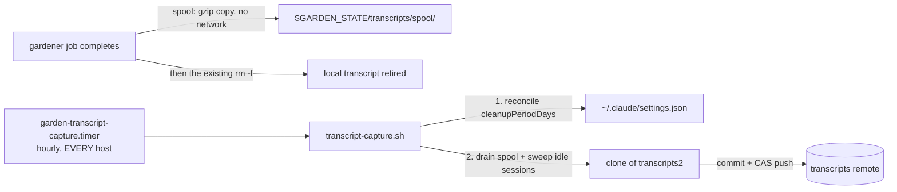

# Transcript capture: a durable fleet transcript archive, and fleet-wide deletion disable

| Created | 2026-07-06 |
| Author  | designer (job `design-transcript-journal-capture`) |
| Status  | Proposed |

Claude Code deletes session transcripts after `cleanupPeriodDays` (default 30),
and the gardener handler deletes each job's transcript the moment the job
completes. The maintainer wants the opposite posture: deletion disabled across
the fleet, and the transcripts captured into the garden's versioned record ("the
journal holds the garden's transcript"). This design specifies both halves:

1. **Capture**: every host spools its finished session transcripts, gzip-compressed
   and lightly redacted, into a dedicated `transcripts2` orphan branch on a
   **configurable transcripts remote** (private repo recommended; the garden's
   own origin is public), pushed with the fleet's usual CAS loop.
2. **Disable deletion**: the `garden` launcher seeds `cleanupPeriodDays: 36500`
   into the settings file it writes, and the capture service reconciles the same
   setting idempotently on every existing host, every tick.

## Facts on the ground

Measured on this instance (`endolin-garden2-5bcdff64`, 2026-07-06) and read from
the code; the builder can rely on these without re-deriving them.

- Transcripts live at `~/.claude/projects/<encoded-cwd>/<session-id>.jsonl`
  (HOME is the garden root in-container). This host: **1,622 files, 214MB**,
  accumulated over roughly two months. The job prompt reports ~5,700 on an
  older host. So the corpus is order hundreds of MB per host per year, raw.
- **gzip gives about 4:1** on transcript JSONL (measured: a 1,671,253-byte
  transcript compresses to 432,896 bytes). Compressed growth is order
  ~100MB per host per year.
- A gardener job's transcript path is **deterministic**:
  `session_id = uuid5(NAMESPACE_URL, "garden-job:" + base)` and the project dir
  encodes the per-base worktree cwd
  ([`scripts/jobs/handlers/gardener-claude.sh`](../scripts/jobs/handlers/gardener-claude.sh),
  the `session_id` / `proj_dir` / `proj_dir_alt` block). The encoded cwd itself
  contains `gardener-wt-<base>`, so the job base is recoverable from the
  directory name alone.
- **The handler already destroys the transcript on completion.** The teardown
  block in `gardener-claude.sh` runs
  `rm -f "$proj_dir/$session_id.jsonl" "$proj_dir_alt/$session_id.jsonl"` when the
  completion sentinel is written, to prevent a re-posted base from falsely
  resuming a finished session. For job sessions this deletion, not
  `cleanupPeriodDays`, is the primary destroyer; capture must hook in **before**
  that `rm`, and the `rm` must stay (the false-resume hazard is real).
- `scripts/jobs/usage-meter.sh` already scans `$HOME/.claude/projects/**/*.jsonl`
  (`GARDEN_CCUSAGE_LOGDIR`): precedent for reading the session logs from fleet
  scripts.
- **This instance's `~/.claude/settings.json` does NOT carry `cleanupPeriodDays`**
  (verified 2026-07-06: the file holds only `theme` and
  `skipDangerousModePermissionPrompt`). The job prompt believed it had been set
  by hand; whether that edit landed elsewhere or was lost, the reconcile step
  below fixes this host too, which is exactly why reconciliation must be part of
  the design rather than trusting one-time hand edits.
- **The origin (`github.com/kriskowal/garden`) is public** (verified via
  `gh repo view`). Anything pushed to it is world-readable.
- `capture_blob` / `anchor_blob` / `inspect_note` in
  [`scripts/jobs/common.sh`](../scripts/jobs/common.sh) store one-off blobs in a
  clone's object DB and optionally anchor them under `refs/captures/*`
  (skill [prompt-on-failure-capture](../skills/prompt-on-failure-capture/SKILL.md)).

## Decision 1: where the transcripts live

Three candidate stores, as the job posed them:

- **A subtree under `journal2`.** Rejected. `journal2` is the shared job board
  and message bus; every producer, gardener, and watcher clones, fetches, resets,
  and pushes it constantly (per-service clones under `$GARDEN_STATE`, plus the
  `journal/` worktree). Hundreds of MB per host per year landing there taxes
  every fetch and push fleet-wide, forever. This is the central bloat hazard the
  design exists to avoid.
- **Loose blobs via `capture_blob` + `anchor_blob` (`refs/captures/*`).**
  Rejected as the primary store. It avoids commits, but it gives no tree, no
  history, no browsable index; pruning means server-side ref surgery GitHub does
  not expose; and thousands of `refs/captures/*` entries are their own
  pathology. The primitive stays what it is today: a one-off escalation
  attachment, not an archive.
- **A dedicated orphan branch, `transcripts2`, mirroring the `journal2` orphan
  pattern operationally.** **Recommended.** Bloat is isolated: nothing in the
  fleet fetches `transcripts2` except the capture service itself (and a human
  browsing). The proven machinery transfers directly: single-branch clone,
  reset-to-origin, append-only per-host paths, push-CAS with verification
  (mirror `_push_journal` / `_verify_pushed` in `common.sh`).

**Which remote carries the branch is a separate, safety-weighted choice.** The
garden's origin is public, and transcripts are the fleet's raw working memory:
tokens that scrolled through a shell, maintainer email, private reasoning.
Publishing them is not a default any agent should quietly pick. So the remote is
**per-instance journal config**, exactly the [issue-inbox](issue-inbox.md)
arming pattern:

- `config/transcripts-remote` on `journal2` holds a git URL (for example
  `git@github.com:kriskowal/garden-transcripts.git`). Written by a new
  `scripts/jobs/set-transcripts-remote.sh <url>` (sibling of
  `set-garden-repo.sh`).
- The capture service is **inert until the config exists**: it still spools
  locally (below) so nothing is lost meanwhile, but it pushes nowhere. Writing
  the config is the deliberate arming act, recorded as a journal `message`
  entry.
- **Recommendation: a dedicated private repo** (`kriskowal/garden-transcripts`
  or similar), bot granted push. Using the public origin remains possible by
  simply configuring it, but that is the maintainer's explicit call, never a
  default.

The branch inside that remote is still named `transcripts2`
(`GARDEN_TRANSCRIPTS_BRANCH`), keeping the orphan-branch naming convention even
when the remote is a dedicated repo, so the door stays open to hosting it on the
origin if the maintainer ever prefers that.

**Compression:** every stored transcript is gzipped (`gzip -n` for
deterministic output; about 4:1 measured). Stored path:

```
transcripts/<GARDEN>/<encoded-cwd>/<session-id>.jsonl.gz
index/<GARDEN>.tsv
```

`<GARDEN>` is the host's instance identity (`hostname -s` fallback via
`common.sh`), so hosts never write each other's paths and concurrent pushes
conflict only at the CAS, never in content.

**Per-host clone shape:** the capture clone at
`$GARDEN_STATE/transcripts/clone` is created
`--single-branch --branch transcripts2 --filter=blob:none`, with
`git sparse-checkout set transcripts/<GARDEN> index/<GARDEN>`. The blobless
partial clone plus sparse checkout means a host's working copy holds only its
own subtree no matter how large the fleet corpus grows; a plain single-branch
clone is an acceptable degraded mode if the remote lacks partial-clone support.
If the branch does not exist on the remote yet, the service initializes an
orphan `transcripts2` locally and the first push creates it.

**Pruning: none built now.** With capture-on-completion, each transcript is
committed approximately once (a rare re-capture of a session that grew after an
idle-window capture adds one more version), so history overhead stays near the
tree size. If the branch ever needs shrinking, the escape hatch is rotation, not
rewrite: tag the tip `transcripts2-archive-<year>`, start a fresh orphan
`transcripts2`. Noted, deliberately deferred; to be filed as an issue when the
corpus first warrants it.

## Decision 2: when capture happens (both triggers, split cheap/expensive)



- **Completion hook (the half that saves job transcripts).** In
  `gardener-claude.sh`'s completion-teardown block, immediately **before** the
  existing `rm -f`, spool the transcript: gzip-copy whichever of
  `$proj_dir/$session_id.jsonl` / `$proj_dir_alt/$session_id.jsonl` exists into
  `$GARDEN_STATE/transcripts/spool/<encoded-cwd>/<session-id>.jsonl.gz` and
  append a pending index row carrying the job base. The helper
  (`transcript_spool`, new in `common.sh`) does **no network work** and never
  fails the handler (`|| log` and continue): the completion path stays fast and
  offline-safe, and the spool survives under `$GARDEN_STATE` until the timer
  drains it. Spooling happens whether or not a remote is configured.
- **Hourly sweep (the half that covers everything else).** A new
  `scripts/jobs/transcript-capture.sh` on a systemd timer, running on **every
  host** (each container has its own transcripts; no `is-main-host` gate). Per
  tick it drains the spool and sweeps `$HOME/.claude/projects/**/*.jsonl` for
  sessions that are **idle** (mtime older than `GARDEN_TRANSCRIPT_IDLE_SECS`,
  default 21600, six hours) and **new or changed** since their last capture (a
  ledger at `$GARDEN_STATE/transcripts/captured.tsv` records session id, size,
  and mtime at capture). The idle gate keeps a live, still-growing session from
  being captured over and over; a session that grows after capture is captured
  once more at its next idle point, overwriting the same path.
- **Which sessions: all of them.** Gardener jobs arrive via the hook; the sweep
  additionally catches liaison sessions in the garden root, subagent sessions,
  ad-hoc shells, and jobs that died without completing. The journal is the
  garden's transcript, and the liaison's steering conversations are part of that
  record. The privacy flip side is under Open questions.

Sweep procedure per tick, concretely:

1. **Reconcile settings** (Decision 3), unconditionally, before anything else.
2. Read `config/transcripts-remote` from the synced journal
   (`git show origin/journal2:config/transcripts-remote`, the same read path the
   issue-inbox config uses). Absent: log inert, exit 0. The spool keeps
   accumulating.
3. Ensure the capture clone (shape above); fetch and reset to the remote tip.
4. Copy spool entries and newly idle/changed sessions into the clone
   (redacting, then `gzip -n`), append their rows to `index/<GARDEN>.tsv`.
5. Nothing new: exit quietly. Otherwise commit and push with the fetch/reset/
   reapply CAS retry, verifying the push landed (the `_verify_pushed` idiom).
   Per-host paths are disjoint, so retries always apply cleanly.
6. Only after a verified push: clear the drained spool entries and update the
   ledger. Local originals under `~/.claude/projects/` are left untouched.

## Decision 3: disabling Claude Code's deletion, fleet-wide

Two prongs, because `settings.json` is gitignored and cannot propagate via git:

- **Launcher seed (new instances).** `seed_claude_settings()` in the
  [`garden`](../garden) launcher adds `"cleanupPeriodDays": 36500` alongside the
  SessionStart hook it already writes. Covers every instance created after the
  change.
- **Idempotent reconcile (existing instances).** Step 1 of every
  `transcript-capture.sh` tick: if `~/.claude/settings.json` lacks
  `cleanupPeriodDays` or holds a value other than 36500, rewrite it via
  `jq '.cleanupPeriodDays = 36500'` into a temp file and `mv` atomically;
  create the file with just that key if absent. jq preserves the other keys,
  which matters because Claude Code itself rewrites this file (it holds `theme`,
  for example), so the reconcile must be read-modify-write, never a template
  overwrite. Every host runs the capture timer, so every host converges within
  an hour of deploying, including this one (whose setting is missing today).
  Do not use `0` (rejected by current Claude Code as a validation error);
  36500 days is the sanctioned "effectively never".

With deletion disabled, local `~/.claude` disk grows without bound
(order 100 to 200MB per host per month at current activity: fine for years).
Once the archive is armed and proven, a follow-up MAY add a local janitor that
deletes originals already present in a verified-pushed capture and older than
some window; explicitly deferred, not part of this build, to be filed when disk
pressure first appears.

## Decision 4: finding a transcript later (the index)

- **Path convention is the primary index.** By host: `transcripts/<GARDEN>/`.
  By job: the encoded cwd contains `gardener-wt-<base>`, so
  `ls transcripts/*/*gardener-wt-<base>*/` finds a job's transcript across all
  hosts; the session id inside is reproducible as
  `uuid5(NAMESPACE_URL, "garden-job:" + base)`.
- **Per-host TSV index** at `index/<GARDEN>.tsv`, one appended row per capture:
  `captured_at  session_id  job_base(or -)  encoded_cwd  raw_bytes  gz_bytes  raw_mtime`.
  One file per host means no cross-host merge conflicts; the hook records the
  job base authoritatively, and the sweep back-derives it from the
  `gardener-wt-` directory-name pattern when it can, `-` otherwise.
- Reading one: `git -C <clone> show origin/transcripts2:transcripts/<GARDEN>/<dir>/<sid>.jsonl.gz | gunzip | less`
  (or check the file out sparsely). A small `find-transcript.sh <base>` wrapper
  is a nice-to-have follow-on, not part of the core build.

## Secrets and redaction

The transcripts are the garden's own output, so prompt injection is not a
concern; disclosure is. Two layers:

1. **The primary defense is the private remote** (Decision 1). No redaction
   list is complete; visibility scoping is the guarantee.
2. **A deterministic redaction pass** runs anyway, defense in depth, as a
   `redact_stream` filter applied before gzip: mask GitHub token shapes
   (`gh[pousr]_[A-Za-z0-9]{20,}`, `github_pat_[A-Za-z0-9_]{20,}`), Anthropic
   keys (`sk-ant-[A-Za-z0-9-]{20,}`), and `Authorization: Bearer <token>`
   values, replacing the tail with `…REDACTED`. The pattern list lives in one
   function in `transcript-capture.sh` so it can grow. Residual risk (secrets in
   shapes the list does not know) is accepted and is exactly why layer 1 leads.

## Builder spec (file by file)

1. **`scripts/jobs/common.sh`**: knobs
   `GARDEN_TRANSCRIPTS_BRANCH` (default `transcripts2`),
   `GARDEN_TRANSCRIPTS_SPOOL` (default `$GARDEN_STATE/transcripts/spool`),
   `GARDEN_TRANSCRIPT_IDLE_SECS` (default 21600); helper
   `transcript_spool <jsonl-path> [<job-base>]` (gzip into the spool plus a
   pending index row; always returns 0, logging failures).
2. **`scripts/jobs/handlers/gardener-claude.sh`**: in the completion-teardown
   block, call `transcript_spool` for `$proj_dir/$session_id.jsonl` and
   `$proj_dir_alt/$session_id.jsonl` (whichever exists) with `$base`,
   immediately before the existing `rm -f`. The `rm` and its rationale comment
   stay exactly as they are.
3. **`scripts/jobs/transcript-capture.sh`**: the per-tick sweep as specified in
   Decision 2 (reconcile settings; read config; ensure clone; drain spool +
   sweep idle sessions through `redact_stream` and `gzip -n`; commit; CAS push
   with verification; clear spool and update ledger only after a verified
   push). Quiet one-liner on the no-op path, per house daemon style.
4. **`scripts/jobs/set-transcripts-remote.sh`**: CAS-writes
   `config/transcripts-remote` on `journal2`, modeled on `set-garden-repo.sh`.
5. **`scripts/systemd/garden-transcript-capture.{service,timer}`**: oneshot
   service through `self-heal-run.sh`, `SuccessExitStatus=143 130 SIGTERM SIGINT`,
   `TimeoutStartSec=900`, **no** `is-main-host` ExecCondition (every host);
   timer `OnCalendar=*-*-* *:20:00` (hourly at :20, dodging the :00/:30 and
   :15/:45 slots the clone and journal keepers use), `Persistent=true`, with the
   absolute-schedule rationale comment the other timers carry.
   `install-units.sh` auto-enables non-template units, and this one needs no
   exclusion: it reads only our own transcripts and invokes no LLM, so the
   monitoring-safety constraint does not apply.
6. **`garden` launcher**: add `"cleanupPeriodDays": 36500` to the JSON in
   `seed_claude_settings()`.
7. **Test** (`test/transcript-capture-test.sh`): fake `$HOME` with synthetic
   project dirs, a local bare repo as the remote, a fake journal config; assert
   inert-when-unarmed spooling, spool drain, idle gating, changed-session
   re-capture, redaction, settings reconcile (absent file, foreign keys
   preserved), and CAS retry against a racing peer commit.
8. **Docs**: a row in [designs/README.md § Index](README.md) (added with this
   design); the builder adds a short operator page
   `context/operations/transcripts.md` (arming, browsing, the rotation escape
   hatch) and links it from the starting-stage page if the liaison should offer
   arming during bring-up.

Follow-on order: 1 through 7 are one build job. Arming (create the private
repo, grant the bot push, run `set-transcripts-remote.sh`, record the journal
`message` entry) is the maintainer's act afterward. The optional local janitor
and `find-transcript.sh` are separate later jobs, to be filed when wanted.

## Open questions

- **Which remote?** The design recommends a dedicated private repo
  (`kriskowal/garden-transcripts`); only the maintainer can create it and grant
  the bot push. Configuring the public origin instead is possible but publishes
  the fleet's working memory; is the private repo acceptable as the plan of
  record?
- **Capture liaison sessions too?** The sweep includes them by default (they are
  part of the garden's transcript), but they contain the maintainer's own
  conversational text. Exclude the garden-root project dir if that feels wrong.
- **Idle threshold**: six hours is a guess balancing capture latency against
  re-capture churn for long-lived liaison sessions. Tune freely via
  `GARDEN_TRANSCRIPT_IDLE_SECS`.
