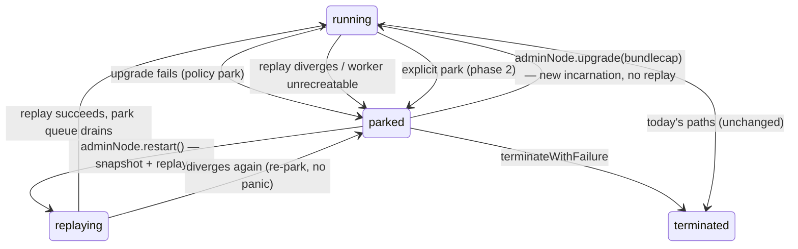

# Design: park a vat that fails to upgrade, resumable via its admin facet

Part of the XS-validation effort ([kriskowal/garden#33](https://github.com/kriskowal/garden/issues/33)).
Maintainer requirement ([issue comment](https://github.com/kriskowal/garden/issues/33#issuecomment-4910381116),
kriskowal, 2026-07-08): *"the ability to park a vat that fails to upgrade such
that it can be resumed with an explicit upgrade or restart on its admin facet.
That may be a new pull request."*

Target project: **`kriscendobot/agoric-sdk`** (fork of Agoric/agoric-sdk; upstream
stays untouched per `roles/COMMON.md` § External-repo etiquette). Companion
mechanism: the xsnap **legacy/latest variant** split (upstream issue #11030 /
draft PR #11031, being mirrored into the fork by jobs `xst-mirror-agoric-11031`
and `xst-mirror-agoric-11297`). Upstream context: Epic #10905 (Upgrade Moddable
and Native XSnap Worker), prior art #6361 (how to change XS on a deployed
system). All upstream text consulted read-only, as untrusted data.

**Where this design lives.** Here, in the garden's `designs/`, not the fork —
recommended because (a) the designer carve-out for agoric-sdk is
"output-is-the-file, no PR", (b) no mirror branches exist on the fork yet to
anchor a fork-side design PR, and (c) the garden note survives job-worktree
teardown and is readable by every follow-on build job. The build PR should carry
a distilled operator/developer page at `packages/SwingSet/docs/parked-vats.md`
derived from this note, matching the existing `docs/vat-upgrade.md` style.

## Problem

SwingSet persists each vat as durable state (vatstore, c-lists) plus a heap
**snapshot** and a **transcript** tail. A vat worker is reconstructed by loading
the snapshot and replaying the transcript tail with `replayTranscript`
(`packages/SwingSet/src/kernel/vat-warehouse.js`), and the replay must be
byte-exact: `makeSyscallSimulator` throws an *anachrophobia* error on any
wrong/extra/missing syscall. Today the failure handling is maximally harsh, in
two distinct places:

1. **Worker re-creation / replay failure.** `ensureVatOnline` is called from
   `deliverToVat` and `start()` with `recreate = true` — literally commented
   "PANIC in the failure case". A manager-creation failure calls
   `panic('unable to re-create vat …')`; a replay divergence or snapshot-load
   failure throws through `deliverAndLogToVat`, which rethrows — a **kernel
   panic**, i.e. a halted chain, deterministically on every node. Any XS engine
   change that perturbs one old vat's replay halts everything.
2. **Vat-upgrade failure.** `processUpgradeVat` (`kernel.js`) delivers a final
   `bringOutYourDead` to the old incarnation, then `startVat` to the new one. If
   either reports failure, `abortUpgrade` unwinds the crank, stops the worker,
   and rejects the upgrade via `vatUpgradeCallback(upgradeID, false, error)` —
   and the **next delivery silently re-creates the OLD incarnation** from
   snapshot + replay. That rollback is only safe while an engine that can
   faithfully resume the old snapshot/transcript still exists.

The variant split (#11031) gives every vat `xsnap({ variant: 'legacy' | 'latest' })`,
default `legacy`, and anticipates "further work to automatically promote vats
from legacy to latest if they successfully upgrade." This design is the failure
half of that promotion story: when the upgrade-to-latest **fails**, the vat must
degrade gracefully into a **parked** state instead of either halting the chain
or thrashing between rollback and retry — and later be **resumed** with an
explicit `upgrade` or `restart` on its admin facet, once a fixed XS or a fixed
bundle ships. The bootstrap vat, which is non-upgradable (Epic #10905), makes
the panic path especially costly: today it has no graceful failure mode at all.

## Park semantics

A new per-vat kernel state, **parked**, sibling to *terminated* but fully
reversible:

- **State keys** (mirroring `vats.terminated` / `markVatAsTerminated` in
  `kernelKeeper.js`): a `vats.parked` array, plus `${vatID}.parked` holding
  `{ reason, phase: 'upgrade' | 'replay' | 'explicit', incarnation, crankNum }`.
  No wall-clock time (consensus determinism); a kernel-schema bump in
  `upgradeSwingset.js` seeds the empty set.
- **Everything is retained.** kvStore (vatstore, c-lists), transcript spans,
  snapshots, meter, options, incarnation number. `vatIsAlive` stays true; a new
  `vatIsParked` predicate distinguishes it. Exports are *not* orphaned; promises
  the vat decides remain unresolved.
- **No worker.** The worker is evicted (`stopWorker`); `ensureVatOnline` refuses
  parked vats; BOYD/reap scheduling, snapshot scheduling, and warehouse preload
  (`start()`) all skip parked vats.
- **Deliveries are deferred, not refused.** A per-vat **park queue**
  (`${vatID}.parkQueue`, reusing kernelKeeper's queue helpers) holds run-queue
  events routed to a parked vat — `send`s whose target object it owns
  (`routeSendEvent`), `notify`s for which it is subscriber, GC deliveries
  suppressed. Refcounts are held while queued. On resume the queue drains
  FIFO onto the acceptance queue ahead of new traffic. **Caller-observable
  semantics: a parked vat is indistinguishable from a very slow vat** — no new
  error contract leaks to senders; result promises simply do not settle until
  resume. (Considered and rejected: splat like `'vat terminated'` — destroys
  messages and forces every client to grow retry logic; leaving events on the
  shared run queue — head-of-line blocks the whole kernel, and the run/acceptance
  queues at `kernelKeeper.js` are global FIFOs with no per-vat lanes.)
- **Terminable.** `terminateWithFailure` is allowed on a parked vat (relaxing
  `assertRunningVat` in `vat-vat-admin.js`), so a vat nobody will ever fix can
  still be given up on; termination drains the park queue by splatting, then
  proceeds as today (`terminateVat`, cleanup budget machinery).
- **Interaction with snapshot/transcript machinery.** Parking freezes the vat at
  its last committed delivery: the current transcript span and last snapshot
  remain the resume point for `restart`, and are discarded wholesale by
  `beginNewWorkerIncarnation` on resume-by-`upgrade`, exactly as in a normal
  upgrade. The snapshot records (or is keyed to) the xsnap **variant** that
  wrote it, so a resume always re-launches the worker on the engine that can
  read it.

## Detection: routing failure to parking instead of panic

Three hook points, in priority order:

1. **Failed `adminNode.upgrade()`** — `processUpgradeVat`'s two `abortUpgrade`
   branches (BOYD-terminate, startVat-terminate). A new policy option
   `onUpgradeFailure: 'rollback' | 'park'` (recorded vat option, settable via
   `changeOptions` and overridable per-call in `upgrade()` options; default
   `'rollback'` preserves today's behavior). Under `'park'`, the crank still
   aborts/unwinds, but the CrankResults gain a `park: { vatID, info }` field
   processed **after** `abortCrank` — the same post-abort pattern that lets
   `terminate` survive the unwind today. `vatUpgradeCallback(upgradeID, false,
   error)` still fires, so the upgrader's promise still rejects; the error notes
   the vat is now parked rather than rolled back.
2. **Worker re-create / replay failure** — the `panic` paths under
   `ensureVatOnline` (manager-creation rejection, `replayTranscript`'s
   anachrophobia throw, snapshot-load failure). For **non-critical** vats,
   catch in `deliverToVat` / warehouse `start()`: record the park, abort the
   crank, and move the triggering delivery to the park queue. Divergence is
   deterministic (same transcript, same engine on every node), so the parking
   decision is consensus-safe. **Critical vats keep panic semantics** in v1
   (`vatKeeper.getOptions().critical`) — a chain missing a critical vat is
   presumed nonfunctional, and silently parking one would be worse than halting.
3. **Explicit park** (phase 2, optional): `E(adminNode).park(reason)` and a
   host-side `controller.parkVat(vatID)`, for preemptively quiescing a vat ahead
   of a risky chain upgrade.

Out of scope: vat-level faults during normal execution (hard metering faults,
illegal syscalls, liveslots errors — the non-`'ok'` branch of
`deliverAndLogToVat`). Those indicate broken vat *code*, not a broken *engine*,
and today's termination semantics remain right for them.

## Admin-facet surface and authority model

The resume verbs live on the existing per-vat `adminNode` exo in
`vat-vat-admin.js` (`makeAdminNode`), guarded today by `assertRunningVat`:

- **`upgrade(bundlecap, options)`** — existing method, relaxed to accept parked
  vats. Resume-by-upgrade: `beginNewWorkerIncarnation` discards snapshot and
  transcript, the new incarnation boots from durable state (baggage) via
  `startVat` on a fresh worker — **no replay of the old-engine transcript**, so
  this is the intended recovery once a fixed bundle or fixed XS ships. One
  deviation from the normal upgrade sequence: the pre-upgrade
  `bringOutYourDead` to the old incarnation is **skipped** (it cannot run — that
  is why the vat is parked); the code comment in `processUpgradeVat` already
  anticipates making BOYD optional "if a vat is so broken it can't do BOYD".
  Kernel-side promise disconnection and non-durable-export abandonment still
  run. On success the park queue drains into the new incarnation (its objects
  are the same krefs; upgrade-disconnection semantics for in-flight promises
  apply as in any upgrade).
- **`restart()`** — new method (the maintainer's "restart" verb). Clears the
  parked flag and lets the normal `ensureVatOnline` path re-create the worker
  from snapshot + replay on the vat's recorded variant, then drains the park
  queue. Right when the cause was engine-environmental and has been fixed
  engine-side (a patched legacy binary restoring compatibility, an explicit park
  being lifted). If replay diverges again the vat **re-parks** (detection hook 2)
  — each retry costs one failed replay, never a panic.
- **`parkStatus()`** — new query returning
  `{ parked, reason, phase, incarnation }`, via a `vatAdminHooks` kernel hook
  (the same device-hook route `terminateWithFailure` uses). Parking does *not*
  settle `done()` — the vat is not dead.

**Authority model: unchanged.** Whoever holds the `adminNode` (returned by
`E(vatAdminService).createVat`) holds park-resume authority — no new authority
is minted, parking just makes the existing facet's `upgrade` meaningful on a vat
that would previously have taken the chain down with it. On Agoric mainnet that
holder is typically Zoe (contract vats — surfaced to governance via Zoe's
adminFacet / `restartContract` null-upgrade machinery) or bootstrap-held vats
driven by core-eval. **Static vats have no adminNode**: their resume path is the
host/controller surface — the existing `controller.upgradeStaticVat(vatName,
shouldPauseFirst, bundleID, options)` (which routes through the vatAdmin vat's
same `upgradeVat` path) plus a new `controller.restartVat(vatID)`; on chain,
both are reachable through core-eval governance. The **bootstrap vat** remains
non-upgradable: for it, parking converts a fatal engine divergence into a
degraded-but-alive chain (bootstrap is mostly quiescent post-bootstrap; its park
queue holds any stray traffic), and `restart()` after an engine-side fix is its
only resume path. That honest limit — parked-bootstrap has no upgrade escape —
is a feature gap this design surfaces but does not solve; #10905 owns it.

## Composition with the legacy/latest variant split

- `WorkerOptions` (type `'xsnap'`, `makeWorkerOptions` /
  `updateWorkerOptions` in `src/lib/workerOptions.js`) gains a `variant`
  field, plumbed through `manager-subprocess-xsnap.js` → `startXSnap` → the
  `xsnap()` constructor option from #11031. Existing vats default `'legacy'`.
- A **legacy vat resumed from a snapshot** never sees the new engine: rollback
  after a failed upgrade re-creates the old incarnation on its recorded legacy
  variant. This is precisely why `'rollback'` stays a safe default *while the
  legacy binary ships*.
- An **upgrade may switch variant** (an `upgrade()` option, defaulting to
  promotion `legacy → latest` per #11031's stated intent): the new incarnation
  starts on the target variant with no old-engine replay. On failure under
  `'park'`, the vat parks with its legacy-written snapshot intact, and both
  resume verbs remain live: `restart()` back onto legacy, or a later
  `upgrade()` retry onto latest.
- The endgame this enables: a chain software upgrade ships a new latest xsnap;
  legacy vats are untouched (no divergence risk); vats are promoted one at a
  time via their admin facets; each failure parks that one vat instead of
  halting the chain; the release-validation gauntlet shrinks from "every vat
  replays clean" to "parked vats get fixes, at leisure".

## Test plan

SwingSet unit tests (patterns from `test/upgrade/upgrade.test.js`):
park-on-failed-upgrade under `'park'` vs rollback under default; sends/notifies
to a parked vat deferring and draining in order on resume; resume-by-`upgrade`
(baggage intact, no replay) and by-`restart` (replay) including re-park on
repeat divergence; replay-divergence parking via a doctored transcript entry;
critical-vat panic preserved; `terminateWithFailure` on a parked vat;
`parkStatus`; kernel-schema upgrade seeding. Variant-composition tests (need the
#11031 mirror): a fixture vat whose replay diverges under `latest` parks and
then resumes by upgrade onto `latest`. Slog assertions for new `vat-parked` /
`vat-resumed` events.

## Path to a PR (follow-on build jobs)

A **new PR on `kriscendobot/agoric-sdk`** (suggested branch
`kriskowal-park-on-upgrade-failure`, base `master`), independent of the #11297
xsnap-bump mirror and only *test-coupled* to the #11031 mirror. Recommended
decomposition, orchestrated serially:

1. **`xst-park-on-fail-build-kernel`** — park state + park queue + routing +
   detection hooks 1–2 + adminNode `restart`/`parkStatus` + controller surface +
   schema bump + unit tests + `packages/SwingSet/docs/parked-vats.md`. One PR.
2. **`xst-park-on-fail-build-variant`** — after the #11031 mirror lands on the
   fork: `WorkerOptions.variant` plumbing, upgrade-time variant switch,
   snapshot-variant keying, the divergence fixture test. Could be a second
   commit series on the same PR or a stacked PR.

## Open questions

- Should `onUpgradeFailure: 'park'` become the *default* when an upgrade
  targets the `latest` variant? (Recommend: explicit option in v1; flip the
  default in the chain-software-upgrade release that removes any legacy-rollback
  guarantee.)
- May a **critical** vat ever park instead of panic? (Recommend: no in v1;
  revisit for the bootstrap vat specifically, which is both critical-in-spirit
  and non-upgradable — parking it is strictly better than halting only if the
  chain can limp without it, a chain-operations judgment.)
- Park-queue growth: a busy parked vat accumulates refcount-holding queue
  entries without bound. Cap, or metric-only? (Recommend: metric + slog only in
  v1, with `terminateWithFailure` as the relief valve.)
- Does the adminNode need a push notification on park (a `vatParkedCallback`
  sibling to `vatUpgradeCallback`), or does the rejected `upgrade()` promise
  plus poll-able `parkStatus()` suffice for v1?
- Naming: `parked` chosen (the maintainer's word); `paused` collides with
  vatAdminService's own `pauseService` self-upgrade machinery in
  `vat-vat-admin.js`.
