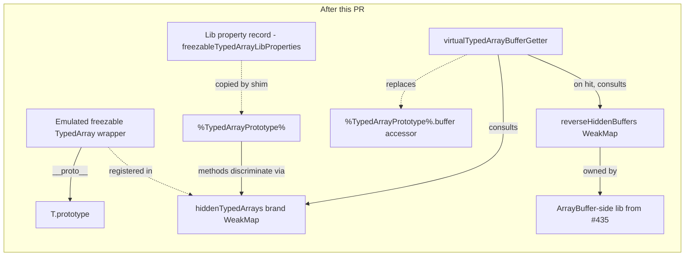

> Abstract: Maps the proposed changes across the immutable-arraybuffer lib and shim, including hidden genuine views, constructor replacement, accessor delegation, and prototype installation.

## Implementation outline

The implementation is the post-#435 reshape of the experiment branch's
freezable-TypedArray commits (`721c68a3`, `2097641c`, `cfe99f7e`,
`e02ec0d0`, `1ef6c174`, plus four review-response fixups).

### Files added or modified

| File                                                                | Action  | Notes                                                                 |
| ------------------------------------------------------------------- | ------- | --------------------------------------------------------------------- |
| `packages/immutable-arraybuffer/src/lib.js`                         | EDIT    | extend with the freezable-TypedArray surface (see *Lib additions*)    |
| `packages/immutable-arraybuffer/src/shim.js`                        | EDIT    | extend the shim to also install the freezable-TypedArray surface      |
| `packages/immutable-arraybuffer/test/lib-typedarray.test.js`        | NEW     | lib-level unit tests (translated from `freezable-typedarray-pony.test.js`) |
| `packages/immutable-arraybuffer/test/shim-typedarray.test.js`       | NEW     | shim-level integration tests (translated from `freezable-typedarray-shim.test.js`) |
| `packages/immutable-arraybuffer/test/shim-typedarray-per-flavor.test.js` | NEW | per-flavor parameterized coverage across all eleven concrete TypedArray constructors |
| `packages/immutable-arraybuffer/README.md`                          | EDIT    | new section "The Freezable TypedArray Emulation"; retire the "follow-on shims might modify `DataView` and `TypedArray`" caveat |
| `packages/immutable-arraybuffer/designs/freezable-typedarray.md`    | NEW     | this file                                                              |
| `packages/ses/src/permits.js`                                       | EDIT    | see *permits.js delta* sub-section below                               |
| `packages/ses/test/immutable-arraybuffer.test.js`                   | EDIT    | extend to cover the freezable-TypedArray case (a `Uint8Array` constructed from an immutable AB is frozen / immutable after lockdown) |
| `.changeset/freezable-typedarray-emulation.md`                      | NEW     | minor on `@endo/immutable-arraybuffer`; patch on `ses`                  |

#### permits.js delta

The current `%TypedArrayPrototype%` entry in `packages/ses/src/permits.js` (on
`master` at `4a04d078b`) already contains a `buffer: getter` permit:

```js
'%TypedArrayPrototype%': {
  buffer: getter,
  byteLength: getter,
  byteOffset: getter,
  constructor: '%TypedArray%',
  copyWithin: fn,
  // ... (fill, filter, find, findIndex, forEach, includes, indexOf,
  //      join, keys, lastIndexOf, length, map, reduce, reduceRight,
  //      reverse, set, slice, some, sort, subarray, toLocaleString,
  //      toString, values, @@iterator, @@toStringTag, at, findLast,
  //      findLastIndex, toReversed, toSorted, with)
},
```

The shim replaces the native `%TypedArrayPrototype%.buffer` accessor with
`virtualTypedArrayBufferGetter` (the discriminating accessor the lib
installs).
Because the shim's replacement accessor is itself a getter, the SES
permits walk does not see a new property kind: the slot was `getter`
before and remains `getter` after the shim's install.
No new permit row is required; the existing `buffer: getter` entry
covers the shim-installed replacement without modification.

The five mutator methods (`copyWithin`, `fill`, `reverse`, `set`, `sort`)
already appear as `fn` entries in the same `%TypedArrayPrototype%`
entry and remain `fn` after the shim installs the amplifier-with-this-
fallthrough property record.
Their permit shape does not change.

Therefore the only edit to `permits.js` this design requires is none of
the kind the critic's question anticipated (no new row, no row type
change).
The EDIT action in the table above is present because the test
`packages/ses/test/immutable-arraybuffer.test.js` (a sibling edit) will
exercise the permits walk against the shim-installed slots; if that test
surfaces an unexpected gap the builder patches the permits entry at that
time.
The expected outcome is that no gap surfaces: the existing `getter` and
`fn` entries cover the shim's replacements.

This design does **not** introduce a new ses-side intrinsic.
Under the drop-the-pseudo-prototype shape the emulated wrappers
inherit directly from the genuine `T.prototype`, so
`get-anonymous-intrinsics.js` does not need a new sample.
This is the parallel to PR #435's deletion of the
`%ImmutableArrayBufferPrototype%` sample.

### Lib additions

The lib gains four exported bindings (in addition to whatever PR #435
leaves as the post-merge exports):

```js
// In src/lib.js, after the existing ArrayBuffer-side property record:

const hiddenTypedArrays = new WeakMap();

export const amplifyTypedArray = typedArray =>
  apply(weakmapGet, hiddenTypedArrays, [typedArray]) || typedArray;

export const virtualTypedArrayBufferGetter = /* getter that consults
  hiddenTypedArrays first, then walks via FERAL_GET_ARRAY_BUFFER and
  reverseHiddenBuffers to return the immutable wrapper for hidden
  cases and the genuine buffer for fallthrough */;

export const makePseudoTypedArrayConstructor = OriginalConstructor =>
  /* returns a constructor that delegates to OriginalConstructor on
     non-hidden-buffer args, and produces an emulated wrapper on
     hidden-buffer args */;

export const freezableTypedArrayLibProperties = /* property record
  the shim copies onto %TypedArrayPrototype%; contains the mutator
  throw / read delegate methods, plus the `buffer` accessor
  replacement */;
```

The `freezableTypedArrayLibProperties` record bundles two
semantically distinct concerns under one install loop for shim-side
simplicity, not because they are the same kind of property:

- The mutator-throws descriptors (`copyWithin`, `fill`, `reverse`,
  `set`, `sort`): discriminate on `hiddenTypedArrays` brand
  membership and throw on hit; on miss, delegate to the captured
  genuine method (the *amplifier-with-this-fallthrough* shape).
- The `buffer` accessor replacement: discriminate on the same brand
  WeakMap but with a different fallthrough semantic.
  On hit, return the immutable wrapper via `reverseHiddenBuffers`;
  on miss, return the genuine buffer the native accessor would have
  returned.

The two share the brand WeakMap and the install loop but answer
different questions (throw-versus-delegate for mutators, redirect-
versus-passthrough for the buffer getter).
The bundling is an install-loop economy, not a category claim.

The internal `hiddenBuffers` and `reverseHiddenBuffers` WeakMaps
(see *Background* above) remain owned by the immutable-ArrayBuffer
side of the post-#435 lib;
the freezable-TypedArray code reads them from the lib's existing
module-internal scope.
On post-#435 master, the immutable-ArrayBuffer side already lives
inside the consolidated `lib.js` (the experiment branch's separate
`immutable-arraybuffer-pony-internal.js` file does not survive the
merge), so this design extends a single `lib.js` and does not
reintroduce an internal file split.

The experiment branch carries an `internal-heir.js` helper (a 100+
line "intermediate prototype with redirect + complain semantics"
builder) that does not exist on post-#435 master.
Under the drop-the-pseudo-prototype shape there is no intermediate
prototype to build; the helper's role is taken by the property
record copied onto `T.prototype`.
The builder therefore does not port the helper; the design needs no
property-record-building utility beyond what `lib.js` exports
directly.

### Shim additions

`src/shim.js` extends the existing detect-then-skip install body:

```js
// In src/shim.js, inside the existing detect-then-skip block:

if (!('sliceToImmutable' in arrayBufferPrototype)) {
  // ... existing ArrayBuffer-side install from PR #435 ...

  // New: freezable-TypedArray install.
  const TypedArray = getPrototypeOf(Uint8Array);
  const { prototype: typedArrayPrototype } = TypedArray;

  defineProperties(
    typedArrayPrototype,
    getOwnPropertyDescriptors(freezableTypedArrayLibProperties),
  );

  // Replace each of the eleven concrete global TypedArray constructors
  // with the pseudo-constructor produced from the lib.
  for (const { name, Constructor } of concreteTypedArrayConstructors) {
    defineProperty(globalThis, name, {
      value: makePseudoTypedArrayConstructor(Constructor),
      writable: true,
      enumerable: false,
      configurable: true,
    });
  }
}
```

The stage-3 detect-then-skip gate is shared: if a prior shim or a
native implementation has already installed the ArrayBuffer-side
`sliceToImmutable`, this shim's entire install body is skipped,
including the TypedArray-side additions.
The two sides ship as a unit because they are part of the same TC39
proposal.

### Diagram




Source: [freezable-typedarray.md](https://github.com/endojs/endo-but-for-bots/blob/c8007ce9c9f7e9dad2d129f4586ae0cb8fecef97/packages/immutable-arraybuffer/designs/freezable-typedarray.md) at PR head `c8007ce9` (unreviewed archive).
