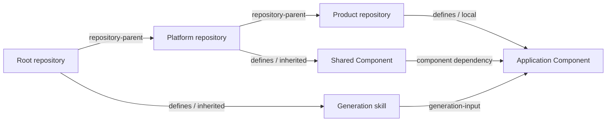

> Abstract: `litai graph` projects lineage plus the effective local and inherited Component, Flavor, and skill catalog (with skill-to-Component generation-input edges) into one canonical, acyclic, typed graph that also shows non-materialized candidates as `withheld` or `shadowed-by`. The same solved graph exports as JSON, text, Mermaid, DOT, or a structural SVG; closed filters bound model context. `litai graph rebalance` reports byte-identical authority duplicated across descendants and its lowest common ancestor, with `automatic_action: false`.

`litai graph` projects the resolved repository lineage and the effective local or inherited Component, Flavor, and skill catalog into one canonical directed graph. It also includes generation-input edges from Components to the skills they invoke. Every node records its owning project, provenance, local/inherited state, and inheritance policy; every edge has a typed direction.

Inheritance planning also records candidates that do not materialize. A private `inheritable: false` Component is shown as `withheld`; an ancestor definition replaced by a descendant or a locally edited imported file is shown with a `shadowed-by` edge. The graph therefore distinguishes the effective catalog from the decisions that formed it instead of silently erasing non-selected authority.



The solver canonicalizes nodes and edges, rejects missing endpoints, and computes a stable topological order. Any directed cycle is a validation failure, not a rendering oddity. The identical graph can be exported as compact JSON, readable text, Mermaid, Graphviz DOT, or standalone SVG:

```bash
litai graph --format text
litai graph --format json --output _build/authority.json
litai graph --format mermaid --output docs/authority.mmd
litai graph --format dot --output _build/authority.dot
litai graph --format svg --output _build/authority.svg
litai graph --kind component --ownership inherited --inheritance inheritable
litai graph --kind flavor --edge-kind flavor-selection
```

Repeat `--kind`, `--provenance`, or `--edge-kind` to select a union. `--ownership` distinguishes local from inherited authority; `--inheritance` distinguishes entities that pass downstream from those deliberately kept private. Filters are pure closed views: an edge is retained only when both endpoints remain selected.

**Rebalancing.** Graph inspection is read-only. `litai graph rebalance` implements the conservative exact-identity case of a rebalancing advisor: it identifies authority duplicated byte-for-byte across descendants and recommends moving it toward the lowest common repository ancestor. Its evidence names the current repositories, lowest common ancestor, affected repository descendants, duplicate-node/copy cost, estimated copies avoided, and review risks. It reports `automatic_action: false`; it never moves, commits, or pushes authority and makes no claim that merely similar entities are semantically equivalent.

**Structural SVG.** The standalone SVG is a structural export, not a screenshot. Each node group carries its stable ID, kind, project, and provenance; each edge group carries source, target, kind, and label, so a test can prove it represents the same solved graph as JSON, text, Mermaid, and DOT. Nodes are layered by dependency depth, so independent authority is visibly parallel rather than stretched into a misleading single chain.

**Bounding model context.** Large graphs should be inspected through closed filters before model context is assembled. Start with repository-parent edges, then select one Component and its exact dependency/generation inputs; use ownership and inheritance filters to separate local, effective inherited, shadowed, and withheld candidates. This bounds the reasoning surface without flattening private Component implementation detail into an application prompt.

Source: [docs/architecture/repository-inheritance.md](https://github.com/jordanhubbard/literate-ai/blob/fcc40bc617a2bc2455627db7396a1e016ebfbab6/docs/architecture/repository-inheritance.md) at commit `fcc40bc`.
