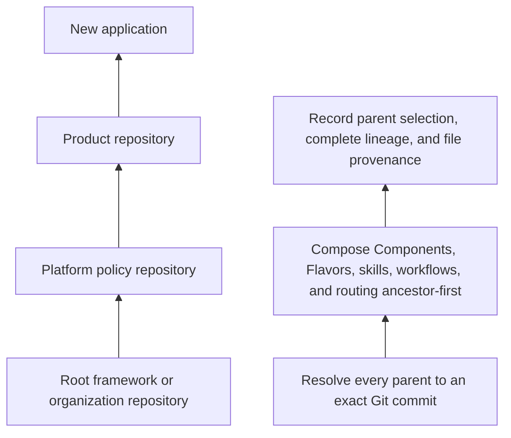

> Abstract: Literate AI repositories form a directed acyclic graph of "inherits from" edges (not Git remotes or submodules); `litai init --from` and `litai update` follow it to explicit roots, and a stopped or ambiguous chain is an error, never a fallback to whatever framework is on `PATH`. Every resolved node is pinned to an exact commit in `.literate/repository-lineage.json`, using non-interactive Git plumbing that reads only manifests and tracked catalog blobs: no checkout, hooks, submodules, or repository code, and credential-bearing URLs are rejected.

Literate-AI repositories form a directed acyclic graph. A project may name one or more parent repositories; each parent may name its own parents. `litai init --from` and `litai update` follow the complete graph to explicit roots. A stopped or ambiguous chain is an error, never an implicit fallback to whichever framework happens to be on `PATH`.



The arrows mean "inherits from," not Git remotes or submodules. Git supplies immutable repository bytes; Literate AI supplies the parent relationship, catalog composition, and update policy.

**Initialization.**

```console
litai init my-app --from https://example.com/acme/product-platform.git#main
```

The optional suffix is a Git revision selector. The selection is recorded, while every resolved node is pinned to its exact commit in `.literate/repository-lineage.json`. Resolution uses non-interactive Git plumbing in `OBJ_DIR/repository-lineage`; it reads only `literate.project.json`, `.literate/repository-parent.json`, and regular tracked catalog blobs. It does not check out a working tree, run hooks, recurse through submodules, or execute repository code. URLs containing passwords, query credentials, or fragments are rejected before persistence.

Source: [docs/architecture/repository-inheritance.md](https://github.com/jordanhubbard/literate-ai/blob/fcc40bc617a2bc2455627db7396a1e016ebfbab6/docs/architecture/repository-inheritance.md) at commit `fcc40bc`.
