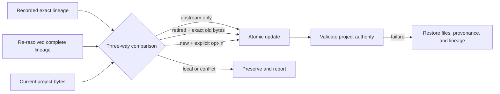

> Abstract: `litai update` re-resolves the full lineage and classifies each inherited file three ways (recorded provenance, prospective upstream, current local bytes): planning is read-only; `--apply` writes only upstream-only changes, new files need `--adopt-added`, conflicts and local edits are preserved unless `--take-upstream PATH` authorizes a reviewed one, and files, provenance, and lineage roll back together on validation failure. A retired import is removed only if every local file still matches its import, otherwise the whole item becomes local. `litai reparent URL` / `reparent none` (the "divorce") change the parent graph by compare-and-swap and are the sole bootstrap for legacy projects.

`litai update` re-resolves the recorded selection through every ancestor, composes the prospective catalogs, and classifies inherited files against their previous provenance and current local bytes. Planning is read-only. `--apply` writes only upstream-only files; `--adopt-added` is required for new upstream files. Local-only files and conflicts are preserved and reported by default. A repeatable `--take-upstream PATH` may authorize only an explicitly reviewed inherited-catalog conflict, allowing a dependency-closed set of safe changes, additions, and chosen conflicts to validate and commit together. A repeatable `--keep-local PATH` may preserve only a planned retired catalog path that remains a local compatibility input. Before mutation, both local and upstream state are rechecked. Catalog files, provenance, and the lineage lock are rolled back together if validation fails.

An explicit `--follow-ref B` uses the prospective parent selection for read-only catalog planning as well as apply. The enclosing follow plan binds the recorded and prospective parent authority; simulating that stage does not write either lineage file. A changed project, recorded lineage or newly resolved parent rejects the plan. The inherited file classifications and prospective identities match apply for the same inputs.

**Retirement.** When an exact prior catalog import disappears from the prospective export, its recorded per-file identity makes removal another three-way comparison. `--apply` removes the item only when every surviving local file still equals its exact import provenance. If any file diverged, every surviving file in that retired item becomes local authority so a multi-file Component, Flavor, or skill cannot be broken by partial retirement. The old import record is removed either way. Framework-template removals remain conservative because their initialization baseline does not prove the same catalog ownership boundary.

**Reparenting.** `litai reparent URL[#REVISION]` plans a different complete parent graph. `litai reparent none` explicitly makes the project a root (its "divorce" operation). Applying a reparent uses compare-and-swap and validation, but it does not pretend that catalog reconciliation is free: run `litai update` after reviewing a changed parent selection. An explicit root makes `litai update` a documented no-op.

**Provenance timestamps.** Unchanged import records retain their `copied_at` timestamp: it describes when that exact source and file provenance was established, not the most recent update observation. A changed source revision, ancestor binding or file closure still establishes fresh provenance. When the serialized imports are unchanged, apply and failure recovery leave `.literate/imports.json` untouched; final validation still runs.

**Legacy bootstrap.** For a canonical project created before repository-lineage evidence existed, `reparent` is the sole bootstrap operation. Its read-only plan represents the simultaneous absence of both lineage documents as a typed legacy-root state. Apply succeeds only if both remain absent and restores that exact absence if project validation fails. One missing document, malformed evidence, or concurrently introduced evidence is never treated as legacy state.

Source: [docs/architecture/repository-inheritance.md](https://github.com/jordanhubbard/literate-ai/blob/fcc40bc617a2bc2455627db7396a1e016ebfbab6/docs/architecture/repository-inheritance.md) at commit `fcc40bc`.
