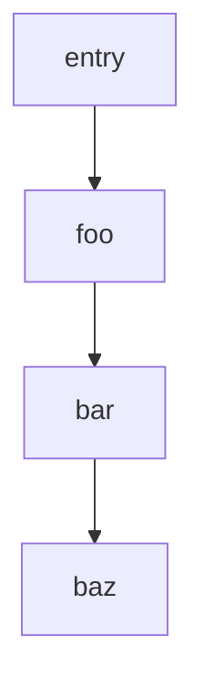

# @endo/path-compare

§Shortlex-ordering for string arrays. Used by `@endo/compartment-mapper` when crawling `node_modules` to find §the-shortest-path-to-any-given-transitive-dependency from the entry package.

## Three-tier comparison algorithm

1. **§Undefined compares greater than anything else** — both undefined returns 0; one undefined returns -1 or 1.
2. **§Array length** — `a.length - b.length`; prefer shorter.
3. **§Cumulative string length** — `a.join('').length - b.join('').length`; prefer shorter cumulative.
4. **§Lexicographic per-element** — `stringCompare(a[i], b[i])` (UTF-16 code unit order) — early return on first difference.

§Each-tier-has-a-named-reason-comment in source. §Early-return-per-tier.

## Key design moves

- **§Shortlex-ordering** with §Wikipedia-citation as §formal-name + §three-tier-comparison.
- **§Multi-tier-comparison-with-named-reasons** + §early-return-per-tier — comments document why each tier exists.
- **§Undefined-compares-greater-than-anything-else** as §explicit-handling matching `Array.prototype.sort` default.
- **§Three-mermaid-diagrams in README** (actually four examples) with §worked-examples each demonstrating §one-tier-of-the-comparison-driving-the-choice.
- **§Honest-Note-about-lexicographic-surprises** — "the 'lexicographic' comparison uses the UTF-16 code unit order, and thus may be surprising".
- **§Sanity-check-with-c8-ignore-comment** (`/* c8 ignore next 5 */`) for §defensive-check-that-should-never-fire.
- **§CompareFn typedef with §JSDoc-callback shape** — generic-typedef reused for both exports (`CompareFn<string>` for stringCompare; `CompareFn<string[]|undefined>` for pathCompare).
- **§stringCompare as building block** — one-line UTF-16 comparator using JavaScript's `<` operator; building block for pathCompare's rich algorithm.
- **§Used-by-compartment-mapper-for-shortest-path-to-transitive-dependency** — canonical consumer named in README.
- **§q = JSON.stringify** canonical shorthand for error-message-quoting (sibling to cycle 207 env-options).
- **§Eslint-aware-named-deviation** (`// eslint-disable-next-line no-nested-ternary`).
- **§Algorithm-numbered-steps-in-JSDoc** — five-numbered steps documenting the algorithm.

## Worked examples (from README)

Path: `['foo', 'bar', 'baz']` (trivial linear case).

Length-tier example: `['foo', 'bar', 'baz']` (length 3) vs `['foo', 'a', 'b', 'baz']` (length 4). Shorter wins.

Cumulative-length-tier example: `['foo', 'bar', 'baz']` vs `['foo', 'alternative', 'baz']` (both length 3). Shorter cumulative (`'foobarbaz'` 9 chars < `'fooalternativebaz'` 17 chars) wins.

Lex-tier example: `['foo', 'spam', 'baz']` vs `['foo', 'quux', 'baz']` (both length 3, both same cumulative). Lex-smallest wins (`'quux'` < `'spam'` at first code unit of second element).

## Ingest scope

Cycle 209 (chat-lane): full ingest of source + README. One section.

## Related material in the library

- **`@endo/compartment-mapper`** (canonical consumer): uses pathCompare when crawling node_modules to find shortest path to transitive dependency.
- **cycle 200 retention-path-notation**: §best-path-selection-rule sibling — both designs apply §shortlex-style-discipline; cycle 200 is at the higher-level (retention-path with rich segment shapes); cycle 209 is at the lower-level (string-array comparison).
- **cycle 207 env-options**: §pre-SES sibling — both packages have compact source + rich README structure; both use `q = JSON.stringify` shorthand.
- **cycle 199 trampoline-memoize-nat-trio**: §minimal-dependency-discipline sibling — @endo/path-compare is similarly minimal.
- **cycle 203 cache-map**: §LRU + CLOCK + SIEVE Wikipedia citations sibling (cycle 209 cites Shortlex).
- **cycle 197 panic**: §default-erroneous-exit sibling (both designs §name-the-default-behavior-explicitly).
- **cycle 195 cli/src cluster**: §example-comments-in-source-not-tests sibling — both patterns annotate source for purposes not directly executed.
- **cycle 201 immutable-arraybuffer**: §Purposeful-Violation-section sibling — cycle 209's §honest-Note-about-lexicographic-surprises is the same family of §named-deviations-from-natural-expectation.
- **cycle 200 worker-rust-xs**: §ASCII-architecture-diagram sibling — cycle 209 uses mermaid diagrams instead.
- **cycle 206 inventory-cancel-and-liveness**: §ASCII-visual-layout-diagram sibling — cycle 209 uses mermaid for graph-shaped examples (better fit for dependency-tree visualization).
