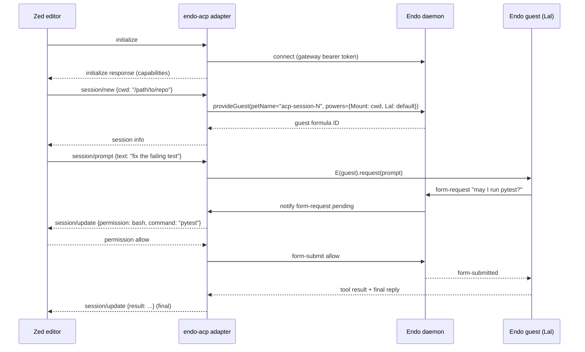

# EndOpen: ACP Server Adapter

|             |                                              |
|-------------|----------------------------------------------|
| **Created** | 2026-05-15                                   |
| **Author**  | kriscendobot (prompted by kriskowal)         |
| **Status**  | Not Started                                  |
| **Source**  | [`endopen.md`](endopen.md) § Gap 4           |

## What is the Problem Being Solved?

The [Agent Client Protocol](https://agentclientprotocol.com/) is a
JSON-RPC over stdio protocol for editor / IDE clients to drive
coding agents. Zed integrates with OpenCode via ACP; the Zed
configuration is a four-line `agent_servers` block in
`~/.config/zed/settings.json` (per
[`packages/opencode/src/acp/README.md`](../../external/opencode/packages/opencode/src/acp/README.md)).

Endo has no ACP surface, so Endo guests are not addressable from
Zed or any other ACP-aware client. Closing this gap is operationally
significant: it makes Endo a *drop-in* alternative to OpenCode for
ACP clients, without the client needing to learn OCapN or CapTP.

The capability story has to be preserved. OpenCode's ACP server
auto-approves all permission requests
([`acp/README.md`](../../external/opencode/packages/opencode/src/acp/README.md)
*Current Limitations*, point 4); Endo's ACP server must route
permission requests through the existing form-request machinery
[daemon-form-request](daemon-form-request.md) so the user-in-the-loop
guarantee survives the protocol bridge.

## Design

### The adapter shape

ACP is a JSON-RPC protocol with the following methods (per
OpenCode's
[`acp/agent.ts`](../../external/opencode/packages/opencode/src/acp/agent.ts)
imports lines 1 through 32):

- `initialize`: protocol version negotiation, capability advertisement.
- `authenticate`: authentication flow (ACP supports OAuth / API key / none).
- `session/new`: create a new session with a working directory and MCP servers.
- `session/load`: resume an existing session.
- `session/prompt`: send a prompt; stream back updates.
- `session/cancel`: interrupt a prompt in flight.
- `session/close`: tear down a session.
- `session/list`: enumerate active sessions.
- `session/fork`: branch a session into a child.
- `session/resume`: re-attach to a paused session.

The adapter is a standalone node process at `packages/endo-acp/`
(or `packages/cli/src/acp.js` as a verb) that:

1. Speaks JSON-RPC on stdio (using `@agentclientprotocol/sdk` for the protocol parser).
2. Holds a single Endo client connection to the user's daemon (via the standard `@endo/client` library or the gateway's bearer-token-auth endpoint).
3. Maps each ACP session onto one Endo *guest*. ACP `session/new` calls `provideGuest`; ACP `session/load` looks up by formula ID stored in a per-process session map.
4. Maps `session/prompt` onto `E(guest).request(prompt)` plus a subscription on the guest's inbox; streams `session/update` notifications for each tool call and result.
5. Translates ACP permission requests into Endo form-request submissions; the daemon's existing UI surfaces (Familiar / Chat) render the prompt, the user answers, and the answer flows back as the ACP permission response.

### Wire diagram



### Capability preservation

The adapter holds **the user's authority**, not the ACP client's.
The bearer token in the adapter's connection identifies the user;
each new ACP session is a new guest with capabilities the *user*
granted (typically: `Mount` to the working directory, `Lal` to the
default LLM provider, `Shell` if the agent-mode rules permit). The
ACP client cannot escalate beyond this; the structural confinement
the daemon provides is preserved across the protocol bridge.

This is in deliberate contrast to OpenCode's ACP server, which
auto-approves. Endo's strength is the capability story, and the
ACP adapter must not undermine it.

### Session lifecycle

| ACP method        | Endo translation                                                           |
|-------------------|----------------------------------------------------------------------------|
| `session/new`     | `provideGuest(pet-name, powers)`; powers derived from user defaults + ACP `cwd` |
| `session/load`    | Look up guest by formula ID stored in adapter-local SQLite                 |
| `session/prompt`  | `E(guest).request(prompt)`; subscribe to guest inbox; stream as session/update |
| `session/cancel`  | `E(guest).cancel()` if implemented; else best-effort by closing the request promise |
| `session/close`   | Adapter forgets the session; the guest persists in the daemon (durable)    |
| `session/list`    | Enumerate the adapter's per-process session map                            |
| `session/fork`    | `E(guest).fork()` if implemented; else create a new guest with the parent's transcript |
| `session/resume`  | Re-attach to a guest by formula ID; replay any unread inbox messages       |

The key insight: ACP "sessions" are ephemeral references to durable
Endo guests. Closing an ACP session does **not** delete the guest;
the next `session/list` on the next adapter run shows them under
their pet names, and `session/resume` re-attaches. This is the right
default for a capability-graph store; OpenCode's session model
(rows that disappear when archived) is the wrong default here.

### Configuration

The adapter accepts a config file at `~/.config/endo-acp/config.json`:

```json
{
  "daemon": {
    "url": "ws://127.0.0.1:8920",
    "bearerToken": "..."
  },
  "session": {
    "agentModule": "lal",
    "defaultModel": "anthropic/claude-3.5-sonnet",
    "permission": {
      "auto": false,
      "bash": "ask"
    }
  }
}
```

The `permission.auto` flag explicitly defaults to `false` (in
contrast to OpenCode). Setting it to `true` makes the adapter
auto-approve, matching OpenCode's behavior; the user opts into the
weaker security posture knowingly.

### Zed integration

```json
{
  "agent_servers": {
    "Endo": {
      "command": "endo",
      "args": ["acp"]
    }
  }
}
```

`endo acp` is a new CLI subcommand at
[`packages/cli/src/`](../packages/cli/src/) that launches the
adapter as a subprocess.

### MCP server adapter (orthogonal)

The same shape supports an **MCP server adapter** that exposes
Endo's tools to MCP-aware clients (Claude Desktop, Cline, etc.).
The MCP server adapter is a sibling of the ACP server adapter and
shares the same daemon-connection infrastructure. It is named here
as a future follow-up; this design's scope is ACP only.

### MCP client (the other direction)

OpenCode is also an MCP *client*: it calls out to MCP servers
configured in `opencode.json` and exposes their tools to its agent
([`packages/opencode/src/mcp/index.ts`](../../external/opencode/packages/opencode/src/mcp/index.ts)).
This is a different feature (consuming MCP tools, not exposing
Endo's tools as MCP). It composes naturally with the
[trust-on-first-bind](trust-on-first-bind.md) capability-policy
pattern. Listed as out of scope for this design's first cut;
deserves a `endopen-mcp-client.md` follow-up if prioritized.

## Phased Implementation

| Phase | What                                                            | Size | Notes                                |
|-------|-----------------------------------------------------------------|------|--------------------------------------|
| 1     | Adapter scaffold + `initialize` + `session/new` + `session/prompt` | M | ~600 LOC, basic single-turn echo via Lal |
| 2     | Streaming `session/update` notifications                        | M    | ~300 LOC; subscribes to guest inbox  |
| 3     | Permission routing through form-request                         | M    | ~250 LOC; user-in-the-loop story     |
| 4     | `session/load` / `session/resume` / formula-ID persistence      | S-M  | ~200 LOC; per-adapter SQLite or simple JSON store |
| 5     | `session/cancel`, `session/fork`, `session/list`                | M    | ~300 LOC; depends on guest API extensions |
| 6     | `endo acp` CLI verb                                             | S    | ~80 LOC                              |
| 7     | Optional `permission.auto` mode                                 | S    | ~50 LOC                              |

Total: 4-5 weeks for phases 1-6; phase 7 is a follow-on toggle.

## Dependencies

| Design                          | Relationship                                              |
|---------------------------------|-----------------------------------------------------------|
| [gateway-bearer-token-auth](gateway-bearer-token-auth.md) | Adapter authenticates against the daemon via bearer token |
| [daemon-form-request](daemon-form-request.md) | Permission requests route through form-request UX |
| [daemon-mount](daemon-mount.md) | Each session's `cwd` is a `Mount` capability               |
| [endoclaw-network-fetch](endoclaw-network-fetch.md) | When the session's agent makes HTTP calls       |

## Open Questions

- **Authentication**: the ACP spec has an `authenticate` method (OAuth / API key / none). Proposal: the adapter holds the daemon's bearer token; the ACP `authenticate` step is a no-op (the user authenticated the adapter at config time, not via ACP). Document this in the README so clients do not expect a credential dance.
- **Multi-tenancy**: can one adapter process serve multiple ACP clients simultaneously? Proposal: yes; the per-process session map keys sessions by ACP-supplied session-id. The daemon does not learn about ACP clients.
- **Mapping ACP `cwd` to Endo `Mount`**: the adapter needs a default `Mount` capability or the user must endow each session manually. Proposal: a wildcard `~/projects/*` mount delegated to the adapter at config time; the adapter narrows per-session to the requested `cwd`.
- **Streaming format**: ACP's `session/update` is one update-per-tool-call; how do we render a many-second LLM token stream? Proposal: emit `session/update` per assistant *message* (post-streaming), and per *tool call* (start, result). OpenCode does not stream tokens to ACP today ([`acp/README.md`](../../external/opencode/packages/opencode/src/acp/README.md) *Current Limitations*, point 1); we match this and revisit when ACP gains a token-stream channel.

## Design Decisions

1. **Adapter is a separate process, not a daemon module.** The
   daemon does not learn ACP; the adapter is an out-of-tree
   protocol translator. This keeps the daemon's surface area
   focused on OCapN and keeps the adapter independently versionable.
2. **Permission auto-approve is opt-in.** OpenCode's default is
   auto-approve; Endo's is ask. The user can flip the switch
   knowing what they trade.
3. **Sessions are durable; ACP references are ephemeral.** A
   session that the ACP client closes still exists as an Endo
   guest under its pet name. The user can resume from any client
   that re-attaches.
4. **Considered and rejected: making the daemon directly speak
   ACP.** Reason: protocol coupling. The daemon is the OCapN node;
   adding ACP to its top-level routing makes it harder to keep
   the OCapN story clean and harder to deprecate ACP if the
   ecosystem moves elsewhere.
5. **Considered and rejected: also implementing the MCP server
   in the same adapter.** Reason: scope. The MCP server is a
   sibling design, not part of this one.

## Related Designs

- [endopen](endopen.md) — primary comparative analysis.
- [gateway-bearer-token-auth](gateway-bearer-token-auth.md) — auth substrate.
- [daemon-form-request](daemon-form-request.md) — permission UX.
- [trust-on-first-bind](trust-on-first-bind.md) — capability-policy adapter referenced by future MCP-client design.
- OpenCode reference: [`packages/opencode/src/acp/agent.ts`](../../external/opencode/packages/opencode/src/acp/agent.ts) and [`acp/README.md`](../../external/opencode/packages/opencode/src/acp/README.md).

## Prompt

> isolating chunks of code that might translate well to close feature gaps between these projects … missing features citing sources that might be applicable
>
> kriskowal, 2026-05-15
