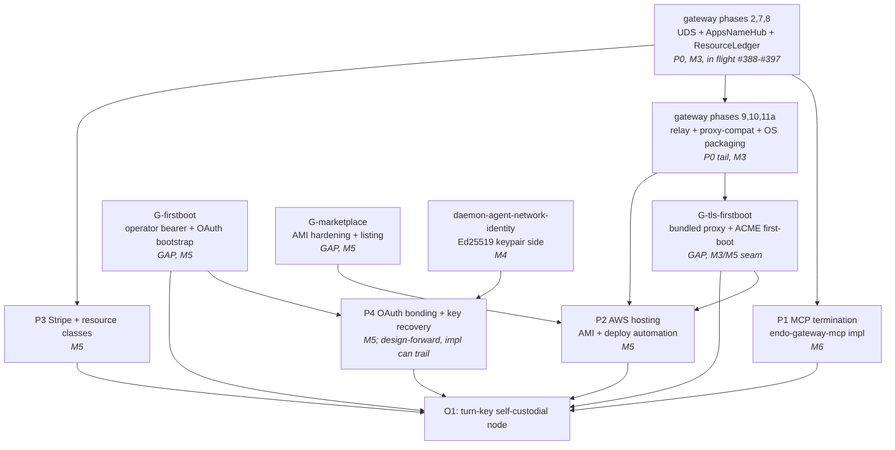

# Resequencing proposal: M3-M11 against the two-stage objective (O1, O2)

This is a **draft for maintainer triage**, not an applied ledger edit.
Following the precedent of the 2026-06-03 renumbering pass, nothing here
touches `designs/README.md` until the maintainer authorizes it.
The proposal does four things, in order: (1) re-derives the O1 critical
path against the actual dependency graph; (2) places O2 explicitly in the
milestone sequence and names the designs it entrains; (3) inventories the
design gaps with problem statements and milestone homes; (4) reconciles
each gap against what existing designs already cover so the new work is
scoped to the remainder. It ends with the proposed old to new milestone
mapping table in the ledger's own style.

The standing invariant is preserved throughout: every milestone's
dependencies live in earlier milestones. Where the brief's strategic
direction (§2) conflicts with the ledger's current sequencing, the brief
takes precedence per canon §1.3, and the ledger's rationale is surfaced
for the maintainer rather than silently overwritten.

## 0. Inputs and ground truth

- Canon: "A Choice of Giants" (the platform thesis, the weblet/user-agent
  vocabulary, the Mastodon operator-liability problem named explicitly).
- Ledger: `designs/README.md` on `llm` at tip `72d1c764c`. The 2026-06-03
  renumbering pass and the M6 P0-P4 slice plan are the baseline this
  proposal resequences from.
- Scout reconnaissance: `journal/entries/2026/06/11/045739Z-result-scout-8f5fb7.md`.
  Treated as evidence to verify, not as a substitute for the ledger.
- External references shelved by the scholar (cited in §3 where they bind
  a gap).

**Four canon discrepancies carried from the scout, verified against the
ledger at tip and confirmed (recorded, not resolved, per brief §6):**

1. **`daemon-agent-network-identity` status conflict.** The README summary
   table (line 131) and the M4 milestone table (line 585) read "Not
   Started"; the design file's own metadata reads "In Progress" with items
   1 and 2 marked Done. The summary table has not been reconciled with the
   file. This matters for sequencing: the keypair side that O1 P4 (OAuth
   bonding) and all of O2's member identity build on may be further along
   than the milestone tables imply.
2. **M5 gateway designs absent from `llm`.** The README lists
   `gateway-package`, `gateway-packaging-ci`, `gateway-aws-deployment`,
   and `gateway-aws-attuned` as Proposed designs in both the summary table
   and the M5 table, but **none of these files exist in `designs/` at the
   `llm` tip.** I confirmed this directly: the only gateway design files on
   `llm` are `endo-gateway.md`, `endo-gateway-mcp.md`, and
   `gateway-bearer-token-auth.md`. The four named-as-Proposed designs live
   on the PR #356 branch (stacked on PR #343), neither merged to `llm`.
   The ledger presents them as extant; they are not. This is load-bearing
   for the critical path: P2 (AWS hosting) and the Phase 11 packaging story
   are described against design docs that are not yet on the roadmap branch.
3. **`familiar-release.md` referenced but absent from `llm`.** The M8 table
   (line 795) treats it as a Proposed design with a list of G-item PRs; the
   file is not in `designs/` at tip. `app-sharing-milestone.md` (which is on
   `llm`) links it by raw GitHub URL on the `design/familiar-release` branch.
4. **M6 P4 sequencing conflict (brief vs. ledger).** Brief §2 co-prioritizes
   OAuth bonding + key recovery (P4) *with* MCP termination (P1), "not
   sequentially." The ledger's M6 slice table (lines 671-676) recommends
   "sequencing [P4] last keeps the rest of the milestone from being held by
   its design cycle." The brief is the later strategic decision and takes
   precedence; the ledger's churn-containment rationale is surfaced in §1.4.

A correction to the scout's framing of discrepancy 4: the conflict is
about **implementation scheduling**, not design scheduling. The brief's
"design-forward on churn-prone identity work" decision (§2) and its
co-prioritization decision are compatible with the ledger's churn-worry
once split along the design/implementation seam (see §1.4). I treat the
two as reconcilable rather than as a contradiction the maintainer must
arbitrate; the open decision is narrower than the scout stated.

## 1. The O1 critical path, re-derived

O1 is the turn-key self-custodial node: deploy from a cloud marketplace
listing in one sitting, terminate MCP for external LLM clients, bond an
OAuth identity to the operator's public-key identity, meter and bill
resources, grant agents attenuated capabilities. The customer is the
operator; the operator is the user.

### 1.1 Showing the work: the actual dependency graph

The brief's expected path (§3.1) is: M3 gateway completion with Phases 10
and 11 promoted to load-bearing, then M6 P1 (MCP) and M5 P4 (OAuth + key
recovery) co-scheduled, then P2 (AWS) and P3 (Stripe + resource classes).
Validating against the ledger and the gateway-package design:

**What Phases 10 and 11 actually are.** The gateway-package design's
ten-feature decomposition maps Phase 10 to Feature 9 (HTTPS terminating
proxy compatibility) and Phase 11 to Feature 10 (OS packaging:
rpm/deb/PKGBUILD/Docker). Feature 9 is **not** TLS termination in the
gateway: the design's standing decision is "no TLS in the gateway; external
TLS via reverse proxy." Feature 9 is the gateway making itself *compatible*
with a terminating proxy in front of it (the `X-Forwarded` trust model:
CIDR allowlist of trusted proxies, max-hops-to-trust). So "the packaged
image is the product" (brief §3.1) decomposes into two distinct
deliverables that the ledger currently collapses into "Phase 11 OS
packaging":

- **Phase 11a (Feature 10 proper): the package artifacts.** The Docker
  image and OS packages that bundle the gateway plus daemon.
- **Phase 11b (a packaging-adjacent gap the ledger does not name): the TLS
  termination story inside the image.** Because the gateway refuses TLS by
  design, a marketplace appliance still has to terminate TLS *somewhere* in
  the image (a bundled reverse proxy: Caddy/nginx with an ACME client) and
  obtain a certificate autonomously at first boot. This is undesigned. It
  is the seam between Feature 9 (the gateway's proxy compatibility) and the
  first-boot ceremony gap (§3.6). See gap **G-tls-firstboot** (§3.2).

**The corrected gating (scout correction 1, verified).** The ledger's M6
slice table states P1 (MCP termination) is gated on gateway-package phases
2 (UDS bootstrap), 7 (admin/AppsNameHub), and 8 (ResourceLedger), **but not
on 10 or 11**. This is correct and load-bearing: P1 does not wait for OS
packaging. The brief's framing implies P1 sits behind "M3 completion";
the graph says P1 starts as soon as phases 2/7/8 land and runs in parallel
with phases 9-11. The brief's expectation is therefore an over-serialization
that the resequencing corrects.

**The P4 placement (scout correction 2 / discrepancy 4).** The ledger homes
P4 (OAuth bonding + key recovery) in M5 and recommends sequencing it last.
The brief co-prioritizes it with P1. Reconciled in §1.4.

### 1.2 The corrected O1 critical path

Reading the graph as a sequence with explicit parallelism:

1. **Gateway phases 2/7/8 (P0, M3)** are the universal prerequisite. In
   flight as PRs #388-#397. Everything downstream waits on these three.
2. Once 2/7/8 land, **two tracks open in parallel:**
   - **Track A (the product-surface track): P1 MCP termination (M6).**
     Implements `endo-gateway-mcp`: extract `@endo/agent-tools`, bearer-token
     table + `publishAgent`, `/mcp` adapter + SSE, Chat-side affordances.
   - **Track B (the packaging track): gateway phases 9, 10, 11a (M3 tail).**
     Relay, proxy compatibility, OS packaging artifacts. The brief's
     "promote 10/11 from pending tail to load-bearing" lands here: these
     are not a deferrable tail, they are the gate on P2.
3. **G-tls-firstboot (the bundled TLS story)** depends on phase 9/11a and
   gates a deployable image. New gap; see §3.2.
4. **P2 AWS hosting (M5)** depends on the packaging track (phases 9/10/11a),
   the bundled-TLS story (G-tls-firstboot), and the marketplace-listing gap
   (G-marketplace). The AMI hardening rules (no embedded credentials, no
   password auth, HVM, EBS-backed) bind what phase 11a may put in the image.
5. **P3 Stripe + resource classes (M5)** depends only on phase 8
   (ResourceLedger, which lands `verifyPaymentProof`). Independent of P1
   and P2. Can start as soon as phase 8 merges.
6. **P4 OAuth bonding + key recovery (M5)** builds on M4
   `daemon-agent-network-identity` (Ed25519 keypair side) and the first-boot
   ceremony (§3.6). Design-forward per brief §2 (pin the model now); the
   implementation can trail P1/P2/P3 without holding them, which is exactly
   the ledger's churn-containment intent, expressed on the implementation
   axis rather than the design axis.

**The single longest chain to O1** (the true critical path) runs through
Track B: `phases 2/7/8` -> `phases 9/10/11a` -> `G-tls-firstboot` ->
`P2 AWS` -> O1, with `G-marketplace` (the 2-4 week AWS listing review, see
§3.2) as a calendar-time tax that can be pipelined behind P2 readiness but
not eliminated. P1 (MCP), the visible product feature, is **not** on the
longest chain; it parallelizes. This is the most important correction the
resequencing makes to the brief's expectation: the binding constraint on
"deploy from a marketplace in one sitting" is the packaging-and-listing
track, not MCP termination.

### 1.3 Where the brief takes precedence over the ledger

- **Phases 10/11 are load-bearing, not a tail.** Adopted. The ledger
  already half-says this ("shortest-route blocker on P2"); the brief makes
  it explicit and the resequencing promotes the packaging track to a
  named, scheduled sub-milestone rather than a "pending" footnote on the
  `endo-gateway` row.
- **Design-forward on identity (P4).** Adopted. The `gateway-oauth-bonding`
  and `gateway-key-recovery` design files are pulled into the current design
  window (authored now, ahead of implementation), per brief §2.
- **Pricing legibility as its own design.** Adopted. `gateway-resource-classes`
  gets its own design file rather than folding into the Stripe adapter,
  reversing the ledger's "may fold into stripe-adapter" hedge. See §3.1.

### 1.4 Surfacing the ledger's P4 churn rationale (open decision for the maintainer)

The ledger's argument for sequencing P4 last: "P4 (OAuth + rotation) is the
only slice that materially extends the user-identity model and is the one
most likely to spawn design churn; sequencing it last keeps the rest of the
milestone from being held by its design cycle." This is a sound
*implementation*-scheduling instinct. The brief's co-prioritization is a
*design and product-priority* decision: identity is the front door of a
commercial product and must not trail the bridge.

These reconcile cleanly along the design/implementation seam the project
already uses (designs on `llm`, implementations on `master`):

- **Design P4 now, co-prioritized with P1's design** (brief §2, design-forward
  §2). Pinning the identity model early is the cheap insurance the brief
  names.
- **Schedule P4's implementation flexibly**, allowing it to trail P1/P2/P3
  implementation if its design cycle runs long (ledger's churn-containment).

The open decision for the maintainer is whether O1's *exit criterion*
requires P4 shipped, or whether O1 can ship with bearer-token auth
(`gateway-bearer-token-auth`, already Implemented) as the day-one identity
and OAuth bonding as a fast-follow. The brief's O1 definition includes
"bonds an OAuth identity," which argues for P4 in the O1 exit criterion;
but a marketplace MVP could ship on raw bearer tokens with OAuth bonding in
the first update. **Recommended for the maintainer: P4 design lands in the
O1 design window; P4 implementation is the O1 exit gate unless the
maintainer accepts a bearer-token-only MVP.**

## 2. Placing O2 explicitly

O2 is the community hub: one operator, many members, ISP-like services
(relaying/NAT traversal, mail delivery, anonymization, curation,
always-online capabilities). O2 is the federation seed; O1 customers are
latent O2 operators.

### 2.1 The structural shape O2 already has a name for

The single most precise ledger description of O2 is **`endo-gateway.md`
Open Question 2: the "daemon-hosting service mode"** ("a variant of the
Gateway where it manages virtual users rather than addressing system-level
User Daemons"). This is explicitly deferred in that design. It is the
gateway-layer heart of O2: the multi-tenant variant where the operator
manages member accounts without one OS account per member. The brief does
not cite this; it is the entrainment anchor and the resequencing names it
as the spine of the O2 milestone.

### 2.2 The O2 entrainment inventory (from the scout's map, verified)

Sixteen designs the community hub entrains, grouped by the O2 function they
serve. Status is read from the ledger at tip; where the file disagrees with
the summary table (discrepancy 1), both are noted.

| Design | Status (ledger) | O2 function | Current milestone |
|--------|-----------------|-------------|-------------------|
| `endo-gateway` (Open Question 2) | Proposed | The virtual-users multi-tenant gateway mode: the O2 spine | M3/M5 |
| `daemon-agent-network-identity` | Not Started (table) / In Progress (file) | Per-member Ed25519 identity; routing key for member-to-hub sessions | M4 |
| `ocapn-noise-network` | Complete | Secure member-to-hub and hub-to-hub transport | M4 |
| `ocapn-noise-session-reconnect` | Proposed | Always-online session reliability for members behind flaky links | M4 |
| `ocapn-network-transport-separation` | In Progress | Transport pluggability for relay / NAT-traversal | M4 |
| `gateway-oauth-bonding` (gap) | gap | Member sign-in with external accounts (members will not manage raw keypairs) | M5 |
| `gateway-key-recovery` (gap) | gap | Member account recovery on a hub the member does not administer | M5 |
| `endoclaw-network-fetch` | Not Started | Outbound HTTP for hub-hosted agents; substrate for mail delivery | M3 (Strategic Early) |
| `endoclaw-webhooks` | Not Started | Inbound events for hub-member agents; proactive / mail-delivery substrate | M7 |
| `daemon-agent-tools` | Not Started | Tool surface for always-online hub-hosted agents | M3 |
| `familiar-deep-link-invitations` | Proposed | Member onboarding by invitation (peer variant; hub variant is the remainder, §3.7) | M8 |
| `endo-app-sharing` | Proposed | Curation: operator distributes apps to members | M8 |
| `familiar-app-ui-hosting` | Proposed | Sandboxed app UI for member-facing apps | M8 |
| `namehub-interface-unification` | Proposed | Hub-level `AppsNameHub` composable with per-member namespaces | M9 |
| `daemon-capability-persona` | Not Started | Per-member persona / identity isolation, epithets, delegation | M10 |
| `daemon-capability-bank` | Not Started | Per-member capability scoping and resource limits | M10 |

### 2.3 Where O2 slots relative to M7-M11

O2's technical prerequisites are all in M3-M6 (gateway substrate, network
identity, OCapN transport, OAuth bonding, MCP for always-online agent
tools). The work that is *distinctively* O2 (multi-tenancy, hub economics,
member isolation, abuse/moderation, operator liability) is currently
scattered across M5 (gateway), M10 (persona, capability-bank), and nowhere
(the economics/moderation/liability gaps, §3.8).

The resequencing proposes a **dedicated O2 milestone, M7 (Community Hub)**,
inserted directly after M6 (the O1-completing MCP-bridge milestone) and
before the current M7 (Weblets and Integrations). Rationale:

- O2's prerequisites complete at M6. Placing the O2 milestone at M7
  satisfies the dependency invariant (everything it needs is in M3-M6) and
  honors the brief's "O1 customers are latent O2 operators": O2 is the next
  thing after O1 ships, not a far-future ecosystem item.
- It pulls the virtual-users multi-tenancy work (`endo-gateway` Open
  Question 2) and the new multi-tenancy gaps (§3.8) out of M5/M10 scatter
  into one milestone with a coherent exit criterion.
- It does **not** require moving `daemon-capability-persona` and
  `daemon-capability-bank` out of M10; instead it identifies the member-
  isolation *slice* of those designs as an O2 dependency and scopes the O2
  milestone to "member isolation sufficient for a hub," deferring the full
  capability-bank to M10 as today. (If the maintainer prefers, the
  member-isolation slice can be split into its own design under the O2
  milestone; flagged as an open decision.)

Everything downstream renumbers by one to make room (see §4). The current
M7-M11 (Weblets, App Sharing, UX, Confinement, `endor`) shift to M8-M12.
The brief's framing of O2 as "the same node software operated for a
community" means O2 does not entrain new app-sharing or weblet designs
beyond what M8 (peer app sharing, renumbered to M9) already produces;
O2 *reuses* the app-sharing substrate for the curation function. So the
M8 app-sharing milestone is correctly placed *after* the O2 milestone in
dependency terms only if O2 needs it; it does not (curation is an
enhancement, not a prerequisite), so app sharing can stay before or after
O2. The resequencing keeps app sharing after O2 (renumbered M9) because the
hub-membership invitation variant (§3.7) wants the O2 member model to exist
first.

## 3. Design gap inventory

Each gap below carries: a one-paragraph problem statement, its milestone
home, the existing designs it references, and (per brief §4) the
reconciliation that scopes it to the remainder after subtracting partial
coverage. Gaps are tagged G-* for cross-reference. The four ledger-named
gaps come first, then the extensions.

### 3.1 The four ledger-named gaps

**G-oauth-bonding (`gateway-oauth-bonding`) — M5 (O1), entrained by O2.**
Bond an external OAuth identity (Google, GitHub, Microsoft) to the
operator's gateway-level public-key (formula-identifier) identity, so a
user signs in with a familiar account rather than copy-pasting a 256-bit
bearer. The design must cover the OAuth-to-formula-id binding shape, the
user-facing flow, and the daemon-side persistence model for bonded
identities. **References:** `daemon-agent-network-identity` (the Ed25519
keypair side, M4), `gateway-bearer-token-auth` (the bearer model the
bonding decorates, Implemented), `endoclaw-oauth` (the agent-layer OAuth
*client* pattern — cite as precedent, do not reuse wholesale: this gap is
the *operator/node* layer, a different trust boundary). The MCP RC's
OAuth/OIDC alignment trajectory is a forward constraint: pin the bonding to
OIDC-compatible claims so the MCP front door and the OAuth front door do not
diverge. **Reconciliation:** uncovered — no design file exists; adjacent
designs specify only what is needed, not how. Scope: full design required.
Ground the problem statement in ocap vocabulary (the OAuth identity is an
*endowment* to a node-level principal, attenuated to "authority to use this
node," not "authority to delegate it"), not generic auth vocabulary.

**G-key-recovery (`gateway-key-recovery`) — M5 (O1), entrained by O2.**
Operator-side re-issue of a fresh formula-identifier bearer when the user
proves OAuth identity ownership, with a deprecation window for the old
bearer and an audit-log shape. Narrower than `endo-gateway.md` Open
Question 1 (Pass-Invariant-Eq), which stays open as the broader story.
**References:** `endo-gateway.md` Open Question 1 (problem statement for the
broader rotation), `daemon-agent-network-identity` (the keypair the recovery
re-issues against), `endo-gateway-mcp.md` Design Decision 2 / the deferred
"Rotate" affordance (touches but does not design rotation),
G-oauth-bonding (the OAuth proof this recovery consumes). **Reconciliation:**
partially covered — the problem is named in `endo-gateway.md` OQ1 and the
rotation affordance is deferred in `endo-gateway-mcp.md`; the recovery
*ceremony* is undesigned. Scope: the narrow operator-side re-issue-on-OAuth-
proof flow plus deprecation window plus audit log. For O2 this gap widens
(member recovery on an operator-run hub the member cannot administer); that
widening is noted in §3.8 as part of hub economics, not folded here.

**G-stripe-adapter (`gateway-stripe-adapter`) — M5 (O1).**
Reference adapter for the `verifyPaymentProof(tokens, proof)` power that
gateway-package Phase 8 (PR #396, ResourceLedger) injects: Stripe webhook
signature validation, Stripe-API integration, idempotency, refund handling.
The gateway holds an abstract `PaymentProcessor` contract; the Stripe
verifier is operator-supplied. **References:** the ResourceLedger design
(Phase 8) for the `verifyPaymentProof` injection point and the
`purchaseTokens(tokens, proof)` contract, G-resource-classes (the metering
units the payment buys). The AWS Marketplace usage-based-billing path
(MeterUsage API) is an *alternative* billing channel for the marketplace-
listed product: when the node is sold as a Paid-Usage AMI, AWS meters via
MeterUsage rather than Stripe, and the dimension names are locked after
publication (a constraint that flows into G-resource-classes, not here).
**Reconciliation:** partially covered — the `verifyPaymentProof` interface
is defined in the ResourceLedger design; the Stripe specifics are
undesigned. Scope: a short design note pinning the wire shape and failure
modes (the project's standing wire-shapes-pinned-before-code preference),
plus an explicit note on the Stripe-vs-MeterUsage billing-channel split for
the marketplace case. Recommended as a design file, not implementation-only.

**G-resource-classes (`gateway-resource-classes`) — M5 (O1), pricing-
legibility is a design requirement per brief §2.**
The resource-class taxonomy: compute (computrons), inference (cogitrons),
storage, network. Per-class measurement surfaces: what counts as a
computron (the existing `daemon-xs-worker-metering` unit), how cogitrons
map to upstream provider tokens, how network bytes are counted across HTTP /
WS / OCapN. **References:** `daemon-xs-worker-metering` (Complete — the
existing computron metering: admission control, three modes, budget-as-pre-
payment; `computrons` is the live unit), the ResourceLedger design (the
per-account counters the classes report into; the resource-ledger-lives-in-
the-gateway-not-the-daemon decision), G-stripe-adapter (the billing the
classes feed). **Reconciliation:** partially covered — the class *names* and
abstract metering surfaces are named in the ledger narrative; no design
file; the ledger hedges "may fold into stripe-adapter." Per brief §2 this
**unfolds into its own design**, reversing the hedge: customers forgive
rough UX but not unpredictable metering. Two specific gaps the design must
close: (a) **`cogitrons` is new vocabulary** — `computrons` exists, but the
inference-metering unit and its mapping to upstream provider tokens (and the
substitutable-inference thesis: cogitrons must be meaningful across local,
self-hosted, and vendor inference) are undesigned; (b) the AWS MeterUsage
**dimension-name lock-after-publication** constraint plus the **15-character
alphanumeric dimension-name limit** bind the class names if the node is
sold as a Paid-Usage AMI — the design must choose dimension names that
survive that lock. Public-facing writing must say plainly these are metering
units, not crypto assets (brief §2); the design file should carry that note
so the persuasion-suite essays inherit it.

### 3.2 Marketplace packaging and listing

**G-marketplace (`gateway-marketplace-listing`) — M5 (O1).**
What an AWS Marketplace AMI/container product requires, and what those
requirements constrain in gateway phase 11a. The packaged image *is* the
product (brief §3.1), so the listing requirements are critical-path
constraints, not a downstream concern. **References:** `daemon-docker-
selfhost` (the closest existing design — Docker image shape, state
persistence, compose pattern, external TLS via reverse proxy), the
gateway-package Phase 11a (OS packaging), the scholar's AWS Marketplace AMI
technical-security and pricing-and-listing references. **Reconciliation:**
partially covered — `daemon-docker-selfhost` covers the container shape but
addresses neither AMI certification, Packer, nor marketplace listing; the
referenced `gateway-aws-deployment` / `gateway-packaging-ci` designs are
**not on `llm`** (discrepancy 2). Scope the gap to the marketplace remainder.
Hard constraints the design must encode (from the AMI requirements):

- **No hardcoded secrets, no pre-seeded SSH keys, no password auth.** This
  binds the first-boot ceremony (§3.6): the operator's initial bearer cannot
  be baked into the image. The bearer must be *generated* at first boot and
  delivered out-of-band (instance metadata / serial console / cloud console).
- **HVM, x86-64 or ARM64, EBS-backed, no encrypted snapshots, region-
  agnostic, source AMI in us-east-1.** Architecture constraints on the
  Packer build.
- **No AWS-credential requests; minimally-privileged IAM role only.** The
  node cannot assume it has AWS API access; the AWS-attuned subsystems
  (S3 CAS, DynamoDB state, Nitro Enclave key custody) named in the absent
  `gateway-aws-attuned` design must go through an instance IAM role.
- **Listing review is 2-4 calendar weeks** (7-10 business days for initial
  publication; 45 days lead for planned releases; 90-day notice for price
  changes). This is a *calendar* tax on O1's ship date and must be budgeted
  into the milestone timeline, not the effort estimate.

**G-tls-firstboot (`gateway-bundled-tls`) — M5 (O1), seam with M3 phase 9.**
Because the gateway refuses TLS by design (Feature 9 is proxy
*compatibility*, not termination), the marketplace appliance must terminate
TLS inside the image and obtain a certificate autonomously at first boot.
**References:** gateway-package Feature 9 (`X-Forwarded` trust model: the
gateway-side contract the bundled proxy speaks to), `daemon-docker-selfhost`
(external-TLS-via-reverse-proxy at the daemon layer), the scholar's TLS-
first-boot-patterns reference. **Reconciliation:** uncovered for the appliance
case — both `endo-gateway.md` and `daemon-docker-selfhost.md` say "TLS is the
reverse proxy's job" but neither designs the *autonomous* first-boot domain-
binding and certificate-acquisition flow a marketplace node needs. Scope: a
bundled reverse proxy (Caddy or nginx) plus ACME client, with the autonomous
pattern being **DNS-01 with a vendor-delegated CNAME** (the scholar's Pattern
1: `<node-id>.nodes.example.com`, vendor-controlled DNS, node-specific short-
lived provisioning credential, no operator DNS config at first boot). The
design must surface: the vendor must run a DNS provisioning service for all
issued nodes (an operational commitment); the alternative TOFU/self-signed
pattern (Pattern 3) as a fallback for operators who bring their own domain;
and the 90-day Let's Encrypt renewal requiring the provisioning API to stay
reachable. This gap is the concrete content of the brief's "TLS and domain
provisioning for a self-custodial node."

### 3.3 First-boot ceremony

**G-firstboot (`gateway-first-boot-ceremony`) — M5 (O1), entrained by O2.**
How the operator receives their bearer token and bonds an OAuth identity on
a fresh node, *before any other channel of trust exists*. On a fresh
headless cloud deployment there is no authenticated Chat session, no prior
bearer, and (per G-marketplace) no secret baked into the image.
**References:** `gateway-bearer-token-auth` (Implemented — the formula
identifier *is* the bearer, but says nothing about first retrieval),
`endo-gateway-mcp.md` Chat-side affordances (assume a running node with an
authenticated Chat UI; do not cover the bootstrap), `daemon-docker-selfhost`
(mentions the `#agent=<id>` URL anchor but not first-boot delivery),
G-oauth-bonding (the OAuth bond this ceremony performs once trust exists),
G-tls-firstboot (the secure channel the ceremony runs over).
**Reconciliation:** uncovered — the credential exists implicitly (the formula
id is in the daemon state directory) but no design specifies how an operator
*securely retrieves it* from a fresh cloud node before any trust channel
exists. Scope: the out-of-band bootstrap. Concrete shape to design: the node
generates its root bearer at first boot, writes the bearer (or a short-lived
one-time setup token) to a channel the cloud operator can read but the
network cannot (AWS instance user-data response / serial console / a one-time
token displayed in the cloud console via instance tags), the operator
retrieves it, opens the (self-signed-or-vendor-cert) setup endpoint, and
performs the OAuth bond. Ground in ocap terms: first boot is the *genesis
endowment* of root authority to the operator; everything else is attenuated
from it.

### 3.4 State custody (backup / restore / migration)

**G-state-custody (`gateway-state-custody`) — M5 (O1), brand-promise.**
Backup, restore, and cloud-to-cloud migration of node state. Self-custody
and anti-lock-in are the brand promise (canon, brief §2: "your state is
yours to export"); they must be designed, not implied. **References:**
`daemon-cas-management` (In Progress — content-addressed store management and
pruning, the substrate any backup walks), `daemon-checkin-checkout`
(Complete — `endo ci`/`endo co` local serialization of readable trees, a
substrate but not a backup design), `daemon-docker-selfhost` (Docker volume
for state persistence, bind-mount for direct backup access — but no backup
*procedure*). **Reconciliation:** uncovered — substrate exists in CAS
management and checkin-checkout; no design addresses the full
backup/restore/migration lifecycle as a product-facing feature. Scope: a
node-state export format (what is in a backup: CAS blobs, formula store,
SQLite state, keypairs), restore-integrity verification, and cloud-to-cloud
migration (move a node from AWS to a homelab and back). The keypair-export
question intersects G-key-recovery (exporting the identity is exactly what
recovery re-issues if lost) and the anti-lock-in thesis: the design must
make "you can leave" concretely true, which is the differentiator the
persuasion suite leans on.

### 3.5 Upgrade channel

**G-upgrade (`gateway-upgrade-channel`) — M5 (O1) for the appliance; O2-
critical.**
Signed software updates for an always-online node. The marketplace AMI
continuous-compliance scan (G-marketplace: products falling out of
compliance are pulled from new subscribers; AMIs older than two years are
disallowed) makes a working update channel a *listing-maintenance*
requirement, not a nicety. **References:** the scholar's TUF reference (the
reference shape: Root/Targets/Snapshot/Timestamp role hierarchy, online
timestamp key, offline root/snapshot/targets keys, rollback/freeze
protection), gateway-package Phase 11a (the artifacts being updated),
`familiar-release.md` (referenced but **not on `llm`**, discrepancy 3 — and
it targets the Familiar Electron desktop app, not the headless gateway).
**Reconciliation:** uncovered for the gateway — `familiar-release` partially
addresses the desktop case and is not on the roadmap branch; no design
addresses signed OTA updates for a headless gateway node. Scope: a TUF-shaped
signed-update channel for the gateway image, with the online timestamp key on
the vendor build infra and offline root/snapshot/targets keys, plus the
update-application story (how an always-online node applies an update without
losing in-flight sessions — intersects `ocapn-noise-session-reconnect`).

### 3.6 Operator observability

**G-observability (`gateway-operator-observability`) — M5 (O1).**
Logs and metrics adequate to run a production node, *without building the
surveillance the project exists to refuse*. The brief names this tension
explicitly. **References:** `endo-gateway-mcp.md` Design Decision 9
(structured-logger-shaped `node:console`; diagnostic forwarding to MCP
clients via `notifications/message`; anylogger as the future bridge — but
no operational metrics), `daemon-xs-worker-metering` (Complete — computron
metering at the worker level, a substrate for resource dashboards),
`daemon-rust-xs-performance` (Active — benchmarking on the Rust/XS side).
**Reconciliation:** uncovered — substrate in XS metering and MCP logging; no
design addresses operational observability (uptime, request/error rates,
resource-consumption dashboards) as a production concern, and none engages
the observability-vs-surveillance tension. Scope: an operator-facing metrics
surface (the operator can see their own node's health and resource use) that
is structurally incapable of being member surveillance (the design must show,
in ocap terms, why the operator's observability capability does not confer
authority to read member content). This is where the brand promise and the
operational requirement meet, so the design carries persuasion-suite weight.

### 3.7 O2 member onboarding (the hub-invitation remainder)

**G-hub-invitation (`gateway-hub-membership`) — O2 milestone (proposed M7).**
How an operator invites a member to a *hub service* (not just peers a pair
of Familiars). **References:** `familiar-deep-link-invitations` (Proposed,
M8/renumbered M9 — the `endo://` deep-link capture, confirmation screen, and
naming modal for *peer-to-peer* connection), `endo-gateway` registration
protocol (local vs remote registrations, per-host policy for who may host),
G-oauth-bonding (member sign-in). **Reconciliation:** partially covered —
`familiar-deep-link-invitations` covers the peer-peering invitation flow
(Familiar to Familiar). The hub variant is the remainder: the operator
invites a member to a *managed account on the operator's node* (a virtual
user per `endo-gateway` Open Question 2), not a peer relationship between two
self-custodial nodes. Scope the gap to the hub-membership invitation: the
operator issues an invitation, the member accepts and receives a managed
identity on the hub, and the trust unit widens from operator to community
(brief §2). This explicitly does *not* re-design the peer flow; it extends
it to the one-operator-many-members shape.

### 3.8 O2 multi-tenancy (isolation, economics, abuse, liability)

**G-multitenancy (`gateway-multi-tenant-isolation`) — O2 milestone (proposed
M7).** Isolation between members on one hub. **References:** `endo-gateway`
Open Question 2 (the virtual-users mode — the spine), Open Question 5
(multi-tenant filesystem isolation for the per-user CAS — named as an open
question in the gateway-package design), `daemon-capability-persona` (member
identity isolation, M10 — the member-isolation slice is the O2 dependency),
`daemon-capability-bank` (per-member capability scoping, M10).
**Reconciliation:** uncovered at the hub scale — the gateway supports
multi-user at the OS-process level; the virtual-user variant is explicitly
deferred. Scope: per-member isolation of CAS, formula store, and capability
grants within one operator's node, sufficient for a hub (not the full M10
capability bank). The brief frames the O2 milestone as needing the
member-isolation slice, deferring the full bank to M10.

**G-hub-economics (`gateway-hub-economics`) — O2 milestone (proposed M7).**
Member billing vs operator billing. **References:** G-stripe-adapter and
G-resource-classes (the O1 billing the hub extends), the ResourceLedger
per-account counters. **Reconciliation:** uncovered — O1 bills one operator;
a hub must decide whether members pay the operator, the operator pays for all
members, or a split. Scope: the per-member accounting model and the
operator-vs-member billing-responsibility decision. Also widens
G-key-recovery (member recovery on a hub the member does not administer).

**G-abuse-moderation (`gateway-abuse-moderation`) — O2 milestone (proposed
M7).** Abuse handling and moderation posture for a community hub.
**References:** gateway-package Open Question 2 (abuse-prevention for the
public relay — named, not designed), the relay frame-relay-without-decryption
property (the operator routes ciphertext and *cannot read it*, which both
protects members and complicates moderation). **Reconciliation:** uncovered.
Scope: the moderation tools an operator has, given that end-to-end Noise
encryption means the operator cannot inspect member traffic. This is a
genuine design tension (the privacy property the project sells is the same
property that makes moderation hard) and should be designed honestly, feeding
the B4 host's-pitch essay's candor register.

**G-operator-liability (`gateway-operator-liability-survey`) — O2 milestone
(proposed M7), survey-only.** A survey of operator-liability questions
sufficient to *brief the maintainer, not resolve* (brief §3.3, §4). The
"Mastodon-instance-operator problem" the canon names: "what happens to us
when the wrong people hear." **References:** the canon essay's Mastodon
operator-liability discussion, G-abuse-moderation (the technical posture that
shapes the liability), G-hub-economics (operating-for-pay changes the
liability calculus). **Reconciliation:** uncovered, and explicitly *not* to be
resolved here. Scope: a Reference-status design (a survey, not an
implementation target) that enumerates the liability questions an O2 operator
faces (content liability given they cannot read encrypted traffic, the safe-
harbor posture, the difference between operating for a known community vs the
public) so the maintainer can decide the project's posture before the B4
essay ships. This is a design/legal analysis task with no technical-milestone
blocker; it can be authored at any time in the O2 design window.

### 3.9 Gap inventory summary (12 gaps)

| Tag | Slug | Milestone | Coverage |
|-----|------|-----------|----------|
| G-oauth-bonding | `gateway-oauth-bonding` | M5 (O1) | uncovered; full design |
| G-key-recovery | `gateway-key-recovery` | M5 (O1) | partial (OQ1, MCP rotate); ceremony undesigned |
| G-stripe-adapter | `gateway-stripe-adapter` | M5 (O1) | partial (verifyPaymentProof iface); Stripe specifics undesigned |
| G-resource-classes | `gateway-resource-classes` | M5 (O1) | partial (class names); cogitrons + dimension-lock undesigned |
| G-marketplace | `gateway-marketplace-listing` | M5 (O1) | partial (docker-selfhost); AMI/listing undesigned |
| G-tls-firstboot | `gateway-bundled-tls` | M5 (O1) | uncovered for appliance; DNS-01 vendor-delegated pattern |
| G-firstboot | `gateway-first-boot-ceremony` | M5 (O1) | uncovered; out-of-band bearer bootstrap |
| G-state-custody | `gateway-state-custody` | M5 (O1) | uncovered; backup/restore/migration lifecycle |
| G-upgrade | `gateway-upgrade-channel` | M5 (O1) | uncovered for gateway; TUF-shaped signed updates |
| G-observability | `gateway-operator-observability` | M5 (O1) | uncovered; metrics-without-surveillance |
| G-hub-invitation | `gateway-hub-membership` | O2 (M7) | partial (peer invitations); hub variant is remainder |
| G-multitenancy / -economics / -abuse / -liability | `gateway-multi-tenant-*` | O2 (M7) | uncovered; isolation slice + economics + moderation + liability survey |

(The four O2 multi-tenancy gaps are listed as one row for compactness; they
are four distinct design files in §3.8. Total distinct gaps: 15 files across
12 numbered problem areas. The brief's seed list named 11 problem areas; the
two extensions beyond the seed are **G-tls-firstboot** — split out of the
packaging gap because the gateway's no-TLS decision makes it a distinct
undesigned seam — and the explicit four-way split of O2 multi-tenancy into
isolation / economics / abuse / liability, which the seed listed as one bullet.)

## 4. Proposed old-to-new milestone mapping

Following the 2026-06-03 renumbering pass's table style. The only structural
change is the insertion of a dedicated **O2 Community Hub** milestone after
M6, shifting M7-M11 down by one. M1-M6 keep their current numbers and their
current designs; their *internal* resequencing (the O1 critical path of §1)
is a scheduling change within M3/M5/M6, not a renumbering, so it does not
appear in this table (it appears in the per-milestone slice plans the ledger
already carries). The gap files of §3 are *additions* to M5 and the new M7,
not renumberings.

| Current (2026-06-03) | Proposed (2026-06-11) | Name | Change |
|----------------------|------------------------|------|--------|
| M1 | M1 | Downloadable AI Agent Experience | unchanged (Complete) |
| M2 | M2 | Project Hygiene | unchanged |
| M3 | M3 | Remote Access and Coding Capabilities | unchanged number; phases 9/10/11a promoted to load-bearing packaging track (§1); + G-tls-firstboot seam |
| M4 | M4 | Networking | unchanged number; reconcile `daemon-agent-network-identity` status (discrepancy 1) |
| M5 | M5 | Public Hosting and Billing (O1 completion) | unchanged number; + 10 new gap files (§3.1-3.6); P4 design-forward (§1.4) |
| M6 | M6 | MCP Bridge Hosting (O1 exit) | unchanged number; P1 confirmed parallel to packaging track |
| — (new) | **M7** | **Community Hub (O2)** | **new milestone**; spine = `endo-gateway` OQ2 virtual-users mode; + 5 O2 gap files (§3.7-3.8) |
| M7 | M8 | Weblets and Integrations | +1 |
| M8 | M9 | Peer App Sharing | +1 |
| M9 | M10 | UX Polish and Agent Tooling | +1 |
| M10 | M11 | Capability Confinement and Ecosystem | +1; member-isolation slice of persona/capability-bank is an O2 (M7) dependency |
| M11 | M12 | Rust Daemon (`endor`) | +1 |

**Dependency-invariant check on the new M7 (O2).** O2's prerequisites:
M3 (gateway substrate, virtual-host registration), M4 (`daemon-agent-network-
identity`, OCapN-Noise, transport separation), M5 (OAuth bonding, key
recovery, resource ledger / billing), M6 (MCP for always-online member
agents). All earlier. The member-isolation slice it needs from
`daemon-capability-persona` / `daemon-capability-bank` (currently M10 ->
renumbered M11) is a *forward* reference, which would violate the invariant.
Resolution: scope the O2 milestone to a self-contained member-isolation
design (G-multitenancy in §3.8) that does *not* depend on the full M11
capability bank; the full bank in M11 then generalizes the O2 slice rather
than the reverse. This keeps the invariant intact. **Flagged as an open
decision:** if the maintainer prefers to keep all isolation work in M11, the
O2 milestone moves to M11-or-later and O2 ships after confinement; the
resequencing recommends the member-isolation-slice split so O2 can follow O1
promptly (honoring "O1 customers are latent O2 operators").

## 5. Open decisions for the maintainer

1. **P4 in the O1 exit criterion?** Does O1 require OAuth bonding + key
   recovery *implemented* to ship, or can O1 ship on bearer-token auth with
   OAuth bonding as a fast-follow update? (§1.4. Brief's O1 definition argues
   for inclusion; a marketplace MVP could defer the implementation.)
2. **Dedicated O2 milestone at M7, or O2 distributed across M5/M11?** The
   resequencing recommends a dedicated M7 (§2.3). The alternative keeps the
   gateway virtual-users work in M5 and member isolation in M11, with no
   distinct O2 milestone.
3. **Member-isolation slice split.** Whether to author a self-contained
   member-isolation design under O2 (preserving the dependency invariant and
   letting O2 follow O1 promptly) or keep all isolation in M11 (pushing O2
   later). (§4.)
4. **`gateway-resource-classes` as its own design.** The brief directs
   unfolding it from the Stripe adapter (§1.3, §3.1). Confirm, given the
   ledger's prior "may fold into stripe-adapter" hedge.
5. **Stripe vs MeterUsage billing channel for the marketplace AMI.** The
   marketplace Paid-Usage path meters through AWS MeterUsage (dimension names
   locked after publication, 15-char limit); the self-host path meters
   through the Stripe adapter. Confirm both channels are in scope and that
   G-resource-classes' dimension names are chosen to survive the AWS lock.
   (§3.1, §3.2.)
6. **Operator-liability survey posture.** The survey (G-operator-liability,
   §3.8) is Reference-status and survey-only per the brief; confirm the
   maintainer wants it authored in the O2 design window to feed the B4 essay,
   and that resolving the posture remains the maintainer's call.
7. **The three absent-from-`llm` design references** (discrepancy 2/3):
   whether to merge PR #356's gateway designs (`gateway-package`,
   `gateway-packaging-ci`, `gateway-aws-deployment`, `gateway-aws-attuned`)
   and `familiar-release` to `llm` so the ledger's status claims match the
   tree, or to correct the ledger to mark them as on-branch-not-yet-merged.
   The critical path (§1) assumes the packaging-track designs land on `llm`;
   they currently do not.

## 6. Applying this proposal (on authorization only)

When the maintainer authorizes, the ledger edits are: (a) the §4 renumbering
note prepended to `designs/README.md` in the 2026-06-03 pass's style;
(b) a new "Milestone 7: Community Hub" section between the current M6 and M7,
with the §2.3 spine and the §3.7-3.8 gap rows; (c) renumbering the current
M7-M11 sections to M8-M12; (d) 15 new gap rows added to the M5 and M7 tables
and to the summary table (status: gap / Not Started); (e) the dependency-graph
mermaid updated with the new gap nodes and the O2 subgraph; (f) the
discrepancy-1 status reconciliation on `daemon-agent-network-identity`.
None of these are applied by this draft. The actual gap *design files* are
separate designer dispatches, one per gap, each landing a `designs/<slug>.md`
draft PR against `llm` per the standing designer workflow.

## Prompt

> Workstream A of the Endo strategy brief (2026-06): produce a resequencing
> proposal for `designs/README.md` realigning M3-M11 to the two-stage
> objective (O1 turn-key self-custodial marketplace node, then O2 community
> hub), preserving the invariant that every milestone's dependencies live in
> earlier milestones. Re-derive the O1 critical path; place O2 explicitly;
> inventory design gaps with problem statements, milestone homes, and
> existing-design references; reconcile partial coverage. DRAFT for
> maintainer triage; end with the proposed old-to-new milestone mapping table.
